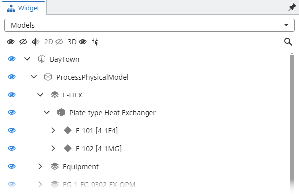
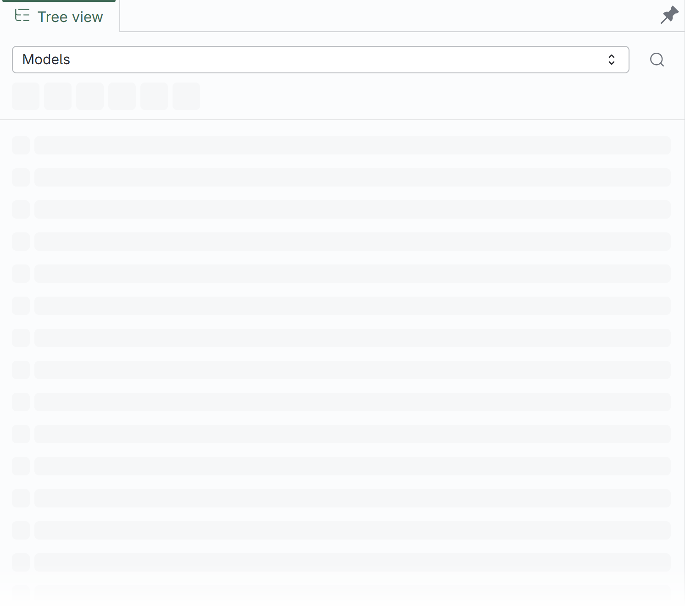
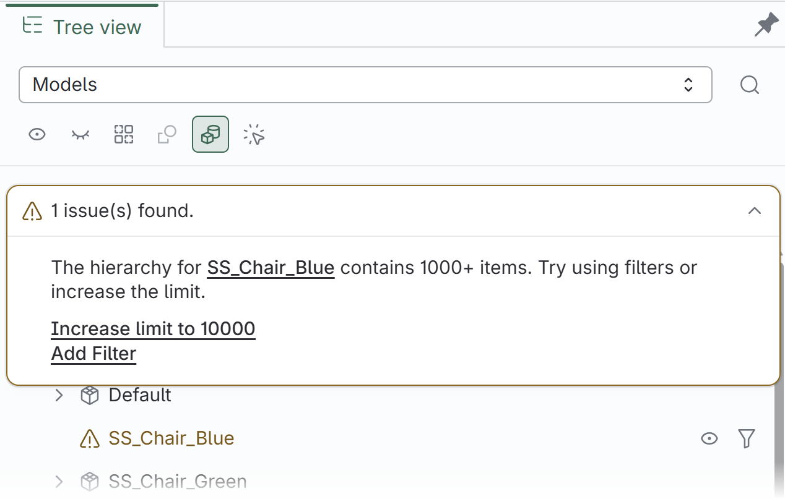
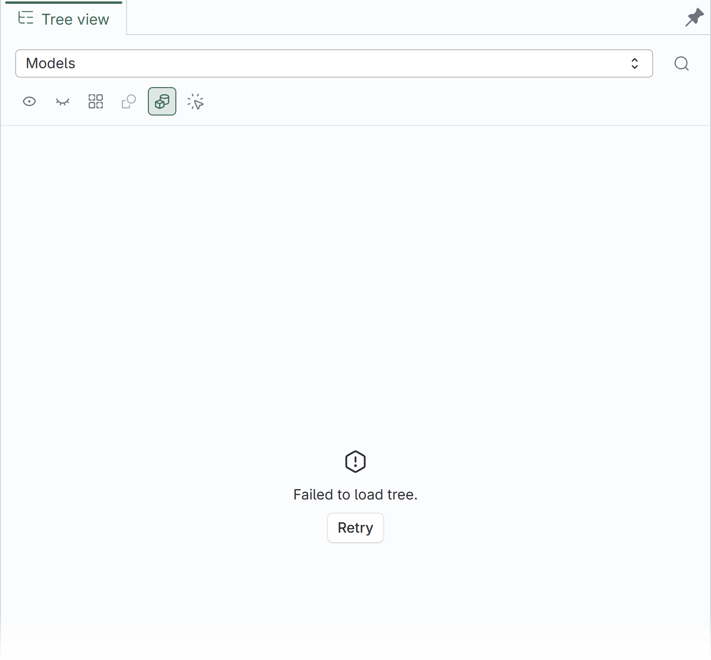

Tree Widget v4 is here. This release introduces a new design system, powerful ways to explore and customize iModel content, more reliable visibility controls, and broad performance and stability improvements. Here is why you should upgrade.

## Why upgrade?

### 1. A modern, accessible design system

Tree Widget has been rebuilt with [MUI](https://mui.com/material-ui/getting-started/) and [StrataKit](https://stratakit.bentley.com/), bringing it in line with the latest iTwin application design system. The new foundation provides a cleaner visual language, accessible labels, consistent keyboard and focus behavior, and semantic controls supplied by MUI and StrataKit.

| v3 - iTwinUI                                                                                                  | v4 - MUI and StrataKit                                                                                       |
| ------------------------------------------------------------------------------------------------------------- | ------------------------------------------------------------------------------------------------------------ |
|  |  |

### 2. New features

Tree Widget v4 introduces several new features for both end users and applications building custom tree workflows:

- **Flexible node actions** can display frequently used actions inline, place additional commands in an overflow menu, and provide contextual actions when a user opens a node's context menu.

  <table>
    <thead>
      <tr>
        <th>Inline actions</th>
        <th>Overflow menu</th>
        <th>Context menu</th>
      </tr>
    </thead>
    <tbody>
      <tr>
        <td valign="top"></td>
        <td valign="top"></td>
        <td valign="top"></td>
      </tr>
    </tbody>
  </table>

- **Clearer loading, warning, and error states** with skeleton placeholders, actionable hierarchy warnings, and a Retry action when loading fails.

  <table>
    <thead>
      <tr>
        <th>Loading placeholders</th>
        <th>Actionable hierarchy warnings</th>
        <th>Error and retry</th>
      </tr>
    </thead>
    <tbody>
      <tr>
        <td valign="top"></td>
        <td valign="top"></td>
        <td valign="top"></td>
      </tr>
    </tbody>
  </table>

- **A new Classifications tree** for applications that work with classification systems, including selection, visibility controls, node actions, label editing, and search.

  

- **Easier integration with different viewports.** Tree Widget is now less tightly coupled to the iTwin.js viewport, making it much easier to integrate with different viewport implementations (e.g., Unity).
- **More configurable Models and Categories hierarchies.** New options provide greater control over the contents of each tree. For example, the Categories tree can now include element nodes.
- **New customization building blocks** including exported node type guards, renderer props, actions, and icons.

### 3. Reliable and consistent visibility controls

Visibility controls now behave consistently across complete, nested, and filtered hierarchies:

- Changing an ancestor's visibility updates all of its nested children.
- Changes to children are reflected in the visibility states of all ancestor nodes.
- When a search results hierarchy is displayed, visibility changes affect only the nodes represented in those results.
- Visibility states update optimistically for immediate feedback.
- Rapid or superseded operations no longer leave visibility controls out of sync.

### 4. Performance improvements

Version 4 includes extensive performance work across hierarchy queries, search, visibility calculations, and rendering. These improvements reduce repeated work when loading and expanding large trees, searching Models and Categories trees, and updating visibility throughout nested content.

### 5. Bug fixes and improved resilience

In addition to the larger improvements above, v4 resolves issues that could affect everyday use of v3. Some highlights include:

- Label search now consistently finds matching nodes throughout nested hierarchies, including categories beneath sub-models that could be missed in v3.
- Loading failures display a clear error message and Retry action.
- Interrupted visibility queries no longer crash the application.

These are only a few of the bug fixes and stability improvements included in v4.

## Breaking changes and migrating from v3

Migrating to v4 should be straightforward for most applications. In the vast majority of cases, only sections 1–3 of the [migration guide](https://github.com/iTwin/viewer-components-react/blob/tree-widget/next/packages/tree-widget/MigrationGuide.md) are needed. Applications with more extensive customization or direct use of lower-level components may also require changes from sections 4–8. The guide is comprehensive: it covers every breaking change and provides instructions and examples for migrating each one.

#### Application setup

- **Rendering and theming moved to MUI and StrataKit.** Tree Widget no longer renders with `@itwin/itwinui-react`; rendering now depends on compatible MUI and StrataKit themes and peer dependencies. ([Migration guide](https://github.com/iTwin/viewer-components-react/blob/tree-widget/next/packages/tree-widget/MigrationGuide.md#1-update-dependencies), PRs: [#1169](https://github.com/iTwin/viewer-components-react/pull/1169), [#1320](https://github.com/iTwin/viewer-components-react/pull/1320), [#1748](https://github.com/iTwin/viewer-components-react/pull/1748))
- **Runtime and package requirements changed.** v4 requires React 18, the peer dependency versions declared by the package—including iTwin.js 5, MUI, and StrataKit—and an ESM-compatible application and test setup. The package no longer publishes a CommonJS build. ([Migration guide](https://github.com/iTwin/viewer-components-react/blob/tree-widget/next/packages/tree-widget/MigrationGuide.md#1-update-dependencies), PRs: [#1642](https://github.com/iTwin/viewer-components-react/pull/1642), [#1748](https://github.com/iTwin/viewer-components-react/pull/1748))
- **Global initialization was replaced by `TreeWidgetContextProvider`.** The `TreeWidget` class and its initialization, termination, and localization helpers were removed. `TreeWidgetContextProvider`, `createTreeWidget`, and `TreeWidgetComponent` now receive localization and optional logging services, and the widget APIs add the provider automatically. ([Migration guide](https://github.com/iTwin/viewer-components-react/blob/tree-widget/next/packages/tree-widget/MigrationGuide.md#2-replace-global-initialization-with-treewidgetcontextprovider), PRs: [#1303](https://github.com/iTwin/viewer-components-react/pull/1303), [#1617](https://github.com/iTwin/viewer-components-react/pull/1617), [#1783](https://github.com/iTwin/viewer-components-react/pull/1783))
- **Header-button telemetry is provided through context.** `onFeatureUsed` was removed from standard header-button props, and custom-tree telemetry is now supplied through `TelemetryContextProvider`. ([Migration guide](https://github.com/iTwin/viewer-components-react/blob/tree-widget/next/packages/tree-widget/MigrationGuide.md#telemetry), PRs: [#1783](https://github.com/iTwin/viewer-components-react/pull/1783))
- **Tree components and renderers now require `treeLabel`.** The label is required by standard tree components, `TreeRenderer`, and `VisibilityTreeRenderer`, and widget tree definitions receive it through their render callback. ([Migration guide](https://github.com/iTwin/viewer-components-react/blob/tree-widget/next/packages/tree-widget/MigrationGuide.md#3-update-widget-registration-and-standard-tree-components), PRs: [#1495](https://github.com/iTwin/viewer-components-react/pull/1495))
- **The `density` and `getSchemaContext` props were removed.** `density` is no longer accepted by tree components, header-button renderer props, or `TreeDefinition.render` props, and the schema context is now created internally. ([Migration guide](https://github.com/iTwin/viewer-components-react/blob/tree-widget/next/packages/tree-widget/MigrationGuide.md#3-update-widget-registration-and-standard-tree-components), PRs: [#1186](https://github.com/iTwin/viewer-components-react/pull/1186), [#1331](https://github.com/iTwin/viewer-components-react/pull/1331))

#### Widget and tree composition

- **The widget and header components changed roles, and the `SelectableTree` name was reused.** The v3 tree selector `SelectableTree` is now `TreeWidgetComponent`, and the v3 header container `TreeWithHeader` is now `SelectableTree`. `SelectableTreeDefinition` was replaced by `TreeDefinition`, whose `getLabel` receives `{ standardLabels }` and whose `render` receives `treeLabel` and, for searchable definitions, `searchText`. ([Migration guide](https://github.com/iTwin/viewer-components-react/blob/tree-widget/next/packages/tree-widget/MigrationGuide.md#replace-the-widget-and-header-components), PRs: [#1186](https://github.com/iTwin/viewer-components-react/pull/1186))
- **Standard tree components no longer render their own search input.** `TreeWithHeader.filteringProps` was removed, widget-header search is now controlled by `TreeDefinition.isSearchable`, and directly rendered standard trees accept search text through `searchText`. ([Migration guide](https://github.com/iTwin/viewer-components-react/blob/tree-widget/next/packages/tree-widget/MigrationGuide.md#preserve-search-ui), PRs: [#1186](https://github.com/iTwin/viewer-components-react/pull/1186), [#1289](https://github.com/iTwin/viewer-components-react/pull/1289))
- **Standard tree hooks return different values.** `useModelsTree` and `useCategoriesTree` return `treeProps` and `getTreeItemProps` instead of `modelsTreeProps` or `categoriesTreeProps` together with `rendererProps`. ([Migration guide](https://github.com/iTwin/viewer-components-react/blob/tree-widget/next/packages/tree-widget/MigrationGuide.md#update-standard-tree-hook-results), PRs: [#1540](https://github.com/iTwin/viewer-components-react/pull/1540))
- **Categories tree header buttons require `models`.** `CategoriesTreeHeaderButtonProps` gained a required `models` property, and `onCategoriesFiltered` now receives `{ categories, models }` instead of a categories array. `useCategoriesTreeButtonProps` supplies both. ([Migration guide](https://github.com/iTwin/viewer-components-react/blob/tree-widget/next/packages/tree-widget/MigrationGuide.md#update-categories-tree-buttons), PRs: [#1265](https://github.com/iTwin/viewer-components-react/pull/1265))

#### Tree renderer and action APIs

- **Node customization moved to `getTreeItemProps`.** The single callback supersedes the v3 `getLabel`, `getIcon`, and `getSublabel` renderer props through its `label`, `decorations`, and `description` results. Its `onClick`, `onKeyDown`, and `onDoubleClick` handlers supersede the corresponding v3 node handlers. Callback nodes now use `TreeNode` from `@itwin/presentation-hierarchies-react` v2, and click handlers no longer receive the v3 `isSelected` argument. The `filterButtonsVisibility`, `size`, and `enableVirtualization` renderer props were removed without replacement. ([Migration guide](https://github.com/iTwin/viewer-components-react/blob/tree-widget/next/packages/tree-widget/MigrationGuide.md#migrate-renderer-props), PRs: [#1540](https://github.com/iTwin/viewer-components-react/pull/1540), [#1557](https://github.com/iTwin/viewer-components-react/pull/1557))
- **Tree actions were redesigned and expanded.** The v3 `getActions` callback was replaced by `getInlineActions`, `getMenuActions`, and `getContextMenuActions`. These callbacks receive `{ targetNode, selectedNodes }`, provide the current renderer props as their second argument, and return React elements: up to two `TreeActionBase` elements inline, and `TreeActionBase` or divider elements in the menus. ([Migration guide](https://github.com/iTwin/viewer-components-react/blob/tree-widget/next/packages/tree-widget/MigrationGuide.md#migrate-node-actions), PRs: [#1394](https://github.com/iTwin/viewer-components-react/pull/1394), [#1485](https://github.com/iTwin/viewer-components-react/pull/1485), [#1522](https://github.com/iTwin/viewer-components-react/pull/1522), [#1534](https://github.com/iTwin/viewer-components-react/pull/1534))
- **The hierarchy level filter callback was renamed.** The `onFilterClick` renderer prop is now `filterHierarchyLevel`. ([Migration guide](https://github.com/iTwin/viewer-components-react/blob/tree-widget/next/packages/tree-widget/MigrationGuide.md#onfilterclick-to-filterhierarchylevel), PRs: [#1557](https://github.com/iTwin/viewer-components-react/pull/1557))
- **Visibility renderer callbacks were renamed.** `getCheckboxState` and `onCheckboxClicked` became `getVisibilityButtonState` and `onVisibilityButtonClick`, the `"on"` and `"off"` states became `"visible"` and `"hidden"`, and the click callback now receives the node's current state instead of the state to apply. ([Migration guide](https://github.com/iTwin/viewer-components-react/blob/tree-widget/next/packages/tree-widget/MigrationGuide.md#migrate-custom-visibility-renderers), PRs: [#1320](https://github.com/iTwin/viewer-components-react/pull/1320))

#### Search APIs

- **Filtering APIs were renamed to search APIs.** `filter` became `searchText`, `getFilteredPaths` became `getSearchPaths`, and `FilterLimitExceededError` became `SearchLimitExceededError`. Localized keys under `*tree.filtering` moved to `*tree.search`, including `tooManySearchMatches` and `unknownSearchError`. ([Migration guide](https://github.com/iTwin/viewer-components-react/blob/tree-widget/next/packages/tree-widget/MigrationGuide.md#4-rename-search-and-renderer-apis), PRs: [#1539](https://github.com/iTwin/viewer-components-react/pull/1539))
- **Hierarchy search and EC class-name types changed.** `getSearchPaths` and `getSubTreePaths` now return `HierarchySearchTree[]` instead of the v3 `HierarchyFilteringPath[]` representation, and the path option `autoExpand` became `reveal`. Configuration APIs that accept full EC class names now use `EC.FullClassNameDotNotation` and accept dot notation such as `BisCore.GeometricElement3d`. ([Migration guide](https://github.com/iTwin/viewer-components-react/blob/tree-widget/next/packages/tree-widget/MigrationGuide.md#hierarchyfilteringpath-to-hierarchysearchtree), PRs: [#1636](https://github.com/iTwin/viewer-components-react/pull/1636))
- **Tree highlighting now uses a text value.** The `highlight` object prop on `Tree` and `VisibilityTree` was replaced by the `highlightText` string prop. The tree props returned by the standard-tree hooks use the same name. ([Migration guide](https://github.com/iTwin/viewer-components-react/blob/tree-widget/next/packages/tree-widget/MigrationGuide.md#highlight-to-highlighttext), PRs: [#1408](https://github.com/iTwin/viewer-components-react/pull/1408))
- **Custom empty-tree content uses `emptyTreeContent`.** The v3 `noDataMessage` prop on `Tree`, `VisibilityTree`, standard tree components, and standard-tree hook results was renamed to `emptyTreeContent`. ([Migration guide](https://github.com/iTwin/viewer-components-react/blob/tree-widget/next/packages/tree-widget/MigrationGuide.md#nodatamessage-to-emptytreecontent), PRs: [#1214](https://github.com/iTwin/viewer-components-react/pull/1214))

#### Visibility APIs

- **Tree visibility APIs now use `TreeWidgetViewport`.** Models, Categories, and Classifications tree components accept an optional `TreeWidgetViewport` and otherwise use AppUI's active viewport. Hooks and header-button APIs that previously accepted an iTwin.js `Viewport` now use the narrower abstraction, and `createTreeWidgetViewport` adapts an iTwin.js viewport. ([Migration guide](https://github.com/iTwin/viewer-components-react/blob/tree-widget/next/packages/tree-widget/MigrationGuide.md#convert-viewport-values-used-by-hooks-and-header-buttons), PRs: [#1466](https://github.com/iTwin/viewer-components-react/pull/1466))
- **Custom hierarchy visibility handlers use standard disposal.** `HierarchyVisibilityHandler` now extends `Disposable`, and its disposal API changed from `dispose()` to `[Symbol.dispose]()`. ([Migration guide](https://github.com/iTwin/viewer-components-react/blob/tree-widget/next/packages/tree-widget/MigrationGuide.md#7-update-custom-visibility-apis), PRs: [#1320](https://github.com/iTwin/viewer-components-react/pull/1320))
- **Models tree visibility override callbacks changed.** `ModelsTreeVisibilityHandlerOverrides` callbacks now use `get*VisibilityStatus` and `change*VisibilityStatus` names, accept entity-specific `Id64Arg` parameters, and allow `modelId` to be omitted from category callbacks. ([Migration guide](https://github.com/iTwin/viewer-components-react/blob/tree-widget/next/packages/tree-widget/MigrationGuide.md#7-update-custom-visibility-apis), PRs: [#1401](https://github.com/iTwin/viewer-components-react/pull/1401), [#1403](https://github.com/iTwin/viewer-components-react/pull/1403))
- **Custom visibility status APIs changed.** `VisibilityStatus.tooltip` was removed from custom hierarchy visibility handlers. Renderer-specific visibility button state may still supply a tooltip. ([Migration guide](https://github.com/iTwin/viewer-components-react/blob/tree-widget/next/packages/tree-widget/MigrationGuide.md#7-update-custom-visibility-apis), PRs: [#1286](https://github.com/iTwin/viewer-components-react/pull/1286))

#### Hierarchy

- **Models and Categories hierarchy configuration is now organized by node type.** Settings for categories, subjects, models, and elements use a new nested structure, and the `enableWithCounts` grouping value is now `enable-with-counts`. Omitted settings continue to preserve the v3 defaults. ([Migration guide](https://github.com/iTwin/viewer-components-react/blob/tree-widget/next/packages/tree-widget/MigrationGuide.md#5-update-hierarchy-configuration), PRs: [#1738](https://github.com/iTwin/viewer-components-react/pull/1738))
- **Models and Categories trees now display intermediate category nodes.** When a child element uses a different category than its parent, it is grouped beneath an intermediate node for its own category instead of appearing directly beneath the parent element. This adds another level to affected hierarchy paths. ([Migration guide](https://github.com/iTwin/viewer-components-react/blob/tree-widget/next/packages/tree-widget/MigrationGuide.md#8-account-for-tree-content-changes), PRs: [#1716](https://github.com/iTwin/viewer-components-react/pull/1716))
