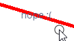

# JSX Markers



With subclassing iModelJs Markers, you have to submit an HTML element using the
`htmlElement` property of the class. Connecting this to React, isn't difficult,
you just have to create a new element and tell ReactDOM to render into it.

But with `useMarker` you can skip that boiler plate and just use jsxElement.
You may want to consider using useMemo to for expensive components that you
don't want to rerender often.

```tsx
import React, { useState } from "react";
import { Point2d, Point3d } from "@bentley/geometry-core";

const MyJsxMarker = (props: { worldLocation: Point3d }) => {
  const [isHovered, setIsHovered] = useState(false);

  useMarker({
    worldLocation: props.worldLocation,
    size: Point2d.create(70, 20),
    onMouseEnter: () => setIsHovered(true),
    onMouseLeave: () => setIsHovered(false),
    jsxElement: <div> {isHovered ? "hovered!" : "nope :("} </div>,
  });

  return null;
};
```
