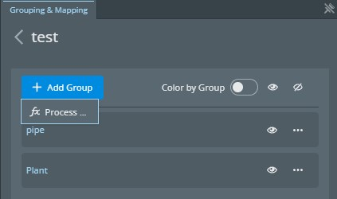
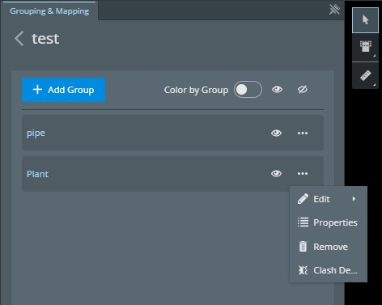

# @itwin/grouping-mapping-widget

Copyright © Bentley Systems, Incorporated. All rights reserved.
The Grouping Mapping widget is a UI component for iTwin Viewer applications that simplifies how users (and developers) interface with the [Reporting Platform APIs](https://developer.bentley.com/apis/insights/overview/).
The grouping-mapping-widget package provides a UiProvider class - `GroupingMappingProvider` - which can be passed into the `uiProviders` prop of the iTwin Viewer's `<Viewer />` component.

## Getting Started

This is not a standalone UI and requires a parent iTwin Viewer application to work as intended.
A guide on how to create a basic iTwin Viewer application can be found here: <https://www.itwinjs.org/learning/tutorials/develop-web-viewer/>.
This package provides a viewer 'widget'. Documentation on how to add a widget to your application can be found here: <https://developer.bentley.com/tutorials/itwin-viewer-hello-world/#2-your-first-ui-widget>.

## Permissions and Scopes

The SPA client used by your iTwin viewer must have these additional scopes:

- `insights:read`
- `insights:modify`
- `itwins:read`

In addition, users must have the `imodels_read` and `imodels_write` [permissions](https://developer.bentley.com/apis/insights/operations/create-mapping/#authorization) assigned at either the Project or iModel level. Further instruction on how to create roles and assign permissions can be found in the [iTwin Platform Projects API documentation](https://developer.bentley.com/apis/projects/tutorials/).

## Sample usage

```tsx
import { GroupingMappingProvider } from "@itwin/grouping-mapping-widget";
<Viewer
  ...
  uiProviders={[new GroupingMappingProvider()]}
/>
```

## Custom UI

This package provides an interface to define your own custom UI or callback functions in grouping mapping widget. There are different types of custom UIs provided.

### Grouping Custom UI

You can use your own UI component to define group creation method.

An example of grouping custom UI, [ManualGroupingCustomUI](./src/components/customUI/ManualGroupingCustomUI.tsx) helps user to manually define ECSQL query for groups.

In `GroupingCustomUIProps`:

- `updateQuery` is used to run the query and visualize results in the viewer.
- `isUpdating` keeps track of the status of query execution.
- `resetView` enables you to reset the viewer state.

To configure your own grouping custom UI, you need to give it:

- a `type` as `GroupingMappingCustomUIType.Grouping`
- a `name` as identifier
- a `displayLabel` which will be shown in the 'Add Group' dropdown list
- a `uiComponent` like above
- an optional `icon`

You can define your UI provider as follows in the GroupingMappingProvider:

```tsx
new GroupingMappingProvider({
  customUIs: [
    {
      type: GroupingMappingCustomUIType.Grouping,
      name: "Manual",
      displayLabel: "Manual Query",
      uiComponent: ManualGroupingCustomUI,
      icon: <SvgDraw />,
    },
  ],
});
```

After adding the grouping custom UI, it will be presented in the 'Add Group' drop down list.



### Context Custom UI

You can also add custom UI in context menu for each group. This could be UI driven interaction or simply a callback function to execute your own code.

You can use the `iModelId`, `mappingId` and `groupId` in `ContextCustomUIProps` provided by Grouping Mapping Widget in your UI component or callback.

To configure your own context custom UI, you need to give it:

- a `type` as `GroupingMappingCustomUIType.Context`
- a `name` as identifier
- a `displayLabel` which will be shown in the context dropdown list in each group tile
- an optional `uiComponent` which will be presented in the widget as a UI component
- an optional `onClick` callback function where you could make your own API calls
- an optional `icon`

You can define your context custom UI as following example in the GroupingMappingProvider with an example is to use [clash detection](https://www.itwinjs.org/sandboxes/iTwinPlatform/Clash%20Review) in the widget:

```tsx
const customCB = (groupId: string, mappingId: string, iModelId: string) => {
  toaster.informational(`Called callback for group ${groupId}`);
};

new GroupingMappingProvider({
  customUIs: [
    {
      type: GroupingMappingCustomUIType.Context,
      name: "ClashDetection",
      displayLabel: "Clash Detection",
      uiComponent: ClashDetectionCustomUI,
      onClick: customCB,
      icon: <SvgClash />,
    },
  ],
});
```

After adding the context custom UI, the context menu item will look like this with additional `Clash Detection` menu item.


