# @itwin/property-grid-react

Copyright © Bentley Systems, Incorporated. All rights reserved.

The `@itwin/property-grid-react` package provides React components to build a properties widget that shows properties of selected element(s).

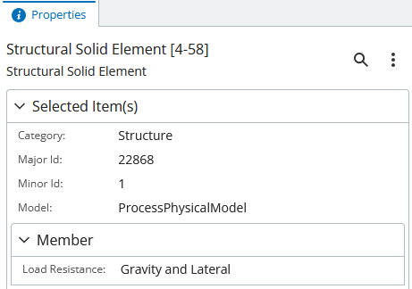

## Usage

Typically, the package is used with an [AppUI](https://github.com/iTwin/appui/tree/master/ui/appui-react) based application, but the building blocks may as well be used with any other iTwin.js React app.

In any case, **before** using any APIs or components delivered with the package, it needs to be initialized:

```ts
import { IModelApp } from "@itwin/core-frontend";
import { PropertyGridManager } from "@itwin/property-grid-react";
...
await PropertyGridManager.initialize(IModelApp.localization);
```

In [AppUI](https://github.com/iTwin/appui/tree/master/ui/appui-react) based applications widgets are typically provided using `UiItemsProvider` implementations. The `@itwin/property-grid-react` package delivers `PropertyGridUiItemsProvider` that can be used to add the properties widget to UI:

```ts
import { UiItemsManager } from "@itwin/appui-abstract";
import { PropertyGridUiItemsProvider } from "@itwin/property-grid-react";
...
UiItemsManager.register(
  new PropertyGridUiItemsProvider()
);
```

The above example uses default widget parameters and results in a component similar to the one visible at the top of this README.

Customization is also possible:

```ts
import { UiItemsManager } from "@itwin/appui-react";
import {
  PropertyGridUiItemsProvider,
  AncestorsNavigationControls,
  AddFavoritePropertyContextMenuItem,
  RemoveFavoritePropertyContextMenuItem,
  CopyPropertyTextContextMenuItem,
  ShowHideNullValuesSettingsMenuItem,
  IModelAppUserPreferencesStorage,
} from "@itwin/property-grid-react";
...
UiItemsManager.register(
  new PropertyGridUiItemsProvider({
    // defaults to `StagePanelLocation.Right`
    defaultPanelLocation: StagePanelLocation.Left,

    // defaults to `StagePanelSection.End`
    defaultPanelSection: StagePanelSection.Start,

    // defaults to whatever the default `Widget.priority` in AppUI is
    defaultPanelWidgetPriority: 1000,

    // supplies props for the `PropertyGridComponent`
    propertyGridProps: {
      // enable auto-expanding all property categories
      autoExpandChildCategories: true,

      // enable ancestor navigation by supplying a component for that
      ancestorsNavigationControls: (props) => <AncestorsNavigationControls {...props} />,

      // the list populates the context menu shown when a property is right-clicked.
      contextMenuItems: [
        // allows adding properties to favorites list
        (props) => <AddFavoritePropertyContextMenuItem {...props} />,
        // allows removing properties from favorites list
        (props) => <RemoveFavoritePropertyContextMenuItem {...props} />,
        // allows copying property values
        (props) => <CopyPropertyTextContextMenuItem {...props} />,
      ],

      // the list populates the settings menu
      settingsMenuItems: [
        // allows hiding properties without values
        (props) => <ShowHideNullValuesSettingsMenuItem {...props} persist={true} />,
      ],

      // supply an optional custom storage for user preferences, e.g. the show/hide null values used above
      preferencesStorage: new IModelAppUserPreferencesStorage("my-favorites-namespace"),

      // supply an optional data provider factory method to create a custom property data provider
      createDataProvider: (imodel: IModelConnection) => new PresentationPropertyDataProvider({ imodel, ruleset: MY_CUSTOM_RULESET }),

      // ... and a number of props of `VirtualizedPropertyGridWithDataProvider` from `@itwin/components-react` is also accepted here
    },
  }),
);
```

As seen in the above code snippet, `PropertyGridUiItemsProvider` takes a number of props that allow customizing not only how the widget behaves, but also how it looks. The package delivers commonly used building blocks:

- context and setting menu items
- ancestor navigation controls
- preferences storage that uses `IModelApp.preferences`

Consumers are free to use those blocks or replace them with their own.

## Multi-element workflow

The property grid is most useful when viewing properties of a single element. When multiple elements are selected, their properties and values get merged together:


Clicking the "Selected Elements" button opens an element list, which lets you pick one specific element from the selection:

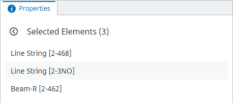

Selecting a specific element opens properties for it specifically:


## Ancestor navigation

When `ancestorsNavigationControls` prop is provided, the widget allows navigating up/down the elements' hierarchy (though `bis.ElementOwnsChildElements` relationship):

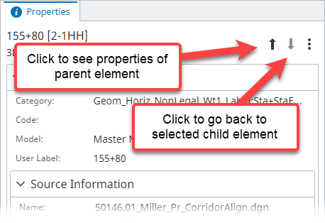

Note that ancestor navigation is only rendered when there's only one element selected and it has a parent.

## Context menu

When the user right clicks on a specific property, a context menu is displayed if at least one context menu item is provided through `contextMenuItems` prop:

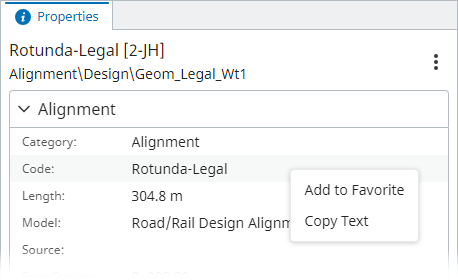

### Favorite properties

The package delivers two context menu item components for adding properties to and removing them from favorite properties list: `AddFavoritePropertyContextMenuItem` and `RemoveFavoritePropertyContextMenuItem`. When selected element contains at least one favorite property, a new "Favorite" category is rendered at the top:

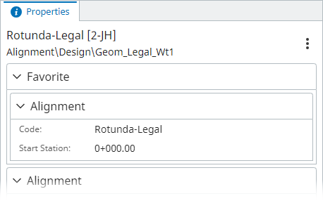

Opening context menu for such properties now renders "Remove from Favorite" instead of "Add to Favorite":

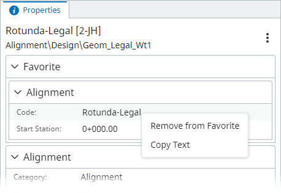

### Copy value

The package delivers `CopyPropertyTextContextMenuItem` component that allows copying selected property value to clipboard.

### Custom context menu items

Adding a custom context menu item can be done as follows:

Define a menu item component:

```tsx
function ExampleContextMenuItem(props: ContextMenuItemProps) {
  return (
    // render using `PropertyGridContextMenuItem` to get consistent style
    <PropertyGridContextMenuItem
      id="example"
      onSelect={async () => {
        console.log(`Selected property: ${props.record.property.displayLabel}`);
      }}
    >
      Click me!
    </PropertyGridContextMenuItem>
  );
}
```

Provide it to the widget:

```ts
new PropertyGridUiItemsProvider({
  propertyGridProps: {
    contextMenuItems: [(props) => <ExampleContextMenuItem {...props} />],
  },
});
```

Result:

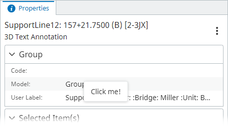

## Settings menu

The settings menu is an entry point for various settings that apply to the widget. It can be accessed by clicking on the three dots button on the right:

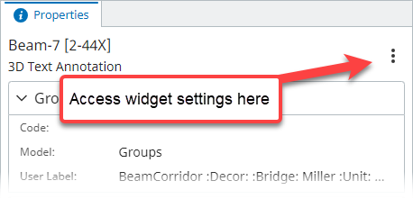

The entry point is only rendered if there's at least one settings menu item provided through the `settingsMenuItems` prop.

### Hiding empty values

The package delivers `ShowHideNullValuesSettingsMenuItem` that allows users to hide / show properties that don't have values:

| Empty values displayed                                            | Empty values hidden                                           |
| ----------------------------------------------------------------- | ------------------------------------------------------------- |
| 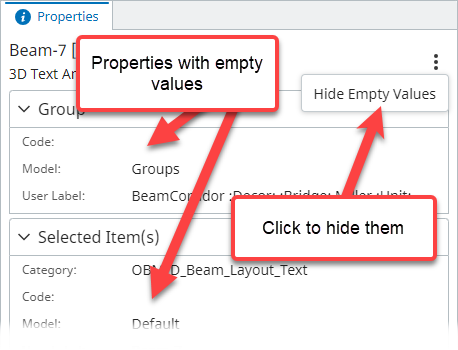 | 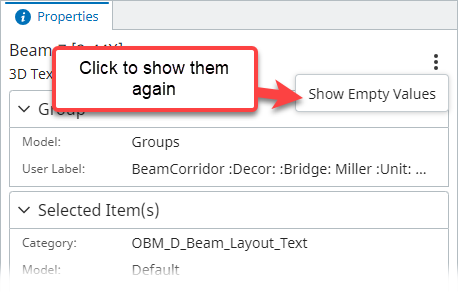 |

### Custom setting menu items

Adding a custom settings menu item can be done as follows:

Define a menu item component:

```tsx
function ExampleSettingsMenuItem() {
  return (
    // render using `PropertyGridSettingsMenuItem` to get consistent style
    <PropertyGridSettingsMenuItem
      id="example"
      onClick={() => {
        console.log("Settings menu clicked!");
      }}
    >
      Click me!
    </PropertyGridSettingsMenuItem>
  );
}
```

Provide it to the widget:

```ts
new PropertyGridUiItemsProvider({
  propertyGridProps: {
    settingsMenuItems: [(props) => <ExampleSettingsMenuItem />],
  },
});
```

Result:

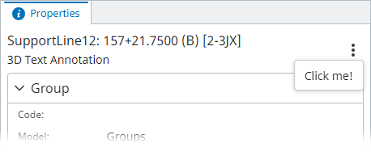

## Property filtering

Property grid allows its users to filter out properties of an element based on text input.

When an item is selected, click the magnifying glass button and notice the search bar expand.

| Search bar closed                        | Search bar opened                                     |
| ---------------------------------------- | ----------------------------------------------------- |
|  | 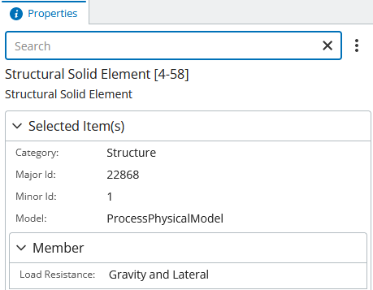 |

One can type into the search bar and notice how properties are automatically filtered based on the search bar input:

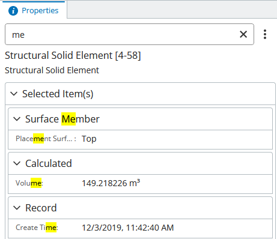

Note that when the search bar is closed, the filter is discarded and all properties are visible again.

## Performance tracking

Components from this package allows consumers to track performance of specific features.

This can be achieved by passing `onPerformanceMeasured` function to `PropertyGridComponent` or `PropertyGridUiItemsProvider`. The function is invoked with feature id and time elapsed as the component is being used. List of tracked features:

- `"properties-load"` - time it takes to load properties data after selection changes.
- `"elements-list-load"` - time it takes to populate elements list when multiple elements are selected.

Example:

```ts
new PropertyGridUiItemsProvider({
  propertyGridProps: {
    onPerformanceMeasured: (feature, elapsedTime) => {
      telemetryClient.log(`PropertyGrid [${feature}] took ${elapsedTime} ms`);
    },
  },
});
```

To track performance of individual components when using them directly, rather than through `PropertyGridUiItemsProvider`, the `onPerformanceMeasured` callback should be supplied through `TelemetryContextProvider`:

```ts
return (
  <TelemetryContextProvider
    onPerformanceMeasured={(feature, elapsedTime) => {
      telemetryClient.log(`PropertyGrid [${feature}] took ${elapsedTime} ms`);
    }}
  >
    <PropertyGrid />
  </TelemetryContextProvider>
);
```

## Usage tracking

Components from this package allows consumers to track the usage of specific features.

This can be achieved by passing `onFeatureUsed` function to `PropertyGridComponent` or `PropertyGridUiItemsProvider`. The function is invoked with feature id and as the component is being used. List of tracked features:

- `"single-element"` - when properties of a single element are shown.
- `"multiple-elements"` - when merged properties of multiple elements are shown.
- `"elements-list"` - when element list is shown.
- `"single-element-from-list"` - when properties are shown for a single element selected from the element list.
- `"ancestor-navigation"` - when elements' hierarchy is traversed using ancestor navigation buttons.
- `"context-menu"` - when context menu for a property is opened.
- `"hide-empty-values-enabled"` - when property values are loaded with "hide empty values" setting enabled.
- `"hide-empty-values-disabled"` - when property values are loaded with "hide empty values" setting disabled.
- `"filter-properties"` - when properties are filtered or selection changes while a filter is applied.

Example:

```ts
new PropertyGridUiItemsProvider({
  propertyGridProps: {
    onFeatureUsed: (feature) => {
      telemetryClient.log(`PropertyGrid [${feature}] used`);
    },
  },
});
```

To track usage of individual components when using them directly, rather than through `PropertyGridUiItemsProvider`, the `onFeatureUsed` callback should be supplied through `TelemetryContextProvider`:

```ts
return (
  <TelemetryContextProvider
    onFeatureUsed={(feature) => {
      telemetryClient.log(`PropertyGrid [${feature}] used`);
    }}
  >
    <PropertyGrid />
  </TelemetryContextProvider>
);
```
