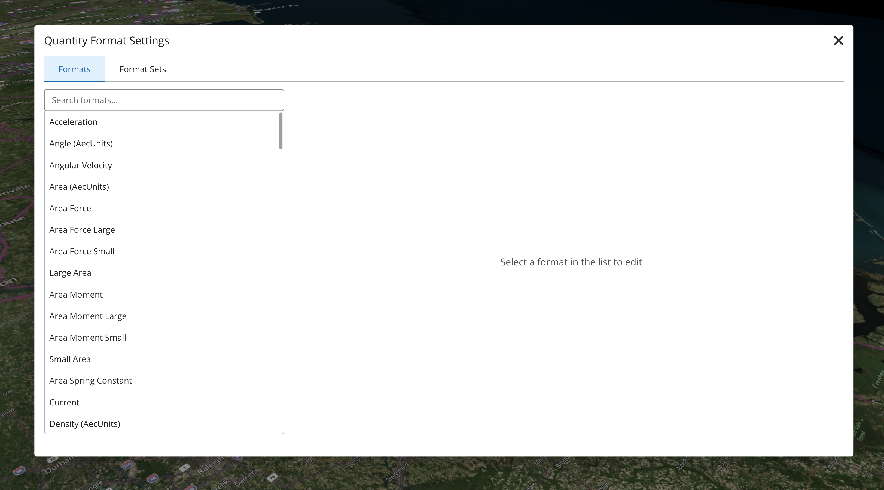
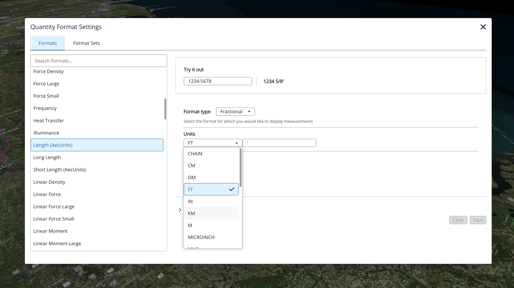

# @itwin/quantity-formatting-react

React components for quantity formatting in iTwin.js applications.

- [@itwin/quantity-formatting-react](#itwinquantity-formatting-react)
  - [Description](#description)
  - [Installation](#installation)
  - [Common Worfklow](#common-worfklow)
    - [Example Workflow](#example-workflow)
  - [Components](#components)
    - [QuantityFormatPanel](#quantityformatpanel)
      - [QuantityFormatPanel Properties](#quantityformatpanel-properties)
      - [QuantityFormatPanel Usage](#quantityformatpanel-usage)
    - [FormatPanel](#formatpanel)
      - [FormatPanel Properties](#formatpanel-properties)
      - [FormatPanel Usage](#formatpanel-usage)
    - [FormatSample](#formatsample)
      - [FormatSample Properties](#formatsample-properties)
      - [FormatSample Usage](#formatsample-usage)
    - [FormatSelector](#formatselector)
      - [FormatSelector Properties](#formatselector-properties)
      - [FormatSelector Usage](#formatselector-usage)
  - [Complete Example](#complete-example)
  - [API](#api)
    - [FormatManager](#formatmanager)
      - [Key Features](#key-features)
      - [Quick Start](#quick-start)
      - [Initialization Options](#initialization-options)
      - [Format Set Management](#format-set-management)
      - [iModel Lifecycle Integration](#imodel-lifecycle-integration)
      - [Event Handling](#event-handling)
  - [Initialization](#initialization)
    - [Integration with iModel Workflow](#integration-with-imodel-workflow)
  - [License](#license)

## Description

This package provides React components for working with quantities and their formatting in iTwin.js applications. It includes components for configuring, displaying, and converting quantities with proper unit handling and formatting options.

**Key Features:**

- **Comprehensive Format Configuration**: Support for Decimal, Fractional, Scientific, Station, Azimuth, Bearing, and Ratio formats
- **Real-time Preview**: Live formatting preview as you adjust settings
- **Unit Management**: Support for composite units and unit conversion
- **Flexible UI Components**: Modular components that can be embedded in dialogs, panels, or custom UIs
- **Format Selection**: Choose from predefined formats to customize

## Installation

```bash
npm install @itwin/quantity-formatting-react
```

## Common Worfklow

The typical workflow involves selecting a format and customizing it to meet your needs:

1. **Select a Format**: Use the `FormatSelector` to choose from available predefined formats
2. **Customize Settings**: Modify format properties like precision, units, and display options
3. **Preview Changes**: See real-time formatting preview as you make adjustments
4. **Save or Reset**: Apply your changes or revert to the original format

### Example Workflow

Starting with the `QuantityFormatPanel`, you can select a format from the available options. Initially, the Save and Clear buttons are disabled when no changes have been made.


The `FormatSelector` dropdown shows all available formats to choose from:



You can then customize the format by changing properties like the unit. For example, changing from square feet to square meters:



After making changes, notice how the Save and Clear buttons become enabled (highlighted), indicating that modifications can now be applied or discarded. The preview panel also now shows the value converted to square meters:


Click **Save** to apply your changes or **Clear** to reset back to the original format settings.

## Components

This package provides four main React components for quantity formatting:

- **QuantityFormatPanel**: Complete formatting configuration with live preview
- **FormatPanel**: Flexible format property editor
- **FormatSample**: Real-time formatting preview component
- **FormatSelector**: Dropdown for selecting from predefined format sets

### QuantityFormatPanel

The main component for configuring quantity formatting. It provides a complete user interface for setting up format properties and includes a live formatting preview.

#### QuantityFormatPanel Properties

```typescript
interface QuantityFormatPanelProps {
  formatDefinition: FormatDefinition; // Current format configuration
  unitsProvider: UnitsProvider; // Provider for unit definitions
  onFormatChange: (formatProps: FormatDefinition) => void; // Callback when format changes
  initialMagnitude?: number; // Initial value for sample preview (default: 0)
  showSample?: boolean; // Whether to show the format sample (default: true)
}
```

#### QuantityFormatPanel Usage

<details>
<summary>QuantityFormatPanel example code</summary>

```tsx
import React, { useState, useCallback } from "react";
import { QuantityFormatPanel } from "@itwin/quantity-formatting-react";
import { IModelApp } from "@itwin/core-frontend";
import { Modal, Button, ModalButtonBar } from "@itwin/itwinui-react";
import type { FormatDefinition } from "@itwin/core-quantity";

function QuantityFormatDialog() {
  const [isOpen, setIsOpen] = useState(false);
  const [formatDefinition, setFormatDefinition] = useState<FormatDefinition>({
    precision: 4,
    type: "Decimal",
    composite: {
      units: [{ name: "Units.M", label: "m" }],
    },
  });

  const handleFormatChange = useCallback((newFormat: FormatDefinition) => {
    setFormatDefinition(newFormat);
  }, []);

  const handleApply = useCallback(() => {
    // Apply the format changes to your application
    console.log("Applied format:", formatDefinition);
    setIsOpen(false);
  }, [formatDefinition]);

  return (
    <>
      <Button onClick={() => setIsOpen(true)}>Configure Format</Button>

      <Modal isOpen={isOpen} onClose={() => setIsOpen(false)} title="Quantity Format Settings">
        <QuantityFormatPanel
          formatDefinition={formatDefinition}
          unitsProvider={IModelApp.quantityFormatter.unitsProvider}
          onFormatChange={handleFormatChange}
          initialMagnitude={123.456}
        />

        <ModalButtonBar>
          <Button onClick={() => setIsOpen(false)}>Cancel</Button>
          <Button styleType="high-visibility" onClick={handleApply}>
            Apply
          </Button>
        </ModalButtonBar>
      </Modal>
    </>
  );
}
```

</details>

### FormatPanel

A flexible component for editing format properties with customizable primary and secondary sections. This component provides more granular control than `QuantityFormatPanel`.

#### FormatPanel Properties

```typescript
interface FormatPanelProps {
  formatDefinition: FormatDefinition; // Current format configuration
  unitsProvider: UnitsProvider; // Provider for unit definitions
  onFormatChange: (formatProps: FormatDefinition) => void; // Callback when format changes
  persistenceUnit?: UnitProps; // Unit for persistence/storage
}
```

#### FormatPanel Usage

<details>
<summary>FormatPanel example code</summary>

```tsx
import React, { useState } from "react";
import { FormatPanel } from "@itwin/quantity-formatting-react";
import { IModelApp } from "@itwin/core-frontend";
import type { FormatDefinition } from "@itwin/core-quantity";

function CustomFormatEditor() {
  const [format, setFormat] = useState<FormatDefinition>({
    precision: 2,
    type: "Decimal",
    formatTraits: ["showUnitLabel"],
    composite: {
      units: [{ name: "Units.FT", label: "ft" }],
    },
  });
  const persistenceUnit = await IModelApp.quantityFormatter.unitsProvider.findUnit("Units.M");

  return (
    <div style={{ padding: "16px" }}>
      <h3>Custom Format Editor</h3>
      <FormatPanel
        formatDefinition={format}
        unitsProvider={IModelApp.quantityFormatter.unitsProvider}
        onFormatChange={setFormat}
        persistenceUnit={persistenceUnit}
      />

      <div style={{ marginTop: "16px" }}>
        <h4>Current Format Configuration:</h4>
        <pre>{JSON.stringify(format, null, 2)}</pre>
      </div>
    </div>
  );
}
```

</details>

### FormatSample

A component that provides real-time preview of how values will be formatted using the current format configuration. Shows both the input value and the formatted output.

#### FormatSample Properties

```typescript
interface FormatSampleProps {
  formatProps: FormatDefinition; // Format configuration to preview
  unitsProvider: UnitsProvider; // Provider for unit definitions
  persistenceUnit?: UnitProps; // Unit for the input value
  initialMagnitude?: number; // Initial value to display (default: 0)
}
```

#### FormatSample Usage

<details>
<summary>FormatSample example code</summary>

```tsx
import React, { useState } from "react";
import { FormatSample } from "@itwin/quantity-formatting-react";
import { IModelApp } from "@itwin/core-frontend";
import type { FormatDefinition } from "@itwin/core-quantity";

function FormatPreview() {
  const [format] = useState<FormatDefinition>({
    precision: 3,
    type: "Decimal",
    formatTraits: ["showUnitLabel"],
    composite: {
      units: [{ name: "Units.M", label: "m" }],
    },
  });

  return (
    <div style={{ padding: "16px" }}>
      <h3>Format Preview</h3>
      <FormatSample formatProps={format} unitsProvider={IModelApp.quantityFormatter.unitsProvider} initialMagnitude={123.456789} />
    </div>
  );
}
```

</details>

### FormatSelector

A dropdown component for selecting from predefined format definitions within a format set.

#### FormatSelector Properties

```typescript
interface FormatSelectorProps {
  activeFormatSet?: FormatSet; // Set of available formats
  activeFormatDefinitionKey?: string; // Currently selected format key
  onListItemChange: (formatDefinition: FormatDefinition, key: string) => void; // Selection callback
}
```

#### FormatSelector Usage

<details>
<summary>FormatSelector example code</summary>

```tsx
import React, { useState, useCallback } from "react";
import { FormatSelector } from "@itwin/quantity-formatting-react";
import type { FormatDefinition, FormatSet } from "@itwin/ecschema-metadata";

function FormatSelectionPanel({ formatSet }: { formatSet?: FormatSet }) {
  const [selectedKey, setSelectedKey] = useState<string>();

  const handleFormatSelection = useCallback((formatDef: FormatDefinition, key: string) => {
    setSelectedKey(key);
    console.log("Selected format:", formatDef.label, "with key:", key);
  }, []);

  return (
    <div style={{ padding: "16px" }}>
      <h3>Select a Format</h3>
      <FormatSelector activeFormatSet={formatSet} activeFormatDefinitionKey={selectedKey} onListItemChange={handleFormatSelection} />
    </div>
  );
}
```

</details>

## Complete Example

Here's a comprehensive example showing how to use FormatSelector together with QuantityFormatPanel:

<details>
<summary>Complete integration example</summary>

```tsx
import React, { useState, useCallback } from "react";
import { FormatSelector, QuantityFormatPanel } from "@itwin/quantity-formatting-react";
import { IModelApp } from "@itwin/core-frontend";
import { Modal, Button, ModalButtonBar } from "@itwin/itwinui-react";
import type { FormatDefinition, FormatSet } from "@itwin/ecschema-metadata";

function QuantityFormatDialog({ formatSet }: { formatSet?: FormatSet }) {
  const [isOpen, setIsOpen] = useState(false);
  const [formatDefinition, setFormatDefinition] = useState<FormatDefinition | undefined>();
  const [selectedFormatKey, setSelectedFormatKey] = useState<string>();

  const handleFormatSelection = useCallback((formatDef: FormatDefinition, key: string) => {
    setFormatDefinition(formatDef);
    setSelectedFormatKey(key);
  }, []);

  const handleFormatChange = useCallback((newFormat: FormatDefinition) => {
    setFormatDefinition(newFormat);
  }, []);

  return (
    <>
      <Button onClick={() => setIsOpen(true)}>Configure Format</Button>

      <Modal isOpen={isOpen} onClose={() => setIsOpen(false)} title="Quantity Format Settings">
        <div style={{ padding: "16px" }}>
          <div style={{ marginBottom: "16px" }}>
            <h4>Select a Format</h4>
            <FormatSelector activeFormatSet={formatSet} activeFormatDefinitionKey={selectedFormatKey} onListItemChange={handleFormatSelection} />
          </div>

          {formatDefinition && (
            <div>
              <h4>Customize Format</h4>
              <QuantityFormatPanel
                formatDefinition={formatDefinition}
                unitsProvider={IModelApp.quantityFormatter.unitsProvider}
                onFormatChange={handleFormatChange}
              />
            </div>
          )}
        </div>

        <ModalButtonBar>
          <Button onClick={() => setIsOpen(false)}>Cancel</Button>
          <Button styleType="high-visibility" onClick={() => setIsOpen(false)} disabled={!formatDefinition}>
            Apply Format
          </Button>
        </ModalButtonBar>
      </Modal>
    </>
  );
}
```

</details>

## API

### FormatManager

The `FormatManager` provides a centralized singleton for managing format sets and format providers in iTwin applications. It automatically integrates with iModel schemas and supports custom format sets with event-driven updates.

#### Key Features

- **Singleton Pattern**: Single instance for application-wide format management
- **Format Set Management**: Add, remove, and organize collections of formats
- **Schema Integration**: Automatically discover and load formats from iModel schemas
- **Event-Driven**: Real-time notifications when format sets or active formats change
- **Fallback Support**: Configurable fallback format providers

#### Quick Start

```typescript
import { FormatManager } from "@itwin/quantity-formatting-react";

// Initialize the FormatManager during application startup
await FormatManager.initialize({
  formatSets: [myCustomFormatSet],
  setupSchemaFormatSetOnIModelOpen: true, // Auto-setup from schemas
});


// Listen for format changes
FormatManager.instance?.onActiveFormatSetChanged.addListener((args) => {
  console.log(`Format set changed to: ${args.currentFormatSet.name}`);
});

// Set an active format set
FormatManager.instance?.setActiveFormatSet(myFormatSet);
```

#### Initialization Options

The `FormatManager.initialize()` method accepts these configuration options:

```typescript
interface FormatManagerInitializeOptions {
  /** Initial format sets to register */
  formatSets?: FormatSet[];

  /** Fallback format provider for unknown formats */
  fallbackProvider?: FormatsProvider;

  /** Whether to automatically setup schema formats when iModel opens (default: true) */
  setupSchemaFormatSetOnIModelOpen?: boolean;

  /** Schema names to scan for formats (default: ["AecUnits"]) */
  schemaNames?: string[];
}
```

#### Format Set Management

```typescript
const manager = FormatManager.instance!;

// Add a new format set
manager.addFormatSet({
  name: "MyFormats",
  label: "My Custom Formats",
  formats: {
    "custom.length": {
      type: "Decimal",
      precision: 3,
      label: "Custom Length Format"
    }
  }
});

// Get all format sets
const formatSets = manager.formatSets;

// Get specific format set
const myFormatSet = manager.getFormatSet("MyFormats");

// Remove a format set
manager.removeFormatSet("MyFormats");

// Set active format set (applies to IModelApp.formatsProvider)
manager.setActiveFormatSet(myFormatSet);
```

#### iModel Lifecycle Integration

The FormatManager automatically integrates with iModel lifecycle events:

```typescript
// Called when iModel opens - automatically sets up schema formats
await manager.onIModelOpen(iModelConnection, {
  schemaNames: ["AecUnits"], // Get all KindOfQuantities from these schemas
  excludeUsedKindOfQuantities: false, // Include formats from used KindOfQuantities from all schemas across the iModel, not just those passed to schemaNames
  formatSetLabel: "Schema Formats", // Label for the auto-generated format set
});

// Called when iModel closes - cleans up schema providers and event listeners
await manager.onIModelClose();
```

#### Event Handling

The FormatManager provides several events for monitoring changes:

```typescript
const manager = FormatManager.instance!;

// Listen for format set collection changes
manager.onFormatSetsChanged.addListener((formatSets) => {
  console.log(`Now have ${formatSets.length} format sets`);
});

// Listen for active format set changes
manager.onActiveFormatSetChanged.addListener((args) => {
  console.log(`Active format set changed from ${args.previousFormatSet?.name} to ${args.currentFormatSet.name}`);
});

// FormatSetFormatsProvider also fires events when individual formats change
const provider = manager.activeFormatSetFormatsProvider;
provider?.onFormatsChanged.addListener((args) => {
  console.log(`Formats changed: ${args.formatsChanged.join(", ")}`);
});
```

## Initialization

Before using the components, initialize both the localization support and optionally the FormatManager:

```typescript
import { QuantityFormatting, FormatManager } from "@itwin/quantity-formatting-react";
import { IModelApp } from "@itwin/core-frontend";

// Initialize localization during application startup
await QuantityFormatting.startup({
  localization: IModelApp.localization, // Optional: use custom localization
});

// Optionally initialize FormatManager for centralized format management
await FormatManager.initialize({
  formatSets: [], // Start with empty format sets, or provide custom ones
  setupSchemaFormatSetOnIModelOpen: true, // Auto-setup from iModel schemas
});
```

### Integration with iModel Workflow

For applications that work with iModels, integrate the FormatManager with your iModel lifecycle:

```typescript
import { IModelConnection } from "@itwin/core-frontend";

// When opening an iModel
IModelConnection.open(...).then(async (iModelConnection) => {
  // Setup schema-based formats automatically
  await FormatManager.instance?.onIModelOpen(iModelConnection);

  // Your application logic here
});

// When closing an iModel
iModelConnection.close().then(async () => {
  // Cleanup schema providers
  await FormatManager.instance?.onIModelClose();
});

// Application shutdown
process.on('exit', () => {
  FormatManager.terminate(); // Cleanup singleton and listeners
});
```

</details>

## License

This project is licensed under the MIT License - see the [LICENSE.md](./LICENSE.md) file for details.
