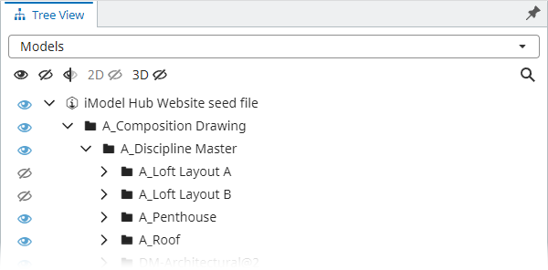
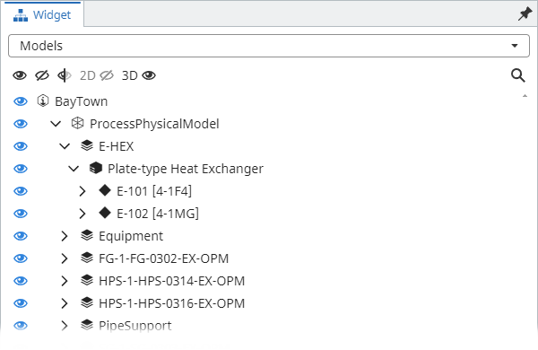
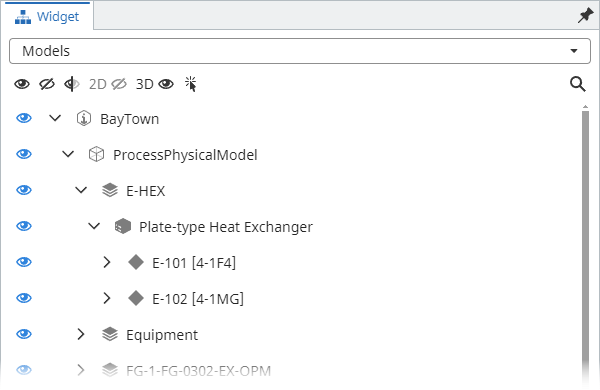
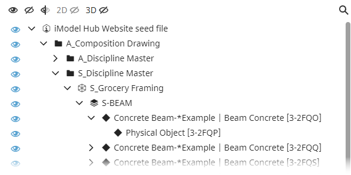
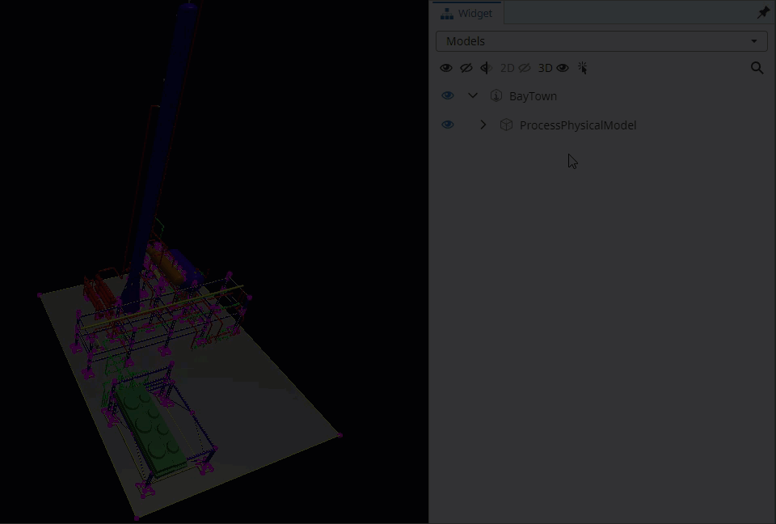
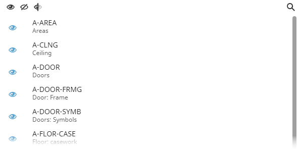
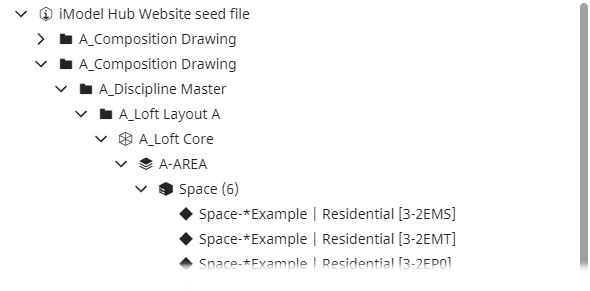
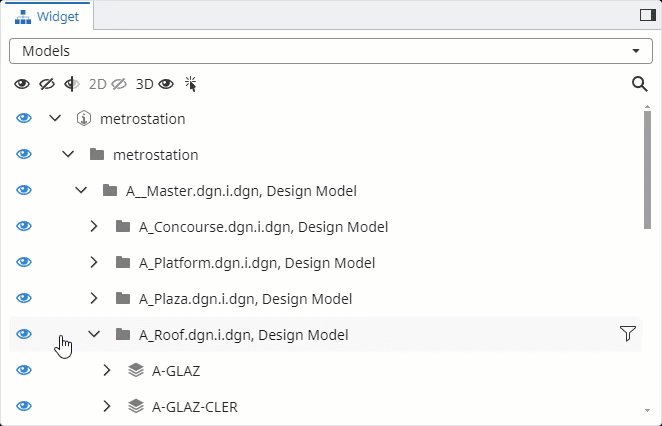

# @itwin/tree-widget-react

Copyright © Bentley Systems, Incorporated. All rights reserved.

The `@itwin/tree-widget-react` package provides React components to build a widget with tree components' selector, along with all the building blocks that can be used individually.



## 3.0 highlights

The new `3.0` version of the package contains a few notable changes, compared to the previous `2.x` generation.

- To allow easier customization of widget placement, the package now delivers a `createTreeWidget()` function that creates a tree widget definition, instead of a full `UiItemsProvider` implementation. See [Usage](#usage) section for details on how to use the new function.

- The underlying engine for building hierarchies has been changed from `@itwin/presentation-components` to `@itwin/presentation-hierarchies-react`. This is a significant change as the new library runs plain ECSQL queries and handles hierarchy creation on the frontend, as opposed to the previous version that relied on the backend to provide hierarchy data. This change allows this package to use more optimal queries and to be more flexible in terms of hierarchy creation. As a result, we're seeing 30-40% performance improvement for loading nodes in the Models tree when using a web backend and orders of magnitude improvement when using a local backend (desktop & mobile case).

  This change adds a requirement for all tree components in this package to access iModels' metadata, which is achieved through a required `getSchemaContext` prop. See [Creating schema context](#creating-schema-context) section for an example implementation of this function. This also adds an `@itwin/ecschema-metadata` peer dependency on version `^4.0.0`.

  In addition, the new tree components don't rely on the global selection manager provided by `@itwin/presentation-frontend` package. Instead, they require a unified selection storage object created using `createStorage()` function from `@itwin/unified-selection` package. See sections of individual tree components for how to supply it to them, and [Creating unified selection storage](#creating-unified-selection-storage) section for an example for how to create the storage.

- The tree components delivered with the package have been updated to use the [`Tree` component from `@itwin/itwinui-react` package](https://itwinui.bentley.com/docs/tree) instead of [`ControlledTree` from `@itwin/components-react`](https://www.itwinjs.org/reference/components-react/tree/controlledtree/). The new component is a little less dense, provides better accessibility and customization options.

  | 2.x                                             | 3.0                                             |
  | ----------------------------------------------- | ----------------------------------------------- |
  |  |  |

  This change introduces an `@itwin/itwinui-react` peer dependency on version `^3.11.0`.

- The tree components now have hierarchy level size limiting and filtering features always turned on. The features were already available in `2.x` versions, but were not enabled by default. See [Hierarchy level size limiting](#hierarchy-level-size-limiting) and [Hierarchy level filtering](#hierarchy-level-filtering) sections for more details.

- Behavior of header buttons like "Show all", "Hide all", etc. has been changed in filtered hierarchies' case. Previously they applied the visibility change on everything, no matter if the hierarchy is filtered or not. Now, when a hierarchy is filtered, only the nodes in the filtered hierarchy are affected.

- Models tree:
  - The label filtering feature has been expanded to filter not only up to Models, but the whole hierarchy. This allows filtering the hierarchy to additionally find Category or Element nodes.
  - [Focus mode](#focus-mode) feature has been added to allow automatic hierarchy filtering as the application selection changes.
  - In addition to the two filtering-related improvements above, we now allow displaying a subset of the tree by providing a `getFilteredPaths` function. See [Displaying a subset of the tree](#displaying-a-subset-of-the-tree) section for more details.
  - Display states' control has been modified to be hierarchy based. This means that changing display state of something deep in the hierarchy affects checkbox state of all its ancestors. And vice versa - changing display state of an ancestor affects all its descendants.

## Usage

Typically, the package is used with an [AppUI](https://github.com/iTwin/appui/tree/master/ui/appui-react) based application, but the building blocks may as well be used with any other iTwin.js React app.

In any case, **before** using any APIs or components delivered with the package, it needs to be initialized:

```tsx
import { TreeWidget } from "@itwin/tree-widget-react";
import { IModelApp } from "@itwin/core-frontend";

await TreeWidget.initialize(IModelApp.localization);
```

In [AppUI](https://github.com/iTwin/appui/tree/master/ui/appui-react) based applications widgets are typically provided using `UiItemsProvider` implementations. The `@itwin/tree-widget-react` package delivers `createTreeWidget` function that can be used to add the tree widget to UI through a `UiItemsProvider`:

```tsx
import { UiItemsManager } from "@itwin/appui-react";
import { createTreeWidget, ModelsTreeComponent } from "@itwin/tree-widget-react";

UiItemsManager.register({
  id: "tree-widget-provider",
  getWidgets: () =>
    [
      createTreeWidget({
        trees: [
          // add a custom component
          { id: "my-tree-id", startIcon: <svg />, getLabel: () => "My Custom Tree", render: () => <>This is my custom tree.</> },
          // add the Models tree component delivered with the package
          {
            id: ModelsTreeComponent.id,
            getLabel: () => ModelsTreeComponent.getLabel(),
            render: (props) => (
              <ModelsTreeComponent
                // see "Creating unified selection storage" section for example implementation
                selectionStorage={unifiedSelectionStorage}
              />
            ),
          },
        ],
      }),
    ] as readonly Widget[],
});
```

As seen in the above code snippet, `createTreeWidget` takes a list of trees that are displayed in the widget. This package delivers a number of tree components for everyone's use (see below), but providing custom trees is also an option.

## Components

While we expect this package to be mostly used with [AppUI](https://github.com/iTwin/appui/tree/master/ui/appui-react) and widget created through `createTreeWidget`, the package delivers components used within the widget to meet other use cases.

### Selectable tree

`SelectableTree` renders a tree selector and selected tree, based on the `trees` prop. Each tree definition contains a label, an optional icon and a render function that renders the component.

### Models tree

The component renders a tree that tries to replicate how a typical "Models" tree of the iModel would look like in the source application. There's also a header that renders models search box and various visibility control buttons.



Typical usage:

```tsx
import { ModelsTreeComponent } from "@itwin/tree-widget-react";

function MyWidget() {
  return (
    <ModelsTreeComponent
      // see "Creating unified selection storage" section for example implementation
      selectionStorage={unifiedSelectionStorage}
      headerButtons={[
        (props) => <ModelsTreeComponent.ShowAllButton {...props} key={"ShowAllButton"} />,
        (props) => <ModelsTreeComponent.HideAllButton {...props} key={"HideAllButton"} />,
      ]}
    />
  );
}
```

Available header buttons:

- `ModelsTreeComponent.ShowAllButton` makes everything in the iModel displayed.
- `ModelsTreeComponent.HideAllButton` makes everything in the iModel hidden by turning off all models.
- `ModelsTreeComponent.InvertButton` inverts display of all models.
- `ModelsTreeComponent.View2DButton` toggles plan projection models' display.
- `ModelsTreeComponent.View3DButton` toggles non-plan projection models' display.
- `ModelsTreeComponent.ToggleInstancesFocusButton` enables/disables instances focusing mode.

#### Focus mode

The Models tree can be used in a "focus mode" where the tree is automatically filtered to show only elements that are selected in the application. The mode can be controlled through a toggle button in the component's header. Since the feature is mutually exclusive with the "search" feature, enabling it automatically disables the search functionality.



#### Custom models tree

This package provides building blocks for custom models tree:

- `useModelsTree` - hook for creating and managing models tree state.
- `useModelsTreeButtonProps` - hook for creating props for models tree buttons.

Example:

```tsx
import { useCallback } from "react";
import { TreeWithHeader, useModelsTree, useModelsTreeButtonProps, VisibilityTree, VisibilityTreeRenderer } from "@itwin/tree-widget-react";
import type { SelectionStorage } from "@itwin/unified-selection";
import type { IModelConnection, Viewport } from "@itwin/core-frontend";
import type { ComponentPropsWithoutRef } from "react";

type VisibilityTreeRendererProps = ComponentPropsWithoutRef<typeof VisibilityTreeRenderer>;
type CustomModelsTreeRendererProps = Parameters<ComponentPropsWithoutRef<typeof VisibilityTree>["treeRenderer"]>[0];
function CustomModelsTreeRenderer(props: CustomModelsTreeRendererProps) {
  const getLabel = props.getLabel;
  const getLabelCallback = useCallback<Required<VisibilityTreeRendererProps>["getLabel"]>(
    (node) => {
      const originalLabel = getLabel(node);
      return <>Custom node - {originalLabel}</>;
    },
    [getLabel],
  );
  const getSublabelCallback = useCallback<Required<VisibilityTreeRendererProps>["getSublabel"]>((node) => <>Sublabel - {node.label}</>, []);
  return <VisibilityTreeRenderer {...props} getLabel={getLabelCallback} getSublabel={getSublabelCallback} />;
}

interface CustomModelsTreeProps {
  imodel: IModelConnection;
  viewport: Viewport;
  selectionStorage: SelectionStorage;
}

function CustomModelsTreeComponent({ imodel, viewport, selectionStorage }: CustomModelsTreeProps) {
  const { buttonProps } = useModelsTreeButtonProps({ imodel, viewport });
  const { modelsTreeProps, rendererProps } = useModelsTree({ activeView: viewport });

  return (
    <TreeWithHeader
      buttons={[
        <ModelsTreeComponent.ShowAllButton {...buttonProps} key={"ShowAllButton"} />,
        <ModelsTreeComponent.HideAllButton {...buttonProps} key={"HideAllButton"} />,
      ]}
    >
      <VisibilityTree
        {...modelsTreeProps}
        selectionStorage={selectionStorage}
        imodel={imodel}
        treeRenderer={(props) => <CustomModelsTreeRenderer {...props} {...rendererProps} />}
      />
    </TreeWithHeader>
  );
}
```

#### Displaying a subset of the tree

Models tree allows displaying a subset of all nodes by providing a `getFilteredPaths` function, which receives a `createInstanceKeyPaths` function for creating hierarchy node paths from instance keys or an instance label and returns a list of hierarchy node paths targeting some nodes. When these paths are provided, the displayed hierarchy consists only of the targeted nodes, their ancestors, and their children. Example implementation of `getFilteredPaths`:

```tsx
type UseModelsTreeProps = Parameters<typeof useModelsTree>[0];
type GetFilteredPathsType = Exclude<UseModelsTreeProps["getFilteredPaths"], undefined>;
interface CustomModelsTreeProps {
  viewport: Viewport;
  selectionStorage: SelectionStorage;
  imodel: IModelConnection;
  targetItems: InstanceKey[];
}

function CustomModelsTreeComponent({ viewport, selectionStorage, imodel, targetItems }: CustomModelsTreeProps) {
  const getFilteredPaths = useCallback<GetFilteredPathsType>(
    async ({ createInstanceKeyPaths }) => {
      return createInstanceKeyPaths({
        // list of instance keys representing nodes that should be displayed in the hierarchy
        targetItems,
      });
    },
    [targetItems],
  );

  const { modelsTreeProps, rendererProps } = useModelsTree({ activeView: viewport, getFilteredPaths });

  return (
    <VisibilityTree
      {...modelsTreeProps}
      selectionStorage={selectionStorage}
      imodel={imodel}
      treeRenderer={(props) => <VisibilityTreeRenderer {...props} {...rendererProps} />}
    />
  );
}
```

### Categories tree

The component, based on the active view, renders a hierarchy of either spatial (3d) or drawing (2d) categories. The hierarchy consists of two levels - the category (spatial or drawing) and its sub-categories. There's also a header that renders categories search box and various visibility control buttons.



Typical usage:

```tsx
import { CategoriesTreeComponent } from "@itwin/tree-widget-react";

function MyWidget() {
  return (
    <CategoriesTreeComponent
      // see "Creating unified selection storage" section for example implementation
      selectionStorage={unifiedSelectionStorage}
      headerButtons={[(props) => <CategoriesTreeComponent.ShowAllButton {...props} />, (props) => <CategoriesTreeComponent.HideAllButton {...props} />]}
    />
  );
}
```

Available header buttons:

- `ModelsTreeComponent.ShowAllButton` makes all categories and their subcategories displayed.
- `ModelsTreeComponent.HideAllButton` makes all categories hidden.
- `ModelsTreeComponent.InvertButton` inverts display of all categories.

#### Custom categories tree

This package provides building blocks for custom categories tree:

- `useCategoriesTree` - hook for creating and managing categories tree state.
- `useCategoriesTreeButtonProps` - hook for creating props for categories tree buttons.

Example:

```tsx
import { TreeWithHeader, useCategoriesTree, useCategoriesTreeButtonProps, VisibilityTree, VisibilityTreeRenderer } from "@itwin/tree-widget-react";
import type { IModelConnection, Viewport } from "@itwin/core-frontend";
import type { SelectionStorage } from "@itwin/unified-selection";
import type { ComponentPropsWithoutRef } from "react";

type VisibilityTreeRendererProps = ComponentPropsWithoutRef<typeof VisibilityTreeRenderer>;
type CustomCategoriesTreeRendererProps = Parameters<ComponentPropsWithoutRef<typeof VisibilityTree>["treeRenderer"]>[0];

function CustomCategoriesTreeRenderer(props: CustomCategoriesTreeRendererProps) {
  const getLabel = props.getLabel;
  const getLabelCallback = useCallback<Required<VisibilityTreeRendererProps>["getLabel"]>(
    (node) => {
      const originalLabel = getLabel(node);
      return <>Custom node - {originalLabel}</>;
    },
    [getLabel],
  );
  const getSublabel = useCallback<Required<VisibilityTreeRendererProps>["getSublabel"]>(() => {
    return <>Custom sub label</>;
  }, []);
  return <VisibilityTreeRenderer {...props} getLabel={getLabelCallback} getSublabel={getSublabel} />;
}

interface CustomCategoriesTreeProps {
  imodel: IModelConnection;
  viewport: Viewport;
  selectionStorage: SelectionStorage;
}

function CustomCategoriesTreeComponent({ imodel, viewport, selectionStorage }: CustomCategoriesTreeProps) {
  const { buttonProps } = useCategoriesTreeButtonProps({ viewport });
  const { categoriesTreeProps, rendererProps } = useCategoriesTree({ activeView: viewport, filter: "" });
  return (
    <TreeWithHeader
      buttons={[
        <CategoriesTreeComponent.ShowAllButton {...buttonProps} key={"ShowAllButton"} />,
        <CategoriesTreeComponent.HideAllButton {...buttonProps} key={"HideAllButton"} />,
      ]}
    >
      <VisibilityTree
        {...categoriesTreeProps}
        selectionStorage={selectionStorage}
        imodel={imodel}
        treeRenderer={(props) => <CustomCategoriesTreeRenderer {...props} {...rendererProps} />}
      />
    </TreeWithHeader>
  );
}
```

### iModel content tree

The component renders a similar hierarchy to [Models tree](#models-tree), but with the following changes:

- Only the hierarchy, without a header is rendered.
- Visibility control is not allowed.
- There's less hiding of `Subject` and `Model` nodes.
- Show not only geometric, but all Models and Elements.

In general, the component is expected to be used by advanced users to inspect contents of the iModel.



Typical usage:

```tsx
import { IModelContentTreeComponent } from "@itwin/tree-widget-react";

function MyWidget() {
  return (
    <IModelContentTreeComponent
      // see "Creating unified selection storage" section for example implementation
      selectionStorage={unifiedSelectionStorage}
    />
  );
}
```

### Custom trees

The package delivers a set of building blocks for creating trees that look and feel similar to the tree components provided by this package.

#### Custom basic tree

A "basic" tree is a tree that renders the hierarchy without visibility control - see [iModel content tree](#imodel-content-tree) for an example. Core components:

- `Tree` - component that manages tree state, selection and filtering.
- `TreeRenderer` - default renderer for tree data.

Example:

```tsx
import type { ComponentPropsWithoutRef } from "react";
import type { IModelConnection } from "@itwin/core-frontend";
import { Tree, TreeRenderer } from "@itwin/tree-widget-react";
import { createNodesQueryClauseFactory, createPredicateBasedHierarchyDefinition } from "@itwin/presentation-hierarchies";
import { createBisInstanceLabelSelectClauseFactory } from "@itwin/presentation-shared";

type TreeProps = ComponentPropsWithoutRef<typeof Tree>;
const getHierarchyDefinition: TreeProps["getHierarchyDefinition"] = ({ imodelAccess }) => {
  // create a hierarchy definition that defines what should be shown in the tree
  // see https://github.com/iTwin/presentation/blob/master/packages/hierarchies/learning/imodel/HierarchyDefinition.md
  const labelsQueryFactory = createBisInstanceLabelSelectClauseFactory({ classHierarchyInspector: imodelAccess });
  const nodesQueryFactory = createNodesQueryClauseFactory({ imodelAccess, instanceLabelSelectClauseFactory: labelsQueryFactory });
  return createPredicateBasedHierarchyDefinition({
    classHierarchyInspector: imodelAccess,
    hierarchy: {
      // For root nodes, select all BisCore.GeometricModel3d instances
      rootNodes: async () => [
        {
          fullClassName: "BisCore.GeometricModel3d",
          query: {
            ecsql: `
              SELECT
                ${await nodesQueryFactory.createSelectClause({
                  ecClassId: { selector: "this.ECClassId" },
                  ecInstanceId: { selector: "this.ECInstanceId" },
                  nodeLabel: {
                    selector: await labelsQueryFactory.createSelectClause({ classAlias: "this", className: "BisCore.GeometricModel3d" }),
                  },
                })}
              FROM BisCore.GeometricModel3d this
            `,
          },
        },
      ],
      childNodes: [],
    },
  });
};

interface MyTreeProps {
  imodel: IModelConnection;
}

function MyTree({ imodel }: MyTreeProps) {
  return (
    <Tree
      treeName="MyTree"
      imodel={imodel}
      selectionStorage={unifiedSelectionStorage}
      getHierarchyDefinition={getHierarchyDefinition}
      treeRenderer={(props) => <TreeRenderer {...props} />}
    />
  );
}
```

#### Custom visibility tree

A visibility tree is a tree that renders the hierarchy and allows controlling visibility control through the use of "eye" checkboxes - see [Models](#models-tree) and [Categories](#categories-tree) trees. Core components:

- `VisibilityTree` - same as `Tree` component but additionally manages visibility of instances represented by tree nodes.
- `VisibilityTreeRenderer` - same as `TreeRenderer` but additionally renders checkboxes for visibility control.

Example:

```tsx
import { BeEvent } from "@itwin/core-bentley";
import { VisibilityTree, VisibilityTreeRenderer } from "@itwin/tree-widget-react";
import { createNodesQueryClauseFactory, createPredicateBasedHierarchyDefinition } from "@itwin/presentation-hierarchies";
import { createBisInstanceLabelSelectClauseFactory } from "@itwin/presentation-shared";
import type { ComponentPropsWithoutRef } from "react";
import type { IModelConnection } from "@itwin/core-frontend";

type VisibilityTreeProps = ComponentPropsWithoutRef<typeof VisibilityTree>;
const getHierarchyDefinition: VisibilityTreeProps["getHierarchyDefinition"] = ({ imodelAccess }) => {
  // create a hierarchy definition that defines what should be shown in the tree
  // see https://github.com/iTwin/presentation/blob/master/packages/hierarchies/learning/imodel/HierarchyDefinition.md
  const labelsQueryFactory = createBisInstanceLabelSelectClauseFactory({ classHierarchyInspector: imodelAccess });
  const nodesQueryFactory = createNodesQueryClauseFactory({ imodelAccess, instanceLabelSelectClauseFactory: labelsQueryFactory });
  return createPredicateBasedHierarchyDefinition({
    classHierarchyInspector: imodelAccess,
    hierarchy: {
      // For root nodes, select all BisCore.GeometricModel3d instances
      rootNodes: async () => [
        {
          fullClassName: "BisCore.GeometricModel3d",
          query: {
            ecsql: `
              SELECT
                ${await nodesQueryFactory.createSelectClause({
                  ecClassId: { selector: "this.ECClassId" },
                  ecInstanceId: { selector: "this.ECInstanceId" },
                  nodeLabel: {
                    selector: await labelsQueryFactory.createSelectClause({ classAlias: "this", className: "BisCore.GeometricModel3d" }),
                  },
                })}
              FROM BisCore.GeometricModel3d this
            `,
          },
        },
      ],
      childNodes: [],
    },
  });
};

const visibilityHandlerFactory: VisibilityTreeProps["visibilityHandlerFactory"] = () => {
  return {
    // event that can be used to notify tree when visibility of instances represented by tree nodes changes from outside.
    onVisibilityChange: new BeEvent(),
    async getVisibilityStatus(node: HierarchyNode): Promise<VisibilityStatus> {
      return { state: "visible" };
      // determine visibility status of the instance represented by tree node.
    },
    async changeVisibility(node: HierarchyNode, on: boolean): Promise<void> {
      // change visibility of the instance represented by tree node.
    },
    dispose() {
      // if necessary, do some clean up before new visibility handler is created or component is unmounted.
    },
  };
};

interface MyVisibilityTreeProps {
  imodel: IModelConnection;
}

function MyVisibilityTree({ imodel }: MyVisibilityTreeProps) {
  return (
    <VisibilityTree
      treeName="MyVisibilityTree"
      imodel={imodel}
      selectionStorage={unifiedSelectionStorage}
      getHierarchyDefinition={getHierarchyDefinition}
      visibilityHandlerFactory={visibilityHandlerFactory}
      treeRenderer={(props) => <VisibilityTreeRenderer {...props} />}
    />
  );
}
```

### Hierarchy level size limiting

All tree components in this package enforce a hierarchy level size limit. This means that when a node is expanded, only a certain number of child nodes are loaded. The limit is enforced to prevent loading too many nodes at once and to keep the performance of the tree components at an acceptable level.

By default, the limit is set to `1000` nodes and components allow users to increase it to `10,000` for each hierarchy level individually:



### Hierarchy level filtering

All tree components in this package allow users to filter nodes at each hierarchy level. The filter is applied to a single hierarchy level, which allows users to reduce amount of nodes being loaded - this is especially useful when a [hierarchy level size limit](#hierarchy-level-size-limiting) is hit:


### Creating unified selection storage

Tree components that support selection synchronization, require a unified selection storage object created using `createStorage()` function from `@itwin/unified-selection` package.

Typically, we want one unified selection storage per application - this makes sure that selection in all application's components is synchronized. Below is an example implementation of `getUnifiedSelectionStorage` function that creates the storage and clears it when an iModel is closed:

```tsx
import { IModelConnection } from "@itwin/core-frontend";
import { createStorage } from "@itwin/unified-selection";
import type { SelectionStorage } from "@itwin/unified-selection";

let unifiedSelectionStorage: SelectionStorage | undefined;
function getUnifiedSelectionStorage(): SelectionStorage {
  if (!unifiedSelectionStorage) {
    unifiedSelectionStorage = createStorage();
    IModelConnection.onClose.addListener((imodel) => {
      unifiedSelectionStorage!.clearStorage({ imodelKey: imodel.key });
    });
  }
  return unifiedSelectionStorage;
}
```

In case the application is also using components driven by APIs from `@itwin/presentation-frontend` package, which has its own selection manager, the single unified selection storage object should be passed to [`initialize`](https://www.itwinjs.org/reference/presentation-frontend/core/presentation/initializestatic/) function, e.g.:

```tsx
import { Presentation } from "@itwin/presentation-frontend";

await Presentation.initialize({ selection: { selectionStorage: getUnifiedSelectionStorage() } });
```

## Telemetry

### Performance tracking

Components from this package allows consumers to track performance of specific features.

This can be achieved by passing `onPerformanceMeasured` function to `CategoriesTreeComponent`, `ModelsTreeComponent`, `IModelContentTreeComponent`. The function is invoked with feature id and time elapsed as the component is being used. List of tracked features:

- `"{tree}-initial-load"` - time it takes to load initial nodes after the tree is created.
- `"{tree}-hierarchy-level-load"` - time it takes to load child nodes when a node is expanded.
- `"{tree}-reload"` - time it takes to reload the tree after data in the iModel changes or it's being reloaded due to filtering.

Where `{tree}` specifies which tree component the feature is of.

### Usage tracking

Components from this package allows consumers to track the usage of specific features.

This can be achieved by passing `onFeatureUsed` function to `CategoriesTreeComponent`, `ModelsTreeComponent`, `IModelContentTreeComponent`. The function is invoked with feature id as the component is being used. List of tracked features:

- `"choose-{tree}"` - when a tree is selected in the tree selector.
- `"use-{tree}"` - when an interaction with a tree hierarchy happens. This includes any kind of interaction with nodes, including them being expanded/collapsed, selected, filtered, their visibility change, etc.
- `"{tree}-visibility-change"` - when visibility is toggled using an "eye" button.
- `"{tree}-error-timeout"` - when a request timeouts while loading hierarchy or filtering.
- `"{tree}-error-unknown"` - when an unknown error occurs while loading hierarchy or filtering.
- `"models-tree-showall"` - when "Show All" button is used in `ModelsTreeComponent`.
- `"models-tree-hideall"` - when "Hide All" button is used in `ModelsTreeComponent`.
- `"models-tree-invert"` - when "Invert" button is used in `ModelsTreeComponent`.
- `"models-tree-view2d"` - when "Toggle 2D Views" button is used in `ModelsTreeComponent`.
- `"models-tree-view3d"` - when "Toggle 3D Views" button is used in `ModelsTreeComponent`.
- `"models-tree-instancesfocus"` - when "Instances focus mode" toggle button is used in `ModelsTreeComponent`.
- `"models-tree-zoom-to-node"` - when node is zoomed to in `ModelsTree`.
- `"models-tree-filtering"` - when a filter is applied in `ModelsTree`.
- `"models-tree-hierarchy-level-filtering"` - when a hierarchy level filter is applied in the `ModelsTree`.
- `"models-tree-hierarchy-level-size-limit-hit"` - when hierarchy level size limit is exceeded while loading nodes in the `ModelsTree`.
- `"categories-tree-showall"` - when "Show All" button is used in `CategoriesTreeComponent`.
- `"categories-tree-hideall"` - when "Hide All" button is used in `CategoriesTreeComponent`.
- `"categories-tree-invert"` - when "Invert" button is used in `CategoriesTreeComponent`.

Where `{tree}` specifies which tree component the feature is of.

### Example

For individual tree components the callbacks should be supplied through props:

```tsx
import { IModelContentTreeComponent } from "@itwin/tree-widget-react";

function MyWidget() {
  return (
    <IModelContentTreeComponent
      onPerformanceMeasured={(feature, elapsedTime) => {
        console.log(`TreeWidget [${feature}] took ${elapsedTime} ms`);
      }}
      onFeatureUsed={(feature) => {
        console.log(`TreeWidget [${feature}] used`);
      }}
      selectionStorage={unifiedSelectionStorage}
    />
  );
}
```

For custom tree components `TelemetryContextProvider` should be used:

```tsx
import { TelemetryContextProvider, useCategoriesTree, VisibilityTree, VisibilityTreeRenderer } from "@itwin/tree-widget-react";

function MyWidget() {
  return (
    <TelemetryContextProvider
      componentIdentifier="MyTree"
      onPerformanceMeasured={(feature, elapsedTime) => {
        console.log(`TreeWidget [${feature}] took ${elapsedTime} ms`);
      }}
      onFeatureUsed={(feature) => {
        console.log(`TreeWidget [${feature}] used`);
      }}
    >
      <MyTree />
    </TelemetryContextProvider>
  );
}

function MyTree() {
  const { categoriesTreeProps, rendererProps } = useCategoriesTree({ activeView: viewport, filter: "" });
  return (
    // VisibilityTree will use provided telemetry context to report used features and their performance
    <VisibilityTree
      {...categoriesTreeProps}
      selectionStorage={unifiedSelectionStorage}
      imodel={imodel}
      treeRenderer={(props) => <VisibilityTreeRenderer {...props} {...rendererProps} />}
    />
  );
  // see "Custom trees" section for more example implementations
}
```
