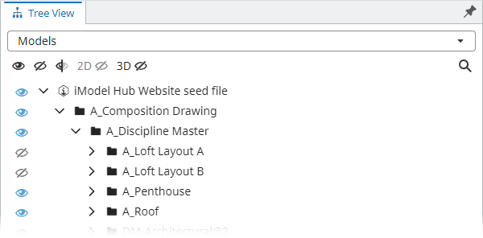
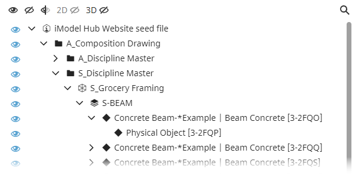
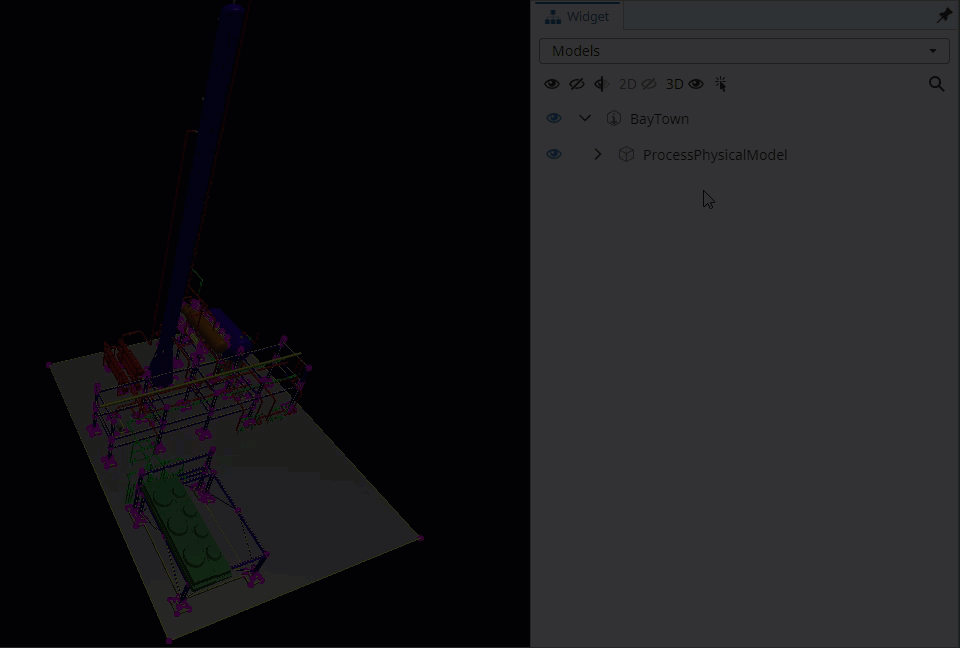
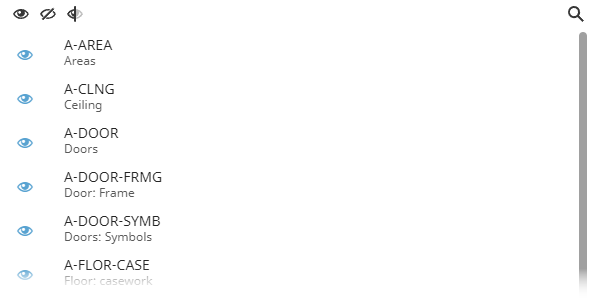
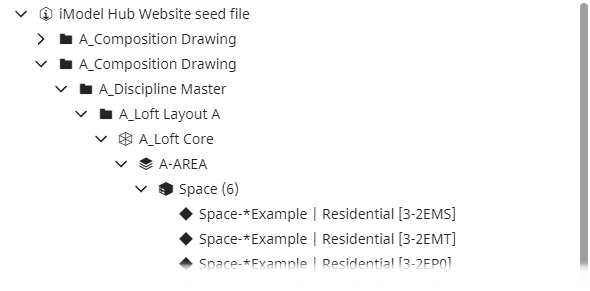
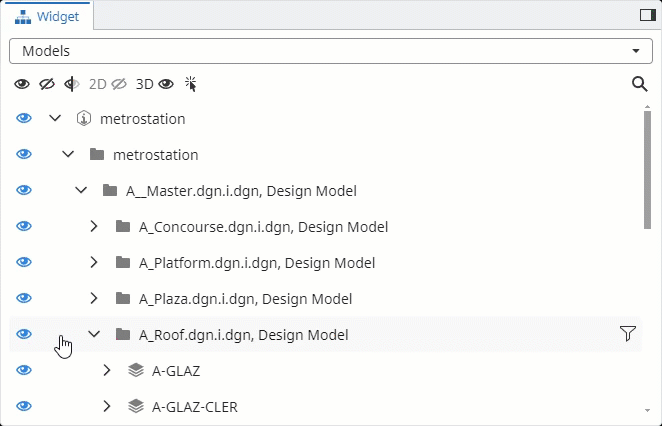

# @itwin/tree-widget-react

Copyright © Bentley Systems, Incorporated. All rights reserved.

The `@itwin/tree-widget-react` package provides React components to build a widget with tree components' selector, along with all the building blocks that can be used individually.



## Usage

Typically, the package is used with an [AppUI](https://github.com/iTwin/appui/tree/master/ui/appui-react) based application, but the building blocks may as well be used with any other iTwin.js React app.

In any case, **before** using any APIs or components delivered with the package, it needs to be initialized:

```tsx
import { TreeWidget } from "@itwin/tree-widget-react";

await TreeWidget.initialize();
```

In [AppUI](https://github.com/iTwin/appui/tree/master/ui/appui-react) based applications widgets are typically provided using `UiItemsProvider` implementations. The `@itwin/tree-widget-react` package delivers `createTreeWidget` function that can be used to add the tree widget to UI through a `UiItemsProvider`:

```tsx
import { UiItemsManager } from "@itwin/appui-react";
import { createTreeWidget, ModelsTreeComponent } from "@itwin/tree-widget-react";

UiItemsManager.register({
  id: "tree-widget-provider",
  getWidgets: () =>
    [
      createTreeWidget({
        localization: IModelApp.localization,
        trees: [
          // add a custom component
          { id: "my-tree-id", startIcon: <svg />, getLabel: () => "My Custom Tree", render: () => <>This is my custom tree.</> },
          // add the Models tree component delivered with the package
          {
            id: ModelsTreeComponent.id,
            getLabel: ModelsTreeComponent.getLabel,
            render: (props) => (
              <ModelsTreeComponent
                // see "Creating unified selection storage" section for example implementation
                selectionStorage={unifiedSelectionStorage}
              />
            ),
          },
        ],
      }),
    ] as readonly Widget[],
});
```

As seen in the above code snippet, `createTreeWidget` takes a list of trees that are displayed in the widget. This package delivers a number of tree components for everyone's use (see below), but providing custom trees is also an option.

## Localization

This package delivers a locale JSON file with English strings that follows the [`i18next JSON format`](https://www.i18next.com/misc/json-format). To enable localization, register `LOCALIZATION_NAMESPACES` during initialization and wrap components in `LocalizationContextProvider`:

```tsx
import { LocalizationContextProvider, LOCALIZATION_NAMESPACES, createTreeWidget, ModelsTreeComponent } from "@itwin/tree-widget-react";

// Register localization namespaces with `i18next` based localization provider.
for (const namespace of LOCALIZATION_NAMESPACES) {
  await IModelApp.localization.registerNamespace(namespace);
}

// When using `createTreeWidget` pass `localization` object and `LocalizationContextProvider` will be added at the widget scope automatically.
UiItemsManager.register({
  id: "tree-widget-provider",
  getWidgets: () =>
    [
      createTreeWidget({
        localization: IModelApp.localization,
        trees: [
          // tree definitions
        ],
      }),
    ] as readonly Widget[],
});

// When using lower level components directly they will need to be wrapped inside `LocalizationContextProvider`
function TreeComponent() {
  return (
    <LocalizationContextProvider localization={IModelApp.localization}>
      <ModelsTreeComponent
        // see "Creating unified selection storage" section for example implementation
        selectionStorage={unifiedSelectionStorage}
        headerButtons={[
          (props) => <ModelsTreeComponent.ShowAllButton {...props} key={"ShowAllButton"} />,
          (props) => <ModelsTreeComponent.HideAllButton {...props} key={"HideAllButton"} />,
        ]}
      />
    </LocalizationContextProvider>
  );
}
```

`LocalizationContextProvider` accepts a `localization` prop — an object with a `getLocalizedString(key: string): string` method. It is designed to work with the `Localization` interface from `@itwin/core-common`, but a custom implementation can be used as well by providing an object with a custom `getLocalizedString` function.

## Components

While we expect this package to be mostly used with [AppUI](https://github.com/iTwin/appui/tree/master/ui/appui-react) and widget created through `createTreeWidget`, the package delivers components used within the widget to meet other use cases.

### Selectable tree

`SelectableTree` renders a tree selector and selected tree, based on the `trees` prop. Each tree definition contains a label, an optional icon and a render function that renders the component.

### Models tree

The component renders a tree that tries to replicate how a typical "Models" tree of the iModel would look like in the source application. There's also a header that renders models search box and various visibility control buttons.



Typical usage:

```tsx
import { ModelsTreeComponent } from "@itwin/tree-widget-react";

function MyWidget() {
  return (
    <ModelsTreeComponent
      // see "Creating unified selection storage" section for example implementation
      selectionStorage={unifiedSelectionStorage}
      headerButtons={[
        (props) => <ModelsTreeComponent.ShowAllButton {...props} key={"ShowAllButton"} />,
        (props) => <ModelsTreeComponent.HideAllButton {...props} key={"HideAllButton"} />,
      ]}
    />
  );
}
```

Available header buttons:

- `ModelsTreeComponent.ShowAllButton` makes everything in the iModel displayed.
- `ModelsTreeComponent.HideAllButton` makes everything in the iModel hidden by turning off all models.
- `ModelsTreeComponent.InvertButton` inverts display of all models.
- `ModelsTreeComponent.View2DButton` toggles plan projection models' display.
- `ModelsTreeComponent.View3DButton` toggles non-plan projection models' display.
- `ModelsTreeComponent.ToggleInstancesFocusButton` enables/disables instances focusing mode.

#### Focus mode

The Models tree can be used in a "focus mode" where the tree is automatically filtered to show only elements that are selected in the application. The mode can be controlled through a toggle button in the component's header. Since the feature is mutually exclusive with the "search" feature, enabling it automatically disables the search functionality.



#### Custom models tree

This package provides building blocks for custom models tree:

- `useModelsTree` - hook for creating and managing models tree state.
- `useModelsTreeButtonProps` - hook for creating props for models tree buttons.

Example:

```tsx
import { useCallback } from "react";
import { TreeWithHeader, useModelsTree, useModelsTreeButtonProps, VisibilityTree, VisibilityTreeRenderer } from "@itwin/tree-widget-react";
import type { SelectionStorage } from "@itwin/unified-selection";
import type { IModelConnection, Viewport } from "@itwin/core-frontend";
import type { ComponentPropsWithoutRef } from "react";

type VisibilityTreeRendererProps = ComponentPropsWithoutRef<typeof VisibilityTreeRenderer>;
type CustomModelsTreeRendererProps = Parameters<ComponentPropsWithoutRef<typeof VisibilityTree>["treeRenderer"]>[0];
function CustomModelsTreeRenderer(props: CustomModelsTreeRendererProps) {
  const getTreeItemProps = useCallback<Required<VisibilityTreeRendererProps>["getTreeItemProps"]>(
    (node) => {
      const treeProps = props.getTreeItemProps(node);
      const label = treeProps.label ?? node.label;
      return {
        label: <>Custom node - {label}</>
        description: <>Sublabel - {label}</>
      };
    },
    [props.getTreeItemProps],
  );
  return <VisibilityTreeRenderer {...props} getTreeItemProps={getTreeItemProps} />;
}

interface CustomModelsTreeProps {
  imodel: IModelConnection;
  viewport: Viewport;
  selectionStorage: SelectionStorage;
}

function CustomModelsTreeComponent({ imodel, viewport, selectionStorage }: CustomModelsTreeProps) {
  const { buttonProps } = useModelsTreeButtonProps({ imodel, viewport });
  const modelsTree = useModelsTree({ activeView: viewport });

  return (
    <TreeWithHeader
      buttons={[
        <ModelsTreeComponent.ShowAllButton {...buttonProps} key={"ShowAllButton"} />,
        <ModelsTreeComponent.HideAllButton {...buttonProps} key={"HideAllButton"} />,
      ]}
    >
      <VisibilityTree
        {...modelsTree.treeProps}
        selectionStorage={selectionStorage}
        imodel={imodel}
        treeRenderer={(rendererProps) => <CustomModelsTreeRenderer {...rendererProps} getTreeItemProps={(node) => modelsTree.getTreeItemProps(node, rendererProps)} />}
      />
    </TreeWithHeader>
  );
}
```

#### Displaying a subset of the tree

Models tree allows displaying a subset of all nodes by providing a `getFilteredPaths` or `getSubTreePaths` functions. These functions receive a helper function called `createInstanceKeyPaths`.
For `getFilteredPaths` this helper function can generate paths from either:

- a list of instance keys (`targetItems`)
- a label string

For `getSubTreePaths` this helper function can generate paths from:

- a list of instance keys (`targetItems`)

Based on the returned paths, the displayed hierarchy consists only of the targeted nodes, their ancestors, and their children.

Use `getFilteredPaths` when you need more control over filtering behaviour. Here are some example use cases:

- **Filter by known instance keys**: You already have a list of `InstanceKey` items that should remain in the tree. Pass them as `targetItems` to `createInstanceKeyPaths`.

  ```tsx
  type UseModelsTreeProps = Parameters<typeof useModelsTree>[0];
  type GetFilteredPathsType = Exclude<UseModelsTreeProps["getFilteredPaths"], undefined>;

  function CustomModelsTreeComponentWithTargetItems({
    viewport,
    selectionStorage,
    imodel,
    targetItems,
  }: {
    viewport: Viewport;
    selectionStorage: SelectionStorage;
    imodel: IModelConnection;
    targetItems: InstanceKey[];
  }) {
    const getFilteredPaths = useCallback<GetFilteredPathsType>(
      async ({ createInstanceKeyPaths }) => {
        return createInstanceKeyPaths({
          // list of instance keys representing nodes that should be displayed in the hierarchy
          targetItems,
        });
      },
      [targetItems],
    );

    const modelsTree = useModelsTree({ activeView: viewport, getFilteredPaths });

    return (
      <VisibilityTree
        {...modelsTree.treeProps}
        getSchemaContext={getSchemaContext}
        selectionStorage={selectionStorage}
        imodel={imodel}
        treeRenderer={(rendererProps) => (
          <VisibilityTreeRenderer {...rendererProps} getTreeItemProps={(node) => modelsTree.getTreeItemProps(node, rendererProps)} />
        )}
      />
    );
  }
  ```

- **Post-process the paths created `createInstanceKeyPaths`**: Use `filter` string to generate the paths, then apply additional filtering - e.g., remove paths that are too long.

  ```tsx
  function CustomModelsTreeComponentWithPostProcessing({
    viewport,
    selectionStorage,
    imodel,
  }: {
    viewport: Viewport;
    selectionStorage: SelectionStorage;
    imodel: IModelConnection;
  }) {
    const getFilteredPaths = useCallback<GetFilteredPathsType>(async ({ createInstanceKeyPaths, filter }) => {
      const defaultPaths = await createInstanceKeyPaths({ label: filter ?? "test" });
      const result = new Array<HierarchyFilteringPath>();
      for (const path of defaultPaths) {
        const normalizedPath = HierarchyFilteringPath.normalize(path);
        if (normalizedPath.path.length < 5) {
          normalizedPath.options = { autoExpand: true };
          result.push(normalizedPath);
        }
      }
      return result;
    }, []);

    const modelsTree = useModelsTree({ activeView: viewport, getFilteredPaths });

    return (
      <VisibilityTree
        {...modelsTree.treeProps}
        getSchemaContext={getSchemaContext}
        selectionStorage={selectionStorage}
        imodel={imodel}
        treeRenderer={(rendererProps) => (
          <VisibilityTreeRenderer {...rendererProps} getTreeItemProps={(node) => modelsTree.getTreeItemProps(node, rendererProps)} />
        )}
      />
    );
  }
  ```

- **Apply custom logic to generate instance keys**: Generate instance keys using custom implementation. For example: only apply the given filter string to `bis.Subject` and `bis.Model` instances, but not others (`bis.Category`, `bis.GeometricElement`).

  ```tsx
  function CustomModelsTreeComponentWithFilterAndTargetItems({
    viewport,
    selectionStorage,
    imodel,
    filter,
  }: {
    viewport: Viewport;
    selectionStorage: SelectionStorage;
    imodel: IModelConnection;
    filter: string | undefined;
  }) {
    const getFilteredPaths = useCallback<GetFilteredPathsType>(
      async ({ createInstanceKeyPaths, filter: activeFilter }) => {
        if (!activeFilter) {
          // if filter is not defined, return `undefined` to avoid applying empty filter
          return undefined;
        }
        const targetItems = new Array<InstanceKey>();
        for await (const row of imodel.createQueryReader(
          `
            SELECT ClassName, Id
            FROM (
              SELECT
                ec_classname(e.ECClassId, 's.c') ClassName,
                e.ECInstanceId Id,
                COALESCE(e.UserLabel, e.CodeValue) Label
              FROM BisCore.Subject e

              UNION ALL

              SELECT
                ec_classname(m.ECClassId, 's.c') ClassName,
                m.ECInstanceId Id,
                COALESCE(e.UserLabel, e.CodeValue) Label
              FROM BisCore.GeometricModel3d m
              JOIN BisCore.Element e ON e.ECInstanceId = m.ModeledElement.Id
              WHERE NOT m.IsPrivate
                AND EXISTS (SELECT 1 FROM BisCore.Element WHERE Model.Id = m.ECInstanceId)
                AND json_extract(e.JsonProperties, '$.PhysicalPartition.Model.Content') IS NULL
                AND json_extract(e.JsonProperties, '$.GraphicalPartition3d.Model.Content') IS NULL
            )
            WHERE Label LIKE '%${activeFilter.replaceAll(/[%_\\]/g, "\\$&")}%' ESCAPE '\\'
          `,
          undefined,
          { rowFormat: QueryRowFormat.UseJsPropertyNames },
        )) {
          targetItems.push({ id: row.Id, className: row.ClassName });
        }
        // `createInstanceKeyPaths` doesn't automatically set the `autoExpand` flag - set it here
        const paths = await createInstanceKeyPaths({ targetItems });
        return paths.map((path) => ({ ...path, options: { autoExpand: true } }));
      },
      [imodel],
    );

    const modelsTree = useModelsTree({ activeView: viewport, getFilteredPaths, filter });
    return (
      <VisibilityTree
        {...modelsTree.treeProps}
        getSchemaContext={getSchemaContext}
        selectionStorage={selectionStorage}
        imodel={imodel}
        treeRenderer={(rendererProps) => (
          <VisibilityTreeRenderer {...rendererProps} getTreeItemProps={(node) => modelsTree.getTreeItemProps(node, rendererProps)} />
        )}
      />
    );
  }
  ```

Use `getSubTreePaths` when you need to restrict the visible hierarchy to a specific sub-tree of nodes, without changing how filtering works. Here is an example use case:

**Restrict the hierarchy to a sub-tree and keep the default filtering logic**: You already have a list of `InstanceKey` items that should remain in the tree. Pass them as `targetItems` to `createInstanceKeyPaths`. This will restrict the hierarchy to a sub-tree, but filtering will work as before.

```tsx
type UseModelsTreeProps = Props<typeof useModelsTree>;
type GetSubTreePathsType = NonNullable<UseModelsTreeProps["getSubTreePaths"]>;

function CustomModelsTreeComponentWithTargetItems({
  viewport,
  selectionStorage,
  imodel,
  targetItems,
}: {
  viewport: Viewport;
  selectionStorage: SelectionStorage;
  imodel: IModelConnection;
  targetItems: InstanceKey[];
}) {
  const getSubTreePaths = useCallback<GetSubTreePathsType>(
    async ({ createInstanceKeyPaths }) => {
      return createInstanceKeyPaths({
        // List of instance keys representing nodes that should be part of the hierarchy.
        // Only these nodes, their ancestors and children will be part of that hierarchy.
        targetItems,
      });
    },
    [targetItems],
  );

  const modelsTree = useModelsTree({ activeView: viewport, getSubTreePaths });

  return (
    <VisibilityTree
      {...modelsTree.treeProps}
      selectionStorage={selectionStorage}
      imodel={imodel}
      treeRenderer={(rendererProps) => <VisibilityTreeRenderer {...props} getTreeItemProps={(node) => modelsTree.getTreeItemProps(node, rendererProps)} />}
    />
  );
}
```

### Categories tree

The component, based on the active view, renders a hierarchy of either spatial (3d) or drawing (2d) categories. The hierarchy consists of two levels - the category (spatial or drawing) and its sub-categories. There's also a header that renders categories search box and various visibility control buttons.



Typical usage:

```tsx
import { CategoriesTreeComponent } from "@itwin/tree-widget-react";

function MyWidget() {
  return (
    <CategoriesTreeComponent
      // see "Creating unified selection storage" section for example implementation
      selectionStorage={unifiedSelectionStorage}
      headerButtons={[(props) => <CategoriesTreeComponent.ShowAllButton {...props} />, (props) => <CategoriesTreeComponent.HideAllButton {...props} />]}
    />
  );
}
```

Available header buttons:

- `ModelsTreeComponent.ShowAllButton` makes all categories and their subcategories displayed.
- `ModelsTreeComponent.HideAllButton` makes all categories hidden.
- `ModelsTreeComponent.InvertButton` inverts display of all categories.

#### Custom categories tree

This package provides building blocks for custom categories tree:

- `useCategoriesTree` - hook for creating and managing categories tree state.
- `useCategoriesTreeButtonProps` - hook for creating props for categories tree buttons.

Example:

```tsx
import { TreeWithHeader, useCategoriesTree, useCategoriesTreeButtonProps, VisibilityTree, VisibilityTreeRenderer } from "@itwin/tree-widget-react";
import type { IModelConnection, Viewport } from "@itwin/core-frontend";
import type { SelectionStorage } from "@itwin/unified-selection";
import type { ComponentPropsWithoutRef } from "react";

type VisibilityTreeRendererProps = ComponentPropsWithoutRef<typeof VisibilityTreeRenderer>;
type CustomCategoriesTreeRendererProps = Parameters<ComponentPropsWithoutRef<typeof VisibilityTree>["treeRenderer"]>[0];

function CustomCategoriesTreeRenderer(props: CustomCategoriesTreeRendererProps) {
  const getTreeItemProps = useCallback<Required<VisibilityTreeRendererProps>["getTreeItemProps"]>(
    (node) => {
      const treeProps = props.getTreeItemProps(node);
      return {
        label: <>Custom node - {treeProps.label ?? node.label}</>,
        description: <>Custom sub label</>,
      };
    },
    [props.getTreeItemProps],
  );
  return <VisibilityTreeRenderer {...props} getTreeItemProps={getTreeItemProps} />;
}

interface CustomCategoriesTreeProps {
  imodel: IModelConnection;
  viewport: Viewport;
  selectionStorage: SelectionStorage;
}

function CustomCategoriesTreeComponent({ imodel, viewport, selectionStorage }: CustomCategoriesTreeProps) {
  const { buttonProps } = useCategoriesTreeButtonProps({ viewport });
  const categoriesTree = useCategoriesTree({ activeView: viewport, filter: "" });
  return (
    <TreeWithHeader
      buttons={[
        <CategoriesTreeComponent.ShowAllButton {...buttonProps} key={"ShowAllButton"} />,
        <CategoriesTreeComponent.HideAllButton {...buttonProps} key={"HideAllButton"} />,
      ]}
    >
      <VisibilityTree
        {...categoriesTree.treeProps}
        selectionStorage={selectionStorage}
        imodel={imodel}
        treeRenderer={(rendererProps) => (
          <CustomCategoriesTreeRenderer {...rendererProps} getTreeItemProps={(node) => categoriesTree.getTreeItemProps(node, rendererProps)} />
        )}
      />
    </TreeWithHeader>
  );
}
```

### iModel content tree

The component renders a similar hierarchy to [Models tree](#models-tree), but with the following changes:

- Only the hierarchy, without a header is rendered.
- Visibility control is not allowed.
- There's less hiding of `Subject` and `Model` nodes.
- Show not only geometric, but all Models and Elements.

In general, the component is expected to be used by advanced users to inspect contents of the iModel.



Typical usage:

```tsx
import { IModelContentTreeComponent } from "@itwin/tree-widget-react";

function MyWidget() {
  return (
    <IModelContentTreeComponent
      // see "Creating unified selection storage" section for example implementation
      selectionStorage={unifiedSelectionStorage}
    />
  );
}
```

### Custom trees

The package delivers a set of building blocks for creating trees that look and feel similar to the tree components provided by this package.

#### Custom basic tree

A "basic" tree is a tree that renders the hierarchy without visibility control - see [iModel content tree](#imodel-content-tree) for an example. Core components:

- `Tree` - component that manages tree state, selection and filtering.
- `TreeRenderer` - default renderer for tree data.

Example:

```tsx
import type { ComponentPropsWithoutRef } from "react";
import type { IModelConnection } from "@itwin/core-frontend";
import { Tree, TreeRenderer } from "@itwin/tree-widget-react";
import { createPredicateBasedHierarchyDefinition } from "@itwin/presentation-hierarchies";

type TreeProps = ComponentPropsWithoutRef<typeof Tree>;
const getHierarchyDefinition: TreeProps["getHierarchyDefinition"] = ({ imodelAccess }) => {
  // create a hierarchy definition that defines what should be shown in the tree
  // see https://github.com/iTwin/presentation/blob/master/packages/hierarchies/learning/imodel/HierarchyDefinition.md
  return createPredicateBasedHierarchyDefinition({
    classHierarchyInspector: imodelAccess,
    hierarchy: {
      // For root nodes, select all BisCore.GeometricModel3d instances
      rootNodes: async ({ nodeSelectClauseFactory, instanceLabelSelectClauseFactory }) => [
        {
          fullClassName: "BisCore.GeometricModel3d",
          query: {
            ecsql: `
              SELECT
                ${await nodeSelectClauseFactory.createSelectClause({
                  ecClassId: { selector: "this.ECClassId" },
                  ecInstanceId: { selector: "this.ECInstanceId" },
                  nodeLabel: {
                    selector: await instanceLabelSelectClauseFactory.createSelectClause({ classAlias: "this", className: "BisCore.GeometricModel3d" }),
                  },
                })}
              FROM BisCore.GeometricModel3d this
            `,
          },
        },
      ],
      childNodes: [],
    },
  });
};

interface MyTreeProps {
  imodel: IModelConnection;
}

function MyTree({ imodel }: MyTreeProps) {
  return (
    <Tree
      treeName="MyTree"
      imodel={imodel}
      selectionStorage={unifiedSelectionStorage}
      getHierarchyDefinition={getHierarchyDefinition}
      treeRenderer={(props) => <TreeRenderer {...props} />}
    />
  );
}
```

#### Custom visibility tree

A visibility tree is a tree that renders the hierarchy and allows controlling visibility control through the use of "eye" checkboxes - see [Models](#models-tree) and [Categories](#categories-tree) trees. Core components:

- `VisibilityTree` - same as `Tree` component but additionally manages visibility of instances represented by tree nodes.
- `VisibilityTreeRenderer` - same as `TreeRenderer` but additionally renders checkboxes for visibility control.

Example:

```tsx
import { BeEvent } from "@itwin/core-bentley";
import { VisibilityTree, VisibilityTreeRenderer } from "@itwin/tree-widget-react";
import { createPredicateBasedHierarchyDefinition } from "@itwin/presentation-hierarchies";
import type { ComponentPropsWithoutRef } from "react";
import type { IModelConnection } from "@itwin/core-frontend";

type VisibilityTreeProps = ComponentPropsWithoutRef<typeof VisibilityTree>;
const getHierarchyDefinition: VisibilityTreeProps["getHierarchyDefinition"] = ({ imodelAccess }) => {
  // create a hierarchy definition that defines what should be shown in the tree
  // see https://github.com/iTwin/presentation/blob/master/packages/hierarchies/learning/imodel/HierarchyDefinition.md
  return createPredicateBasedHierarchyDefinition({
    classHierarchyInspector: imodelAccess,
    hierarchy: {
      // For root nodes, select all BisCore.GeometricModel3d instances
      rootNodes: async ({ nodeSelectClauseFactory, instanceLabelSelectClauseFactory }) => [
        {
          fullClassName: "BisCore.GeometricModel3d",
          query: {
            ecsql: `
              SELECT
                ${await nodeSelectClauseFactory.createSelectClause({
                  ecClassId: { selector: "this.ECClassId" },
                  ecInstanceId: { selector: "this.ECInstanceId" },
                  nodeLabel: {
                    selector: await instanceLabelSelectClauseFactory.createSelectClause({ classAlias: "this", className: "BisCore.GeometricModel3d" }),
                  },
                })}
              FROM BisCore.GeometricModel3d this
            `,
          },
        },
      ],
      childNodes: [],
    },
  });
};

const visibilityHandlerFactory: VisibilityTreeProps["visibilityHandlerFactory"] = () => {
  return {
    // event that can be used to notify tree when visibility of instances represented by tree nodes changes from outside.
    onVisibilityChange: new BeEvent(),
    async getVisibilityStatus(node: HierarchyNode): Promise<VisibilityStatus> {
      return { state: "visible" };
      // determine visibility status of the instance represented by tree node.
    },
    async changeVisibility(node: HierarchyNode, on: boolean): Promise<void> {
      // change visibility of the instance represented by tree node.
    },
    dispose() {
      // if necessary, do some clean up before new visibility handler is created or component is unmounted.
    },
  };
};

interface MyVisibilityTreeProps {
  imodel: IModelConnection;
}

function MyVisibilityTree({ imodel }: MyVisibilityTreeProps) {
  return (
    <VisibilityTree
      treeName="MyVisibilityTree"
      imodel={imodel}
      selectionStorage={unifiedSelectionStorage}
      getHierarchyDefinition={getHierarchyDefinition}
      visibilityHandlerFactory={visibilityHandlerFactory}
      treeRenderer={(props) => <VisibilityTreeRenderer {...props} />}
    />
  );
}
```

### Hierarchy level size limiting

All tree components in this package enforce a hierarchy level size limit. This means that when a node is expanded, only a certain number of child nodes are loaded. The limit is enforced to prevent loading too many nodes at once and to keep the performance of the tree components at an acceptable level.

By default, the limit is set to `1000` nodes and components allow users to increase it to `10,000` for each hierarchy level individually:



### Hierarchy level filtering

All tree components in this package allow users to filter nodes at each hierarchy level. The filter is applied to a single hierarchy level, which allows users to reduce amount of nodes being loaded - this is especially useful when a [hierarchy level size limit](#hierarchy-level-size-limiting) is hit:


### Creating unified selection storage

Tree components that support selection synchronization, require a unified selection storage object created using `createStorage()` function from `@itwin/unified-selection` package.

Typically, we want one unified selection storage per application - this makes sure that selection in all application's components is synchronized. Below is an example implementation of `getUnifiedSelectionStorage` function that creates the storage and clears it when an iModel is closed:

```tsx
import { IModelConnection } from "@itwin/core-frontend";
import { createStorage } from "@itwin/unified-selection";
import type { SelectionStorage } from "@itwin/unified-selection";

let unifiedSelectionStorage: SelectionStorage | undefined;
function getUnifiedSelectionStorage(): SelectionStorage {
  if (!unifiedSelectionStorage) {
    unifiedSelectionStorage = createStorage();
    IModelConnection.onClose.addListener((imodel) => {
      unifiedSelectionStorage!.clearStorage({ imodelKey: imodel.key });
    });
  }
  return unifiedSelectionStorage;
}
```

In case the application is also using components driven by APIs from `@itwin/presentation-frontend` package, which has its own selection manager, the single unified selection storage object should be passed to [`initialize`](https://www.itwinjs.org/reference/presentation-frontend/core/presentation/initializestatic/) function, e.g.:

```tsx
import { Presentation } from "@itwin/presentation-frontend";

await Presentation.initialize({ selection: { selectionStorage: getUnifiedSelectionStorage() } });
```

## Telemetry

### Performance tracking

Components from this package allows consumers to track performance of specific features.

This can be achieved by passing `onPerformanceMeasured` function to `CategoriesTreeComponent`, `ModelsTreeComponent`, `IModelContentTreeComponent`. The function is invoked with feature id and time elapsed as the component is being used. List of tracked features:

- `"{tree}-initial-load"` - time it takes to load initial nodes after the tree is created.
- `"{tree}-hierarchy-level-load"` - time it takes to load child nodes when a node is expanded.
- `"{tree}-reload"` - time it takes to reload the tree after data in the iModel changes or it's being reloaded due to filtering.

Where `{tree}` specifies which tree component the feature is of.

### Usage tracking

Components from this package allows consumers to track the usage of specific features.

This can be achieved by passing `onFeatureUsed` function to `CategoriesTreeComponent`, `ModelsTreeComponent`, `IModelContentTreeComponent`. The function is invoked with feature id as the component is being used. List of tracked features:

<!-- cspell:disable -->

- `"choose-{tree}"` - when a tree is selected in the tree selector.
- `"use-{tree}"` - when an interaction with a tree hierarchy happens. This includes any kind of interaction with nodes, including them being expanded/collapsed, selected, filtered, their visibility change, etc.
- `"{tree}-visibility-change"` - when visibility is toggled using an "eye" button.
- `"{tree}-error-timeout"` - when a request timeouts while loading hierarchy or filtering.
- `"{tree}-error-unknown"` - when an unknown error occurs while loading hierarchy or filtering.
- `"models-tree-showall"` - when "Show All" button is used in `ModelsTreeComponent`.
- `"models-tree-hideall"` - when "Hide All" button is used in `ModelsTreeComponent`.
- `"models-tree-invert"` - when "Invert" button is used in `ModelsTreeComponent`.
- `"models-tree-view2d"` - when "Toggle 2D Views" button is used in `ModelsTreeComponent`.
- `"models-tree-view3d"` - when "Toggle 3D Views" button is used in `ModelsTreeComponent`.
- `"models-tree-instancesfocus"` - when "Instances focus mode" toggle button is used in `ModelsTreeComponent`.
- `"models-tree-zoom-to-node"` - when node is zoomed to in `ModelsTree`.
- `"models-tree-filtering"` - when a filter is applied in `ModelsTree`.
- `"models-tree-hierarchy-level-filtering"` - when a hierarchy level filter is applied in the `ModelsTree`.
- `"models-tree-hierarchy-level-size-limit-hit"` - when hierarchy level size limit is exceeded while loading nodes in the `ModelsTree`.
- `"categories-tree-showall"` - when "Show All" button is used in `CategoriesTreeComponent`.
- `"categories-tree-hideall"` - when "Hide All" button is used in `CategoriesTreeComponent`.
- `"categories-tree-invert"` - when "Invert" button is used in `CategoriesTreeComponent`.
<!-- cspell:enable -->

Where `{tree}` specifies which tree component the feature is of.

### Example

For individual tree components the callbacks should be supplied through props:

```tsx
import { IModelContentTreeComponent } from "@itwin/tree-widget-react";

function MyWidget() {
  return (
    <IModelContentTreeComponent
      onPerformanceMeasured={(feature, elapsedTime) => {
        console.log(`TreeWidget [${feature}] took ${elapsedTime} ms`);
      }}
      onFeatureUsed={(feature) => {
        console.log(`TreeWidget [${feature}] used`);
      }}
      selectionStorage={unifiedSelectionStorage}
    />
  );
}
```

For custom tree components `TelemetryContextProvider` should be used:

```tsx
import { TelemetryContextProvider, useCategoriesTree, VisibilityTree, VisibilityTreeRenderer } from "@itwin/tree-widget-react";

function MyWidget() {
  return (
    <TelemetryContextProvider
      componentIdentifier="MyTree"
      onPerformanceMeasured={(feature, elapsedTime) => {
        console.log(`TreeWidget [${feature}] took ${elapsedTime} ms`);
      }}
      onFeatureUsed={(feature) => {
        console.log(`TreeWidget [${feature}] used`);
      }}
    >
      <MyTree />
    </TelemetryContextProvider>
  );
}

function MyTree() {
  const categoriesTree = useCategoriesTree({ activeView: viewport, filter: "" });
  return (
    // VisibilityTree will use provided telemetry context to report used features and their performance
    <VisibilityTree
      {...categoriesTree.treeProps}
      selectionStorage={unifiedSelectionStorage}
      imodel={imodel}
      treeRenderer={(rendererProps) => (
        <VisibilityTreeRenderer {...rendererProps} getTreeItemProps={(node) => categoriesTree.getTreeItemProps(node, rendererProps)} />
      )}
    />
  );
  // see "Custom trees" section for more example implementations
}
```
