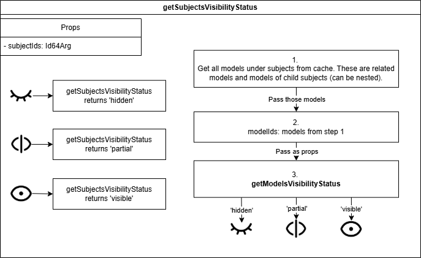
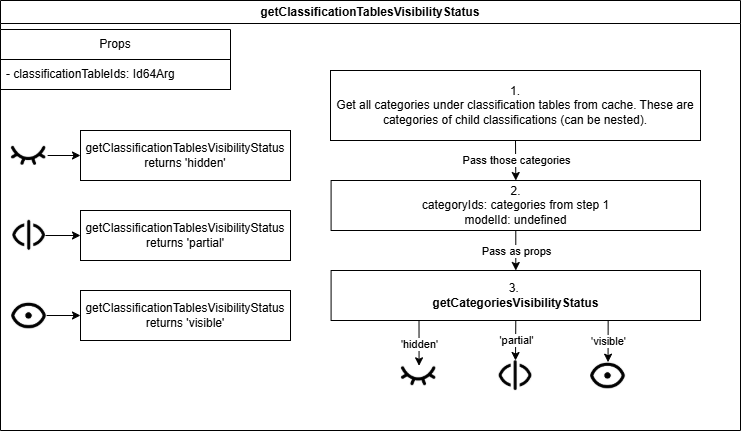
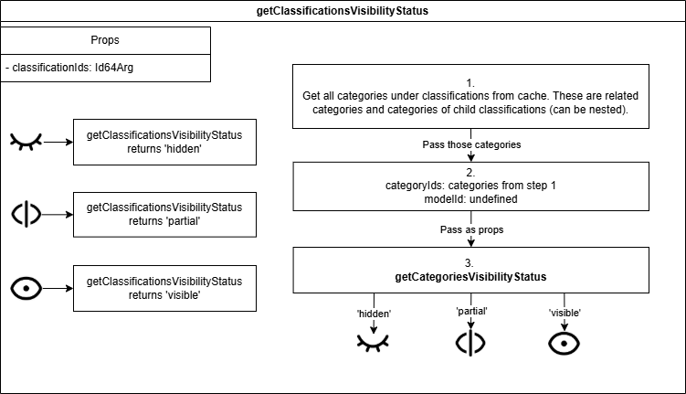
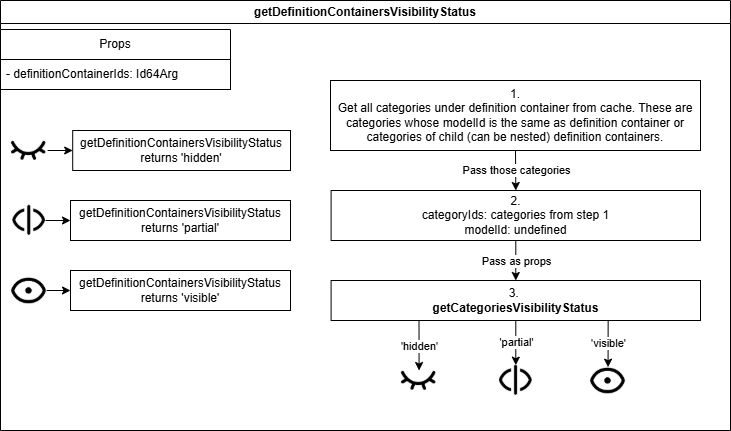
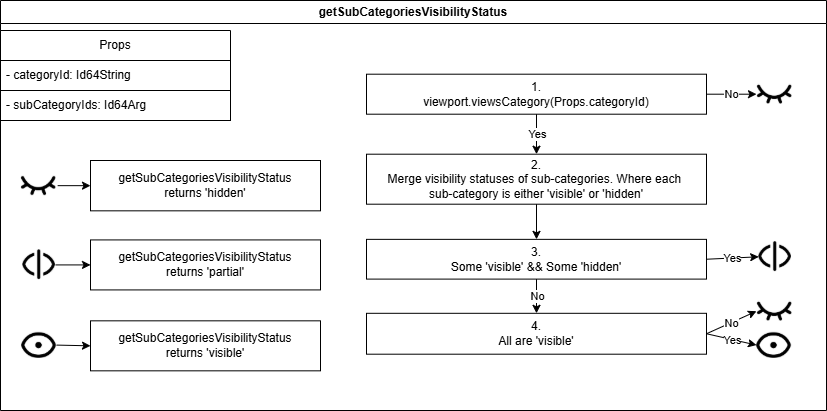
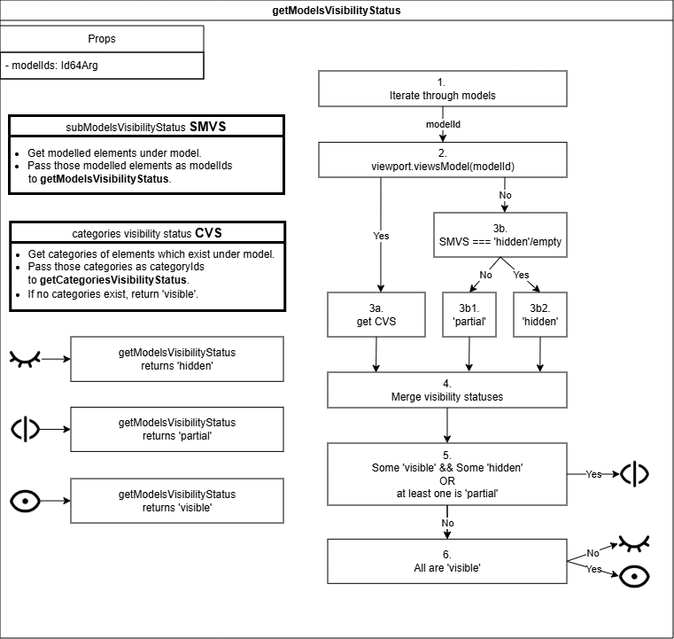
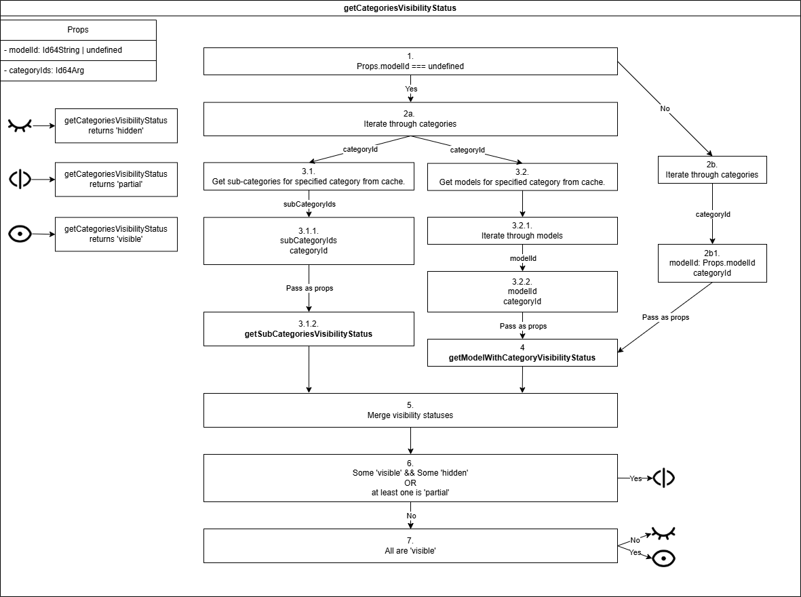
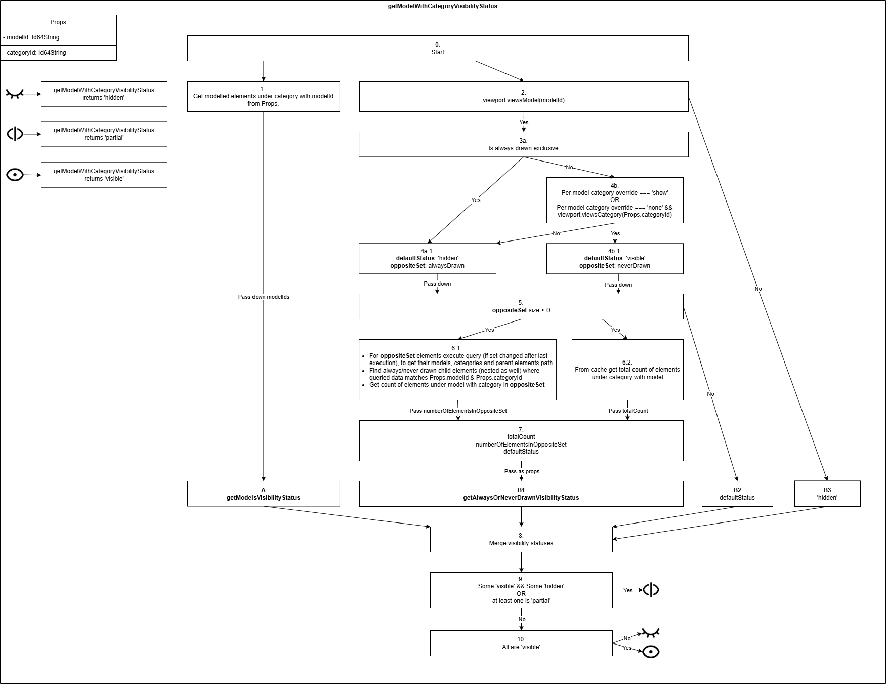
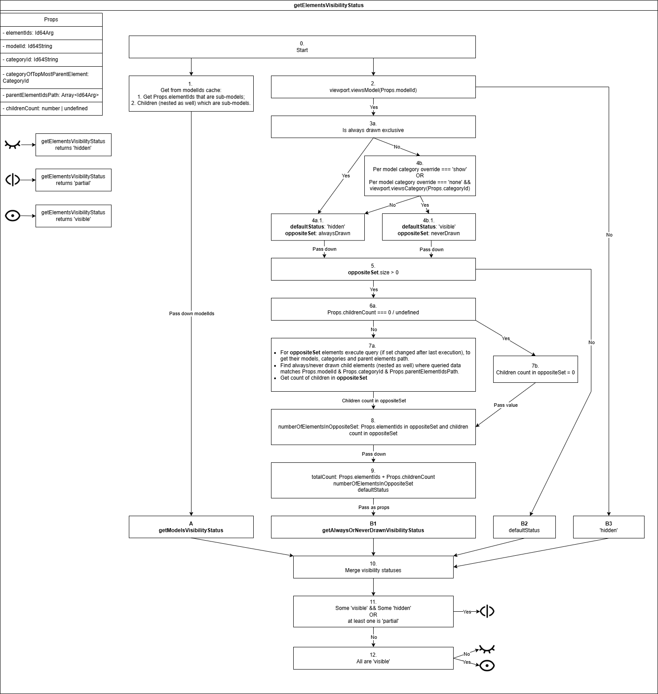

# Visibility Handling in Tree Widget

This document explains how visibility handling works across tree types (Models, Categories, and Classifications) and node types (models, categories, geometric elements, sub-categories, sub-models, classifications, classification tables and definition containers).

## File Overview

- [UseCachedVisibility.ts](./src/tree-widget-react/components/trees/common/internal/useTreeHooks/UseCachedVisibility.ts)
  - Returns a tree-specific visibility handler.
  - Uses [VisibilityChangeEventListener](./src/tree-widget-react/components/trees/common/internal/VisibilityChangeEventListener.ts) to allow `getVisibilityStatus()` calls to be cancelled and re-requested by [UseHierarchyVisibility](./src/tree-widget-react/components/trees/common/UseHierarchyVisibility.ts) via `onVisibilityChange()`.
  - Pauses event notifications while `changeVisibility()` is in progress to avoid re-requesting `getVisibilityStatus` before change finishes.
  - Applies special handling when search paths are present (for nodes that are not search targets or have no search-target ancestors).

- [BaseVisibilityHelper.ts](./src/tree-widget-react/components/trees/common/internal/visibility/BaseVisibilityHelper.ts)
  - Shared read/write operations for visibility based on element/model/category ids.
  - Uses `BaseIdsCache` to retrieve information about nodes.
  - Examples: `getModelsVisibilityStatus()`, `getCategoriesVisibilityStatus()`, `changeModelsVisibilityStatus()`, `changeCategoriesVisibilityStatus()`.

- Tree-specific visibility handlers:
  - Files: [CategoriesTreeVisibilityHandler.ts](./src/tree-widget-react/components/trees/categories-tree/internal/visibility/CategoriesTreeVisibilityHandler.ts), [ClassificationsTreeVisibilityHandler.ts](./src/tree-widget-react/components/trees/classifications-tree/internal/visibility/ClassificationsTreeVisibilityHandler.ts), [ModelsTreeVisibilityHandler.ts](./src/tree-widget-react/components/trees/models-tree/internal/visibility/ModelsTreeVisibilityHandler.ts).
  - These take tree nodes as input, determine node type via nodes' `extendedData` property, and use appropriate methods from visibility helpers.
  - Each exposes read/write logic for search-target nodes.
  - Each provides wrapper methods for its tree-specific caches used by `BaseVisibilityHelper`.

- Tree-specific visibility helpers:
  - Files: [CategoriesTreeVisibilityHelper.ts](./src/tree-widget-react/components/trees/categories-tree/internal/visibility/CategoriesTreeVisibilityHelper.ts), [ClassificationsTreeVisibilityHelper.ts](./src/tree-widget-react/components/trees/classifications-tree/internal/visibility/ClassificationsTreeVisibilityHelper.ts), [ModelsTreeVisibilityHelper.ts](./src/tree-widget-react/components/trees/models-tree/internal/visibility/ModelsTreeVisibilityHelper.ts).
  - These cover tree specific cases (e.g. definition containers exist only in the Categories tree, so `CategoriesTreeVisibilityHelper` implements get/change visibility methods for definition containers).
  - All of them use `BaseVisibilityHelper` to get/change visibility for those tree specific cases.

- Search-results trees:
  - [BaseSearchResultsTree.ts](./src/tree-widget-react/components/trees/common/internal/visibility/BaseSearchResultsTree.ts) defines the abstraction and factory methods.
  - Tree-specific implementation files: [Categories SearchResultsTree](./src/tree-widget-react/components/trees/categories-tree/internal/visibility/SearchResultsTree.ts), [Classifications SearchResultsTree](./src/tree-widget-react/components/trees/classifications-tree/internal/visibility/SearchResultsTree.ts), [Models SearchResultsTree](./src/tree-widget-react/components/trees/models-tree/internal/visibility/SearchResultsTree.ts).
  - The main purpose of search results trees is to help determine/change visibility of nodes which are not search targets and don't have search target ancestors (since these nodes might have some children missing). These trees allow retrieving child search targets for such nodes and then getting/changing visibility is done based on search targets instead.

- Caching:
  - Tree specific caches (requests data once):
    - [CategoriesTreeIdsCache.ts](./src/tree-widget-react/components/trees/categories-tree/internal/CategoriesTreeIdsCache.ts), [ClassificationsTreeIdsCache.ts](./src/tree-widget-react/components/trees/classifications-tree/internal/ClassificationsTreeIdsCache.ts), [ModelsTreeIdsCache.ts](./src/tree-widget-react/components/trees/models-tree/internal/ModelsTreeIdsCache.ts)
    - These caches store various relationships, e.g. element's model <-> category.
    - The data stored in these caches is requested once (it does not change).
    - Some caching implementations is reused across these files and is stored inside [this folder](./src/tree-widget-react/components/trees/common/internal/caches/).

  - [AlwaysAndNeverDrawnElementInfoCache.ts](./src/tree-widget-react/components/trees/common/internal/caches/AlwaysAndNeverDrawnElementInfoCache.ts)
    - Caches extra metadata (like category) for always/never drawn element ids so visibility can be resolved correctly.
    - Always and never drawn caches are reset when always and never drawn sets change respectively.

  - [ElementChildrenCache.ts](./src/tree-widget-react/components/trees/common/internal/caches/ElementChildrenCache.ts)
    - Cache for retrieving elements' children.
    - Using this cache to query data is a little expensive, so it is only used when changing visibility for element or element grouping nodes.

## How visibility is determined in the viewport

The viewport only renders elements. Element visibility is resolved in the following order (highest priority first):

1. **Model selector**: if a model is hidden, its elements are never visible.
2. **Always/Never drawn sets**: elements in these sets are forced to be visible/hidden.
3. **Per model-category overrides**: a category can be overridden per model with `hide`, `show`, or `none`.
   - `hide`: hides all elements of that category within the model.
   - `show`: shows all elements of that category within the model.
   - `none`: defers to category and sub-category rules below.
4. **Category selector**: hidden categories hide their elements.
5. **Sub-categories**: hidden sub-categories hide their elements.

Note: Determining element -> sub-category relationships is not supported at the moment. So sub-category checks are only performed when the Categories tree calls `getVisibilityStatus()` for categories or sub-categories.

## Architecture

### Getting visibility status

#### getSubjectsVisibilityStatus

#### getClassificationTablesVisibilityStatus

#### getClassificationsVisibilityStatus

#### getDefinitionContainersVisibilityStatus

#### getSubCategoriesVisibilityStatus

#### getModelsVisibilityStatus

#### getCategoriesVisibilityStatus

#### getModelWithCategoryVisibilityStatus

#### getElementsVisibilityStatus

#### getAlwaysOrNeverDrawnVisibilityStatus

