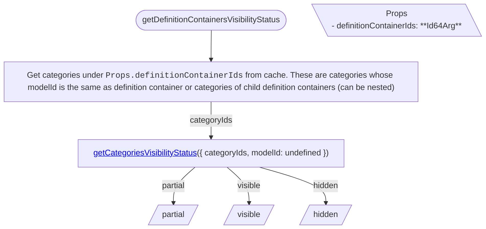

<!-- cspell: ignore getcategoriesvisibilitystatus -->

# Categories tree specific visibility handling

This document explains visibility handling for categories tree specific cases.

## Getting visibility status

### getDefinitionContainersVisibilityStatus

To determine definition containers' visibility status, get their child categories from cache and call <a href='./SharedVisibilityHandling.md#getcategoriesvisibilitystatus'>getCategoriesVisibilityStatus</a>.

