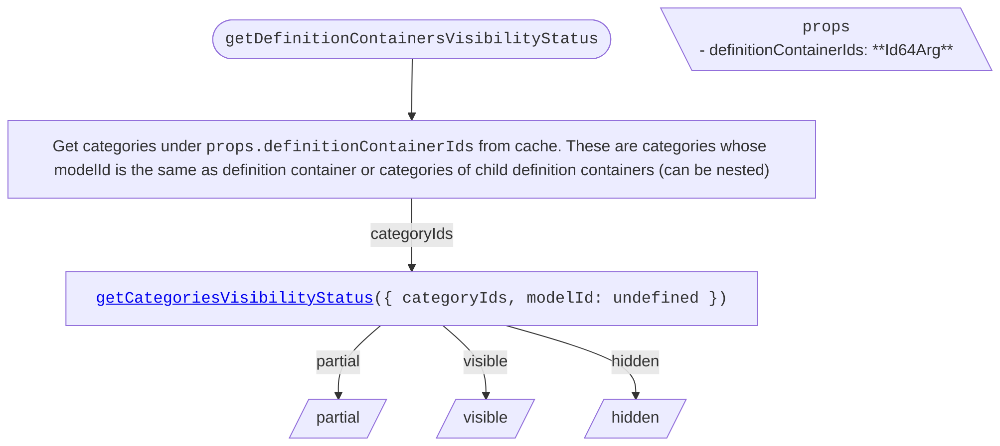

<!-- cspell: ignore getcategoriesvisibilitystatus getdefinitioncontainersvisibilitystatus getsubcategoriesvisibilitystatus getelementsvisibilitystatus -->

# Categories tree specific visibility handling

This document explains visibility handling for categories tree specific cases.

## Table of contents

- [Getting visibility status](#getting-visibility-status)
  - [getDefinitionContainersVisibilityStatus](#getdefinitioncontainersvisibilitystatus)
  - [getCategoriesVisibilityStatus](./SharedVisibilityHandling.md#getcategoriesvisibilitystatus)
  - [getSubCategoriesVisibilityStatus](./SharedVisibilityHandling.md#getsubcategoriesvisibilitystatus)
  - [getElementsVisibilityStatus](./SharedVisibilityHandling.md#getelementsvisibilitystatus)

## Getting visibility status

### getDefinitionContainersVisibilityStatus

To determine definition containers' visibility status, get their child categories from cache and call [getCategoriesVisibilityStatus](./SharedVisibilityHandling.md#getcategoriesvisibilitystatus).

