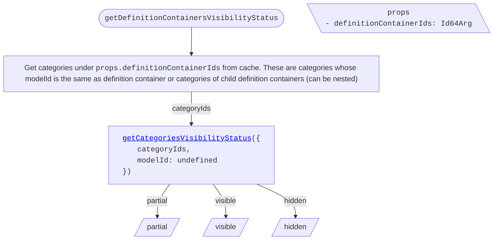
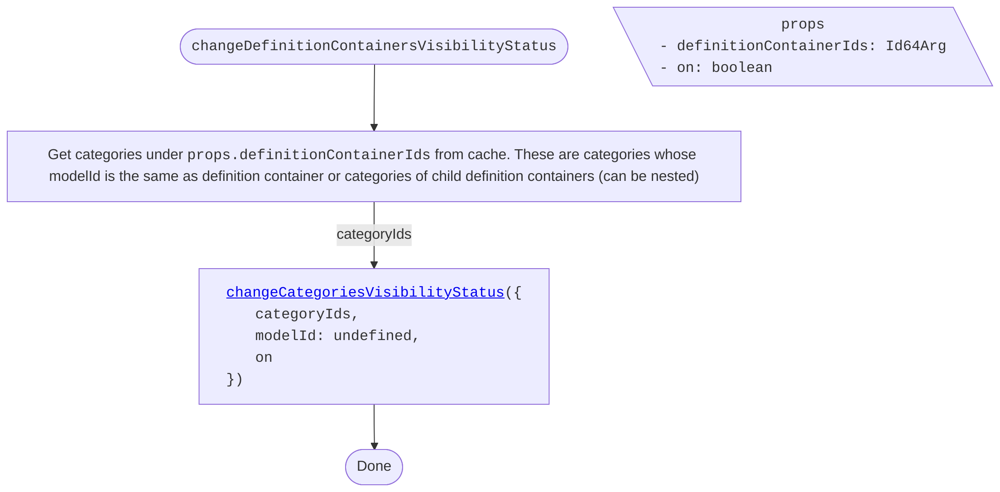
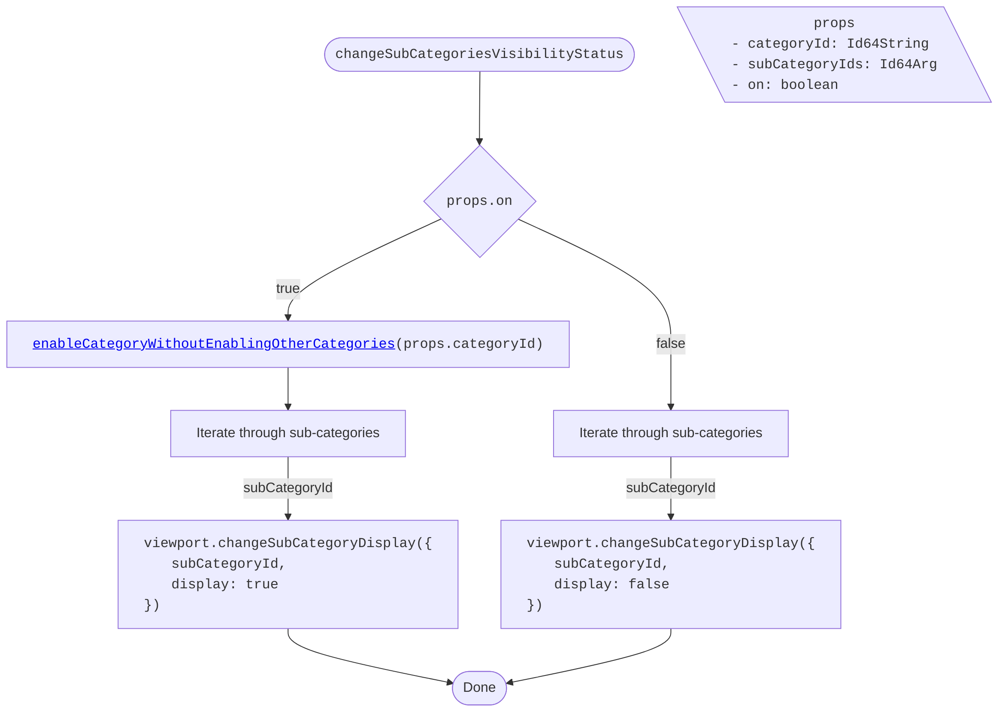
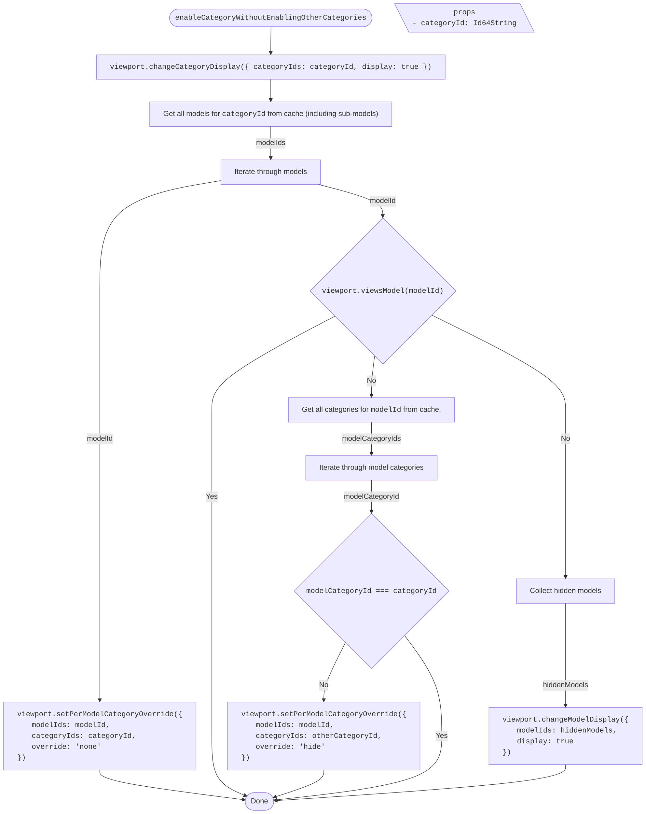

<!-- cspell: ignore getcategoriesvisibilitystatus getdefinitioncontainersvisibilitystatus getsubcategoriesvisibilitystatus getelementsvisibilitystatus changedefinitioncontainersvisibilitystatus changesubcategoriesvisibilitystatus enablecategorywithout enablingothercategories changegroupedelementsvisibilitystatus changecategoriesvisibilitystatus changeelementsvisibilitystatus enablecategorywithoutenablingothercategories -->

# Categories tree specific visibility handling

This document explains visibility handling for categories tree specific cases.

## Table of contents

- [Getting visibility status](#getting-visibility-status)
  - [getDefinitionContainersVisibilityStatus](#getdefinitioncontainersvisibilitystatus)
  - [getCategoriesVisibilityStatus](./SharedVisibilityHandling.md#getcategoriesvisibilitystatus)
  - [getSubCategoriesVisibilityStatus](./SharedVisibilityHandling.md#getsubcategoriesvisibilitystatus)
  - [getElementsVisibilityStatus](./SharedVisibilityHandling.md#getelementsvisibilitystatus)
- [Changing visibility status](#changing-visibility-status)
  - [changeDefinitionContainersVisibilityStatus](#changedefinitioncontainersvisibilitystatus)
  - [changeSubCategoriesVisibilityStatus](#changesubcategoriesvisibilitystatus)
  - [enableCategoryWithoutEnablingOtherCategories](#enablecategorywithoutenablingothercategories)
  - [changeGroupedElementsVisibilityStatus](#changegroupedelementsvisibilitystatus)
  - [changeCategoriesVisibilityStatus](./SharedVisibilityHandling.md#changecategoriesvisibilitystatus)
  - [changeElementsVisibilityStatus](./SharedVisibilityHandling.md#changeelementsvisibilitystatus)

## Getting visibility status

### getDefinitionContainersVisibilityStatus

To determine definition containers' visibility status, get their child categories from cache and call [getCategoriesVisibilityStatus](./SharedVisibilityHandling.md#getcategoriesvisibilitystatus).

## Changing visibility status

### changeDefinitionContainersVisibilityStatus

Changes definition containers' visibility status by propagating the change to all contained categories.

### changeSubCategoriesVisibilityStatus

Changes sub-categories' visibility. When turning on, first ensures the parent category and its related models are enabled without affecting other categories.

### enableCategoryWithoutEnablingOtherCategories

Turns on a category and its related models while preserving the hidden state of all other categories in those models. Used internally when enabling a sub-category.

