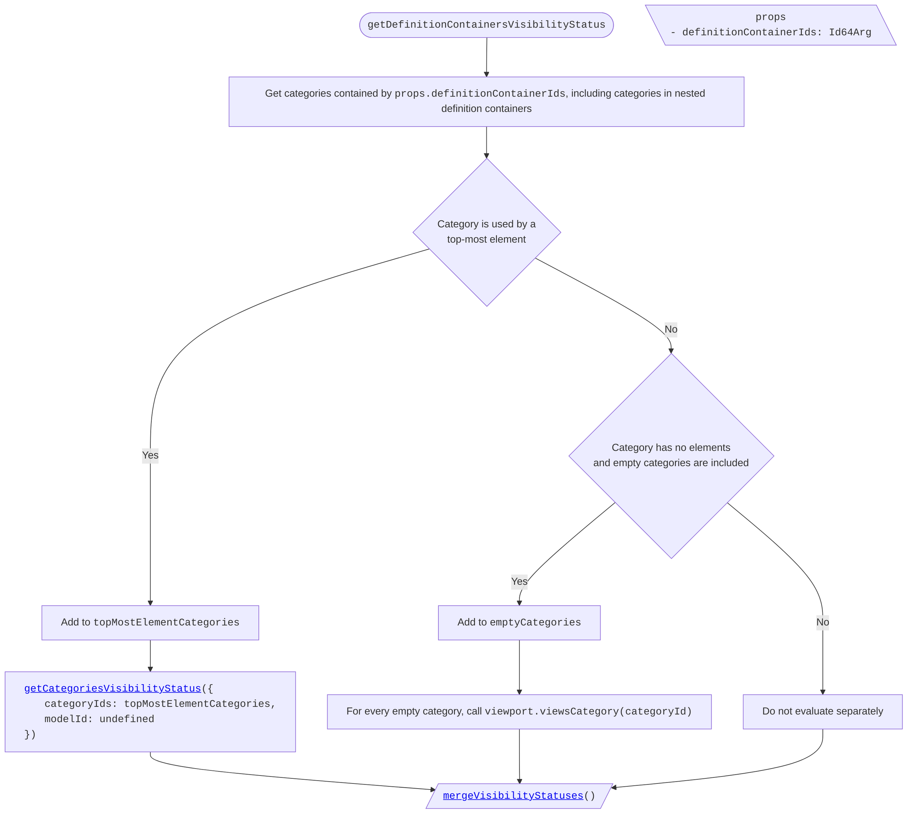
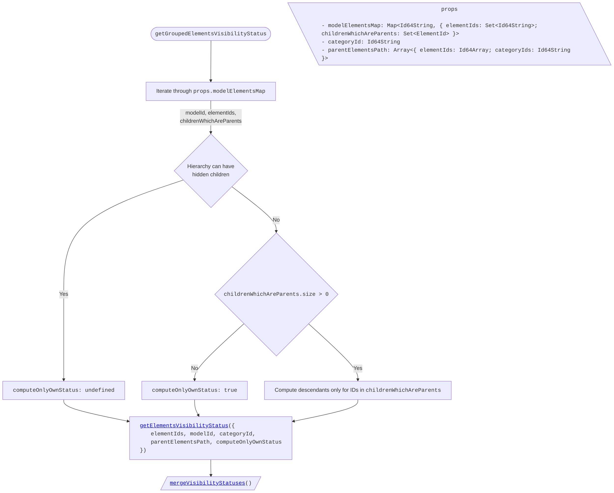
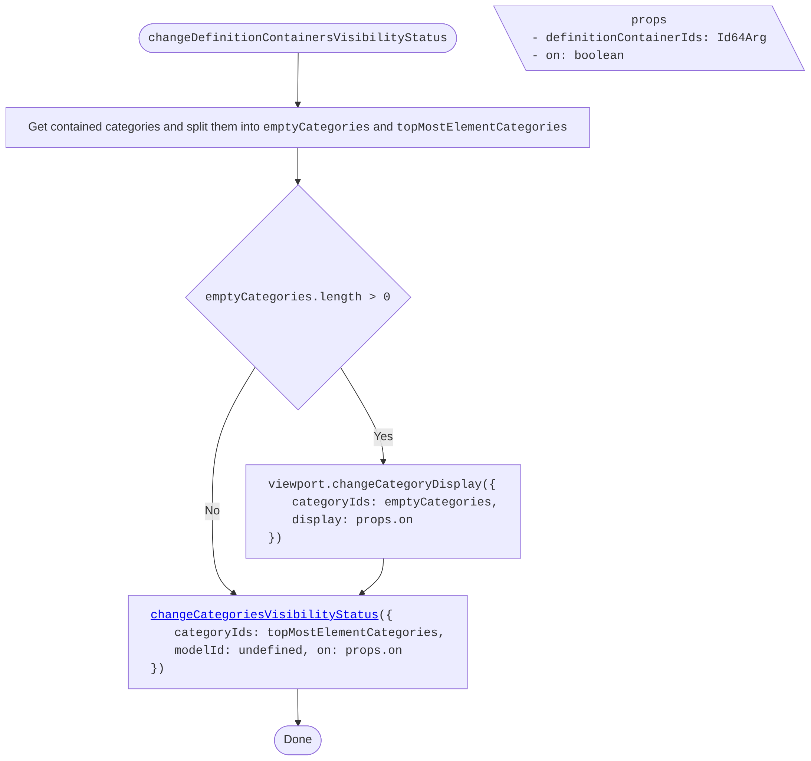
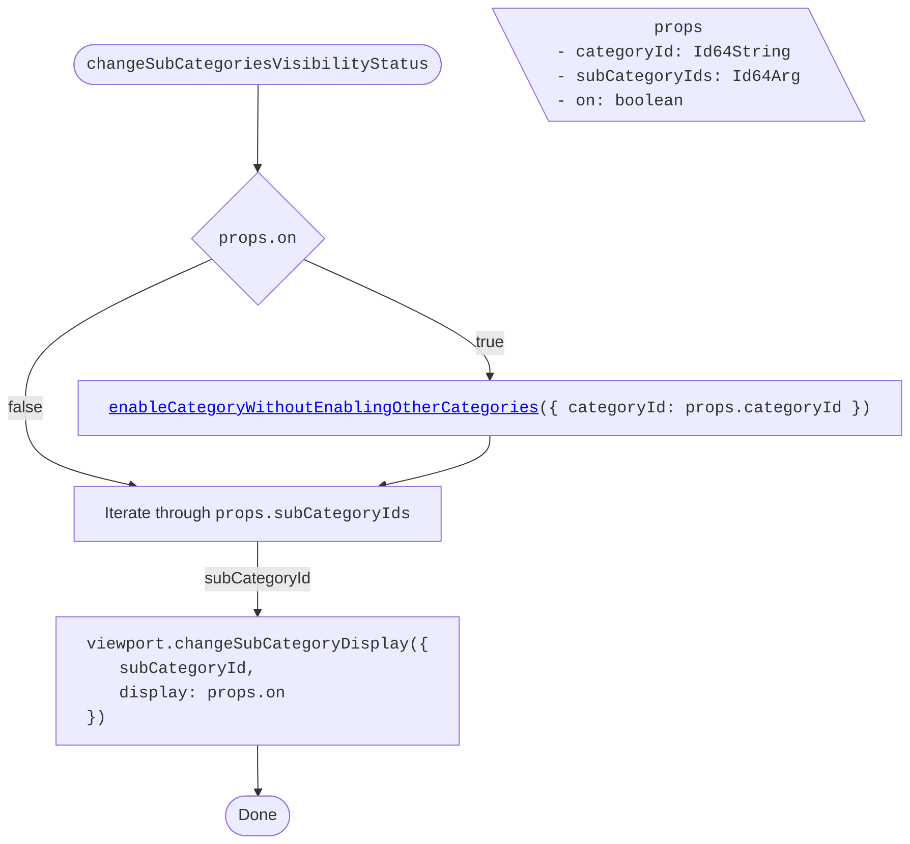
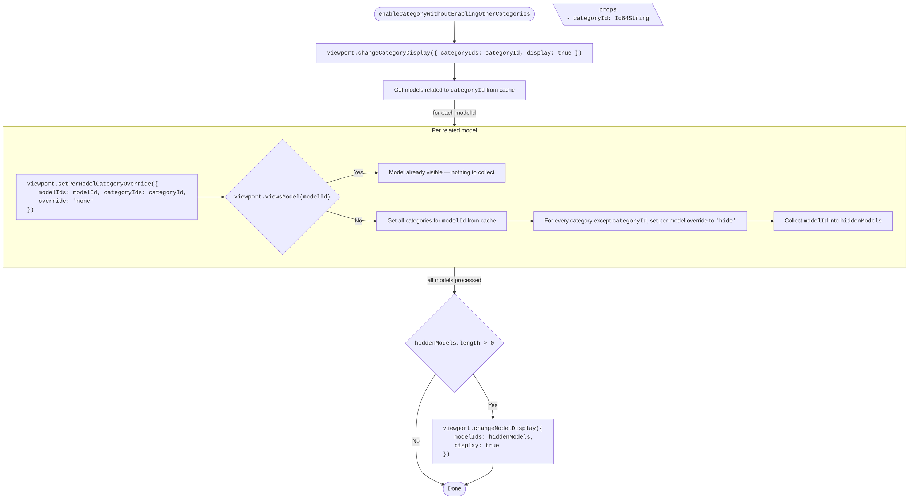
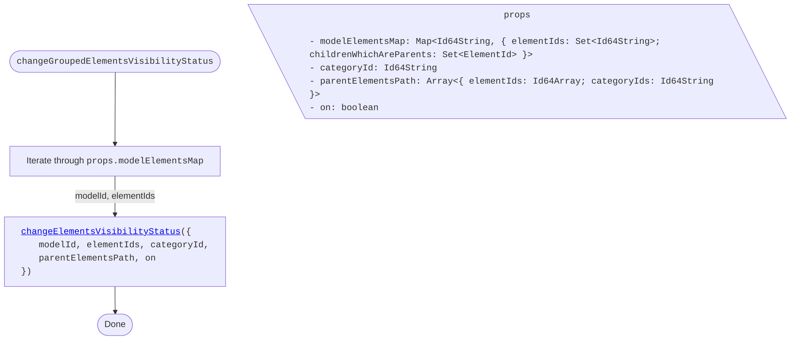

<!-- cspell: ignore mergevisibilitystatuses getdefinitioncontainersvisibilitystatus getgroupedelementsvisibilitystatus changedefinitioncontainersvisibilitystatus changesubcategoriesvisibilitystatus enablecategorywithoutenablingothercategories changegroupedelementsvisibilitystatus -->

# Categories tree specific visibility handling

This document explains visibility handling that is specific to the Categories tree. Shared model, category, sub-category, and element behavior is documented in [Shared visibility handling](./SharedVisibilityHandling.md).

Categories tree visibility is available for 2D and 3D viewports. For other viewport types, status requests return `disabled` and change requests do nothing.

## Table of contents

- [Getting visibility status](#getting-visibility-status)
  - [getDefinitionContainersVisibilityStatus](#getdefinitioncontainersvisibilitystatus)
  - [getGroupedElementsVisibilityStatus](#getgroupedelementsvisibilitystatus)
  - [getCategoriesVisibilityStatus](./SharedVisibilityHandling.md#getcategoriesvisibilitystatus)
  - [getSubCategoriesVisibilityStatus](./SharedVisibilityHandling.md#getsubcategoriesvisibilitystatus)
  - [getElementsVisibilityStatus](./SharedVisibilityHandling.md#getelementsvisibilitystatus)
- [Changing visibility status](#changing-visibility-status)
  - [changeDefinitionContainersVisibilityStatus](#changedefinitioncontainersvisibilitystatus)
  - [changeSubCategoriesVisibilityStatus](#changesubcategoriesvisibilitystatus)
  - [enableCategoryWithoutEnablingOtherCategories](#enablecategorywithoutenablingothercategories)
  - [changeGroupedElementsVisibilityStatus](#changegroupedelementsvisibilitystatus)
  - [changeCategoriesVisibilityStatus](./SharedVisibilityHandling.md#changecategoriesvisibilitystatus)
  - [changeElementsVisibilityStatus](./SharedVisibilityHandling.md#changeelementsvisibilitystatus)

## Getting visibility status

### getDefinitionContainersVisibilityStatus

The cache recursively returns categories contained by the requested definition containers. The helper keeps two groups:

- Categories of top-most elements use [getCategoriesVisibilityStatus](./SharedVisibilityHandling.md#getcategoriesvisibilitystatus), which includes their descendant element trees.
- Empty categories use category-selector state directly, but only when the hierarchy configuration includes categories without elements.

NOTE: Categories that contain elements but are not categories of top-most elements are NOT evaluated separately (such categories will be evaluated by the first group).

Results from both groups are merged. If neither group contains a category, the category-selector fallback of [getCategoriesVisibilityStatus](./SharedVisibilityHandling.md#getcategoriesvisibilitystatus) has no categories to merge and trivially produces `visible` in normal mode and `hidden` in always-drawn-exclusive mode. Large top-most category collections are processed in batches to release the main thread.

```mermaid
---
config:
  flowchart:
    wrappingWidth: 750
    useMaxWidth: false
---

flowchart TD
  %% Start
  TITLE(["<span style='font-family: monospace;'>getDefinitionContainersVisibilityStatus</span>"]) --> A["Get categories contained by <span style='font-family: monospace;'>props.definitionContainerIds</span>, including categories in nested definition containers"]

  PROPS[\"
    <span style='font-family: monospace;'>props</span>
    <span style='display: block; text-align: left; font-family: monospace;'>- definitionContainerIds: Id64Arg</span>
  "\]

  A --> B{"Category is used by a<br/>top-most element"}
  B -- Yes --> B1["Add to <span style='font-family: monospace;'>topMostElementCategories</span>"]
  B -- No --> C{"Category has no elements<br/>and empty categories are included"}
  C -- Yes --> C1["Add to <span style='font-family: monospace;'>emptyCategories</span>"]
  C -- No --> C2["Do not evaluate separately"]

  B1 --> D["<div style='text-align: left; font-family: monospace;'><a href='./SharedVisibilityHandling.md#getcategoriesvisibilitystatus'>getCategoriesVisibilityStatus</a>({
    <span style='padding-left: 2rem;'>categoryIds: topMostElementCategories,</span>
    <span style='padding-left: 2rem;'>modelId: undefined</span>
    })</div>"]
  C1 --> E["For every empty category, call <span style='font-family: monospace;'>viewport.viewsCategory(categoryId)</span>"]

  D --> M[/"<span style='font-family: monospace;'><a href='./SharedVisibilityHandling.md#mergevisibilitystatuses'>mergeVisibilityStatuses</a>()</span>"/]
  E --> M
  C2 --> M
```

### getGroupedElementsVisibilityStatus

Categories tree grouping node may represent elements from multiple models. Each `modelElementsMap` entry is resolved through [getElementsVisibilityStatus](./SharedVisibilityHandling.md#getelementsvisibilitystatus), using the grouping category and parent path, and all model results are merged.

As in the Models tree, nested descendant evaluation is skipped for known leaf elements. The hierarchy can have hidden children when the tree configuration excludes element classes (`excludedElementClassNames`) — excluded descendants do not appear in the tree but still render in the viewport, so their visibility must be evaluated.

```mermaid
---
config:
  flowchart:
    wrappingWidth: 750
    useMaxWidth: false
---

flowchart TD
  %% Start
  TITLE(["<span style='font-family: monospace;'>getGroupedElementsVisibilityStatus</span>"]) --> A["Iterate through <span style='font-family: monospace;'>props.modelElementsMap</span>"]

  PROPS[\"
    <span style='font-family: monospace;'>props</span>
    <span style='display: block; text-align: left; font-family: monospace;'>- modelElementsMap: Map&lt;Id64String, { elementIds: Set&lt;Id64String&gt;; childrenWhichAreParents: Set&lt;ElementId&gt; }&gt;<br/>- categoryId: Id64String<br/>- parentElementsPath: Array&lt;{ elementIds: Id64Array; categoryIds: Id64String }&gt;</span>
  "\]

  A -- "modelId, elementIds,<br/>childrenWhichAreParents" --> B{"Hierarchy can have<br/>hidden children"}
  B -- Yes --> C1["<span style='font-family: monospace;'>computeOnlyOwnStatus: undefined</span>"]
  B -- No --> C2{"<span style='font-family: monospace;'>childrenWhichAreParents.size > 0</span>"}
  C2 -- No --> C3["<span style='font-family: monospace;'>computeOnlyOwnStatus: true</span>"]
  C2 -- Yes --> C4["Compute descendants only for IDs in <span style='font-family: monospace;'>childrenWhichAreParents</span>"]

  C1 --> D["<div style='text-align: left; font-family: monospace;'><a href='./SharedVisibilityHandling.md#getelementsvisibilitystatus'>getElementsVisibilityStatus</a>({
    <span style='padding-left: 2rem;'>elementIds, modelId, categoryId,</span>
    <span style='padding-left: 2rem;'>parentElementsPath, computeOnlyOwnStatus</span>
    })</div>"]
  C3 --> D
  C4 --> D

  D --> M[/"<span style='font-family: monospace;'><a href='./SharedVisibilityHandling.md#mergevisibilitystatuses'>mergeVisibilityStatuses</a>()</span>"/]
```

## Changing visibility status

### changeDefinitionContainersVisibilityStatus

Contained categories are grouped in the same way as for status requests. Empty categories are changed directly in the category selector. Top-most element categories use [changeCategoriesVisibilityStatus](./SharedVisibilityHandling.md#changecategoriesvisibilitystatus), which handles models, descendants, and sub-models.

```mermaid
---
config:
  flowchart:
    wrappingWidth: 750
    useMaxWidth: false
---

flowchart TD
  RESULT_Done([Done])

  %% Start
  TITLE(["<span style='font-family: monospace;'>changeDefinitionContainersVisibilityStatus</span>"]) --> A["Get contained categories and split them into <span style='font-family: monospace;'>emptyCategories</span> and <span style='font-family: monospace;'>topMostElementCategories</span>"]

  PROPS[\"
    <span style='font-family: monospace;'>props</span>
    <span style='display: block; text-align: left; font-family: monospace;'>- definitionContainerIds: Id64Arg<br/>- on: boolean</span>
  "\]

  A --> B{"<span style='font-family: monospace;'>emptyCategories.length > 0</span>"}
  B -- Yes --> B1["<div style='text-align: left; font-family: monospace;'>viewport.changeCategoryDisplay({
    <span style='padding-left: 2rem;'>categoryIds: emptyCategories,</span>
    <span style='padding-left: 2rem;'>display: props.on</span>
    })</div>"]
  B -- No --> C
  B1 --> C["<div style='text-align: left; font-family: monospace;'><a href='./SharedVisibilityHandling.md#changecategoriesvisibilitystatus'>changeCategoriesVisibilityStatus</a>({
    <span style='padding-left: 2rem;'>categoryIds: topMostElementCategories,</span>
    <span style='padding-left: 2rem;'>modelId: undefined, on: props.on</span>
    })</div>"]
  C --> RESULT_Done
```

### changeSubCategoriesVisibilityStatus

When turning sub-categories on, the parent category and its related models are first enabled without exposing unrelated categories. The requested sub-categories are then changed in sequence.

```mermaid
---
config:
  flowchart:
    wrappingWidth: 750
    useMaxWidth: false
---

flowchart TD
  RESULT_Done([Done])

  %% Start
  TITLE(["<span style='font-family: monospace;'>changeSubCategoriesVisibilityStatus</span>"]) --> A{"<span style='font-family: monospace;'>props.on</span>"}

  PROPS[\"
    <span style='font-family: monospace;'>props</span>
    <span style='display: block; text-align: left; font-family: monospace;'>- categoryId: Id64String<br/>- subCategoryIds: Id64Arg<br/>- on: boolean</span>
  "\]

  A -- true --> B["<span style='font-family: monospace;'><a href='#enablecategorywithoutenablingothercategories'>enableCategoryWithoutEnablingOtherCategories</a>({ categoryId: props.categoryId })</span>"]
  A -- false --> C["Iterate through <span style='font-family: monospace;'>props.subCategoryIds</span>"]
  B --> C
  C -- subCategoryId --> D["<div style='text-align: left; font-family: monospace;'>viewport.changeSubCategoryDisplay({
    <span style='padding-left: 2rem;'>subCategoryId,</span>
    <span style='padding-left: 2rem;'>display: props.on</span>
    })</div>"]
  D --> RESULT_Done
```

### enableCategoryWithoutEnablingOtherCategories

This helper turns on the category selector and clears the target category's per-model override. For each related hidden model, it adds `hide` overrides to every other model category before enabling the model. Consequently, enabling a sub-category does not make unrelated categories visible.

```mermaid
---
config:
  flowchart:
    wrappingWidth: 750
    useMaxWidth: false
---

flowchart TD
  RESULT_Done([Done])

  %% Start
  TITLE(["<span style='font-family: monospace;'>enableCategoryWithoutEnablingOtherCategories</span>"]) --> A["<span style='font-family: monospace;'>viewport.changeCategoryDisplay({ categoryIds: categoryId, display: true })</span>"]

  PROPS[\"
    <span style='font-family: monospace;'>props</span>
    <span style='display: block; text-align: left; font-family: monospace;'>- categoryId: Id64String</span>
  "\]

  A --> B["Get models related to <span style='font-family: monospace;'>categoryId</span> from cache"]
  B -- "for each modelId" --> SUB

  subgraph SUB["Per related model"]
    C["<div style='text-align: left; font-family: monospace;'>viewport.setPerModelCategoryOverride({
    <span style='padding-left: 2rem;'>modelIds: modelId, categoryIds: categoryId,</span>
    <span style='padding-left: 2rem;'>override: 'none'</span>
    })</div>"] --> D{"<span style='font-family: monospace;'>viewport.viewsModel(modelId)</span>"}
    D -- Yes --> D1["Model already visible — nothing to collect"]
    D -- No --> E["Get all categories for <span style='font-family: monospace;'>modelId</span> from cache"]
    E --> F["For every category except <span style='font-family: monospace;'>categoryId</span>, set per-model override to <span style='font-family: monospace;'>'hide'</span>"]
    F --> G["Collect <span style='font-family: monospace;'>modelId</span> into <span style='font-family: monospace;'>hiddenModels</span>"]
  end

  SUB -- "all models processed" --> H{"<span style='font-family: monospace;'>hiddenModels.length > 0</span>"}
  H -- Yes --> H1["<div style='text-align: left; font-family: monospace;'>viewport.changeModelDisplay({
    <span style='padding-left: 2rem;'>modelIds: hiddenModels,</span>
    <span style='padding-left: 2rem;'>display: true</span>
    })</div>"]
  H -- No --> RESULT_Done
  H1 --> RESULT_Done
```

### changeGroupedElementsVisibilityStatus

Each `modelElementsMap` entry delegates to the path-scoped [changeElementsVisibilityStatus](./SharedVisibilityHandling.md#changeelementsvisibilitystatus). The shared helper handles actual descendant categories and sub-models.

```mermaid
---
config:
  flowchart:
    wrappingWidth: 750
    useMaxWidth: false
---

flowchart TD
  RESULT_Done([Done])

  %% Start
  TITLE(["<span style='font-family: monospace;'>changeGroupedElementsVisibilityStatus</span>"]) --> A["Iterate through <span style='font-family: monospace;'>props.modelElementsMap</span>"]

  PROPS[\"
    <span style='font-family: monospace;'>props</span>
    <span style='display: block; text-align: left; font-family: monospace;'>- modelElementsMap: Map&lt;Id64String, { elementIds: Set&lt;Id64String&gt;; childrenWhichAreParents: Set&lt;ElementId&gt; }&gt;<br/>- categoryId: Id64String<br/>- parentElementsPath: Array&lt;{ elementIds: Id64Array; categoryIds: Id64String }&gt;<br/>- on: boolean</span>
  "\]

  A -- "modelId, elementIds" --> B["<div style='text-align: left; font-family: monospace;'><a href='./SharedVisibilityHandling.md#changeelementsvisibilitystatus'>changeElementsVisibilityStatus</a>({
    <span style='padding-left: 2rem;'>modelId, elementIds, categoryId,</span>
    <span style='padding-left: 2rem;'>parentElementsPath, on</span>
    })</div>"]
  B --> RESULT_Done
```
