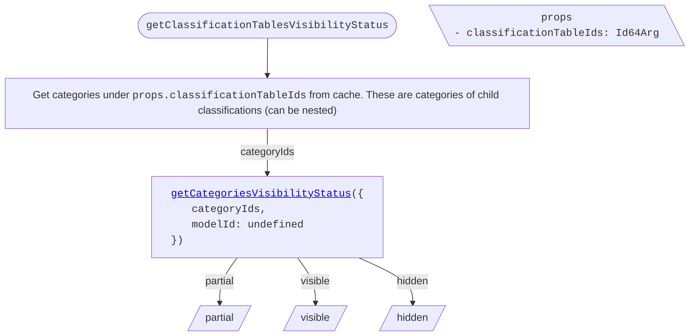
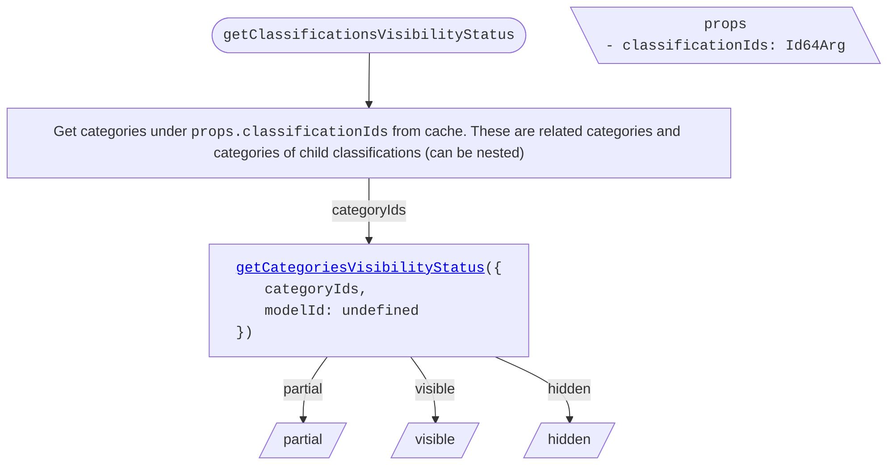
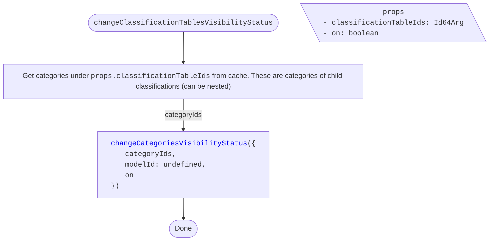
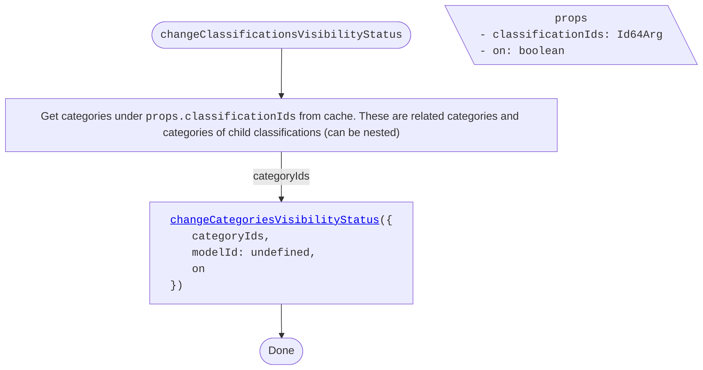

<!-- cspell: ignore getclassificationtablesvisibilitystatus getclassificationsvisibilitystatus getcategoriesvisibilitystatus getelementsvisibilitystatus changeclassificationtablesvisibilitystatus changeclassificationsvisibilitystatus changecategoriesvisibilitystatus -->

# Classifications tree specific visibility handling

This document explains visibility handling for classifications tree specific cases.

## Table of contents

- [Getting visibility status](#getting-visibility-status)
  - [getClassificationTablesVisibilityStatus](#getclassificationtablesvisibilitystatus)
  - [getClassificationsVisibilityStatus](#getclassificationsvisibilitystatus)
  - [getCategoriesVisibilityStatus](./SharedVisibilityHandling.md#getcategoriesvisibilitystatus)
  - [getElementsVisibilityStatus](./SharedVisibilityHandling.md#getelementsvisibilitystatus)
- [Changing visibility status](#changing-visibility-status)
  - [changeClassificationTablesVisibilityStatus](#changeclassificationtablesvisibilitystatus)
  - [changeClassificationsVisibilityStatus](#changeclassificationsvisibilitystatus)
  - [changeCategoriesVisibilityStatus](./SharedVisibilityHandling.md#changecategoriesvisibilitystatus)

## Getting visibility status

### getClassificationTablesVisibilityStatus

To determine classification tables' visibility status, get their child categories from cache and call [getCategoriesVisibilityStatus](./SharedVisibilityHandling.md#getcategoriesvisibilitystatus).

### getClassificationsVisibilityStatus

To determine classifications' visibility status, get their child categories from cache and call [getCategoriesVisibilityStatus](./SharedVisibilityHandling.md#getcategoriesvisibilitystatus).

## Changing visibility status

### changeClassificationTablesVisibilityStatus

Changes classification tables' visibility status by propagating the change to all contained categories.

### changeClassificationsVisibilityStatus

Changes classifications' visibility status by propagating the change to all contained categories.

