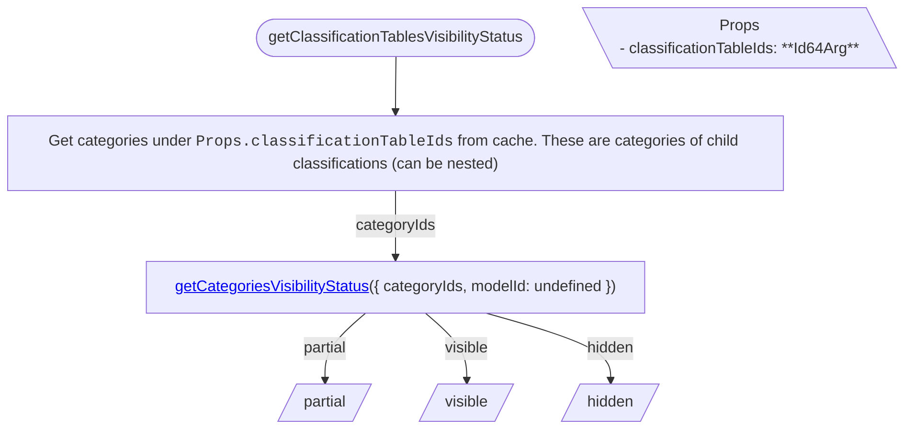
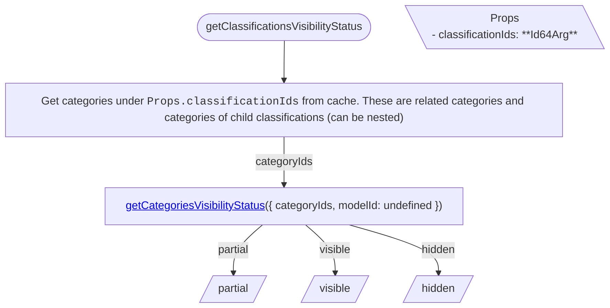

<!-- cspell: ignore getcategoriesvisibilitystatus -->

# Classifications tree specific visibility handling

This document explains visibility handling for classifications tree specific cases.

## Getting visibility status

### getClassificationTablesVisibilityStatus

To determine classification tables' visibility status, get their child categories from cache and call <a href='./SharedVisibilityHandling.md#getcategoriesvisibilitystatus'>getCategoriesVisibilityStatus</a>.

### getClassificationsVisibilityStatus

To determine classifications' visibility status, get their child categories from cache and call <a href='./SharedVisibilityHandling.md#getcategoriesvisibilitystatus'>getCategoriesVisibilityStatus</a>.

