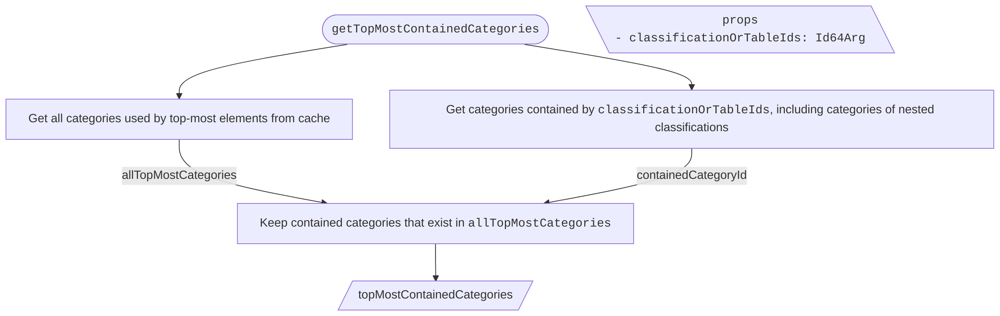
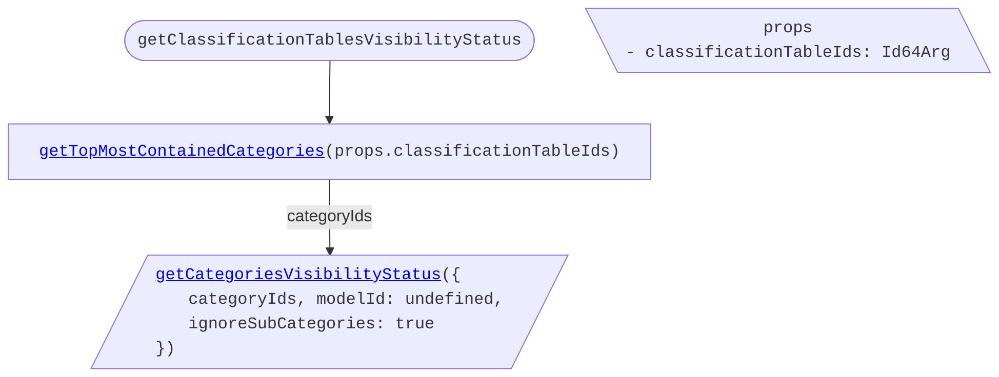
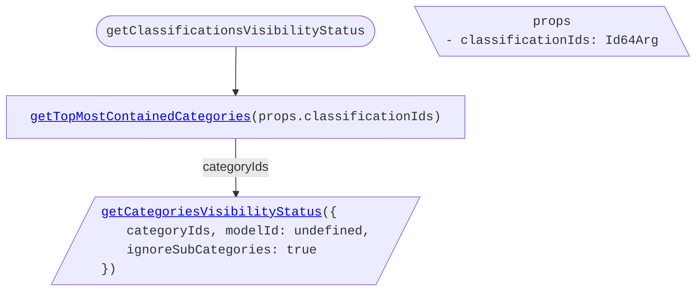
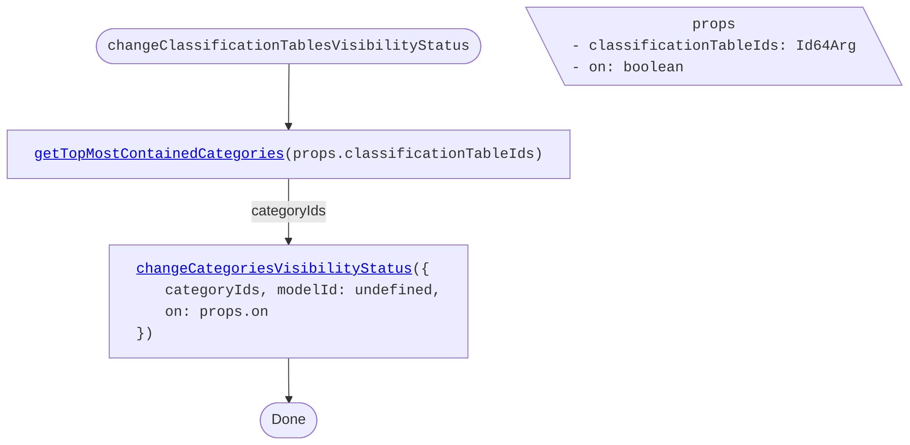
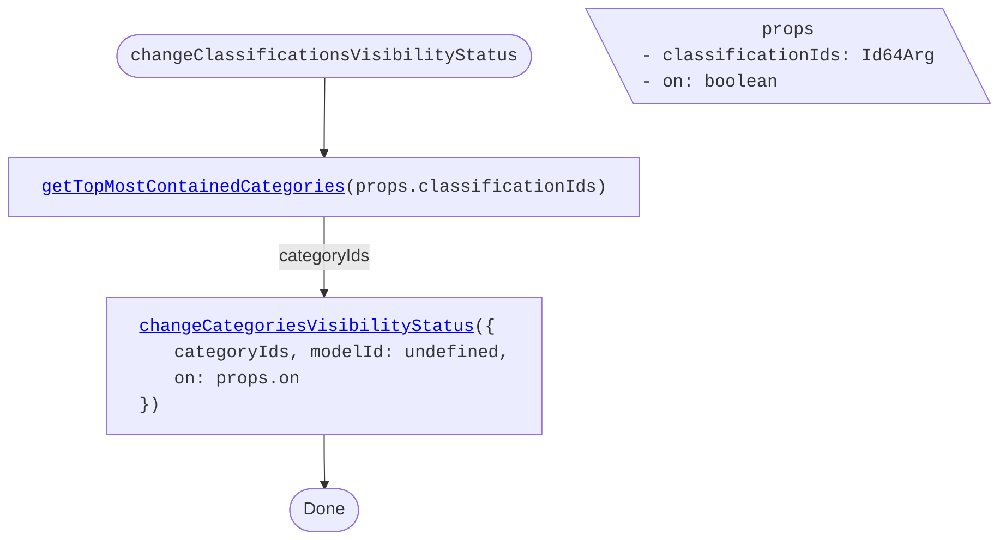

<!-- cspell: ignore getcategoriesvisibilitystatus getclassificationtablesvisibilitystatus getclassificationsvisibilitystatus gettopmostcontainedcategories changeclassificationtablesvisibilitystatus changeclassificationsvisibilitystatus -->

# Classifications tree specific visibility handling

This document explains visibility handling that is specific to the Classifications tree. Shared category and element behavior is documented in [Shared visibility handling](./SharedVisibilityHandling.md).

Classifications tree visibility is available only for 3D viewports. In other viewport types, status requests return `disabled` and change requests do nothing.

## Table of contents

- [Resolving contained categories](#resolving-contained-categories)
- [Getting visibility status](#getting-visibility-status)
  - [getClassificationTablesVisibilityStatus](#getclassificationtablesvisibilitystatus)
  - [getClassificationsVisibilityStatus](#getclassificationsvisibilitystatus)
  - [getCategoriesVisibilityStatus](./SharedVisibilityHandling.md#getcategoriesvisibilitystatus)
  - [getElementsVisibilityStatus](./SharedVisibilityHandling.md#getelementsvisibilitystatus)
- [Changing visibility status](#changing-visibility-status)
  - [changeClassificationTablesVisibilityStatus](#changeclassificationtablesvisibilitystatus)
  - [changeClassificationsVisibilityStatus](#changeclassificationsvisibilitystatus)
  - [changeCategoriesVisibilityStatus](./SharedVisibilityHandling.md#changecategoriesvisibilitystatus)

## Resolving contained categories

All four operations first call `getTopMostContainedCategories`. It recursively retrieves categories related to the requested classification tables or classifications, then keeps only categories used by top-most elements. Categories of descendant elements are handled through those top-most element trees by the shared category helper.

```mermaid
---
config:
  flowchart:
    wrappingWidth: 750
    useMaxWidth: false
---

flowchart TD
  RESULT_Categories[/topMostContainedCategories/]

  %% Start
  TITLE(["<span style='font-family: monospace;'>getTopMostContainedCategories</span>"]) --> A["Get all categories used by top-most elements from cache"]
  TITLE --> B["Get categories contained by <span style='font-family: monospace;'>classificationOrTableIds</span>, including categories of nested classifications"]

  PROPS[\"
    <span style='font-family: monospace;'>props</span>
    <span style='display: block; text-align: left; font-family: monospace;'>- classificationOrTableIds: Id64Arg</span>
  "\]

  A -- allTopMostCategories --> C["Keep contained categories that exist in <span style='font-family: monospace;'>allTopMostCategories</span>"]
  B -- containedCategoryId --> C
  C --> RESULT_Categories
```

## Getting visibility status

Classification status intentionally ignores sub-category visibility. The classification relationships identify element trees, but they do not identify which sub-categories those elements use. If no top-most categories are related to the requested nodes, the category-selector fallback of [getCategoriesVisibilityStatus](./SharedVisibilityHandling.md#getcategoriesvisibilitystatus) has no categories to merge and trivially produces `visible` in normal mode and `hidden` in always-drawn-exclusive mode.

### getClassificationTablesVisibilityStatus

```mermaid
---
config:
  flowchart:
    wrappingWidth: 750
    useMaxWidth: false
---

flowchart TD
  %% Start
  TITLE(["<span style='font-family: monospace;'>getClassificationTablesVisibilityStatus</span>"]) --> A["<span style='font-family: monospace;'><a href='#resolving-contained-categories'>getTopMostContainedCategories</a>(props.classificationTableIds)</span>"]

  PROPS[\"
    <span style='font-family: monospace;'>props</span>
    <span style='display: block; text-align: left; font-family: monospace;'>- classificationTableIds: Id64Arg</span>
  "\]

  A -- categoryIds --> B[/"<div style='text-align: left; font-family: monospace;'><a href='./SharedVisibilityHandling.md#getcategoriesvisibilitystatus'>getCategoriesVisibilityStatus</a>({
    <span style='padding-left: 2rem;'>categoryIds, modelId: undefined,</span>
    <span style='padding-left: 2rem;'>ignoreSubCategories: true</span>
    })</div>"/]
```

### getClassificationsVisibilityStatus

```mermaid
---
config:
  flowchart:
    wrappingWidth: 750
    useMaxWidth: false
---

flowchart TD
  %% Start
  TITLE(["<span style='font-family: monospace;'>getClassificationsVisibilityStatus</span>"]) --> A["<span style='font-family: monospace;'><a href='#resolving-contained-categories'>getTopMostContainedCategories</a>(props.classificationIds)</span>"]

  PROPS[\"
    <span style='font-family: monospace;'>props</span>
    <span style='display: block; text-align: left; font-family: monospace;'>- classificationIds: Id64Arg</span>
  "\]

  A -- categoryIds --> B[/"<div style='text-align: left; font-family: monospace;'><a href='./SharedVisibilityHandling.md#getcategoriesvisibilitystatus'>getCategoriesVisibilityStatus</a>({
    <span style='padding-left: 2rem;'>categoryIds, modelId: undefined,</span>
    <span style='padding-left: 2rem;'>ignoreSubCategories: true</span>
    })</div>"/]
```

## Changing visibility status

Changes also operate only on top-most contained categories. [changeCategoriesVisibilityStatus](./SharedVisibilityHandling.md#changecategoriesvisibilitystatus) updates their top-level category state and handles descendant elements in other categories, related models, and sub-models.

### changeClassificationTablesVisibilityStatus

```mermaid
---
config:
  flowchart:
    wrappingWidth: 750
    useMaxWidth: false
---

flowchart TD
  RESULT_Done([Done])

  %% Start
  TITLE(["<span style='font-family: monospace;'>changeClassificationTablesVisibilityStatus</span>"]) --> A["<span style='font-family: monospace;'><a href='#resolving-contained-categories'>getTopMostContainedCategories</a>(props.classificationTableIds)</span>"]

  PROPS[\"
    <span style='font-family: monospace;'>props</span>
    <span style='display: block; text-align: left; font-family: monospace;'>- classificationTableIds: Id64Arg<br/>- on: boolean</span>
  "\]

  A -- categoryIds --> B["<div style='text-align: left; font-family: monospace;'><a href='./SharedVisibilityHandling.md#changecategoriesvisibilitystatus'>changeCategoriesVisibilityStatus</a>({
    <span style='padding-left: 2rem;'>categoryIds, modelId: undefined,</span>
    <span style='padding-left: 2rem;'>on: props.on</span>
    })</div>"]
  B --> RESULT_Done
```

### changeClassificationsVisibilityStatus

```mermaid
---
config:
  flowchart:
    wrappingWidth: 750
    useMaxWidth: false
---

flowchart TD
  RESULT_Done([Done])

  %% Start
  TITLE(["<span style='font-family: monospace;'>changeClassificationsVisibilityStatus</span>"]) --> A["<span style='font-family: monospace;'><a href='#resolving-contained-categories'>getTopMostContainedCategories</a>(props.classificationIds)</span>"]

  PROPS[\"
    <span style='font-family: monospace;'>props</span>
    <span style='display: block; text-align: left; font-family: monospace;'>- classificationIds: Id64Arg<br/>- on: boolean</span>
  "\]

  A -- categoryIds --> B["<div style='text-align: left; font-family: monospace;'><a href='./SharedVisibilityHandling.md#changecategoriesvisibilitystatus'>changeCategoriesVisibilityStatus</a>({
    <span style='padding-left: 2rem;'>categoryIds, modelId: undefined,</span>
    <span style='padding-left: 2rem;'>on: props.on</span>
    })</div>"]
  B --> RESULT_Done
```
