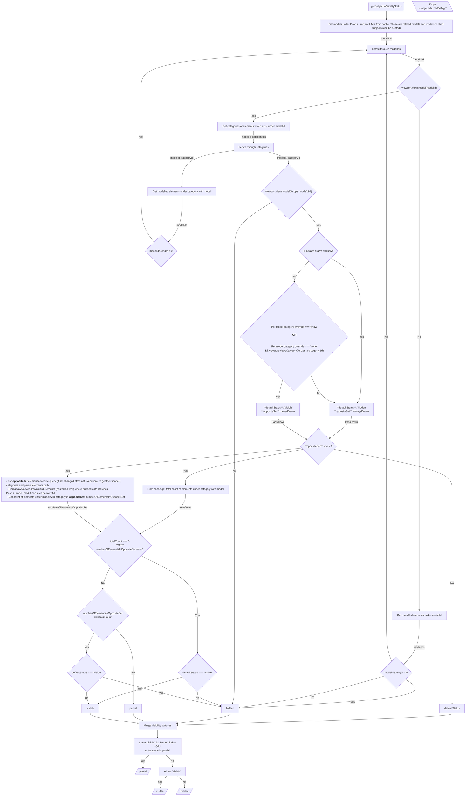

### getSubjectsVisibilityStatus (merged)

```mermaid
---
config:
  flowchart:
    wrappingWidth: 750
    useMaxWidth: false
---

flowchart TD
  RESULT_Partial[/partial/]
  RESULT_Visible[/visible/]
  RESULT_Hidden[/hidden/]

  %% ===== getSubjectsVisibilityStatus =====
  TITLE(getSubjectsVisibilityStatus) --> S_A["Get models under <code>Props.subjectIds</code> from cache. These are related models and models of child subjects (can be nested)"]

  PROPS[\"Props
    <div style='text-align: left;'>- subjectIds: **Id64Arg**</div>
  "\]

  %% ===== getModelsVisibilityStatus =====
  S_A -- modelIds --> M_ITER["Iterate through modelIds"]
  M_ITER -- modelId --> M_VIEW{"viewport.viewsModel(modelId)"}

  %% Model is viewed → get categories
  M_VIEW -- Yes --> M_CATS["Get categories of elements which exist under modelId"]

  %% Model is NOT viewed → check sub-models (recursive)
  M_VIEW -- No --> M_SUB["Get modelled elements under modelId"]
  M_SUB -- modelIds --> M_MODELED_ZERO{"modelIds.length > 0"}
  M_MODELED_ZERO -- Yes --> M_ITER
  M_MODELED_ZERO -- Yes --> M_REC_H[hidden]
  M_MODELED_ZERO -- No --> M_REC_H

  %% ===== getCategoriesVisibilityStatus (modelId defined) =====
  M_CATS -- "modelId, categoryIds" --> C_ITER["Iterate through categories"]

  %% ===== getModelWithCategoryVisibilityStatus =====
  C_ITER -- "modelId, categoryId" --> W_A1["Get modelled elements under category with model"]
  C_ITER -- "modelId, categoryId" --> W_A2{"viewport.viewsModel(<code>Props.modelId</code>)"}
  W_A1 -- modelIds --> M_MODELED_ZERO2{"modelIds.length > 0"}

  %% Sub-models path (recursive)
  M_MODELED_ZERO2 -- Yes --> M_ITER

  %% Model not viewed
  W_A2 -- No --> M_REC_H

  %% Model viewed → determine always/never drawn
  W_A2 -- Yes --> W_D{Is always drawn exclusive}

    %% Branch Yes
    W_D -- Yes --> W_E1["**defaultStatus**: 'hidden' <br/> **oppositeSet**: alwaysDrawn"]

    %% Branch No
    W_D -- No --> W_E2{"
      <div style='padding: 20px'>
        Per model category override === 'show' <br/>
        <strong style='font-weight: bold;'>OR</strong>
        <br/>
        Per model category override === 'none'<br/> && viewport.viewsCategory(<code>Props.categoryId</code>)
      </div>
    "}

      %% Branch No
      W_E2 -- No --> W_E1

      %% Branch Yes
      W_E2 -- Yes --> W_E3["**defaultStatus**: 'visible' <br/> **oppositeSet**: neverDrawn"]

  W_E1 -- Pass down --> W_F{"**oppositeSet**.size > 0"}
  W_E3 -- Pass down --> W_F

    %% Branch No
    W_F -- No --> W_G1[defaultStatus]

    %% Branch Yes
    W_F -- Yes --> W_G2[From cache get total count of elements under category with model]

    W_F -- Yes --> W_G3["<div style='text-align: left;'>- For <strong>oppositeSet</strong> elements execute query (if set changed after last execution), to get their models, categories and parent elements path. <br/> - Find always/never drawn child elements (nested as well) where queried data matches <code>Props.modelId</code> & <code>Props.categoryId</code>. <br/> - Get count of elements under model with category in <strong>oppositeSet</strong>: numberOfElementsInOppositeSet </div>"]

  %% ===== getAlwaysOrNeverDrawnVisibilityStatus (inlined) =====
    W_G2 -- totalCount --> AN_A{"totalCount === 0 <br/> **OR** <br/> numberOfElementsInOppositeSet === 0"}
    W_G3 -- numberOfElementsInOppositeSet --> AN_A

    %% Branch Yes
    AN_A -- Yes --> AN_B1{"defaultStatus === 'visible'"}
      AN_B1 -- Yes --> AN_V1[visible]
      AN_B1 -- No --> M_REC_H

    %% Branch No
    AN_A -- No --> AN_B2{"numberOfElementsInOppositeSet <br/> === totalCount"}
      %% Branch No
      AN_B2 -- No --> M_REC_P[partial]

      %% Branch Yes
      AN_B2 -- Yes --> AN_C{"defaultStatus === 'visible'"}
        AN_C -- Yes --> M_REC_H
        AN_C -- No --> AN_V1

  %% ===== Merge (getModelWithCategoryVisibilityStatus) =====
  W_G1 --> MOD_M["Merge visibility statuses"]

  %% ===== Merge (getModelsVisibilityStatus) =====
  M_REC_H --> MOD_M
  M_REC_P --> MOD_M
  AN_V1 --> MOD_M

  %% ===== Final result =====
  MOD_M --> N["Some 'visible' && Some 'hidden' <br/> **OR** <br/> at least one is 'partial'"]

  N -- Yes --> RESULT_Partial

  N -- No --> O["All are 'visible'"]

  O -- Yes --> RESULT_Visible
  O -- No --> RESULT_Hidden
```
