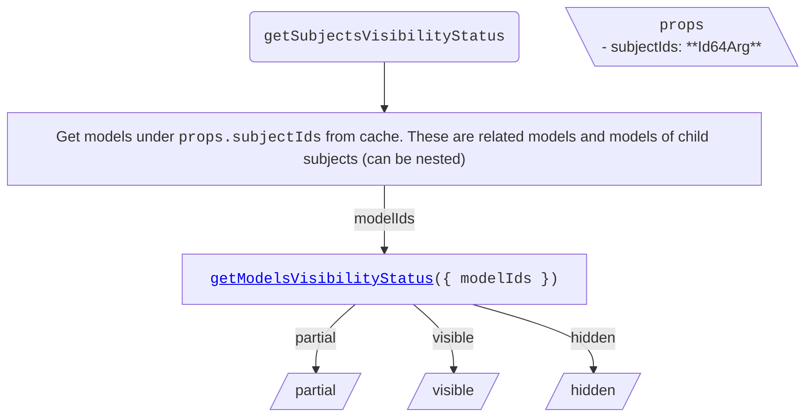

<!-- cspell: ignore getsubjectsvisibilitystatus getmodelsvisibilitystatus getcategoriesvisibilitystatus getelementsvisibilitystatus -->

# Models tree specific visibility handling

This document explains visibility handling for models tree specific cases.

## Table of contents

- [Getting visibility status](#getting-visibility-status)
  - [getSubjectsVisibilityStatus](#getsubjectsvisibilitystatus)
  - [getModelsVisibilityStatus](./SharedVisibilityHandling.md#getmodelsvisibilitystatus)
  - [getCategoriesVisibilityStatus](./SharedVisibilityHandling.md#getcategoriesvisibilitystatus)
  - [getElementsVisibilityStatus](./SharedVisibilityHandling.md#getelementsvisibilitystatus)

## Getting visibility status

### getSubjectsVisibilityStatus

To determine subjects' visibility status, get their child models from cache and call [getModelsVisibilityStatus](./SharedVisibilityHandling.md#getmodelsvisibilitystatus).

