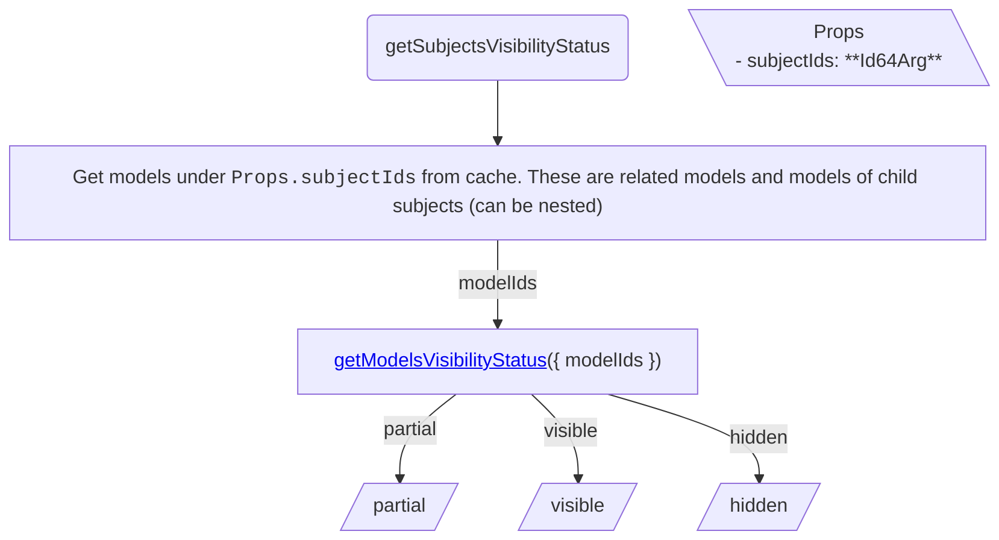

<!-- cspell: ignore getmodelsvisibilitystatus -->

# Models tree specific visibility handling

This document explains visibility handling for models tree specific cases.

## Getting visibility status

### getSubjectsVisibilityStatus

To determine subjects' visibility status, get their child models from cache and call <a href='./SharedVisibilityHandling.md#getmodelsvisibilitystatus'>getModelsVisibilityStatus</a>.

