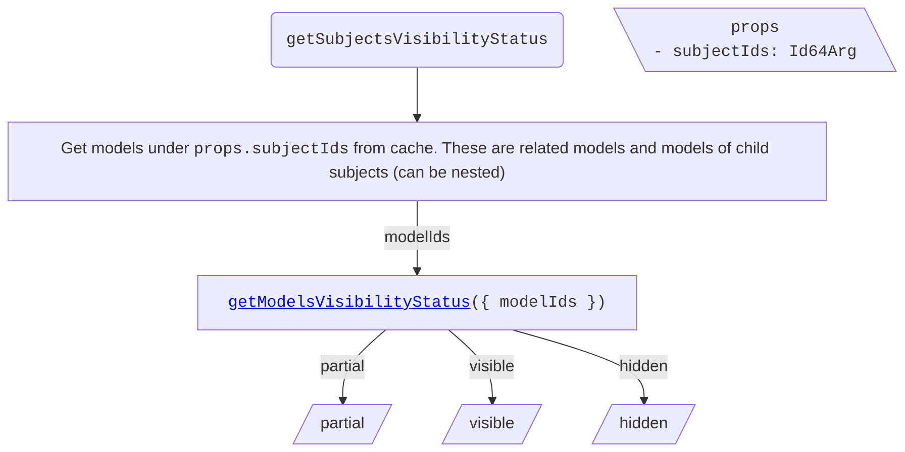
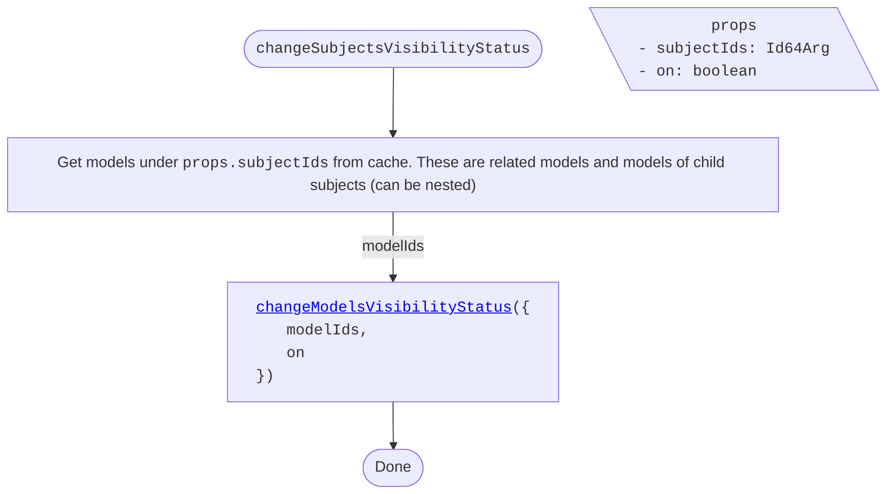

<!-- cspell: ignore getsubjectsvisibilitystatus getmodelsvisibilitystatus getcategoriesvisibilitystatus getelementsvisibilitystatus changesubjectsvisibilitystatus changegroupedelementsvisibilitystatus changemodelsvisibilitystatus changeelementsvisibilitystatus -->

# Models tree specific visibility handling

This document explains visibility handling for models tree specific cases.

## Table of contents

- [Getting visibility status](#getting-visibility-status)
  - [getSubjectsVisibilityStatus](#getsubjectsvisibilitystatus)
  - [getModelsVisibilityStatus](./SharedVisibilityHandling.md#getmodelsvisibilitystatus)
  - [getCategoriesVisibilityStatus](./SharedVisibilityHandling.md#getcategoriesvisibilitystatus)
  - [getElementsVisibilityStatus](./SharedVisibilityHandling.md#getelementsvisibilitystatus)
- [Changing visibility status](#changing-visibility-status)
  - [changeSubjectsVisibilityStatus](#changesubjectsvisibilitystatus)
  - [changeGroupedElementsVisibilityStatus](#changegroupedelementsvisibilitystatus)
  - [changeModelsVisibilityStatus](./SharedVisibilityHandling.md#changemodelsvisibilitystatus)
  - [changeCategoriesVisibilityStatus](./SharedVisibilityHandling.md#changecategoriesvisibilitystatus)
  - [changeElementsVisibilityStatus](./SharedVisibilityHandling.md#changeelementsvisibilitystatus)

## Getting visibility status

### getSubjectsVisibilityStatus

To determine subjects' visibility status, get their child models from cache and call [getModelsVisibilityStatus](./SharedVisibilityHandling.md#getmodelsvisibilitystatus).

## Changing visibility status

### changeSubjectsVisibilityStatus

Changes subjects' visibility status by propagating the change to all related models.

