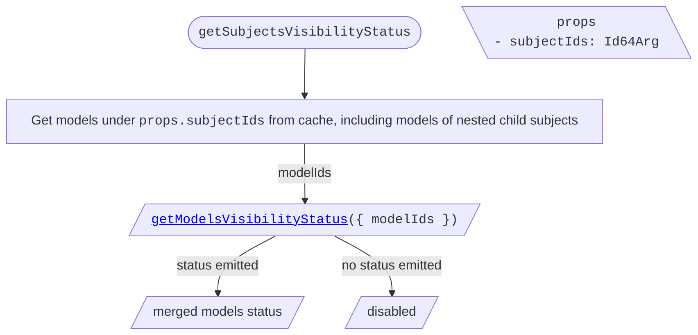
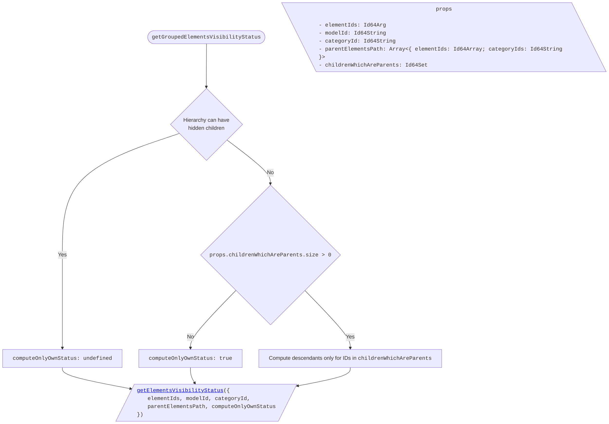
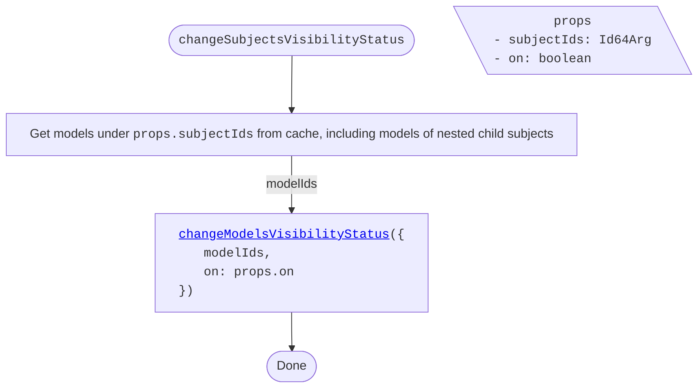
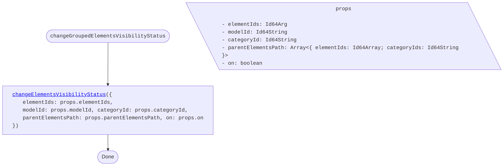

<!-- cspell: ignore mergevisibilitystatuses getelementsvisibilitystatus getsubjectsvisibilitystatus getmodelsvisibilitystatus getgroupedelementsvisibilitystatus changemodelsvisibilitystatus changeelementsvisibilitystatus changesubjectsvisibilitystatus changegroupedelementsvisibilitystatus -->

# Models tree specific visibility handling

This document explains visibility handling that is specific to the Models tree. Shared model, category, and element behavior is documented in [Shared visibility handling](./SharedVisibilityHandling.md).

Models tree visibility is available only for 3D viewports. In other viewport types, status requests return `disabled` and change requests do nothing.

## Table of contents

- [Getting visibility status](#getting-visibility-status)
  - [getSubjectsVisibilityStatus](#getsubjectsvisibilitystatus)
  - [getGroupedElementsVisibilityStatus](#getgroupedelementsvisibilitystatus)
  - [getModelsVisibilityStatus](./SharedVisibilityHandling.md#getmodelsvisibilitystatus)
  - [getCategoriesVisibilityStatus](./SharedVisibilityHandling.md#getcategoriesvisibilitystatus)
  - [getElementsVisibilityStatus](./SharedVisibilityHandling.md#getelementsvisibilitystatus)
- [Changing visibility status](#changing-visibility-status)
  - [changeSubjectsVisibilityStatus](#changesubjectsvisibilitystatus)
  - [changeGroupedElementsVisibilityStatus](#changegroupedelementsvisibilitystatus)
  - [changeModelsVisibilityStatus](./SharedVisibilityHandling.md#changemodelsvisibilitystatus)
  - [changeCategoriesVisibilityStatus](./SharedVisibilityHandling.md#changecategoriesvisibilitystatus)
  - [changeElementsVisibilityStatus](./SharedVisibilityHandling.md#changeelementsvisibilitystatus)

## Getting visibility status

### getSubjectsVisibilityStatus

The cache returns models related to the requested subjects, including models beneath nested child subjects. Their statuses are resolved by [getModelsVisibilityStatus](./SharedVisibilityHandling.md#getmodelsvisibilitystatus) and merged. A subject with no related models is `disabled`.

```mermaid
---
config:
  flowchart:
    wrappingWidth: 750
    useMaxWidth: false
---

flowchart TD
  RESULT_Status[/merged models status/]
  RESULT_Disabled[/disabled/]

  %% Start
  TITLE(["<span style='font-family: monospace;'>getSubjectsVisibilityStatus</span>"]) --> A["Get models under <span style='font-family: monospace;'>props.subjectIds</span> from cache, including models of nested child subjects"]

  PROPS[\"
    <span style='font-family: monospace;'>props</span>
    <span style='display: block; text-align: left; font-family: monospace;'>- subjectIds: Id64Arg</span>
  "\]

  A -- modelIds --> B[/"<span style='font-family: monospace;'><a href='./SharedVisibilityHandling.md#getmodelsvisibilitystatus'>getModelsVisibilityStatus</a>({ modelIds })</span>"/]
  B -- "status emitted" --> RESULT_Status
  B -- "no status emitted" --> RESULT_Disabled
```

### getGroupedElementsVisibilityStatus

A class-grouping node is resolved through [getElementsVisibilityStatus](./SharedVisibilityHandling.md#getelementsvisibilitystatus). The node provides its model, category, parent path, grouped element IDs, and the grouped elements known to have children.

When the hierarchy can hide children, all descendants are evaluated. Otherwise, descendants are evaluated only for grouped elements known to be parents; a group containing only leaves computes only the grouped elements' own status. The hierarchy can have hidden children when the tree configuration excludes element classes (`elements.excludedClasses`) — excluded descendants do not appear in the tree but still render in the viewport, so their visibility must be evaluated.

```mermaid
---
config:
  flowchart:
    wrappingWidth: 750
    useMaxWidth: false
---

flowchart TD
  %% Start
  TITLE(["<span style='font-family: monospace;'>getGroupedElementsVisibilityStatus</span>"]) --> A{"Hierarchy can have<br/>hidden children"}

  PROPS[\"
    <span style='font-family: monospace;'>props</span>
    <span style='display: block; text-align: left; font-family: monospace;'>- elementIds: Id64Arg<br/>- modelId: Id64String<br/>- categoryId: Id64String<br/>- parentElementsPath: Array&lt;{ elementIds: Id64Array; categoryIds: Id64String }&gt;<br/>- childrenWhichAreParents: Id64Set</span>
  "\]

  A -- Yes --> B1["<span style='font-family: monospace;'>computeOnlyOwnStatus: undefined</span>"]
  A -- No --> B2{"<span style='font-family: monospace;'>props.childrenWhichAreParents.size > 0</span>"}
  B2 -- No --> B3["<span style='font-family: monospace;'>computeOnlyOwnStatus: true</span>"]
  B2 -- Yes --> B4["Compute descendants only for IDs in <span style='font-family: monospace;'>childrenWhichAreParents</span>"]
  B1 --> C[/"<div style='text-align: left; font-family: monospace;'><a href='./SharedVisibilityHandling.md#getelementsvisibilitystatus'>getElementsVisibilityStatus</a>({
    <span style='padding-left: 2rem;'>elementIds, modelId, categoryId,</span>
    <span style='padding-left: 2rem;'>parentElementsPath, computeOnlyOwnStatus</span>
    })</div>"/]
  B3 --> C
  B4 --> C
```

## Changing visibility status

### changeSubjectsVisibilityStatus

Changing a subject delegates to [changeModelsVisibilityStatus](./SharedVisibilityHandling.md#changemodelsvisibilitystatus) for every model related to the requested subjects, including models beneath nested child subjects.

```mermaid
---
config:
  flowchart:
    wrappingWidth: 750
    useMaxWidth: false
---

flowchart TD
  RESULT_Done([Done])

  %% Start
  TITLE(["<span style='font-family: monospace;'>changeSubjectsVisibilityStatus</span>"]) --> A["Get models under <span style='font-family: monospace;'>props.subjectIds</span> from cache, including models of nested child subjects"]

  PROPS[\"
    <span style='font-family: monospace;'>props</span>
    <span style='display: block; text-align: left; font-family: monospace;'>- subjectIds: Id64Arg<br/>- on: boolean</span>
  "\]

  A -- modelIds --> B["<div style='text-align: left; font-family: monospace;'><a href='./SharedVisibilityHandling.md#changemodelsvisibilitystatus'>changeModelsVisibilityStatus</a>({
    <span style='padding-left: 2rem;'>modelIds,</span>
    <span style='padding-left: 2rem;'>on: props.on</span>
    })</div>"]
  B --> RESULT_Done
```

### changeGroupedElementsVisibilityStatus

Changing a grouping node delegates to the path-scoped [changeElementsVisibilityStatus](./SharedVisibilityHandling.md#changeelementsvisibilitystatus) for all grouped element IDs. Descendants and sub-models are handled by the shared helper.

```mermaid
---
config:
  flowchart:
    wrappingWidth: 750
    useMaxWidth: false
---

flowchart TD
  RESULT_Done([Done])

  %% Start
  TITLE(["<span style='font-family: monospace;'>changeGroupedElementsVisibilityStatus</span>"]) --> A["<div style='text-align: left; font-family: monospace;'><a href='./SharedVisibilityHandling.md#changeelementsvisibilitystatus'>changeElementsVisibilityStatus</a>({
    <span style='padding-left: 2rem;'>elementIds: props.elementIds,</span>
    <span style='padding-left: 2rem;'>modelId: props.modelId, categoryId: props.categoryId,</span>
    <span style='padding-left: 2rem;'>parentElementsPath: props.parentElementsPath, on: props.on</span>
    })</div>"]

  PROPS[\"
    <span style='font-family: monospace;'>props</span>
    <span style='display: block; text-align: left; font-family: monospace;'>- elementIds: Id64Arg<br/>- modelId: Id64String<br/>- categoryId: Id64String<br/>- parentElementsPath: Array&lt;{ elementIds: Id64Array; categoryIds: Id64String }&gt;<br/>- on: boolean</span>
  "\]

  A --> RESULT_Done
```
