<!-- cspell: ignore getcategoriesvisibilitystatus getmodelsvisibilitystatus getsubcategoriesvisibilitystatus getmodelwithcategoryvisibilitystatus getalwaysorneverdrawnvisibilitystatus getvisiblemodelcategorydirectvisibilitystatus changemodelsvisibilitystatus changecategoriesvisibilitystatus changecategoriesundermodelvisibilitystatus changeelementsvisibilitystatus showmodelwithoutanycategoriesorelements queueelementsvisibilitychange clearalwaysandneverdrawnelements -->

# Shared visibility handling

This document explains the shared parts of visibility handling in models, categories and classifications trees. Please read [how visibility is determined in the viewport](./Visibility.md#how-visibility-is-determined-in-the-viewport).

## Table of contents

- [Getting visibility status](#getting-visibility-status)
  - [getSubCategoriesVisibilityStatus](#getsubcategoriesvisibilitystatus)
  - [getModelsVisibilityStatus](#getmodelsvisibilitystatus)
  - [getCategoriesVisibilityStatus](#getcategoriesvisibilitystatus)
  - [getModelWithCategoryVisibilityStatus](#getmodelwithcategoryvisibilitystatus)
  - [getElementsVisibilityStatus](#getelementsvisibilitystatus)
  - [getAlwaysOrNeverDrawnVisibilityStatus](#getalwaysorneverdrawnvisibilitystatus)
  - [getVisibleModelCategoryDirectVisibilityStatus](#getvisiblemodelcategorydirectvisibilitystatus)
- [Changing visibility status](#changing-visibility-status)
  - [changeModelsVisibilityStatus](#changemodelsvisibilitystatus)
  - [changeCategoriesVisibilityStatus](#changecategoriesvisibilitystatus)
  - [changeCategoriesUnderModelVisibilityStatus](#changecategoriesundermodelvisibilitystatus)
  - [changeElementsVisibilityStatus](#changeelementsvisibilitystatus)
  - [showModelWithoutAnyCategoriesOrElements](#showmodelwithoutanycategoriesorelements)
  - [clearAlwaysAndNeverDrawnElements](#clearalwaysandneverdrawnelements)
  - [queueElementsVisibilityChange](#queueelementsvisibilitychange)

## Getting visibility status

### getSubCategoriesVisibilityStatus

Visibility of sub-category is `hidden` if its category is `hidden` **Or** the sub-category itself is hidden, otherwise it is `visible`. When determining visibility of multiple sub-categories, need to check if some are `visible` and some are `hidden`, in such case `partial` visibility is returned.

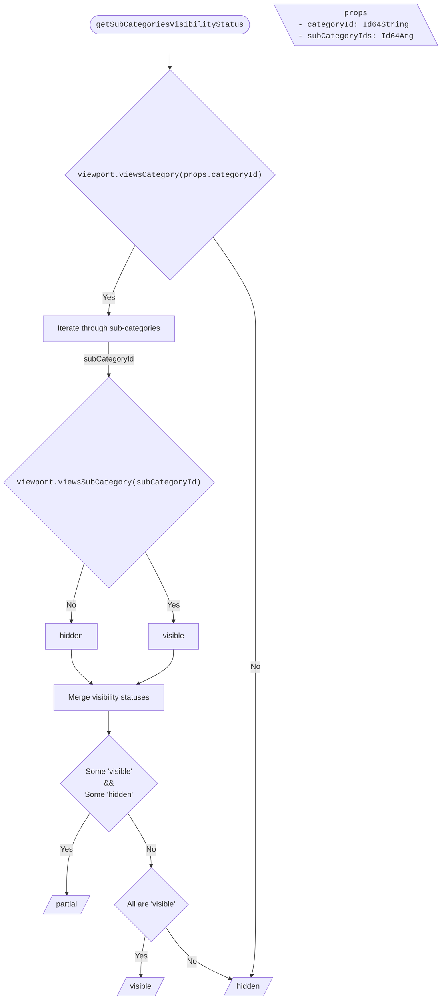

### getModelsVisibilityStatus

Visibility of model is determined by merging visibility status of two parts:

1. Model selector. If model is not hidden in selector, need to check categories of child elements (they are retrieved from cache) by calling [getCategoriesVisibilityStatus](#getcategoriesvisibilitystatus).
2. Child elements which are sub-models (retrieved from cache). For such elements call [getModelsVisibilityStatus](#getmodelsvisibilitystatus).

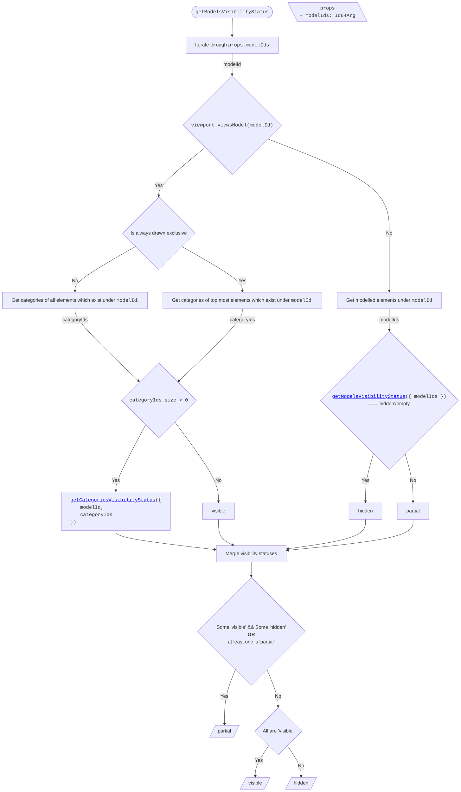

### getCategoriesVisibilityStatus

Allows getting category visibility under specific model (when `props.modelId` is defined) or to get generic category visibility.

1. For category visibility under specific model, [getModelWithCategoryVisibilityStatus](#getmodelwithcategoryvisibilitystatus) is used.
2. For generic category visibility status, merge statuses from:
   - Get sub-categories related to category (from cache), and call [getSubCategoriesVisibilityStatus](#getsubcategoriesvisibilitystatus).
   - Get models of category elements (from cache), for each model call [getModelWithCategoryVisibilityStatus](#getmodelwithcategoryvisibilitystatus).

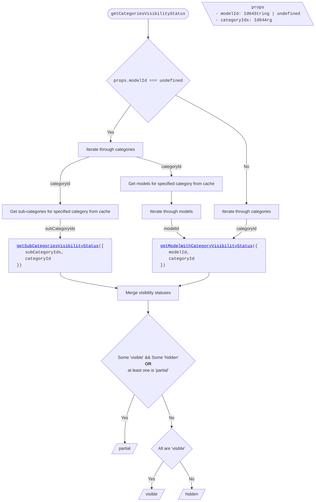

### getModelWithCategoryVisibilityStatus

Determines visibility status of category under model. It is done by merging visibility statuses of:

- **Sub-models**: Model category elements which are sub-models (retrieved from cache) and calling [getModelsVisibilityStatus](#getmodelsvisibilitystatus).
- **Child elements**: determining child elements visibility is done by:
  1. Getting total count of elements under the category with model.
  2. Getting default child elements status based on per-model category override and category selector.
  3. Get `opposite set` to default status: default status === `visible` -> `alwaysDrawn`, `neverDrawn` otherwise.
  4. The `opposite set` can contain elements from any categories and models, need to query data of these elements and find the ones which are related to the desired category and model.
  5. Once all the above data (1-4) is known, visibility can be determined by comparing the total count, number of elements (related to specific model and category) in the opposite set, and default status.

  **Note**: All the checks are done only when [visibility rules](./Visibility.md#how-visibility-is-determined-in-the-viewport) that have higher priority do not interfere (e.g. if model is hidden in selector, then always/never drawn elements are **not checked** and `hidden` is returned for `Child Elements` visibility).

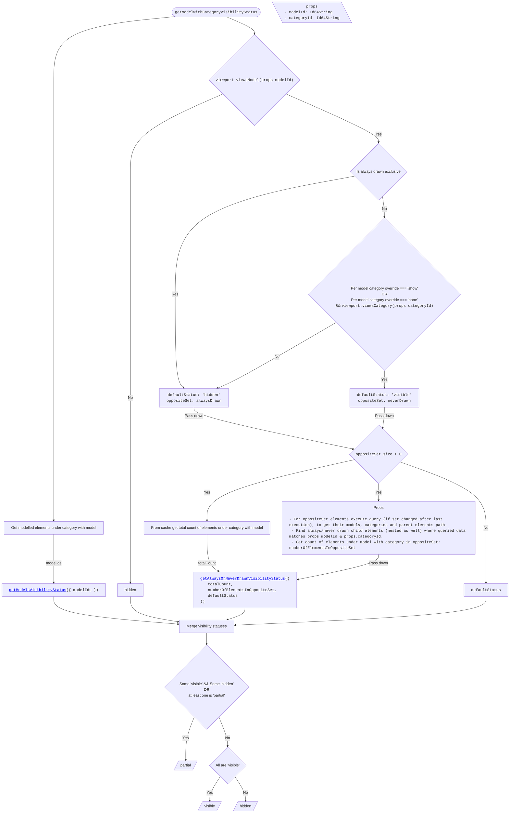

### getElementsVisibilityStatus

Determines visibility status of elements. Structure is very similar to [getModelWithCategoryVisibilityStatus](#getmodelwithcategoryvisibilitystatus), except everything is done based on elements instead of model + category.

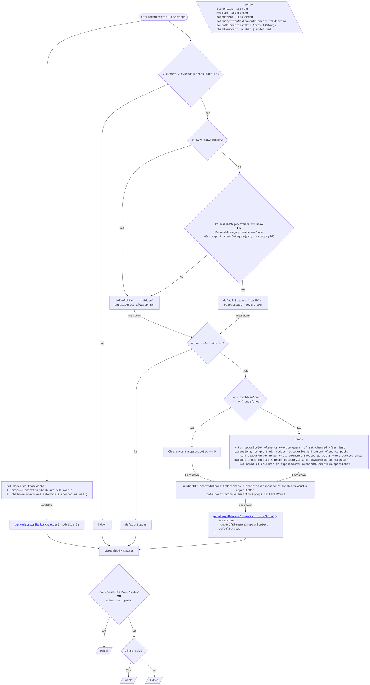

### getAlwaysOrNeverDrawnVisibilityStatus

Helper function that is used by [getModelWithCategoryVisibilityStatus](#getmodelwithcategoryvisibilitystatus) and [getElementsVisibilityStatus](#getelementsvisibilitystatus). It determines visibility status of elements based on `totalCount`, `numberOfElementsInOppositeSet` and `defaultStatus`.

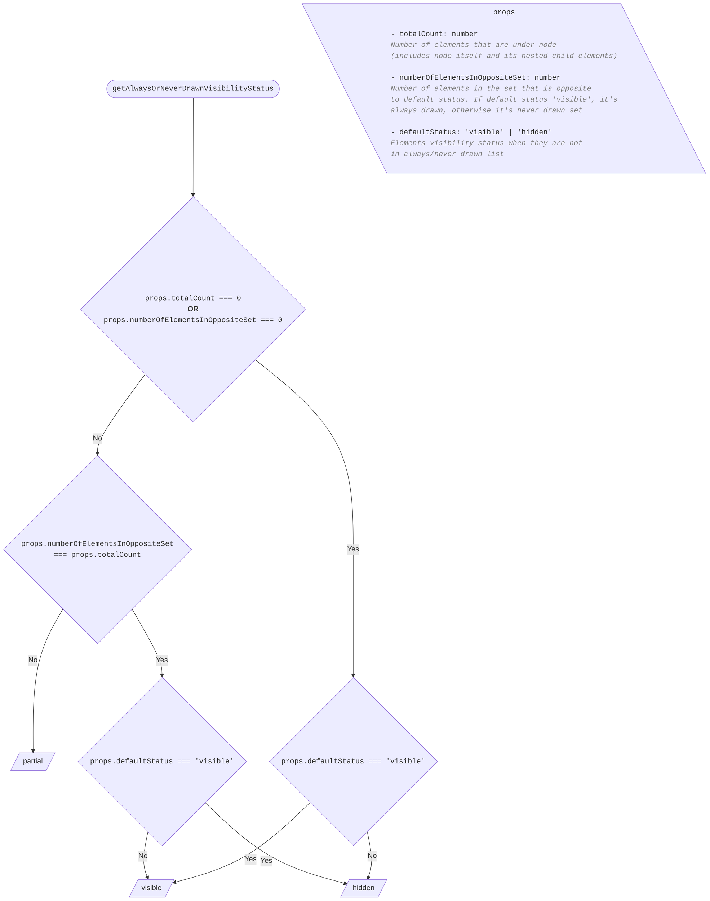

### getVisibleModelCategoryDirectVisibilityStatus

Determines visibility status of a category assuming the model is visible. Returns a non-partial visibility status (`visible` or `hidden`) based on per-model category overrides and the category selector.

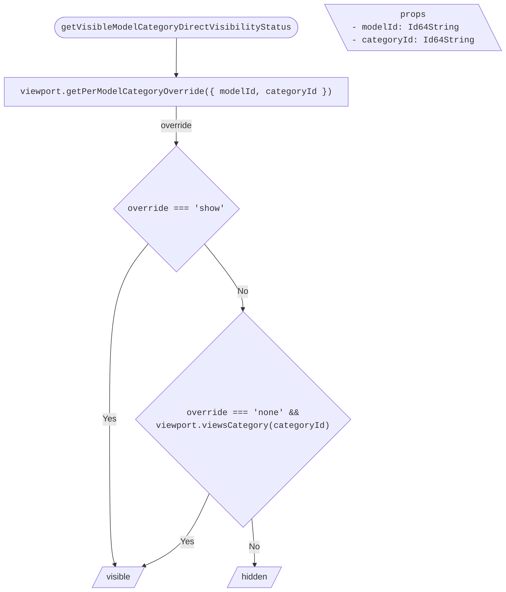

## Changing visibility status

### changeModelsVisibilityStatus

Changes visibility of models by updating the model selector, clearing per-model category overrides, and recursively propagating the change to sub-models and their categories.

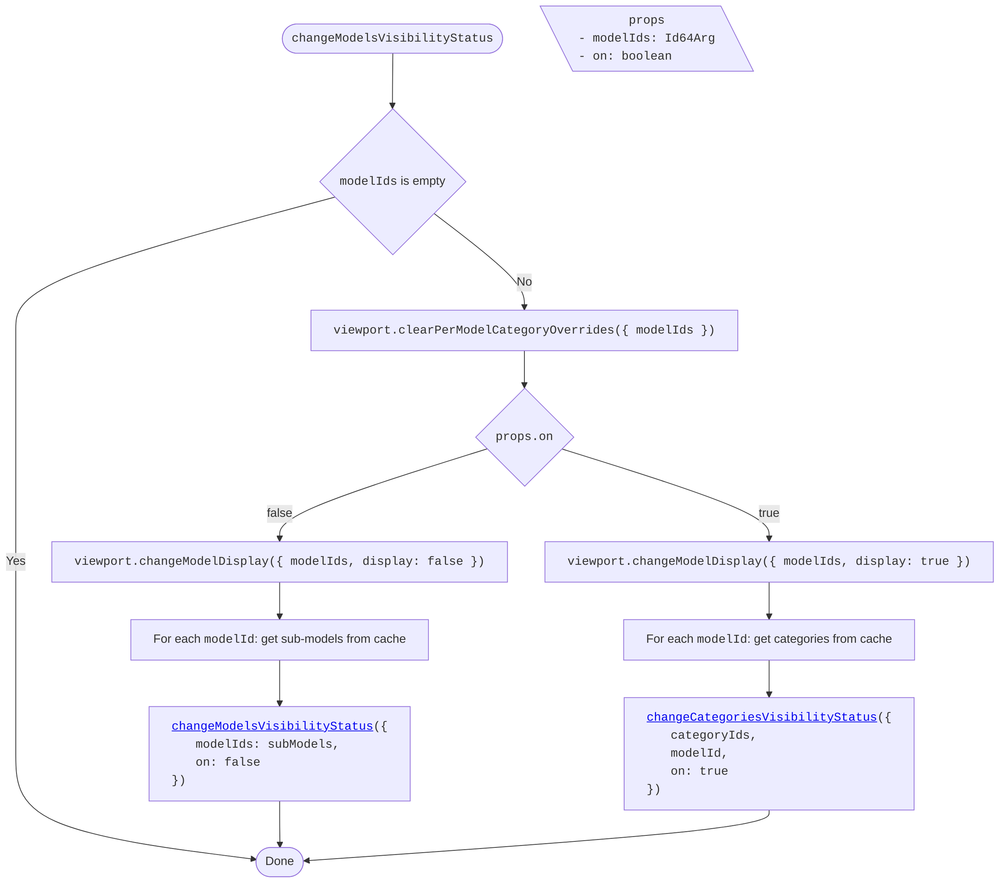

### changeCategoriesVisibilityStatus

Changes visibility of categories. Behavior differs based on whether a `modelId` is provided (per-model category override) or not (generic category selector change).

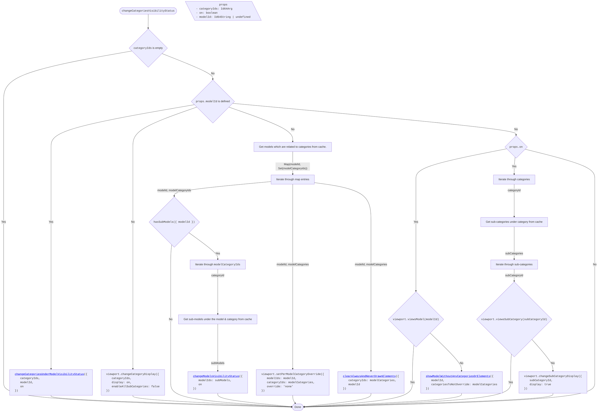

### changeCategoriesUnderModelVisibilityStatus

Changes visibility of categories under a specific model by setting per-model category overrides. All operations run in parallel.

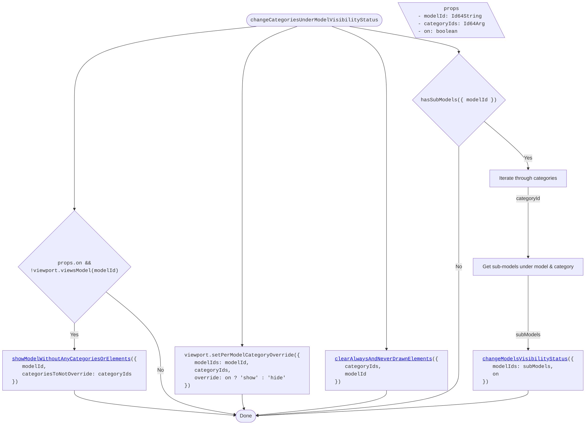

### changeElementsVisibilityStatus

Changes visibility of elements by adding them to the viewport's always/never drawn sets. The default visibility of the element (determined by model and category state) decides which set to modify. Also handles elements that are sub-models by recursively calling `changeModelsVisibilityStatus`.

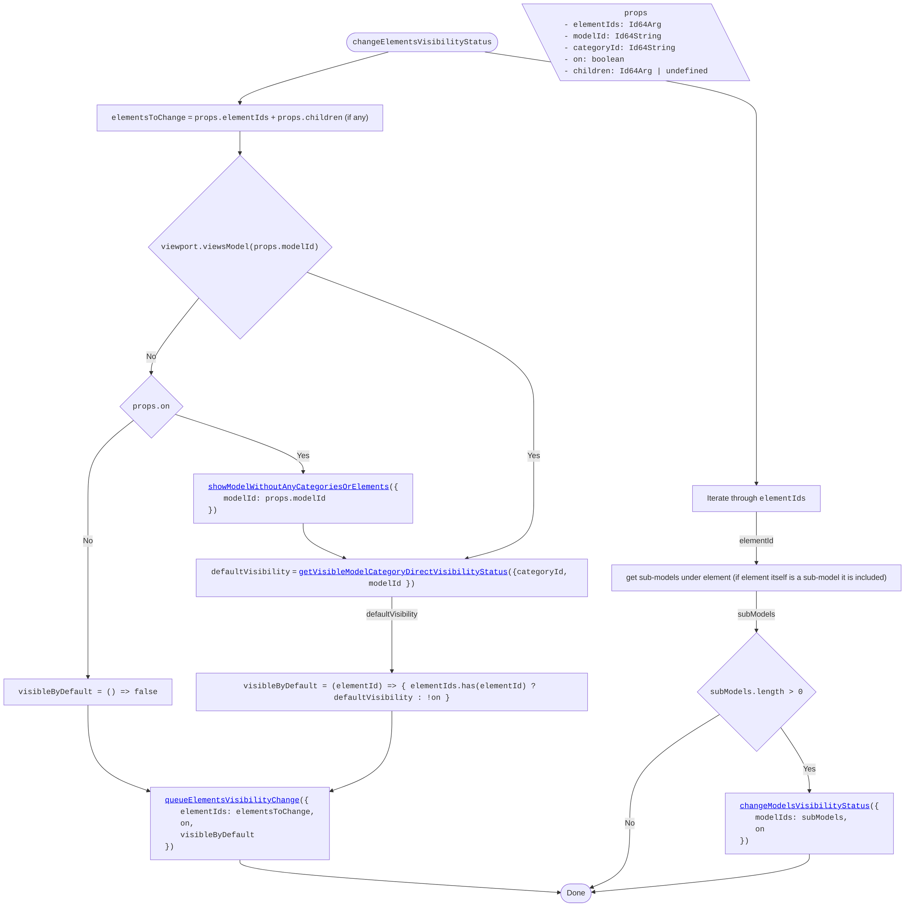

### showModelWithoutAnyCategoriesOrElements

Turns a model on without making any of its elements visible. This is used when a category or element visibility change requires the model to be displayed, but the caller will handle showing the specific categories/elements.

The method:

1. Fetches all model categories and always-drawn elements from cache.
2. If the model was already turned on (e.g. concurrently), returns early.
3. Removes model's always-drawn elements from the viewport's always-drawn set.
4. Turns the model display on.
5. Sets per-model category overrides to hide all categories (except those in `categoriesToNotOverride`).

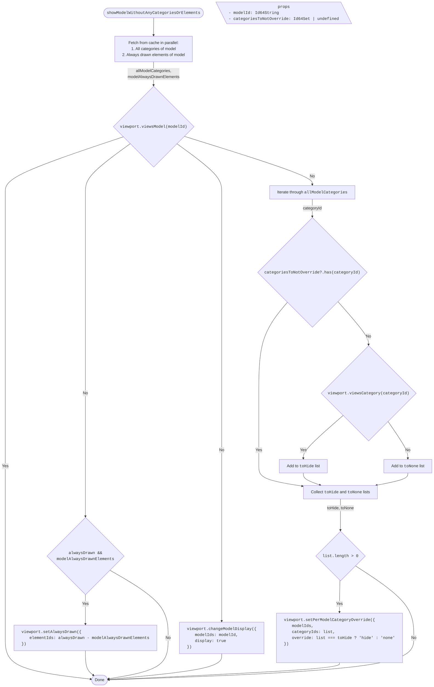

### queueElementsVisibilityChange

Queues a visibility change for elements. If the change is cancelled before completion, the queued operation is skipped.

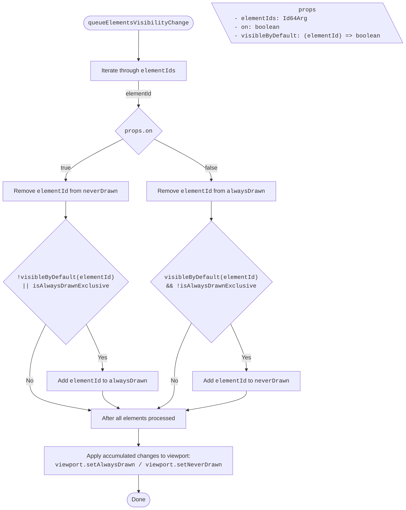

### clearAlwaysAndNeverDrawnElements

Removes elements (related to the specified model and categories) from the viewport's always and never drawn sets.

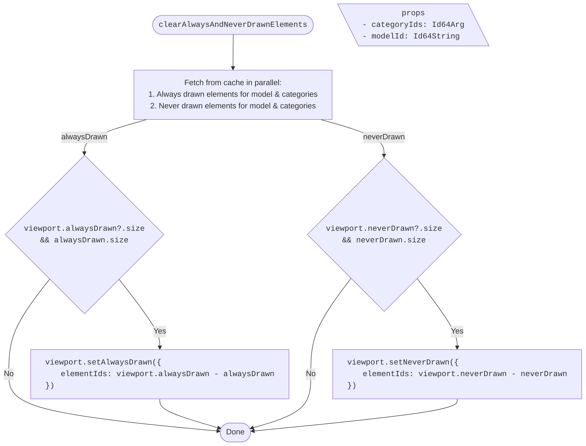
