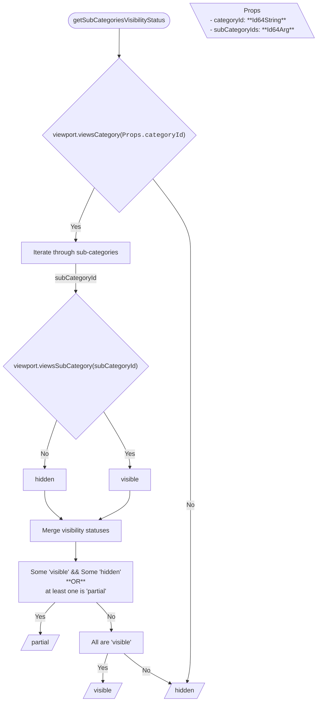
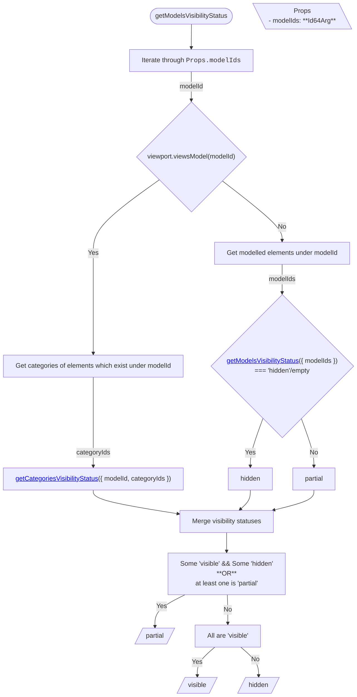
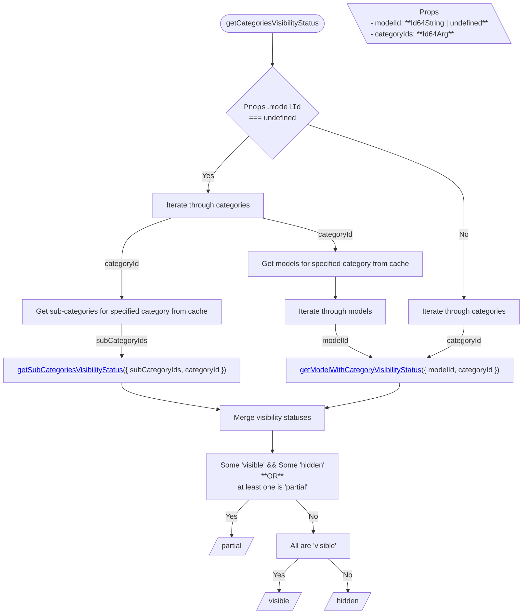
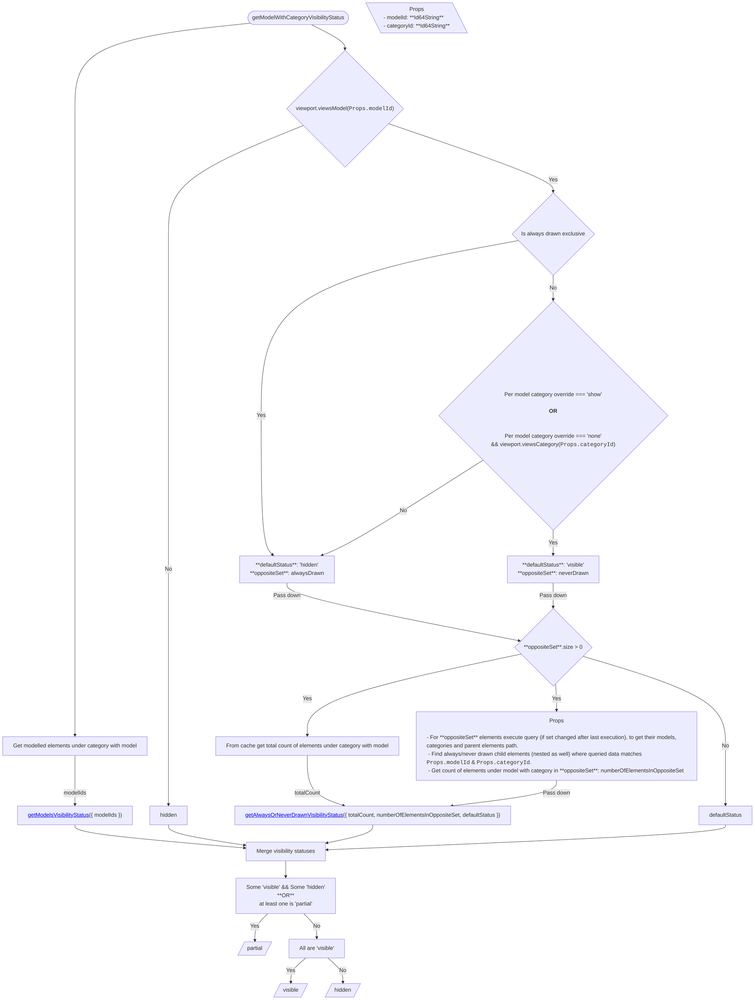
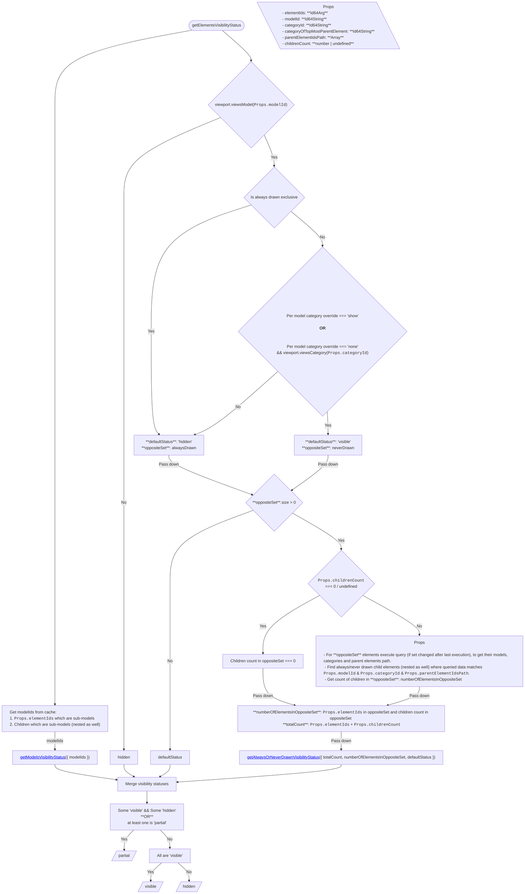
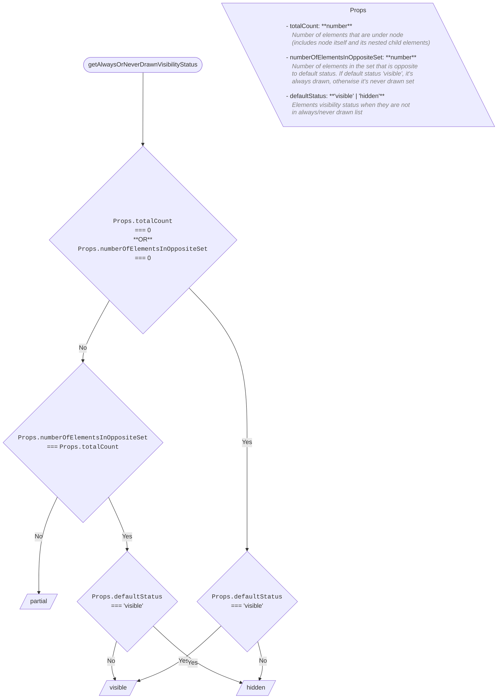

<!-- cspell: ignore getcategoriesvisibilitystatus getmodelsvisibilitystatus getsubcategoriesvisibilitystatus getmodelwithcategoryvisibilitystatus getalwaysorneverdrawnvisibilitystatus -->

# Shared visibility handling

This document explains the shared parts of visibility handling in models, categories and classifications trees. Please read <a href='./Visibility.md#how-visibility-is-determined-in-the-viewport'>how visibility is determined in the viewport</a> before continuing.

## Getting visibility status

### getSubCategoriesVisibilityStatus

Visibility of sub-category is `hidden` if its category is `hidden` **Or** the sub-category itself is hidden, otherwise it is `visible`. When determining visibility of multiple sub-categories, need to check if some are `visible` and some are `hidden`, in such case `partial` visibility is returned.

### getModelsVisibilityStatus

Visibility of model is determined by merging visibility status of two parts:

1. Model selector. If model is not hidden in selector, need to check categories of child elements (they are retrieved from cache) by calling [getCategoriesVisibilityStatus](#getcategoriesvisibilitystatus).
2. Child elements' which are sub-models (retrieved from cache). For such elements call [getModelsVisibilityStatus](#getmodelsvisibilitystatus).

### getCategoriesVisibilityStatus

Allows getting category visibility under specific model (when modelId is defined in props) or to get generic category visibility.

1. For category visibility under specific model, [getModelWithCategoryVisibilityStatus](#getmodelwithcategoryvisibilitystatus) is used.
2. For generic category visibility status, merge statuses from:
   - Get sub-categories related to category (from cache), and call [getSubCategoriesVisibilityStatus](#getsubcategoriesvisibilitystatus).
   - Get models of category elements (from cache), for each model call [getModelWithCategoryVisibilityStatus](#getmodelwithcategoryvisibilitystatus).

### getModelWithCategoryVisibilityStatus

Determines visibility status of category under model. It is done by merging visibility statuses of:

- **Sub-models**: Model category elements which are sub-models (retrieved from cache) and calling [getModelsVisibilityStatus](#getmodelsvisibilitystatus).
- **Child elements**: determining child elements visibility is done by:
  1.  Getting total count of elements under the category with model.
  2.  Getting default child elements status based on per-model category override and category selector.
  3.  Get `opposite set` to default status: default status === `visible` -> `alwaysDrawn`, `neverDrawn` otherwise.
  4.  The `opposite set` can contain elements from any categories and models, need to query data of these elements and find the ones which are related to the desired category and model.
  5.  Once all the above data (1-4) is known, visibility can be determined by comparing the total count, number of elements (related to specific model and category) in the opposite set, and default status.

  **Note**: All the checks are done only when <a href='./Visibility.md#how-visibility-is-determined-in-the-viewport'>visibility rules</a> that have higher priority do not interfere (e.g. if model is hidden in selector, then always/never drawn elements are **not checked** and `hidden` is returned for `Child Elements` visibility).

### getElementsVisibilityStatus

Determines visibility status of elements. Structure is very similar to [getModelWithCategoryVisibilityStatus](#getmodelwithcategoryvisibilitystatus), except everything is done based on elements instead of model + category.

### getAlwaysOrNeverDrawnVisibilityStatus

Helper function that is used by [getModelWithCategoryVisibilityStatus](#getmodelwithcategoryvisibilitystatus) and [getElementsVisibilityStatus](#getelementsvisibilitystatus). It determines visibility status of elements based on `totalCount`, `numberOfElementsInOppositeSet` and `defaultStatus`.

