<!-- cspell: ignore mergevisibilitystatuses getsubcategoriesvisibilitystatus getmodelsvisibilitystatus getcategoriesvisibilitystatus getmodelwithcategoriesvisibilitystatus getelementsvisibilitystatus getcategoryvisibilityfromalwaysandneverdrawnelements getvisiblemodelcategorydirectvisibilitystatus getvisibilityfromgroupeddescendants changemodelsvisibilitystatus changecategoriesvisibilitystatus changecategoriesundermodelvisibilitystatus changeelementsvisibilitystatus showmodelwithoutanycategoriesorelements clearalwaysandneverdrawnelements queueelementsvisibilitychange -->

# Shared visibility handling

This document explains visibility handling shared by the Models, Categories, and Classifications trees. Read [How visibility is determined in the viewport](./Visibility.md#how-visibility-is-determined-in-the-viewport) first.

Visibility statuses are combined by [mergeVisibilityStatuses](#mergevisibilitystatuses). A helper that produces no status is treated as `disabled` by the hierarchy visibility handler unless its caller defines another fallback.

## Table of contents

- [Getting visibility status](#getting-visibility-status)
  - [mergeVisibilityStatuses](#mergevisibilitystatuses)
  - [getSubCategoriesVisibilityStatus](#getsubcategoriesvisibilitystatus)
  - [getModelsVisibilityStatus](#getmodelsvisibilitystatus)
  - [getCategoriesVisibilityStatus](#getcategoriesvisibilitystatus)
  - [getModelWithCategoriesVisibilityStatus](#getmodelwithcategoriesvisibilitystatus)
  - [getElementsVisibilityStatus](#getelementsvisibilitystatus)
  - [getCategoryVisibilityFromAlwaysAndNeverDrawnElements](#getcategoryvisibilityfromalwaysandneverdrawnelements)
  - [Grouped descendant visibility](#grouped-descendant-visibility)
  - [getVisibleModelCategoryDirectVisibilityStatus](#getvisiblemodelcategorydirectvisibilitystatus)
- [Changing visibility status](#changing-visibility-status)
  - [removeAlwaysDrawnExclusive](#removealwaysdrawnexclusive)
  - [changeModelsVisibilityStatus](#changemodelsvisibilitystatus)
  - [changeCategoriesVisibilityStatus](#changecategoriesvisibilitystatus)
  - [changeCategoriesUnderModelVisibilityStatus](#changecategoriesundermodelvisibilitystatus)
  - [changeElementsVisibilityStatus](#changeelementsvisibilitystatus)
  - [showModelWithoutAnyCategoriesOrElements](#showmodelwithoutanycategoriesorelements)
  - [clearAlwaysAndNeverDrawnElements](#clearalwaysandneverdrawnelements)
  - [queueElementsVisibilityChange](#queueelementsvisibilitychange)

## Getting visibility status

### mergeVisibilityStatuses

`mergeVisibilityStatuses` combines zero or more visibility statuses. It produces `visible` when every status is visible, `hidden` when every status is hidden, and `partial` when any status is partial or visible and hidden statuses are mixed. A partial result is conclusive as soon as either condition is encountered. If no status is supplied, it produces no status and lets the caller define a fallback.

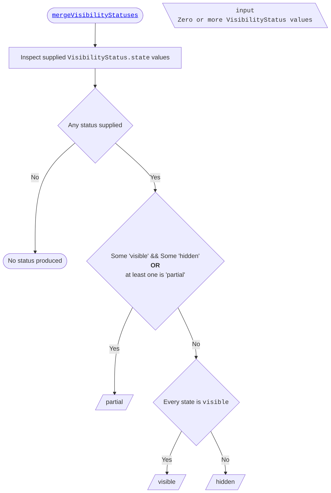
```mermaid
---
config:
  flowchart:
    wrappingWidth: 750
    useMaxWidth: false
---

flowchart TD
  RESULT_Partial[/partial/]
  RESULT_Visible[/visible/]
  RESULT_Hidden[/hidden/]
  RESULT_Empty([No status produced])

  %% Start
  TITLE(["<span style='font-family: monospace;'><a href='../src/tree-widget-react/components/trees/common/internal/VisibilityUtils.ts'>mergeVisibilityStatuses</a></span>"]) --> A["Inspect supplied <span style='font-family: monospace;'>VisibilityStatus.state</span> values"]

  PROPS[\"
    <span style='font-family: monospace;'>input</span>
    <span style='display: block; text-align: left; font-family: monospace;'>Zero or more VisibilityStatus values</span>
  "\]

  A --> B{"Any status supplied"}
  B -- No --> RESULT_Empty
  B -- Yes --> C{<br/> Some 'visible' && Some 'hidden' <br/> <strong>OR</strong> <br/> at least one is 'partial'}
  C -- Yes --> RESULT_Partial
  C -- No --> D{"Every state is <span style='font-family: monospace;'>visible</span>"}
  D -- Yes --> RESULT_Visible
  D -- No --> RESULT_Hidden
```

### getSubCategoriesVisibilityStatus

An empty sub-category input produces no status. If the parent category is hidden, all requested sub-categories are hidden. Otherwise, the helper reads each sub-category selector state and merges the results.

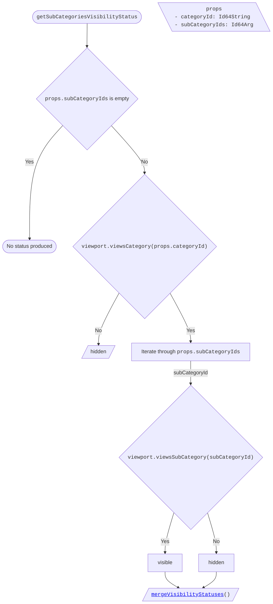
```mermaid
---
config:
  flowchart:
    wrappingWidth: 750
    useMaxWidth: false
---

flowchart TD
  RESULT_Hidden[/hidden/]
  RESULT_Empty([No status produced])

  %% Start
  TITLE(["<span style='font-family: monospace;'>getSubCategoriesVisibilityStatus</span>"]) --> A0{"<span style='font-family: monospace;'>props.subCategoryIds</span> is empty"}

  PROPS[\"
    <span style='font-family: monospace;'>props</span>
    <span style='display: block; text-align: left; font-family: monospace;'>- categoryId: Id64String<br/>- subCategoryIds: Id64Arg</span>
  "\]

  A0 -- Yes --> RESULT_Empty
  A0 -- No --> A{"<span style='font-family: monospace;'>viewport.viewsCategory(props.categoryId)</span>"}
  A -- No --> RESULT_Hidden
  A -- Yes --> B["Iterate through <span style='font-family: monospace;'>props.subCategoryIds</span>"]
  B -- subCategoryId --> C{"<span style='font-family: monospace;'>viewport.viewsSubCategory(subCategoryId)</span>"}
  C -- Yes --> D1[visible]
  C -- No --> D2[hidden]
  D1 --> M[/"<span style='font-family: monospace;'><a href='#mergevisibilitystatuses'>mergeVisibilityStatuses</a>()</span>"/]
  D2 --> M
```

### getModelsVisibilityStatus

Model status merges two independent parts:

1. Every nested sub-model is resolved recursively.
2. Each requested model contributes `hidden` when its model selector is off. A visible model retrieves categories of top-most elements and resolves each through [getCategoryVisibilityFromAlwaysAndNeverDrawnElements](#getcategoryvisibilityfromalwaysandneverdrawnelements), which may return the direct category status without querying descendants. A visible model with no top-most element categories contributes `visible`.

Only top-most element categories are queried because their descendant counts include elements in child categories. An empty model input produces no status.

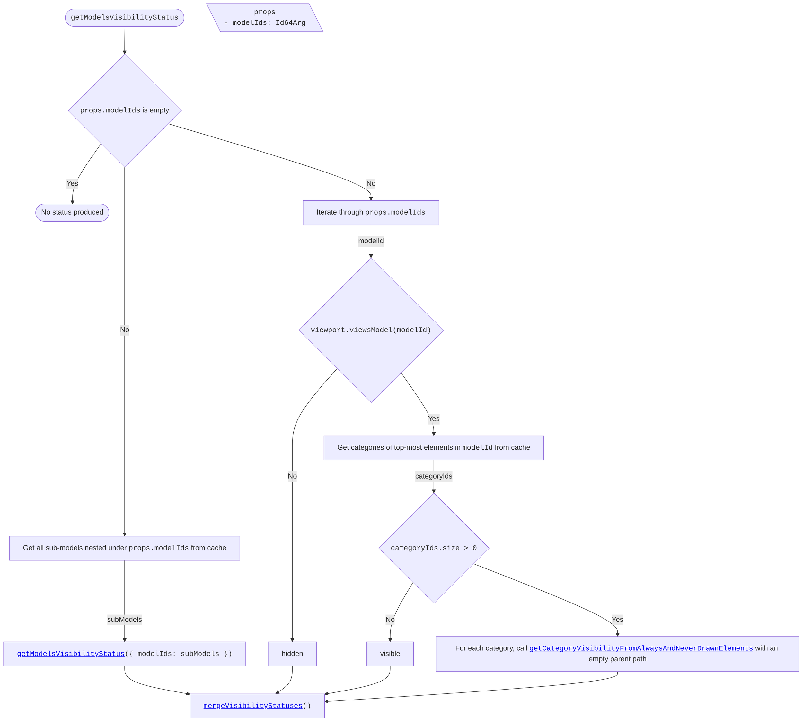
```mermaid
---
config:
  flowchart:
    wrappingWidth: 750
    useMaxWidth: false
---

flowchart TD
  RESULT_Empty([No status produced])

  %% Start
  TITLE(["<span style='font-family: monospace;'>getModelsVisibilityStatus</span>"]) --> A0{"<span style='font-family: monospace;'>props.modelIds</span> is empty"}

  PROPS[\"
    <span style='font-family: monospace;'>props</span>
    <span style='display: block; text-align: left; font-family: monospace;'>- modelIds: Id64Arg</span>
  "\]

  A0 -- Yes --> RESULT_Empty
  A0 -- No --> A["Iterate through <span style='font-family: monospace;'>props.modelIds</span>"]
  A0 -- No --> B["Get all sub-models nested under <span style='font-family: monospace;'>props.modelIds</span> from cache"]
  B -- subModels --> B1["<span style='font-family: monospace;'><a href='#getmodelsvisibilitystatus'>getModelsVisibilityStatus</a>({ modelIds: subModels })</span>"]
  A -- modelId --> C{"<span style='font-family: monospace;'>viewport.viewsModel(modelId)</span>"}
  C -- No --> C1[hidden]
  C -- Yes --> D["Get categories of top-most elements in <span style='font-family: monospace;'>modelId</span> from cache"]
  D -- categoryIds --> E{"<span style='font-family: monospace;'>categoryIds.size > 0</span>"}
  E -- No --> E1[visible]
  E -- Yes --> F["For each category, call <span style='font-family: monospace;'><a href='#getcategoryvisibilityfromalwaysandneverdrawnelements'>getCategoryVisibilityFromAlwaysAndNeverDrawnElements</a></span> with an empty parent path"]

  B1 --> M["<span style='font-family: monospace;'><a href='#mergevisibilitystatuses'>mergeVisibilityStatuses</a>()</span>"]
  C1 --> M
  E1 --> M
  F --> M
```

### getCategoriesVisibilityStatus

The helper supports two scopes.

When `modelId` is provided, all requested categories are resolved together under that model and `parentElementsPath` by [getModelWithCategoriesVisibilityStatus](#getmodelwithcategoriesvisibilitystatus).

Without `modelId`, the helper merges:

- Sub-category state for each requested category, unless `ignoreSubCategories` is set. Classifications use this option because classification relationships do not identify element sub-categories.
- Category status for every related non-sub-model whose top-most element uses the requested category, including descendant overrides when required.
- Recursively resolved sub-models found under those model/category trees.

If none of those paths produces a status, category-selector states are merged as a fallback. The fallback is `hidden` in always-drawn-exclusive mode. With an empty category input the same fallback trivially merges to `visible` in normal mode — tree-specific callers (definition containers, classifications) rely on this when no categories are related to the requested nodes.

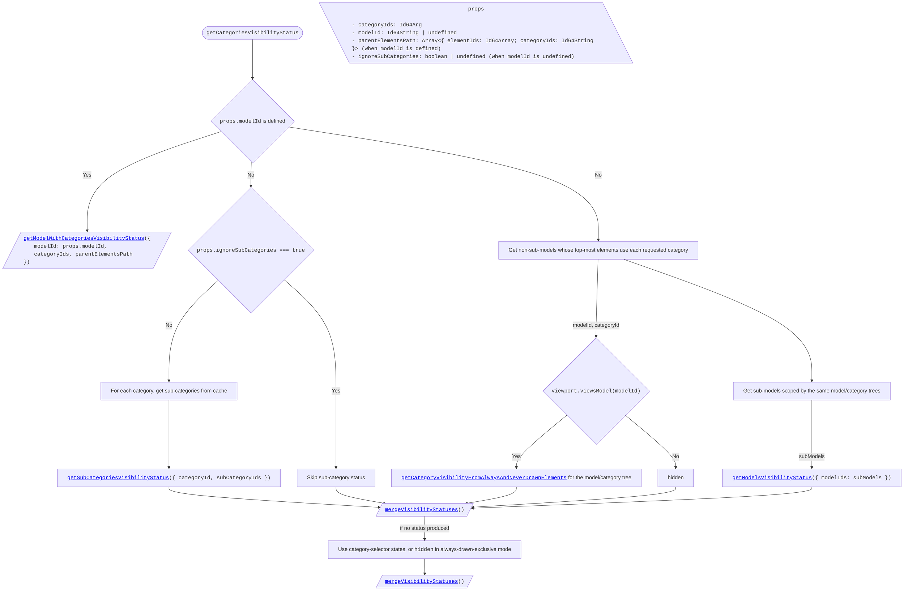
```mermaid
---
config:
  flowchart:
    wrappingWidth: 750
    useMaxWidth: false
---

flowchart TD

  %% Start
  TITLE(["<span style='font-family: monospace;'>getCategoriesVisibilityStatus</span>"]) --> A{"<span style='font-family: monospace;'>props.modelId</span> is defined"}

  PROPS[\"
    <span style='font-family: monospace;'>props</span>
    <span style='display: block; text-align: left; font-family: monospace;'>- categoryIds: Id64Arg<br/>- modelId: Id64String | undefined<br/>- parentElementsPath: Array&lt;{ elementIds: Id64Array; categoryIds: Id64String }&gt; (when modelId is defined)<br/>- ignoreSubCategories: boolean | undefined (when modelId is undefined)</span>
  "\]

  A -- Yes --> B[/"<div style='text-align: left; font-family: monospace;'><a href='#getmodelwithcategoriesvisibilitystatus'>getModelWithCategoriesVisibilityStatus</a>({
    <span style='padding-left: 2rem;'>modelId: props.modelId,</span>
    <span style='padding-left: 2rem;'>categoryIds, parentElementsPath</span>
    })</div>"/]

  A -- No --> C{"<span style='font-family: monospace;'>props.ignoreSubCategories === true</span>"}
  C -- No --> C1["For each category, get sub-categories from cache"]
  C1 --> C2["<span style='font-family: monospace;'><a href='#getsubcategoriesvisibilitystatus'>getSubCategoriesVisibilityStatus</a>({ categoryId, subCategoryIds })</span>"]
  C -- Yes --> C3[Skip sub-category status]

  A -- No --> D["Get non-sub-models whose top-most elements use each requested category"]
  D -- "modelId, categoryId" --> D1{"<span style='font-family: monospace;'>viewport.viewsModel(modelId)</span>"}
  D1 -- Yes --> D2["<span style='font-family: monospace;'><a href='#getcategoryvisibilityfromalwaysandneverdrawnelements'>getCategoryVisibilityFromAlwaysAndNeverDrawnElements</a></span> for the model/category tree"]
  D1 -- No --> D3[hidden]
  D --> E["Get sub-models scoped by the same model/category trees"]
  E -- subModels --> E1["<span style='font-family: monospace;'><a href='#getmodelsvisibilitystatus'>getModelsVisibilityStatus</a>({ modelIds: subModels })</span>"]

  C2 --> M[/"<span style='font-family: monospace;'><a href='#mergevisibilitystatuses'>mergeVisibilityStatuses</a>()</span>"/]
  C3 --> M
  D2 --> M
  D3 --> M
  E1 --> M
  M -- "if no status produced" --> F1["Use category-selector states, or <span style='font-family: monospace;'>hidden</span> in always-drawn-exclusive mode"]
  F1 --> N[/"<span style='font-family: monospace;'><a href='#mergevisibilitystatuses'>mergeVisibilityStatuses</a>()</span>"/]
```

### getModelWithCategoriesVisibilityStatus

This private path resolves multiple categories under one model and one hierarchy path. If the model is visible, each category uses [getCategoryVisibilityFromAlwaysAndNeverDrawnElements](#getcategoryvisibilityfromalwaysandneverdrawnelements). If the model is hidden, the direct model/category part is `hidden`. Sub-models scoped by the same model, categories, and parent path are always resolved recursively and merged with the direct part.

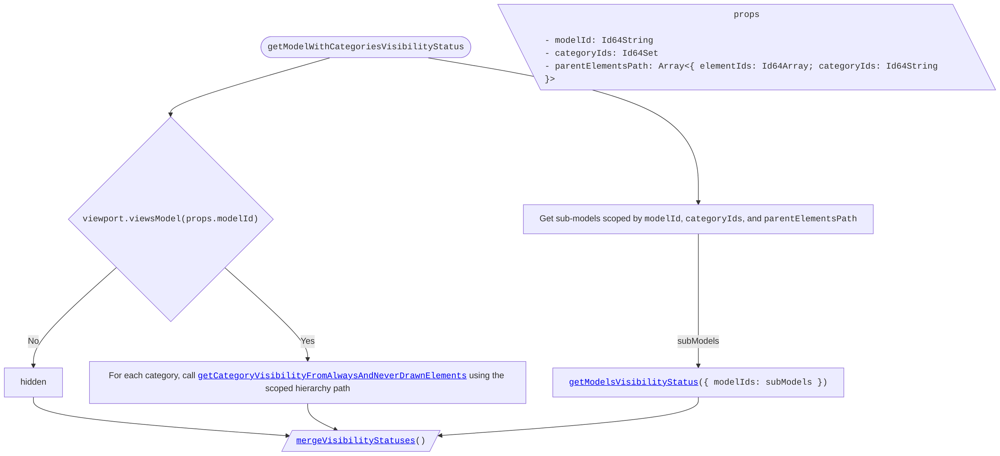
```mermaid
---
config:
  flowchart:
    wrappingWidth: 750
    useMaxWidth: false
---

flowchart TD
  %% Start
  TITLE(["<span style='font-family: monospace;'>getModelWithCategoriesVisibilityStatus</span>"]) --> A{"<span style='font-family: monospace;'>viewport.viewsModel(props.modelId)</span>"}
  TITLE --> B["Get sub-models scoped by <span style='font-family: monospace;'>modelId</span>, <span style='font-family: monospace;'>categoryIds</span>, and <span style='font-family: monospace;'>parentElementsPath</span>"]

  PROPS[\"
    <span style='font-family: monospace;'>props</span>
    <span style='display: block; text-align: left; font-family: monospace;'>- modelId: Id64String<br/>- categoryIds: Id64Set<br/>- parentElementsPath: Array&lt;{ elementIds: Id64Array; categoryIds: Id64String }&gt;</span>
  "\]

  A -- No --> A1[hidden]
  A -- Yes --> A2["For each category, call <span style='font-family: monospace;'><a href='#getcategoryvisibilityfromalwaysandneverdrawnelements'>getCategoryVisibilityFromAlwaysAndNeverDrawnElements</a></span> using the scoped hierarchy path"]
  B -- subModels --> B1["<span style='font-family: monospace;'><a href='#getmodelsvisibilitystatus'>getModelsVisibilityStatus</a>({ modelIds: subModels })</span>"]

  A1 --> M[/"<span style='font-family: monospace;'><a href='#mergevisibilitystatuses'>mergeVisibilityStatuses</a>()</span>"/]
  A2 --> M
  B1 --> M
```

### getElementsVisibilityStatus

Element status merges up to three parts:

1. **Own status**: if the model is hidden, the elements are hidden. Otherwise, use the direct model/category default and count the requested element IDs in its opposite always/never-drawn set.
2. **Descendant status**: if the model is hidden, contribute `hidden` without querying descendant counts. Otherwise, retrieve counts grouped by actual category and resolve visible-category groups against `neverDrawn` and hidden-category groups against `alwaysDrawn`.
3. **Sub-model status**: resolve sub-models represented by, or nested below, the requested elements.

`computeOnlyOwnStatus: true` skips descendant and sub-model work. A predicate form skips that work only for selected element IDs, which is used for known leaves and non-search-target nodes whose search-path children are handled separately. In the diagram, an _eligible_ ID is one the predicate does not skip (or any ID when no predicate is supplied).

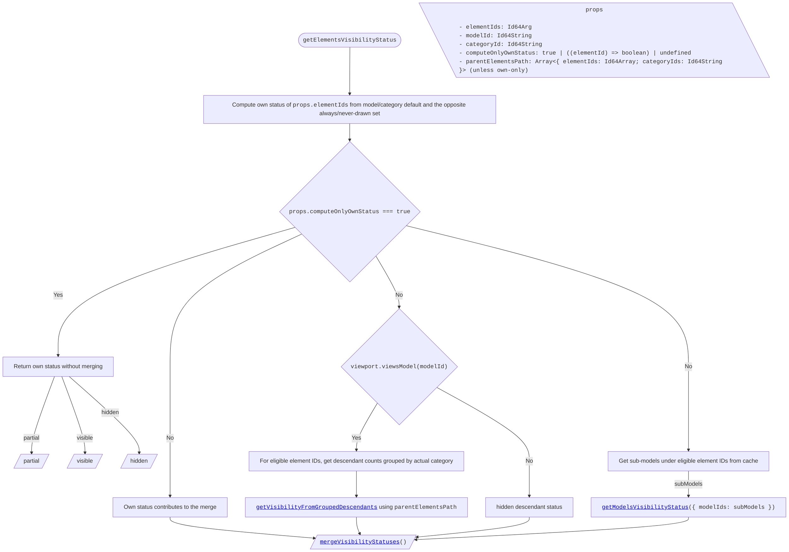
```mermaid
---
config:
  flowchart:
    wrappingWidth: 750
    useMaxWidth: false
---

flowchart TD
  RESULT_Partial[/partial/]
  RESULT_Visible[/visible/]
  RESULT_Hidden[/hidden/]

  %% Start
  TITLE(["<span style='font-family: monospace;'>getElementsVisibilityStatus</span>"]) --> A["Compute own status of <span style='font-family: monospace;'>props.elementIds</span> from model/category default and the opposite always/never-drawn set"]
  A --> B{"<span style='font-family: monospace;'>props.computeOnlyOwnStatus === true</span>"}

  PROPS[\"
    <span style='font-family: monospace;'>props</span>
    <span style='display: block; text-align: left; font-family: monospace;'>- elementIds: Id64Arg<br/>- modelId: Id64String<br/>- categoryId: Id64String<br/>- computeOnlyOwnStatus: true | ((elementId) => boolean) | undefined<br/>- parentElementsPath: Array&lt;{ elementIds: Id64Array; categoryIds: Id64String }&gt; (unless own-only)</span>
  "\]

  B -- Yes --> E["Return own status without merging"]
  E -- partial --> RESULT_Partial
  E -- visible --> RESULT_Visible
  E -- hidden --> RESULT_Hidden
  B -- No --> C0{"<span style='font-family: monospace;'>viewport.viewsModel(modelId)</span>"}
  C0 -- No --> C2[hidden descendant status]
  C0 -- Yes --> C["For eligible element IDs, get descendant counts grouped by actual category"]
  C --> C1["<span style='font-family: monospace;'><a href='#grouped-descendant-visibility'>getVisibilityFromGroupedDescendants</a></span> using <span style='font-family: monospace;'>parentElementsPath</span>"]
  B -- No --> D["Get sub-models under eligible element IDs from cache"]
  D -- subModels --> D1["<span style='font-family: monospace;'><a href='#getmodelsvisibilitystatus'>getModelsVisibilityStatus</a>({ modelIds: subModels })</span>"]

  B -- No --> A2["Own status contributes to the merge"]
  A2 --> M[/"<span style='font-family: monospace;'><a href='#mergevisibilitystatuses'>mergeVisibilityStatuses</a>()</span>"/]
  C1 --> M
  C2 --> M
  D1 --> M
```

### getCategoryVisibilityFromAlwaysAndNeverDrawnElements

This helper resolves one category under a model and hierarchy path. When the category has no parent elements and its opposite always/never-drawn set is empty, the direct model/category status is final and descendant counts are not queried. Otherwise, descendant counts are grouped by actual category and delegated to [grouped descendant visibility](#grouped-descendant-visibility).

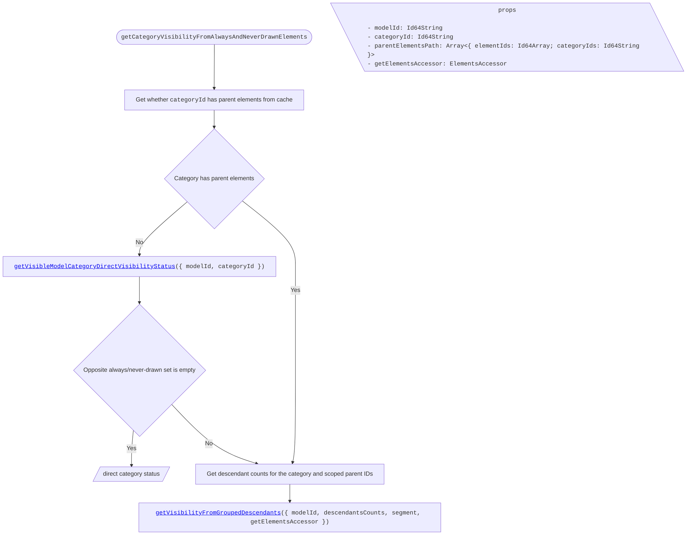
```mermaid
---
config:
  flowchart:
    wrappingWidth: 750
    useMaxWidth: false
---

flowchart TD
  RESULT_Direct[/direct category status/]

  %% Start
  TITLE(["<span style='font-family: monospace;'>getCategoryVisibilityFromAlwaysAndNeverDrawnElements</span>"]) --> A["Get whether <span style='font-family: monospace;'>categoryId</span> has parent elements from cache"]

  PROPS[\"
    <span style='font-family: monospace;'>props</span>
    <span style='display: block; text-align: left; font-family: monospace;'>- modelId: Id64String<br/>- categoryId: Id64String<br/>- parentElementsPath: Array&lt;{ elementIds: Id64Array; categoryIds: Id64String }&gt;<br/>- getElementsAccessor: ElementsAccessor</span>
  "\]

  A --> B{"Category has parent elements"}
  B -- No --> C["<span style='font-family: monospace;'><a href='#getvisiblemodelcategorydirectvisibilitystatus'>getVisibleModelCategoryDirectVisibilityStatus</a>({ modelId, categoryId })</span>"]
  C --> D{"Opposite always/never-drawn set is empty"}
  D -- Yes --> RESULT_Direct
  D -- No --> E
  B -- Yes --> E["Get descendant counts for the category and scoped parent IDs"]
  E --> F["<span style='font-family: monospace;'><a href='#grouped-descendant-visibility'>getVisibilityFromGroupedDescendants</a>({ modelId, descendantsCounts, segment, getElementsAccessor })</span>"]
```

### Grouped descendant visibility

`getVisibilityFromGroupedDescendants` is the shared descendant-count core for model categories, categories under a model, and element descendants:

1. Descendant counts are grouped by each descendant's actual category.
2. [getVisibleModelCategoryDirectVisibilityStatus](#getvisiblemodelcategorydirectvisibilitystatus) splits those categories into directly visible and directly hidden groups.
3. For directly visible groups, path-scoped `neverDrawn` descendants are counted. For directly hidden groups, path-scoped `alwaysDrawn` descendants are counted.
4. Each nonempty group contributes one status to the caller. The caller combines those statuses with its other visibility contributions.

For one group with default status $d$, total count $t$, and opposite-set count $o$:

- $t = 0$ or $o = 0$: return $d$.
- $o = t$: return the inverse of $d$.
- $0 < o < t$: return `partial`.

The cache accessor is scoped by model and `parentElementsPath`, preventing an always/never-drawn element in another hierarchy branch from affecting this status.

`segment` identifies the category level and, optionally, the element level to read from the scoped cache. `getElementsAccessor` selects the `alwaysDrawn` or `neverDrawn` cache and provides `getAlwaysOrNeverDrawnElements(segment?)`, which returns matching element IDs grouped by category. Their shapes:

```ts
interface ElementPathSegment {
  categoryIds: Id64Arg; // category node(s) to descend into
  elementIds?: Id64Arg; // element node(s) below the category; omit to stop at the category level
}

type ElementsAccessor = (setType: "always" | "never") => Observable<{
  getAlwaysOrNeverDrawnElements(segment?: ElementPathSegment): Map<CategoryId, Array<ElementId>>;
}>;
```

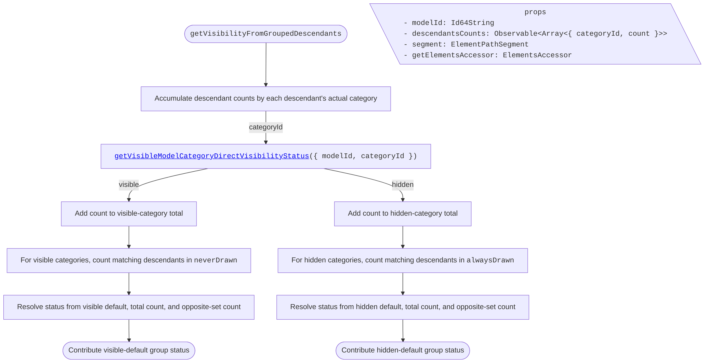
```mermaid
---
config:
  flowchart:
    wrappingWidth: 750
    useMaxWidth: false
---

flowchart TD
  RESULT_VisibleGroup([Contribute visible-default group status])
  RESULT_HiddenGroup([Contribute hidden-default group status])

  %% Start
  TITLE(["<span style='font-family: monospace;'>getVisibilityFromGroupedDescendants</span>"]) --> A["Accumulate descendant counts by each descendant's actual category"]

  PROPS[\"
    <span style='font-family: monospace;'>props</span>
    <span style='display: block; text-align: left; font-family: monospace;'>- modelId: Id64String<br/>- descendantsCounts: Observable&lt;Array&lt;{ categoryId, count }&gt;&gt;<br/>- segment: ElementPathSegment<br/>- getElementsAccessor: ElementsAccessor</span>
  "\]

  A -- categoryId --> B["<span style='font-family: monospace;'><a href='#getvisiblemodelcategorydirectvisibilitystatus'>getVisibleModelCategoryDirectVisibilityStatus</a>({ modelId, categoryId })</span>"]
  B -- visible --> C["Add count to visible-category total"]
  B -- hidden --> D["Add count to hidden-category total"]
  C --> E["For visible categories, count matching descendants in <span style='font-family: monospace;'>neverDrawn</span>"]
  D --> F["For hidden categories, count matching descendants in <span style='font-family: monospace;'>alwaysDrawn</span>"]
  E --> G["Resolve status from visible default, total count, and opposite-set count"]
  F --> H["Resolve status from hidden default, total count, and opposite-set count"]
  G --> RESULT_VisibleGroup
  H --> RESULT_HiddenGroup
```

### getVisibleModelCategoryDirectVisibilityStatus

This helper assumes the model selector is on and returns a non-partial category default. Always-drawn-exclusive mode takes priority over per-model overrides and the category selector.

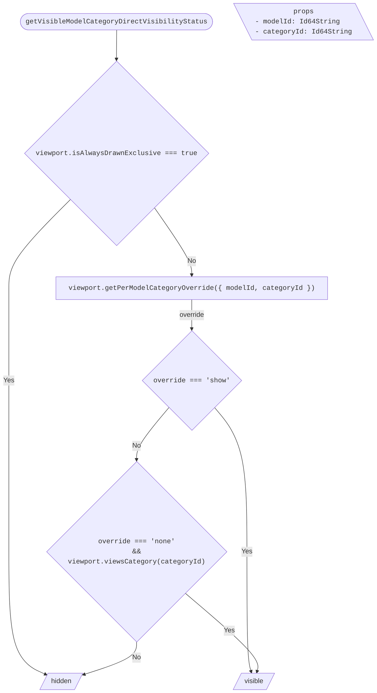
```mermaid
---
config:
  flowchart:
    wrappingWidth: 750
    useMaxWidth: false
---

flowchart TD
  RESULT_Visible[/visible/]
  RESULT_Hidden[/hidden/]

  %% Start
  TITLE(["<span style='font-family: monospace;'>getVisibleModelCategoryDirectVisibilityStatus</span>"]) --> A{"<span style='font-family: monospace;'>viewport.isAlwaysDrawnExclusive === true</span>"}

  PROPS[\"
    <span style='font-family: monospace;'>props</span>
    <span style='display: block; text-align: left; font-family: monospace;'>- modelId: Id64String<br/>- categoryId: Id64String</span>
  "\]

  A -- Yes --> RESULT_Hidden
  A -- No --> B["<span style='font-family: monospace;'>viewport.getPerModelCategoryOverride({ modelId, categoryId })</span>"]
  B -- override --> C{"<span style='font-family: monospace;'>override === 'show'</span>"}
  C -- Yes --> RESULT_Visible
  C -- No --> D{"<span style='font-family: monospace;'>override === 'none'</span><br/>&&<br/><span style='font-family: monospace;'>viewport.viewsCategory(categoryId)</span>"}
  D -- Yes --> RESULT_Visible
  D -- No --> RESULT_Hidden
```

## Changing visibility status

For ordinary tree-node changes, tree-specific handlers call [removeAlwaysDrawnExclusive](#removealwaysdrawnexclusive) first when exclusive mode is active. Search-result group changes call shared helpers directly and may preserve exclusive mode, so shared helpers handle both modes.

### removeAlwaysDrawnExclusive

Leaving exclusive mode must preserve the current visible set. The helper turns off all categories used by elements, clears `neverDrawn` and per-model category overrides, and writes the existing `alwaysDrawn` set back with exclusivity disabled. The requested change is applied afterward.

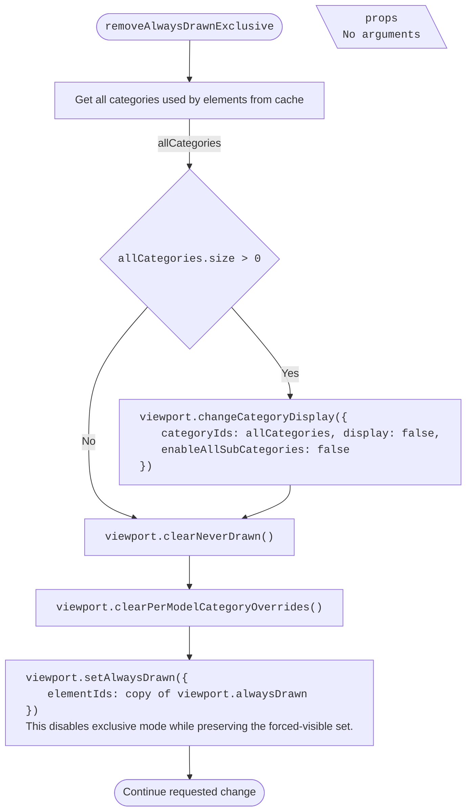
```mermaid
---
config:
  flowchart:
    wrappingWidth: 750
    useMaxWidth: false
---

flowchart TD
  RESULT_Done([Continue requested change])

  %% Start
  TITLE(["<span style='font-family: monospace;'>removeAlwaysDrawnExclusive</span>"]) --> A["Get all categories used by elements from cache"]

  PROPS[\"
    <span style='font-family: monospace;'>props</span>
    <span style='display: block; text-align: left; font-family: monospace;'>No arguments</span>
  "\]

  A -- allCategories --> B{"<span style='font-family: monospace;'>allCategories.size > 0</span>"}
  B -- Yes --> B1["<div style='text-align: left; font-family: monospace;'>viewport.changeCategoryDisplay({
    <span style='padding-left: 2rem;'>categoryIds: allCategories, display: false,</span>
    <span style='padding-left: 2rem;'>enableAllSubCategories: false</span>
    })</div>"]
  B -- No --> C
  B1 --> C["<span style='font-family: monospace;'>viewport.clearNeverDrawn()</span>"]
  C --> D["<span style='font-family: monospace;'>viewport.clearPerModelCategoryOverrides()</span>"]
  D --> E["<div style='text-align: left; font-family: monospace;'>viewport.setAlwaysDrawn({
    <span style='padding-left: 2rem;'>elementIds: copy of viewport.alwaysDrawn</span>
    })</div><span style='display: block;'>This disables exclusive mode while preserving the forced-visible set.</span>"]
  E --> RESULT_Done
```

### changeModelsVisibilityStatus

The helper first clears per-model category overrides for the requested models.

- Turning models off updates the model selector and recursively turns off their sub-models.
- Turning models on updates the model selector, retrieves each model's top-most element categories, and delegates to [changeCategoriesVisibilityStatus](#changecategoriesvisibilitystatus) with that model and an empty parent path. This restores category trees and related sub-models consistently.

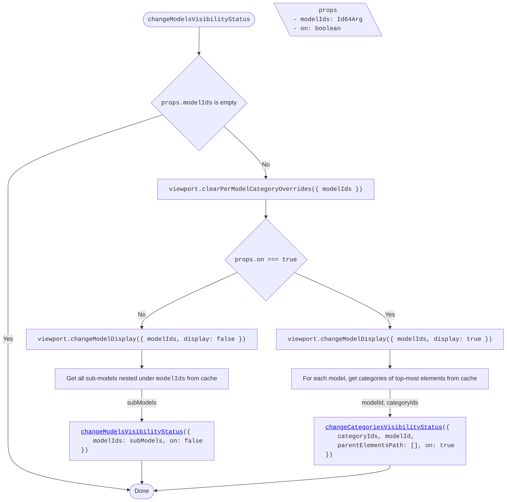
```mermaid
---
config:
  flowchart:
    wrappingWidth: 750
    useMaxWidth: false
---

flowchart TD
  RESULT_Done([Done])

  %% Start
  TITLE(["<span style='font-family: monospace;'>changeModelsVisibilityStatus</span>"]) --> A{"<span style='font-family: monospace;'>props.modelIds</span> is empty"}

  PROPS[\"
    <span style='font-family: monospace;'>props</span>
    <span style='display: block; text-align: left; font-family: monospace;'>- modelIds: Id64Arg<br/>- on: boolean</span>
  "\]

  A -- Yes --> RESULT_Done
  A -- No --> B["<span style='font-family: monospace;'>viewport.clearPerModelCategoryOverrides({ modelIds })</span>"]
  B --> C{"<span style='font-family: monospace;'>props.on === true</span>"}

  C -- No --> D["<span style='font-family: monospace;'>viewport.changeModelDisplay({ modelIds, display: false })</span>"]
  D --> D1["Get all sub-models nested under <span style='font-family: monospace;'>modelIds</span> from cache"]
  D1 -- subModels --> D2["<div style='text-align: left; font-family: monospace;'><a href='#changemodelsvisibilitystatus'>changeModelsVisibilityStatus</a>({
    <span style='padding-left: 2rem;'>modelIds: subModels, on: false</span>
    })</div>"]
  D2 --> RESULT_Done

  C -- Yes --> E["<span style='font-family: monospace;'>viewport.changeModelDisplay({ modelIds, display: true })</span>"]
  E --> E1["For each model, get categories of top-most elements from cache"]
  E1 -- "modelId, categoryIds" --> E2["<div style='text-align: left; font-family: monospace;'><a href='#changecategoriesvisibilitystatus'>changeCategoriesVisibilityStatus</a>({
    <span style='padding-left: 2rem;'>categoryIds, modelId,</span>
    <span style='padding-left: 2rem;'>parentElementsPath: [], on: true</span>
    })</div>"]
  E2 --> RESULT_Done
```

### changeCategoriesVisibilityStatus

With `modelId`, this delegates to [changeCategoriesUnderModelVisibilityStatus](#changecategoriesundermodelvisibilitystatus). Without `modelId`, it updates the category selector without automatically enabling sub-categories, then groups the requested top-most model/category trees by model.

The grouped model/category trees feed independent operations that clear per-model overrides, clear path-scoped always/never-drawn entries, and recursively change sub-models. When turning on, hidden related models are also prepared without exposing other categories. Descendants in different actual categories are reconciled only after model preparation completes and only when the model is visible. Enabling requested sub-categories is a separate operation that runs when turning on.

During descendant reconciliation, categories whose defaults already match `on` have stale opposite-set entries removed. Descendants in categories whose defaults do not match `on` are fetched from `ChildElementsCache` and added to the forcing set.

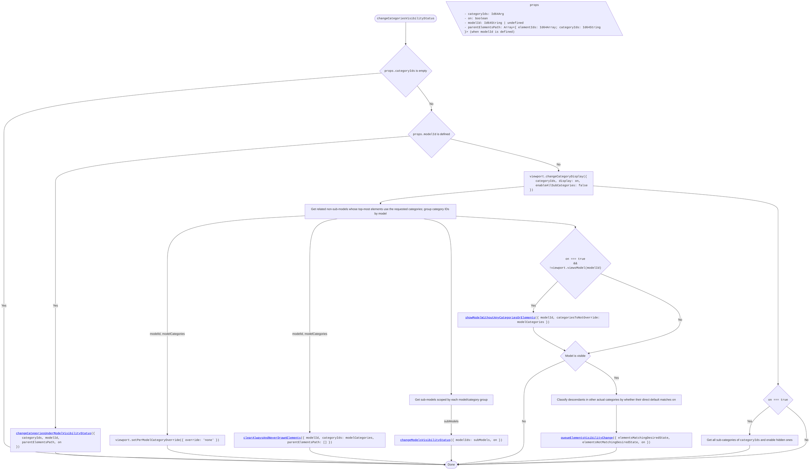
```mermaid
---
config:
  flowchart:
    wrappingWidth: 750
    useMaxWidth: false
---

flowchart TD
  RESULT_Done([Done])

  %% Start
  TITLE(["<span style='font-family: monospace;'>changeCategoriesVisibilityStatus</span>"]) --> A{"<span style='font-family: monospace;'>props.categoryIds</span> is empty"}

  PROPS[\"
    <span style='font-family: monospace;'>props</span>
    <span style='display: block; text-align: left; font-family: monospace;'>- categoryIds: Id64Arg<br/>- on: boolean<br/>- modelId: Id64String | undefined<br/>- parentElementsPath: Array&lt;{ elementIds: Id64Array; categoryIds: Id64String }&gt; (when modelId is defined)</span>
  "\]

  A -- Yes --> RESULT_Done
  A -- No --> B{"<span style='font-family: monospace;'>props.modelId</span> is defined"}
  B -- Yes --> B1["<div style='text-align: left; font-family: monospace;'><a href='#changecategoriesundermodelvisibilitystatus'>changeCategoriesUnderModelVisibilityStatus</a>({
    <span style='padding-left: 2rem;'>categoryIds, modelId,</span>
    <span style='padding-left: 2rem;'>parentElementsPath, on</span>
    })</div>"]
  B1 --> RESULT_Done

  B -- No --> C["<div style='text-align: left; font-family: monospace;'>viewport.changeCategoryDisplay({
    <span style='padding-left: 2rem;'>categoryIds, display: on,</span>
    <span style='padding-left: 2rem;'>enableAllSubCategories: false</span>
    })</div>"]
  C --> D["Get related non-sub-models whose top-most elements use the requested categories; group category IDs by model"]
  D -- "modelId, modelCategories" --> E["<span style='font-family: monospace;'>viewport.setPerModelCategoryOverride({ override: 'none' })</span>"]
  D -- "modelId, modelCategories" --> F["<span style='font-family: monospace;'><a href='#clearalwaysandneverdrawnelements'>clearAlwaysAndNeverDrawnElements</a>({ modelId, categoryIds: modelCategories, parentElementsPath: [] })</span>"]
  D --> G["Get sub-models scoped by each model/category group"]
  G -- subModels --> G1["<span style='font-family: monospace;'><a href='#changemodelsvisibilitystatus'>changeModelsVisibilityStatus</a>({ modelIds: subModels, on })</span>"]

  D --> H{"<span style='font-family: monospace;'>on === true</span><br/>&&<br/><span style='font-family: monospace;'>!viewport.viewsModel(modelId)</span>"}
  H -- Yes --> H1["<span style='font-family: monospace;'><a href='#showmodelwithoutanycategoriesorelements'>showModelWithoutAnyCategoriesOrElements</a>({ modelId, categoriesToNotOverride: modelCategories })</span>"]
  H -- No --> H2{"Model is visible"}
  H1 --> H2
  H2 -- No --> RESULT_Done
  H2 -- Yes --> I["Classify descendants in other actual categories by whether their direct default matches <span style='font-family: monospace;'>on</span>"]
  I --> I1["<span style='font-family: monospace;'><a href='#queueelementsvisibilitychange'>queueElementsVisibilityChange</a>({ elementsMatchingDesiredState, elementsNotMatchingDesiredState, on })</span>"]

  C --> J{"<span style='font-family: monospace;'>on === true</span>"}
  J -- Yes --> J1["Get all sub-categories of <span style='font-family: monospace;'>categoryIds</span> and enable hidden ones"]
  J -- No --> RESULT_Done
  E --> RESULT_Done
  F --> RESULT_Done
  G1 --> RESULT_Done
  I1 --> RESULT_Done
  J1 --> RESULT_Done
```

### changeCategoriesUnderModelVisibilityStatus

This path immediately sets `show` or `hide` per-model overrides for the requested categories. In parallel it clears scoped always/never-drawn entries and recursively changes scoped sub-models. When turning on a hidden model, model preparation finishes before descendants in other categories are reconciled. Descendant reconciliation is skipped if the model remains hidden because always/never-drawn changes would have no effect.

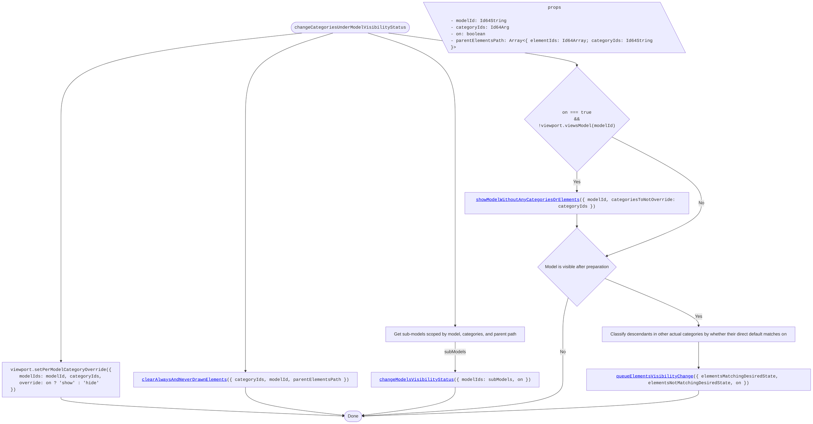
```mermaid
---
config:
  flowchart:
    wrappingWidth: 750
    useMaxWidth: false
---

flowchart TD
  RESULT_Done([Done])

  %% Start
  TITLE(["<span style='font-family: monospace;'>changeCategoriesUnderModelVisibilityStatus</span>"]) --> A["<div style='text-align: left; font-family: monospace;'>viewport.setPerModelCategoryOverride({
    <span style='padding-left: 2rem;'>modelIds: modelId, categoryIds,</span>
    <span style='padding-left: 2rem;'>override: on ? 'show' : 'hide'</span>
    })</div>"]

  PROPS[\"
    <span style='font-family: monospace;'>props</span>
    <span style='display: block; text-align: left; font-family: monospace;'>- modelId: Id64String<br/>- categoryIds: Id64Arg<br/>- on: boolean<br/>- parentElementsPath: Array&lt;{ elementIds: Id64Array; categoryIds: Id64String }&gt;</span>
  "\]

  TITLE --> B["<span style='font-family: monospace;'><a href='#clearalwaysandneverdrawnelements'>clearAlwaysAndNeverDrawnElements</a>({ categoryIds, modelId, parentElementsPath })</span>"]
  TITLE --> C["Get sub-models scoped by model, categories, and parent path"]
  C -- subModels --> C1["<span style='font-family: monospace;'><a href='#changemodelsvisibilitystatus'>changeModelsVisibilityStatus</a>({ modelIds: subModels, on })</span>"]

  TITLE --> D{"<span style='font-family: monospace;'>on === true</span><br/>&&<br/><span style='font-family: monospace;'>!viewport.viewsModel(modelId)</span>"}
  D -- Yes --> D1["<span style='font-family: monospace;'><a href='#showmodelwithoutanycategoriesorelements'>showModelWithoutAnyCategoriesOrElements</a>({ modelId, categoriesToNotOverride: categoryIds })</span>"]
  D -- No --> E
  D1 --> E{"Model is visible after preparation"}
  E -- No --> RESULT_Done
  E -- Yes --> F["Classify descendants in other actual categories by whether their direct default matches <span style='font-family: monospace;'>on</span>"]
  F --> F1["<span style='font-family: monospace;'><a href='#queueelementsvisibilitychange'>queueElementsVisibilityChange</a>({ elementsMatchingDesiredState, elementsNotMatchingDesiredState, on })</span>"]

  A --> RESULT_Done
  B --> RESULT_Done
  C1 --> RESULT_Done
  F1 --> RESULT_Done
```

### changeElementsVisibilityStatus

When turning on elements in a hidden model, [showModelWithoutAnyCategoriesOrElements](#showmodelwithoutanycategoriesorelements) prepares the model first. If the model is still hidden, no element-set changes are needed.

For a visible model, the requested elements and their descendants are divided by whether their direct category default already matches `on`:

- Matching IDs only need stale forcing entries removed.
- Non-matching IDs must be added to `alwaysDrawn` when turning on or `neverDrawn` when turning off.

Descendants are discovered from counts grouped by actual category. Child IDs are fetched only for non-matching category groups. `ignoreDescendants` may skip descendant handling globally or for selected IDs. Sub-models below the requested elements are changed recursively unless `ignoreDescendants` is `true`.

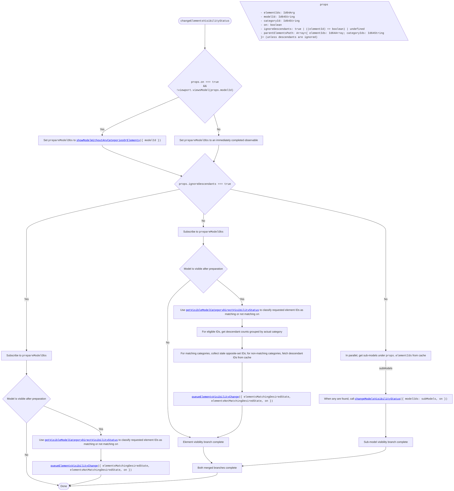
```mermaid
---
config:
  flowchart:
    wrappingWidth: 750
    useMaxWidth: false
---

flowchart TD
  RESULT_Done([Done])

  %% Start
  TITLE(["<span style='font-family: monospace;'>changeElementsVisibilityStatus</span>"]) --> A{"<span style='font-family: monospace;'>props.on === true</span><br/>&&<br/><span style='font-family: monospace;'>!viewport.viewsModel(props.modelId)</span>"}

  PROPS[\"
    <span style='font-family: monospace;'>props</span>
    <span style='display: block; text-align: left; font-family: monospace;'>- elementIds: Id64Arg<br/>- modelId: Id64String<br/>- categoryId: Id64String<br/>- on: boolean<br/>- ignoreDescendants: true | ((elementId) => boolean) | undefined<br/>- parentElementsPath: Array&lt;{ elementIds: Id64Array; categoryIds: Id64String }&gt; (unless descendants are ignored)</span>
  "\]

  A -- Yes --> A1["Set <span style='font-family: monospace;'>prepareModelObs</span> to <span style='font-family: monospace;'><a href='#showmodelwithoutanycategoriesorelements'>showModelWithoutAnyCategoriesOrElements</a>({ modelId })</span>"]
  A -- No --> A2["Set <span style='font-family: monospace;'>prepareModelObs</span> to an immediately completed observable"]
  A1 --> D{"<span style='font-family: monospace;'>props.ignoreDescendants === true</span>"}
  A2 --> D

  D -- Yes --> P1["Subscribe to <span style='font-family: monospace;'>prepareModelObs</span>"]
  P1 --> B1{"Model is visible after preparation"}
  B1 -- No --> RESULT_Done
  B1 -- Yes --> C1["Use <span style='font-family: monospace;'><a href='#getvisiblemodelcategorydirectvisibilitystatus'>getVisibleModelCategoryDirectVisibilityStatus</a></span> to classify requested element IDs as matching or not matching <span style='font-family: monospace;'>on</span>"]
  C1 --> F1["<span style='font-family: monospace;'><a href='#queueelementsvisibilitychange'>queueElementsVisibilityChange</a>({ elementsMatchingDesiredState, elementsNotMatchingDesiredState, on })</span>"]
  F1 --> RESULT_Done

  D -- No --> P2["Subscribe to <span style='font-family: monospace;'>prepareModelObs</span>"]
  P2 --> B2{"Model is visible after preparation"}
  B2 -- No --> H1["Element visibility branch complete"]
  B2 -- Yes --> C2["Use <span style='font-family: monospace;'><a href='#getvisiblemodelcategorydirectvisibilitystatus'>getVisibleModelCategoryDirectVisibilityStatus</a></span> to classify requested element IDs as matching or not matching <span style='font-family: monospace;'>on</span>"]
  C2 --> E["For eligible IDs, get descendant counts grouped by actual category"]
  E --> E1["For matching categories, collect stale opposite-set IDs; for non-matching categories, fetch descendant IDs from cache"]
  E1 --> F2["<span style='font-family: monospace;'><a href='#queueelementsvisibilitychange'>queueElementsVisibilityChange</a>({ elementsMatchingDesiredState, elementsNotMatchingDesiredState, on })</span>"]
  F2 --> H1

  D -- No --> G["In parallel, get sub-models under <span style='font-family: monospace;'>props.elementIds</span> from cache"]
  G -- subModels --> G1["When any are found, call <span style='font-family: monospace;'><a href='#changemodelsvisibilitystatus'>changeModelsVisibilityStatus</a>({ modelIds: subModels, on })</span>"]
  G1 --> H2["Sub-model visibility branch complete"]
  H1 --> I["Both merged branches complete"]
  H2 --> I
  I --> RESULT_Done
```

### showModelWithoutAnyCategoriesOrElements

This helper enables a model while preserving its current element visibility. It is used before showing one category or element in a hidden model.

1. Fetch all model categories and the model's always-drawn elements.
2. Return if another concurrent operation already enabled the model.
3. Remove the model's elements from `alwaysDrawn`, then enable the model.
4. Skip categories in `categoriesToNotOverride`.
5. For every remaining category, set `hide` when its category selector is on; set `none` when the selector is off and already hides it.

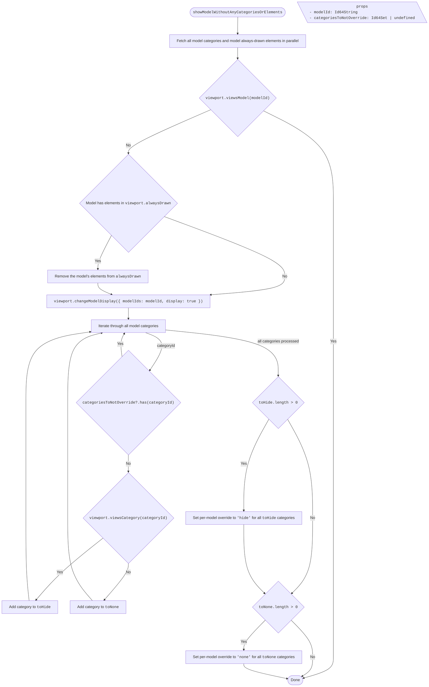
```mermaid
---
config:
  flowchart:
    wrappingWidth: 750
    useMaxWidth: false
---

flowchart TD
  RESULT_Done([Done])

  %% Start
  TITLE(["<span style='font-family: monospace;'>showModelWithoutAnyCategoriesOrElements</span>"]) --> A["Fetch all model categories and model always-drawn elements in parallel"]

  PROPS[\"
    <span style='font-family: monospace;'>props</span>
    <span style='display: block; text-align: left; font-family: monospace;'>- modelId: Id64String<br/>- categoriesToNotOverride: Id64Set | undefined</span>
  "\]

  A --> B{"<span style='font-family: monospace;'>viewport.viewsModel(modelId)</span>"}
  B -- Yes --> RESULT_Done
  B -- No --> C{"Model has elements in <span style='font-family: monospace;'>viewport.alwaysDrawn</span>"}
  C -- Yes --> C1["Remove the model's elements from <span style='font-family: monospace;'>alwaysDrawn</span>"]
  C -- No --> D
  C1 --> D["<span style='font-family: monospace;'>viewport.changeModelDisplay({ modelIds: modelId, display: true })</span>"]
  D --> E["Iterate through all model categories"]
  E -- categoryId --> F{"<span style='font-family: monospace;'>categoriesToNotOverride?.has(categoryId)</span>"}
  F -- Yes --> E
  F -- No --> G{"<span style='font-family: monospace;'>viewport.viewsCategory(categoryId)</span>"}
  G -- Yes --> G1["Add category to <span style='font-family: monospace;'>toHide</span>"]
  G -- No --> G2["Add category to <span style='font-family: monospace;'>toNone</span>"]
  G1 --> E
  G2 --> E
  E -- "all categories processed" --> H{"<span style='font-family: monospace;'>toHide.length > 0</span>"}
  H -- Yes --> H1["Set per-model override to <span style='font-family: monospace;'>'hide'</span> for all <span style='font-family: monospace;'>toHide</span> categories"]
  H -- No --> I
  H1 --> I{"<span style='font-family: monospace;'>toNone.length > 0</span>"}
  I -- Yes --> I1["Set per-model override to <span style='font-family: monospace;'>'none'</span> for all <span style='font-family: monospace;'>toNone</span> categories"]
  I -- No --> RESULT_Done
  I1 --> RESULT_Done
```

### clearAlwaysAndNeverDrawnElements

This helper resolves always- and never-drawn elements for `modelId`, `categoryIds`, and `parentElementsPath`, then removes only those scoped IDs from the viewport sets. Elements in the same model and category but another hierarchy branch are preserved.

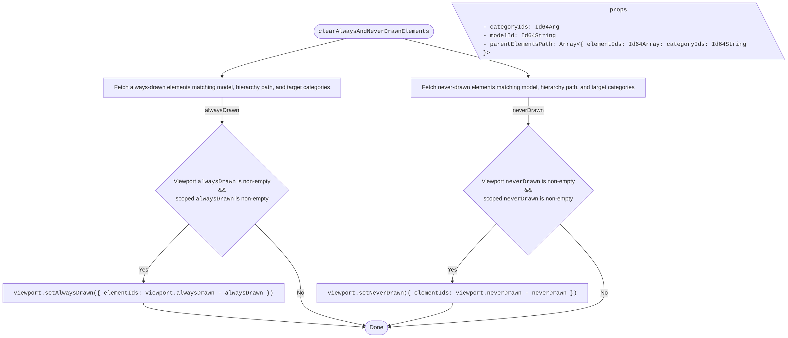
```mermaid
---
config:
  flowchart:
    wrappingWidth: 750
    useMaxWidth: false
---

flowchart TD
  RESULT_Done([Done])

  %% Start
  TITLE(["<span style='font-family: monospace;'>clearAlwaysAndNeverDrawnElements</span>"]) --> A["Fetch always-drawn elements matching model, hierarchy path, and target categories"]
  TITLE --> B["Fetch never-drawn elements matching model, hierarchy path, and target categories"]

  PROPS[\"
    <span style='font-family: monospace;'>props</span>
    <span style='display: block; text-align: left; font-family: monospace;'>- categoryIds: Id64Arg<br/>- modelId: Id64String<br/>- parentElementsPath: Array&lt;{ elementIds: Id64Array; categoryIds: Id64String }&gt;</span>
  "\]

  A -- alwaysDrawn --> C{"Viewport <span style='font-family: monospace;'>alwaysDrawn</span> is non-empty<br/>&&<br/>scoped <span style='font-family: monospace;'>alwaysDrawn</span> is non-empty"}
  C -- Yes --> C1["<span style='font-family: monospace;'>viewport.setAlwaysDrawn({ elementIds: viewport.alwaysDrawn - alwaysDrawn })</span>"]
  C -- No --> RESULT_Done
  B -- neverDrawn --> D{"Viewport <span style='font-family: monospace;'>neverDrawn</span> is non-empty<br/>&&<br/>scoped <span style='font-family: monospace;'>neverDrawn</span> is non-empty"}
  D -- Yes --> D1["<span style='font-family: monospace;'>viewport.setNeverDrawn({ elementIds: viewport.neverDrawn - neverDrawn })</span>"]
  D -- No --> RESULT_Done
  C1 --> RESULT_Done
  D1 --> RESULT_Done
```

### queueElementsVisibilityChange

Element-set updates are serialized. Each request contains IDs whose direct defaults match the desired state and IDs whose defaults do not match it.

- In normal mode, turning on removes all supplied IDs from `neverDrawn` and adds non-matching IDs to `alwaysDrawn`. Turning off removes all supplied IDs from `alwaysDrawn` and adds non-matching IDs to `neverDrawn`.
- In always-drawn-exclusive mode, turning on removes all supplied IDs from `neverDrawn` and adds every supplied ID to `alwaysDrawn`. Turning off removes all supplied IDs from `alwaysDrawn` without adding them to `neverDrawn`.

Updates to `alwaysDrawn` preserve the viewport's exclusive flag. The returned observable completes after the queued update. Unsubscribing before completion cancels any remaining work for that request.

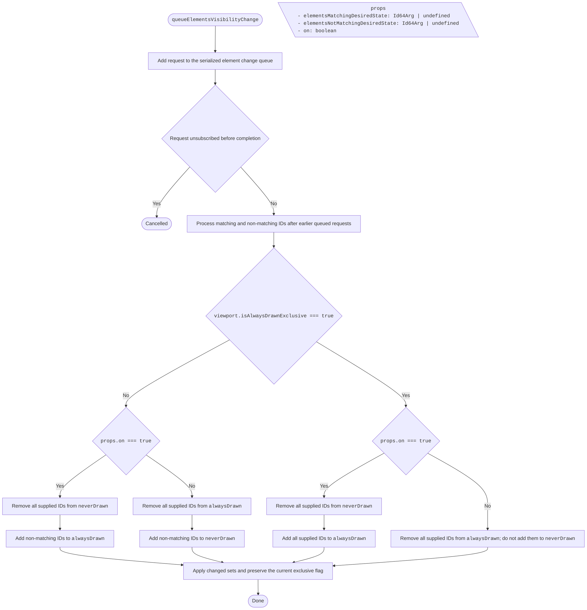
```mermaid
---
config:
  flowchart:
    wrappingWidth: 750
    useMaxWidth: false
---

flowchart TD
  RESULT_Done([Done])
  RESULT_Cancelled([Cancelled])

  %% Start
  TITLE(["<span style='font-family: monospace;'>queueElementsVisibilityChange</span>"]) --> A["Add request to the serialized element change queue"]

  PROPS[\"
    <span style='font-family: monospace;'>props</span>
    <span style='display: block; text-align: left; font-family: monospace;'>- elementsMatchingDesiredState: Id64Arg | undefined<br/>- elementsNotMatchingDesiredState: Id64Arg | undefined<br/>- on: boolean</span>
  "\]

  A --> B{"Request unsubscribed before completion"}
  B -- Yes --> RESULT_Cancelled
  B -- No --> C["Process matching and non-matching IDs after earlier queued requests"]
  C --> X{"<span style='font-family: monospace;'>viewport.isAlwaysDrawnExclusive === true</span>"}
  X -- No --> D{"<span style='font-family: monospace;'>props.on === true</span>"}
  D -- Yes --> E["Remove all supplied IDs from <span style='font-family: monospace;'>neverDrawn</span>"]
  E --> E1["Add non-matching IDs to <span style='font-family: monospace;'>alwaysDrawn</span>"]
  D -- No --> F["Remove all supplied IDs from <span style='font-family: monospace;'>alwaysDrawn</span>"]
  F --> F1["Add non-matching IDs to <span style='font-family: monospace;'>neverDrawn</span>"]
  X -- Yes --> G{"<span style='font-family: monospace;'>props.on === true</span>"}
  G -- Yes --> G1["Remove all supplied IDs from <span style='font-family: monospace;'>neverDrawn</span>"]
  G1 --> G2["Add all supplied IDs to <span style='font-family: monospace;'>alwaysDrawn</span>"]
  G -- No --> G3["Remove all supplied IDs from <span style='font-family: monospace;'>alwaysDrawn</span>; do not add them to <span style='font-family: monospace;'>neverDrawn</span>"]
  E1 --> H["Apply changed sets and preserve the current exclusive flag"]
  F1 --> H
  G2 --> H
  G3 --> H
  H --> RESULT_Done
```
