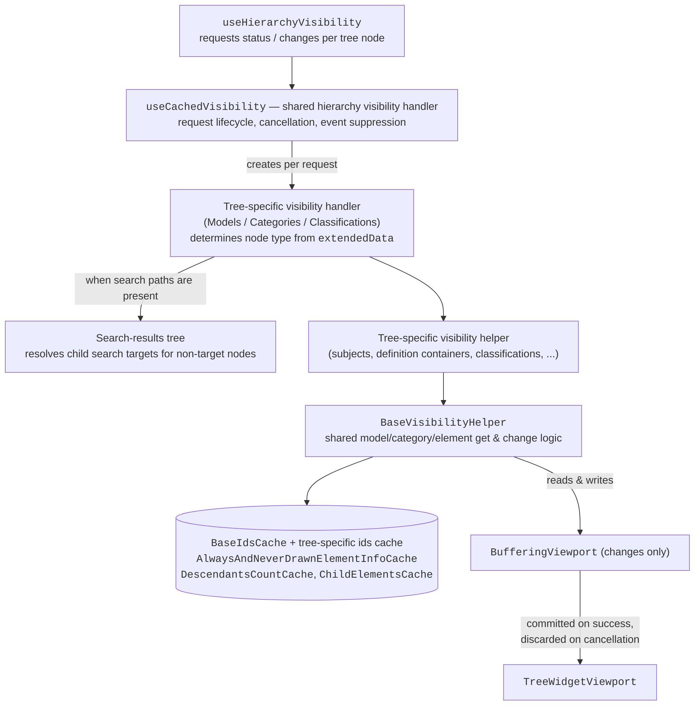
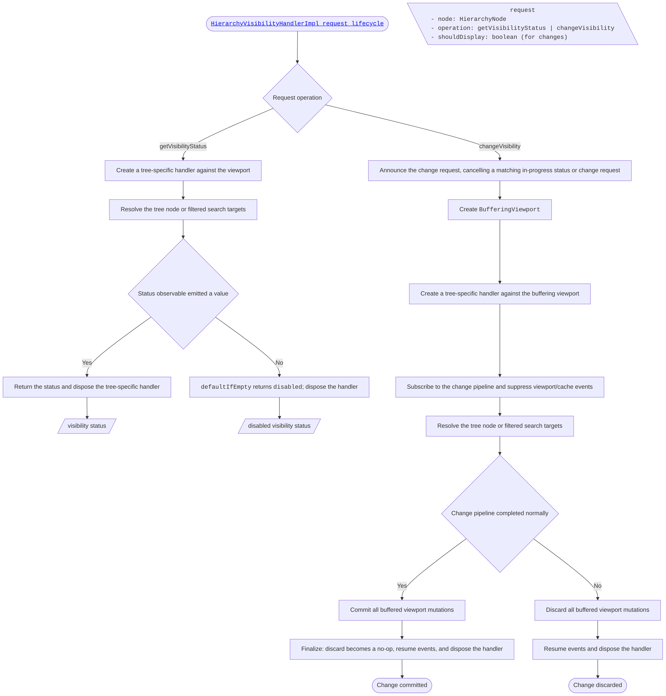

<!-- cspell: ignore getsubjectsvisibilitystatus getcategoriesvisibilitystatus getmodelsvisibilitystatus getsubcategoriesvisibilitystatus getelementsvisibilitystatus getdefinitioncontainersvisibilitystatus getclassificationtablesvisibilitystatus getclassificationsvisibilitystatus changecategoriesvisibilitystatus removealwaysdrawnexclusive showmodelwithoutanycategoriesorelements queueelementsvisibilitychange getvisiblemodelcategorydirectvisibilitystatus -->

# Visibility Handling in Tree Widget

This document explains visibility handling across tree types (Models, Categories, and Classifications) and node types (models, categories, geometric elements, sub-categories, sub-models, classifications, classification tables and definition containers).

## Architecture overview

## Diagram conventions

Every flowchart in these documents follows the same conventions:

- A detached `PROPS` section lists the operation's input. It is intentionally not connected to the flow.
- Multiple outgoing edges from a non-decision node — or multiple identically-labeled edges from a decision node — represent concurrent observable branches that all execute and later merge (usually into `mergeVisibilityStatuses()` or a `Done` node). Differently-labeled edges from a decision node are exclusive.
- Edge labels such as `-- modelId -->` indicate per-item fan-out: the following steps run for each emitted item.
- Result shapes: `[/.../]` is a produced visibility status; `([...])` is a terminal outcome of a change operation.

## Glossary

- **Top-most element** — an element with no parent element (a root element of a model). A _top-most element category_ is a category used by such an element. Only top-most element categories are queried in many places because descendant counts under their trees already include child elements in other categories.
- **Actual category** — the category an element itself uses. Descendants of a node may use categories different from the node's category, so status/change logic groups descendants by actual category to compare each group against the correct category default.
- **`parentElementsPath` / hierarchy path** — the chain of parent element/category segments leading from a model down to a node. Always/never-drawn queries scoped by this path ("path-scoped") only see elements in that hierarchy branch, so an element elsewhere in the same model/category does not affect the node's status.
- **Direct (default) status** — the non-partial `visible`/`hidden` state of a model/category pair computed only from the always-drawn-exclusive flag, per-model category override, and category selector (see [getVisibleModelCategoryDirectVisibilityStatus](./SharedVisibilityHandling.md#getvisiblemodelcategorydirectvisibilitystatus)). Ignores always/never-drawn sets.
- **Own status** — the status of the requested element IDs themselves: the direct status adjusted by counting those IDs in the opposite always/never-drawn set. Excludes descendants and sub-models.
- **Opposite set** — the forcing set that can flip elements away from their direct status: `neverDrawn` when the direct status is `visible`, `alwaysDrawn` when it is `hidden`.
- **Search target** — when hierarchy search/filtering is active, a node matched by a search path. Non-target nodes may omit children that still contribute to visibility, so their visibility is computed from their child search targets instead.
- **Hierarchy can have hidden children** — true when the tree configuration excludes element classes (`excludedElementClassNames`). Excluded descendants do not appear in the trees but still render in the viewport, so visibility handling has to take these nodes into account.

## Key Internal APIs

- [`useCachedVisibility`](../src/tree-widget-react/components/trees/common/internal/useTreeHooks/UseCachedVisibility.ts) — React hook that returns a factory for the shared hierarchy visibility handler.
  - Creates and disposes a tree-specific handler for each status or change request.
  - Cancels an in-progress `getVisibilityStatus()` when the same node receives a change request or the viewport emits a relevant visibility event. [`useHierarchyVisibility`](../src/tree-widget-react/components/trees/common/UseHierarchyVisibility.ts) requests the status again through `onVisibilityChange()`.
  - Runs changes against a [`BufferingViewport`](../src/tree-widget-react/components/trees/common/internal/BufferingViewport.ts). The buffered viewport is committed only when the complete change pipeline finishes normally; cancellation discards all buffered mutations.
  - Suppresses viewport and always/never-drawn cache events during a change, then resumes them after commit or cancellation.
  - Applies special handling when search paths are present, because filtered hierarchy nodes may omit children that still contribute to visibility.

- [`BaseVisibilityHelper`](../src/tree-widget-react/components/trees/common/internal/visibility/BaseVisibilityHelper.ts) — shared get/change operations for visibility status based on element/model/category ids.
  - Uses [`BaseIdsCache`](../src/tree-widget-react/components/trees/common/internal/caches/BaseIdsCache.ts) to retrieve information about nodes.
  - Examples: `getModelsVisibilityStatus()`, `getCategoriesVisibilityStatus()`, `changeModelsVisibilityStatus()`, `changeCategoriesVisibilityStatus()`.

- Tree-specific visibility handlers [`CategoriesTreeVisibilityHandler`](../src/tree-widget-react/components/trees/categories-tree/internal/visibility/CategoriesTreeVisibilityHandler.ts), [`ClassificationsTreeVisibilityHandler`](../src/tree-widget-react/components/trees/classifications-tree/internal/visibility/ClassificationsTreeVisibilityHandler.ts), [`ModelsTreeVisibilityHandler`](../src/tree-widget-react/components/trees/models-tree/internal/visibility/ModelsTreeVisibilityHandler.ts):
  - These handlers are aware of tree-specific hierarchy structure.
  - Take tree nodes as input, determine node type via nodes' `extendedData` property, and use appropriate methods from visibility helpers.
  - Expose get/change visibility status logic for search-target nodes.
  - Models and Classifications tree visibility is 3D-only. Categories tree visibility supports 2D and 3D viewports.
  - Before changing visibility in always-drawn-exclusive mode, preserve the current visible set while converting the viewport to normal mode, then apply the requested change.

- Tree-specific visibility helpers ([`CategoriesTreeVisibilityHelper`](../src/tree-widget-react/components/trees/categories-tree/internal/visibility/CategoriesTreeVisibilityHelper.ts), [`ClassificationsTreeVisibilityHelper`](../src/tree-widget-react/components/trees/classifications-tree/internal/visibility/ClassificationsTreeVisibilityHelper.ts), [`ModelsTreeVisibilityHelper`](../src/tree-widget-react/components/trees/models-tree/internal/visibility/ModelsTreeVisibilityHelper.ts)):
  - Cover tree-specific cases (e.g. definition containers exist only in the Categories tree, so `CategoriesTreeVisibilityHelper` implements get/change visibility methods for definition containers).
  - All of them use [`BaseVisibilityHelper`](../src/tree-widget-react/components/trees/common/internal/visibility/BaseVisibilityHelper.ts) to get/change visibility for those tree-specific cases.

- Search-results trees ([`BaseSearchResultsTree`](../src/tree-widget-react/components/trees/common/internal/visibility/BaseSearchResultsTree.ts) and tree-specific implementations: [Categories](../src/tree-widget-react/components/trees/categories-tree/internal/visibility/SearchResultsTree.ts), [Classifications](../src/tree-widget-react/components/trees/classifications-tree/internal/visibility/SearchResultsTree.ts), [Models](../src/tree-widget-react/components/trees/models-tree/internal/visibility/SearchResultsTree.ts)):
  - Help get/change visibility of nodes which are not search targets and don't have search-target ancestors (since these nodes might have some children missing). They allow retrieving child search targets for such nodes and then getting/changing visibility is done based on search targets instead.

- Caching:
  - [`BaseIdsCache`](../src/tree-widget-react/components/trees/common/internal/caches/BaseIdsCache.ts) - stores data that is relevant to models/categories/classifications trees (e.g. model <-> category relationship).
    - This cache is composed of other caches ([`DescendantsCountCache`](../src/tree-widget-react/components/trees/common/internal/caches/DescendantsCountCache.ts), [`ChildElementsCache`](../src/tree-widget-react/components/trees/common/internal/caches/ChildElementsCache.ts), [`SubCategoriesCache`](../src/tree-widget-react/components/trees/common/internal/caches/SubCategoriesCache.ts), and others).
    - Data stored in this cache is requested only once, because it does not change.
  - Tree-specific id caches ([`CategoriesTreeIdsCache`](../src/tree-widget-react/components/trees/categories-tree/internal/CategoriesTreeIdsCache.ts), [`ClassificationsTreeIdsCache`](../src/tree-widget-react/components/trees/classifications-tree/internal/ClassificationsTreeIdsCache.ts), [`ModelsTreeIdsCache`](../src/tree-widget-react/components/trees/models-tree/internal/ModelsTreeIdsCache.ts)):
    - Store various tree-specific relationships, (e.g. models tree ids cache stores element's model <-> subject relationship).
    - Extend `BaseIdsCacheImpl` so each tree-specific cache can be used in [`BaseVisibilityHelper`](../src/tree-widget-react/components/trees/common/internal/visibility/BaseVisibilityHelper.ts).

  - [`AlwaysAndNeverDrawnElementInfoCache`](../src/tree-widget-react/components/trees/common/internal/caches/AlwaysAndNeverDrawnElementInfoCache.ts) — caches extra data (like category) for always/never drawn elements.
    - Always and never drawn caches are reset when always and never drawn sets change respectively.
    - Always and never drawn elements can be retrieved by model, actual category, and hierarchy path.

  - [`DescendantsCountCache`](../src/tree-widget-react/components/trees/common/internal/caches/DescendantsCountCache.ts) — retrieves descendant counts grouped by each descendant's actual category.
    - Status requests use these counts with path-scoped always/never-drawn information. They do not load all descendant IDs.
    - Change requests use the grouped counts to decide which category groups already match the requested state.

  - [`ChildElementsCache`](../src/tree-widget-react/components/trees/common/internal/caches/ChildElementsCache.ts) — cache for retrieving elements' children.
    - Used only during changes, for category and element/grouping operations whose descendants are in categories that do not already match the requested state.
    - It retrieves IDs only for those non-matching category groups so they can be added to `alwaysDrawn` or `neverDrawn`.
    - It is not used for status requests. A hierarchy branch may contain hundreds of thousands of descendants, so status is computed from grouped counts instead.

## Request lifecycle

## How visibility is determined in the viewport

The viewport only renders elements. Element visibility is resolved in the following order (highest priority first):

1. **Model selector**: if a model is hidden, its elements are never visible.
2. **Always/Never drawn sets**: elements in these sets are forced to be visible/hidden.
3. **Always drawn exclusive flag**: If flag is on, then only elements in the `alwaysDrawn` set are visible, otherwise rules below apply.
4. **Per model-category overrides**: a category can be overridden per model with `hide`, `show`, or `none`.
   - `hide`: hides all elements of that category within the model.
   - `show`: shows all elements of that category within the model.
   - `none`: no override — the category selector (rules below) decides.
5. **Category selector**: hidden categories hide their elements.
6. **Sub-categories**: hidden sub-categories hide their elements.
   - **Note**: Determining element -> sub-category relationship is not supported at the moment. So sub-category checks are only performed when the Categories tree calls `getVisibilityStatus()` for categories or sub-categories.

## Visibility logic

- Getting visibility status
  - [Models tree](./ModelsTreeVisibilityHandling.md)
    - [getSubjectsVisibilityStatus](./ModelsTreeVisibilityHandling.md#getsubjectsvisibilitystatus)
    - [getGroupedElementsVisibilityStatus](./ModelsTreeVisibilityHandling.md#getgroupedelementsvisibilitystatus)
    - [getModelsVisibilityStatus](./SharedVisibilityHandling.md#getmodelsvisibilitystatus)
    - [getCategoriesVisibilityStatus](./SharedVisibilityHandling.md#getcategoriesvisibilitystatus)
    - [getElementsVisibilityStatus](./SharedVisibilityHandling.md#getelementsvisibilitystatus)
  - [Categories tree](./CategoriesTreeVisibilityHandling.md)
    - [getDefinitionContainersVisibilityStatus](./CategoriesTreeVisibilityHandling.md#getdefinitioncontainersvisibilitystatus)
    - [getGroupedElementsVisibilityStatus](./CategoriesTreeVisibilityHandling.md#getgroupedelementsvisibilitystatus)
    - [getCategoriesVisibilityStatus](./SharedVisibilityHandling.md#getcategoriesvisibilitystatus)
    - [getSubCategoriesVisibilityStatus](./SharedVisibilityHandling.md#getsubcategoriesvisibilitystatus)
    - [getElementsVisibilityStatus](./SharedVisibilityHandling.md#getelementsvisibilitystatus)
  - [Classifications tree](./ClassificationsTreeVisibilityHandling.md)
    - [getClassificationTablesVisibilityStatus](./ClassificationsTreeVisibilityHandling.md#getclassificationtablesvisibilitystatus)
    - [getClassificationsVisibilityStatus](./ClassificationsTreeVisibilityHandling.md#getclassificationsvisibilitystatus)
    - [getCategoriesVisibilityStatus](./SharedVisibilityHandling.md#getcategoriesvisibilitystatus)
    - [getElementsVisibilityStatus](./SharedVisibilityHandling.md#getelementsvisibilitystatus)
- Changing visibility status
  - [Shared model, category, and element changes](./SharedVisibilityHandling.md#changing-visibility-status)
  - [Models tree specific changes](./ModelsTreeVisibilityHandling.md#changing-visibility-status)
  - [Categories tree specific changes](./CategoriesTreeVisibilityHandling.md#changing-visibility-status)
  - [Classifications tree specific changes](./ClassificationsTreeVisibilityHandling.md#changing-visibility-status)

## Worked example: turning on a hidden category node

A trace of what happens when the user clicks the eye icon of a hidden category node in the Categories tree (no search active):

1. [`useHierarchyVisibility`](../src/tree-widget-react/components/trees/common/UseHierarchyVisibility.ts) calls `changeVisibility(node, true)` on the shared hierarchy visibility handler created by [`useCachedVisibility`](../src/tree-widget-react/components/trees/common/internal/useTreeHooks/UseCachedVisibility.ts).
2. The handler announces the change request, cancelling any in-progress status or change request for the same node. It creates a [`BufferingViewport`](../src/tree-widget-react/components/trees/common/internal/BufferingViewport.ts), suppresses viewport and always/never-drawn cache events, and creates a `CategoriesTreeVisibilityHandler` against the buffered viewport.
3. The tree-specific handler reads the node's `extendedData`, identifies a category node, and — after calling [removeAlwaysDrawnExclusive](./SharedVisibilityHandling.md#removealwaysdrawnexclusive) first if exclusive mode is active — delegates to the shared [changeCategoriesVisibilityStatus](./SharedVisibilityHandling.md#changecategoriesvisibilitystatus) without a `modelId`.
4. The shared helper enables the category in the category selector, then for every related model: clears the per-model category override, clears path-scoped always/never-drawn entries, and recursively changes scoped sub-models. Hidden related models are prepared by [showModelWithoutAnyCategoriesOrElements](./SharedVisibilityHandling.md#showmodelwithoutanycategoriesorelements) so no unrelated categories become visible. Descendants in other actual categories are reconciled through [queueElementsVisibilityChange](./SharedVisibilityHandling.md#queueelementsvisibilitychange), and hidden sub-categories of the requested category are enabled.
5. The change pipeline completes, so all buffered viewport mutations are committed in one batch, events are resumed, and the tree-specific handler is disposed.
6. Resumed viewport events and `onVisibilityChange()` cause the tree to request fresh statuses for affected nodes; always/never-drawn caches recompute from the updated sets.

If the user clicks another checkbox for the same node mid-pipeline, the announcement in step 2 cancels this pipeline and all buffered mutations are discarded — the real viewport is never touched.
