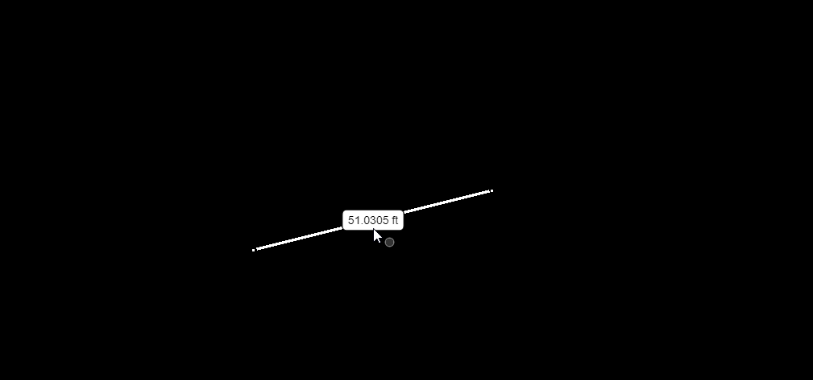
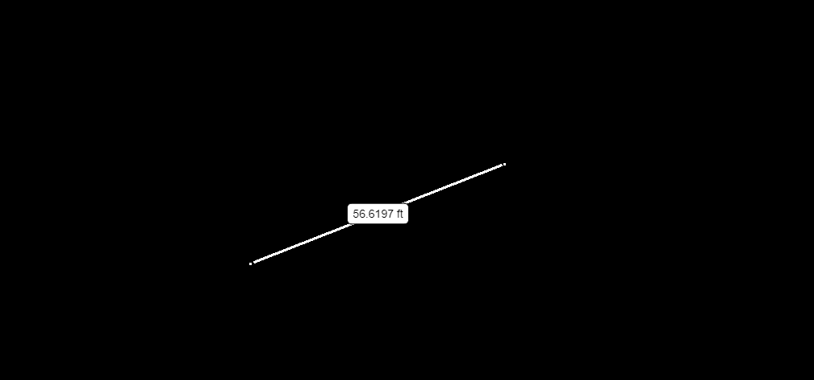

# @bentley/measure-tools-react

Copyright © Bentley Systems, Incorporated. All rights reserved.

The measure-tools-react package provides measurement tools and React components to access within an iTwin Viewer.

Every iTwin.js application has initialization code where they must call `IModelApp.startup()`. This library has a similar initialization entrypoint that must be called to configure localization and register tools.
Call the `MeasureTools.startup() ` **AFTER** the IModelApp one.

```typescript
await IModelApp.startup(opts);
await MeasureTools.startup(opts);
```

After that, most of your code changes will be to consume the default measurement tools (such as measure distance, polygon, location, etc).

**Note:** Startup can be called any number of times but will only startup once. Some other libraries that use measure-tools may have already initialized it for you!

## What to add in your iTwin Viewer based app (iTwin App UI)

With a few short lines, you can add the measurement tools and widgets to your app. The iTwin Viewer accepts a callback, `onIModelAppInit`, which you can use to initialize the MeasureTools. Afterwards, all you need to do is pass in the `MeasureToolsUiItemsProvider` to the list of UiProviders for your viewer to register. This will add both the toolbar with all the measure tools and the measurement property widget to your app for you.

```typescript
  const handleOnIModelAppInit = async () => {
    await MeasureTools.startup();
  };

  return (
    <Viewer
      ...
      onIModelAppInit={handleOnIModelAppInit}
      uiProviders={[
        new MeasureToolsUiItemsProvider(),
      ]}
    />
  );
```

## What to add in your frontstage

If you are not using the iTwin-Viewer or iTwin App UI, you can add the measurement tools and measurement property widget to your frontstage like so:

### Tools

Similar to `CoreTools` in iTwin.js, measure-tools has a collection of item definitions organized under the `MeasureToolDefinitions` singleton. The application can arrange or group the default tool buttons any way it wants.
Below is an example of creating a vertical toolbar filled with the default measurement tools.

```typescript
const verticalToolbar = (
  <Toolbar
    expandsTo={Direction.Right}
    items={
      <>
        <ActionItemButton
          actionItem={MeasureToolDefinitions.measureDistanceToolCommand}
        />
        <ActionItemButton
          actionItem={MeasureToolDefinitions.measureAreaToolCommand}
        />
        <ActionItemButton
          actionItem={MeasureToolDefinitions.measureLocationToolCommand}
        />
        <ActionItemButton
          actionItem={MeasureToolDefinitions.measureRadiusToolCommand}
        />
        <ActionItemButton
          actionItem={MeasureToolDefinitions.measureAngleToolCommand}
        />
      </>
    }
  />
);
```

### Measurement Property Widget

Most applications will have a property grid widget in the lower right corner of the 9-zone UI. Our measurements do not display properties in the element property grid, instead there is a separate widget that will
display properties of any selected measurements. It normally is added as a separate tab to the same zone as the property grid. Below is example code from the 9-zone sample application with the measurement widget defined.

In this code, the measurement widget is hidden until a measurement has been selected. With this code you can have measurements and elements selected and have two tabs to switch between properties of either.

```typescript
bottomRight={
   <Zone defaultState={ZoneState.Open} allowsMerging={true}
   widgets={[

       <Widget id="Properties" control={PropertyGridWidget} defaultState={WidgetState.Closed} fillZone={true}
       iconSpec="icon-properties-list" labelKey="MyApp:components.properties"
       applicationData={{
           iModelConnection: UiFramework.getIModelConnection(),
           rulesetId: this._rulesetId,
       }}
       syncEventIds={[SyncUiEventId.SelectionSetChanged]}
       stateFunc={PropertyGridWidget.generateWidgetStateFuncWithMemory()}
       />,

       <Widget id="Measurements" control={MeasurementWidget} defaultState={WidgetState.Hidden} fillZone={true}
       iconSpec="icon-measure" labelKey="TestMeasurementApp:components.measurements"
       applicationData={{
           iModelConnection: UiFramework.getIModelConnection(),
       }}
       syncEventIds={[MeasurementSyncUiEventId.MeasurementSelectionSetChanged]}
       stateFunc={MeasurementWidget.generateWidgetStateFuncWithMemory()}
       />,
   ]}
   />
}
```


# Advanced Topics

## Action Toolbar

Measurements support a right click context menu called the "Action Toolbar". By default it is not enabled, however it is completely customizable by the application. Similar to how tools are constructed by creating item definitions,
the action toolbar constructs a list of "action items" that can be applied to a selected measurement. Applications can register action providers to add to or modify the list of actions. The application can also set a filter to the toolbar
to control what measuremnts the toolbar is shown for.

If multiple measurements are selected, the actions apply to all the measurements.

Below is an example to enable the toolbar with a default action provider. Actions are:

- Open Properties (selects the measurement)
- Delete
- Toggle display of axes (distance measurement only)
- Toggle lock state (locked measurements by default are not cleared)

```typescript
// Set default measurement action toolbar (call this after MeasureTools.startup)
MeasurementActionToolbar.setDefaultActionProvider();
```



Below is an example of registering a custom action, it toggles the display style of a measurement so that it renders semi-transparently like if it were "ghosted".

```typescript
// Test faded style by adding an action button that toggles default / faded style
// If not all of them are faded, set the remaining to faded. Else, back to default.
MeasurementActionToolbar.addActionProvider(
  (measurements: Measurement[], actionItemList: MeasurementActionItemDef[]) => {
    actionItemList.push(
      new MeasurementActionItemDef({
        id: "faded-toggle",
        iconSpec: "icon-palette",
        label: () => IModelApp.i18n.translate("MeasureTools:Generic.faded"),
        tooltip: () => IModelApp.i18n.translate("MeasureTools:Generic.faded"),
        execute: (args: Measurement[]) => {
          const notAllFaded = args.some(
            (m) => m.style !== WellKnownMeasurementStyle.Faded
          );
          args.forEach((m) => {
            if (notAllFaded && m.style !== WellKnownMeasurementStyle.Faded)
              m.style = WellKnownMeasurementStyle.Faded;
            else if (m.style !== WellKnownMeasurementStyle.Default)
              m.style = WellKnownMeasurementStyle.Default;
          });

          Measurement.invalidateDecorationsForAll(args);
          MeasurementUIEvents.notifyMeasurementsChanged();
        },
      })
    );
  },
  100
);
```



## Measurement UI Events

There are a number of global UI events that are triggered when measurements are modified (e.g. added or removed). Some applications can create contextual UI buttons that will be turn visible or invisible based on these state changes.

For example, distance measurements can have their axes toggled on/off. An application may want to turn on **all** axes. It would determine the visibility state of a contextual UI button by hooking into the `MeasurementUIEvents.onToggleMeasurementAxesButtonVisibilityChanged`
notification event.

An application can further customize UI event behavior by registering override handlers to determine if a measurement is to be accepted/rejected by the UI event (e.g. display a "clear all measurements" button but **only** if measurements fit a certain criteria).

A concrete example of this customization is an application that has measurements organized into multiple groups. One group may be "frozen" due to some application state (state that the measure-tools library may be unaware of) and should not be cleared by the clear measurements tool.
So the application would register a custom UI event handler that would cause those measurements to be ignored when the clear measurement tool is invoked.
