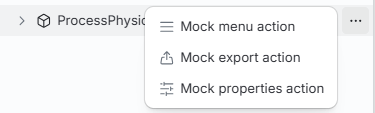
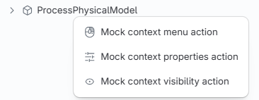

# Migrating from tree-widget v3 to v4

This guide only covers changes required to preserve v3 behavior after upgrading. See the [package README](./README.md) for new v4 features and optional APIs.

## Contents

1. [Update dependencies](#1-update-dependencies)
2. [Replace global initialization with `TreeWidgetContextProvider`](#2-replace-global-initialization-with-treewidgetcontextprovider)
3. [Update widget registration and standard tree components](#3-update-widget-registration-and-standard-tree-components)
4. [Rename search and renderer APIs](#4-rename-search-and-renderer-apis)
5. [Update hierarchy configuration](#5-update-hierarchy-configuration)
6. [Rework custom trees and telemetry](#6-rework-custom-trees-and-telemetry)
7. [Update custom visibility APIs](#7-update-custom-visibility-apis)
8. [Account for tree content changes](#8-account-for-tree-content-changes)

## Suggested order of work

The sections are ordered so that the application compiles again as early as possible:

1. Sections 1-2 cover package setup and the removed global initialization APIs.
2. Section 3 applies to applications that register the widget or render standard tree components.
3. Sections 4-5 apply to applications that customize search or hierarchy configuration.
4. Section 6 applies to applications with custom widget layouts, tree renderers, or telemetry.
5. Section 7 applies to applications with custom visibility handlers.
6. Section 8 applies to code or tests that depend on the Models tree hierarchy shape.

## API quick reference

Migration map for the v3 APIs covered by this guide. Each row links to the section with the details.

| v3                                                   | v4                                                               | Details                                                              |
| ---------------------------------------------------- | ---------------------------------------------------------------- | -------------------------------------------------------------------- |
| `TreeWidget.initialize` / `TreeWidget.terminate`     | `TreeWidgetContextProvider` + `LOCALIZATION_NAMESPACES`          | [2](#2-replace-global-initialization-with-treewidgetcontextprovider) |
| `TreeWidget.i18n` / `.i18nNamespace` / `.translate`  | removed, no replacement                                          | [2](#replace-treewidget-localization-helpers)                        |
| `SelectableTree` (tree selector)                     | `TreeWidgetComponent`                                            | [6](#replace-the-widget-and-header-components)                       |
| `SelectableTreeDefinition`                           | `TreeDefinition`                                                 | [3](#3-update-widget-registration-and-standard-tree-components)      |
| Standard tree `getLabel()`                           | `getLabel({ standardLabels })`                                   | [3](#3-update-widget-registration-and-standard-tree-components)      |
| `TreeWithHeader`                                     | `SelectableTree` (header/container only)                         | [6](#replace-the-widget-and-header-components)                       |
| `TreeWithHeader.filteringProps`                      | `TreeDefinition.isSearchable`, or an application-owned input     | [3](#preserve-search-ui)                                             |
| `FilterLimitExceededError`                           | `SearchLimitExceededError`                                       | [4](#filterlimitexceedederror-to-searchlimitexceedederror)           |
| `Viewport` in tree APIs                              | `TreeWidgetViewport` + `createTreeWidgetViewport`                | [3](#convert-viewport-values-used-by-hooks-and-header-buttons)       |
| `filter`                                             | `searchText`                                                     | [4](#filter-to-searchtext)                                           |
| `highlight`                                          | `highlightText`                                                  | [4](#highlight-to-highlighttext)                                     |
| `getFilteredPaths`                                   | `getSearchPaths`                                                 | [4](#getfilteredpaths-to-getsearchpaths)                             |
| `HierarchyFilteringPath[]`                           | `HierarchySearchTree[]`                                          | [4](#hierarchyfilteringpath-to-hierarchysearchtree)                  |
| `onFilterClick`                                      | `filterHierarchyLevel`                                           | [4](#onfilterclick-to-filterhierarchylevel)                          |
| `noDataMessage`                                      | `emptyTreeContent`                                               | [4](#nodatamessage-to-emptytreecontent)                              |
| `modelsTreeProps` / `categoriesTreeProps`            | `treeProps`                                                      | [4](#update-standard-tree-hook-results)                              |
| `rendererProps`                                      | `getTreeItemProps`                                               | [4](#update-standard-tree-hook-results)                              |
| `getCheckboxState`                                   | `getVisibilityButtonState`                                       | [6](#migrate-custom-visibility-renderers)                            |
| `onCheckboxClicked`                                  | `onVisibilityButtonClick`                                        | [6](#migrate-custom-visibility-renderers)                            |
| Checkbox states `"on"` / `"off"`                     | `"visible"` / `"hidden"`                                         | [6](#migrate-custom-visibility-renderers)                            |
| `getActions`                                         | `getInlineActions`, `getMenuActions`, or `getContextMenuActions` | [6](#migrate-node-actions)                                           |
| `getLabel` / `getIcon` / `getSublabel`               | `getTreeItemProps`                                               | [6](#migrate-renderer-props)                                         |
| `HierarchyVisibilityHandler.dispose`                 | `HierarchyVisibilityHandler[Symbol.dispose]`                     | [7](#7-update-custom-visibility-apis)                                |
| `VisibilityStatus.tooltip`                           | removed from the handler                                         | [7](#7-update-custom-visibility-apis)                                |
| `get*DisplayStatus` / `change*State` overrides       | `get*VisibilityStatus` / `change*VisibilityStatus`               | [7](#7-update-custom-visibility-apis)                                |
| `onCategoriesFiltered(categories)`                   | `onCategoriesFiltered({ categories, models })`                   | [3](#update-oncategoriesfiltered-callback)                           |
| `PresentationHierarchyNode` / `PresentationTreeNode` | `TreeNode` (`@itwin/presentation-hierarchies-react` v2)          | [6](#update-tree-and-visibilitytree-usage)                           |

Props that were removed without a replacement:

| Removed prop                                              | Removed from                                                                                                                                                                          | Details                                                         |
| --------------------------------------------------------- | ------------------------------------------------------------------------------------------------------------------------------------------------------------------------------------- | --------------------------------------------------------------- |
| `density`                                                 | `createTreeWidget`, `TreeWidgetComponent`, `SelectableTree`, `TreeWithHeader`, `Tree`, `VisibilityTree`, standard tree components, header button props, `TreeDefinition.render` props | [3](#3-update-widget-registration-and-standard-tree-components) |
| `getSchemaContext`                                        | `Tree`, `VisibilityTree`, all standard tree components                                                                                                                                | [3](#3-update-widget-registration-and-standard-tree-components) |
| `onFeatureUsed`                                           | header button renderer props                                                                                                                                                          | [3](#3-update-widget-registration-and-standard-tree-components) |
| `filterButtonsVisibility`, `size`, `enableVirtualization` | `TreeRenderer`, `VisibilityTreeRenderer`                                                                                                                                              | [6](#migrate-renderer-props)                                    |

New required props:

| Prop           | Required by                                                                                                                                              |
| -------------- | -------------------------------------------------------------------------------------------------------------------------------------------------------- |
| `localization` | `createTreeWidget`, `TreeWidgetComponent`, `TreeWidgetContextProvider`                                                                                   |
| `treeLabel`    | `ModelsTreeComponent`, `CategoriesTreeComponent`, `IModelContentTreeComponent`, `ExternalSourcesTreeComponent`, `TreeRenderer`, `VisibilityTreeRenderer` |
| `models`       | `CategoriesTreeComponent` header buttons rendered directly                                                                                               |

## 1. Update dependencies

Version 4 requires React 18 and the iTwin.js, AppUI, presentation, MUI, and StrataKit peer dependency ranges listed below. Add them to the application's `package.json`, or update the existing ranges.

```jsonc
{
  "dependencies": {
    // iTwin.js packages with the same version range
    "@itwin/appui-abstract": "^5.8.0",
    "@itwin/core-bentley": "^5.8.0",
    "@itwin/core-common": "^5.8.0",
    "@itwin/core-frontend": "^5.8.0",
    "@itwin/ecschema-metadata": "^5.8.0",
    "@itwin/presentation-common": "^5.8.0",
    "@itwin/presentation-frontend": "^5.8.0",

    // Other iTwin.js packages
    "@itwin/appui-react": "^5.5.0",
    "@itwin/components-react": "^5.5.0",
    "@itwin/presentation-components": "^5.12.0",

    // StrataKit and MUI packages
    "@mui/material": "^9.0.0",
    "@stratakit/icons": "^0.4.0",
    "@stratakit/mui": "^0.5.3",
    "@stratakit/structures": "^0.5.6",

    // React packages
    "react": "^18.0.0",
    "react-dom": "^18.0.0",
  },
}
```

These are all peer dependencies of tree-widget. Package managers that install peer dependencies automatically may resolve the MUI and StrataKit entries without changes to `package.json`; declare them explicitly when the application needs to control their versions. Only the ranges that the application does not already satisfy have to be added.

Version 4 is ESM-only: the package no longer publishes a CommonJS build, and its `package.json` exposes only an `import` condition. Applications that load tree-widget through CommonJS `require`, or run tests in a CommonJS-only runner, must migrate that code and its build/test configuration to ESM.

Tree-widget and its hierarchy dependencies have independent major versions. Tree-widget v3 uses the v1 hierarchy packages, while tree-widget v4 uses the v2 hierarchy packages. If the application imports types or APIs from those dependencies, migrate the imports as follows:

| Tree-widget v3 dependency                  | Tree-widget v4 dependency                  |
| ------------------------------------------ | ------------------------------------------ |
| `@itwin/presentation-core-interop` v1      | `@itwin/presentation-core-interop` v2      |
| `@itwin/presentation-hierarchies` v1       | `@itwin/presentation-hierarchies` v2       |
| `@itwin/presentation-hierarchies-react` v1 | `@itwin/presentation-hierarchies-react` v2 |
| `@itwin/presentation-shared` v1            | `@itwin/presentation-shared` v2            |
| `@itwin/unified-selection` v1              | `@itwin/unified-selection` v2              |

When these v2 packages are prereleases, use versions compatible with the installed tree-widget version rather than selecting their versions independently.

## 2. Replace global initialization with `TreeWidgetContextProvider`

1. Register tree-widget's localization namespaces during application startup:

   ```ts
   import { LOCALIZATION_NAMESPACES } from "@itwin/tree-widget-react";
   import { IModelApp } from "@itwin/core-frontend";

   for (const namespace of LOCALIZATION_NAMESPACES) {
     await IModelApp.localization.registerNamespace(namespace);
   }
   ```

2. Replace `TreeWidget` initialization and termination with the `TreeWidgetContextProvider` React context:

   - Remove the `TreeWidget.initialize()` and `TreeWidget.terminate()` calls.
   - When using `createTreeWidget` or `TreeWidgetComponent`, pass `localization: IModelApp.localization`. These APIs add the provider around their content automatically.
   - When rendering lower-level tree components directly, make one `TreeWidgetContextProvider` available above them. An existing shared provider near the application root can serve all tree components below it.

For example, an application that renders lower-level tree components directly changes as follows:

```tsx
// v3
import { CategoriesTreeComponent, ModelsTreeComponent, TreeWidget } from "@itwin/tree-widget-react";
import { IModelApp } from "@itwin/core-frontend";

await TreeWidget.initialize(IModelApp.localization);

function App() {
  return (
    <>
      <ModelsTreeComponent selectionStorage={selectionStorage} />
      <CategoriesTreeComponent selectionStorage={selectionStorage} />
      <CustomTree />
    </>
  );
}
```

```tsx
// v4
import { CategoriesTreeComponent, LOCALIZATION_NAMESPACES, ModelsTreeComponent, TreeWidgetContextProvider } from "@itwin/tree-widget-react";
import { IModelApp } from "@itwin/core-frontend";

for (const namespace of LOCALIZATION_NAMESPACES) {
  await IModelApp.localization.registerNamespace(namespace);
}

function App() {
  return (
    <TreeWidgetContextProvider localization={IModelApp.localization}>
      <ModelsTreeComponent treeLabel="Models tree" selectionStorage={selectionStorage} />
      <CategoriesTreeComponent treeLabel="Categories tree" selectionStorage={selectionStorage} />
      <CustomTree />
    </TreeWidgetContextProvider>
  );
}
```

### Replace `TreeWidget` localization helpers

The `TreeWidget.i18n`, `TreeWidget.i18nNamespace`, and `TreeWidget.translate` static APIs were removed. There is no direct replacement: tree-widget translation keys are package implementation details and should not be resolved by consumers.

Tree-widget components resolve their own strings internally. Use the `standardLabels` supplied to `TreeDefinition.getLabel` for standard tree names.

If application UI previously reused a tree-widget translation through `TreeWidget.translate`, move that text to an application-owned localization namespace:

```tsx
// v3
const label = TreeWidget.translate("widget.label");

// v4
const label = IModelApp.localization.getLocalizedString("MyApplication:treeWidget.label");
```

`LOCALIZATION_NAMESPACES` is exported for namespace registration, not as a public catalog of translation keys.

## 3. Update widget registration and standard tree components

Widget registration through `createTreeWidget` or `TreeWidgetComponent`:

- `localization` is now required.
- `TreeDefinition` replaces `SelectableTreeDefinition`. Its `getLabel` receives `{ standardLabels }`, which contains the localized default names for the built-in trees.
- `TreeDefinition.render` receives `treeLabel` to forward to the tree component, and `searchText` when the definition sets `isSearchable`.

Standard tree components - `ModelsTreeComponent`, `CategoriesTreeComponent`, `IModelContentTreeComponent`, and `ExternalSourcesTreeComponent` - now require `treeLabel`, which is used for accessibility purposes.

`density` was removed from every API listed above, as well as from `SelectableTree`, `TreeWithHeader`, `Tree`, and `VisibilityTree`.

`getSchemaContext` was removed from the standard tree components, `Tree`, and `VisibilityTree` - v4 creates the schema context internally.

```tsx
// v3
import { createTreeWidget, ModelsTreeComponent } from "@itwin/tree-widget-react";

createTreeWidget({
  density: "enlarged",
  trees: [
    {
      id: ModelsTreeComponent.id,
      getLabel: () => ModelsTreeComponent.getLabel(),
      render: () => <ModelsTreeComponent density="enlarged" getSchemaContext={getSchemaContext} selectionStorage={selectionStorage} />,
    },
  ],
});
```

```tsx
// v4
import { createTreeWidget, ModelsTreeComponent } from "@itwin/tree-widget-react";
import { IModelApp } from "@itwin/core-frontend";

createTreeWidget({
  localization: IModelApp.localization,
  trees: [
    {
      id: ModelsTreeComponent.id,
      isSearchable: true,
      getLabel: ({ standardLabels }) => ModelsTreeComponent.getLabel({ standardLabels }),
      render: ({ treeLabel, searchText }) => <ModelsTreeComponent treeLabel={treeLabel} searchText={searchText} selectionStorage={selectionStorage} />,
    },
  ],
});
```

### Preserve search UI

In v3, `ModelsTreeComponent` and `CategoriesTreeComponent` rendered their own search input. In v4, search input is owned by `TreeWidgetComponent`:

- When registering a standard tree through `createTreeWidget` or `TreeWidgetComponent`, set `TreeDefinition.isSearchable` and pass the render callback's `searchText` to the tree component, as shown above.
- When rendering a standard tree component directly, render an application-owned search input and pass its value through the component's `searchText` prop.

### Convert viewport values used by hooks and header buttons

Tree visibility hooks and header-button APIs no longer accept an iTwin.js `Viewport` directly. They use the narrower `TreeWidgetViewport` interface. Convert the existing viewport with `createTreeWidgetViewport`.

```tsx
// v3 - the same viewport is passed to every tree API
import { useModelsTree, useModelsTreeButtonProps } from "@itwin/tree-widget-react";

import type { IModelConnection, Viewport } from "@itwin/core-frontend";

function MyModelsTree({ imodel, viewport }: { imodel: IModelConnection; viewport: Viewport }) {
  const { buttonProps } = useModelsTreeButtonProps({ imodel, viewport });
  const { modelsTreeProps } = useModelsTree({ activeView: viewport });
  // ...
}
```

```tsx
// v4 - create one adapter and pass it everywhere the viewport was used
import { useMemo } from "react";
import { createTreeWidgetViewport, useModelsTree, useModelsTreeButtonProps } from "@itwin/tree-widget-react";

import type { IModelConnection, Viewport } from "@itwin/core-frontend";

function MyModelsTree({ imodel, viewport }: { imodel: IModelConnection; viewport: Viewport }) {
  const treeWidgetViewport = useMemo(() => createTreeWidgetViewport(viewport), [viewport]);

  const { buttonProps } = useModelsTreeButtonProps({ imodel, viewport: treeWidgetViewport });
  const { treeProps } = useModelsTree({ activeView: treeWidgetViewport });
  // ...
}
```

This applies to `useModelsTree`, `useCategoriesTree`, `useModelsTreeButtonProps`, `useCategoriesTreeButtonProps`, and standard header buttons rendered directly.

### Update Categories tree buttons

Category header button props now include the models available in the iModel. `useCategoriesTreeButtonProps` supplies them:

```tsx
// v3
const { buttonProps } = useCategoriesTreeButtonProps({ viewport });

<CategoriesTreeComponent.ShowAllButton viewport={buttonProps.viewport} categories={buttonProps.categories} />;

// v4 - `models` was added
const { buttonProps } = useCategoriesTreeButtonProps({ viewport: treeWidgetViewport });

<CategoriesTreeComponent.ShowAllButton viewport={buttonProps.viewport} categories={buttonProps.categories} models={buttonProps.models} />;
```

When all returned button props should be forwarded, spread them instead:

```tsx
<CategoriesTreeComponent.ShowAllButton {...buttonProps} />
```

Custom header-button renderers no longer receive `density` or `onFeatureUsed`. Remove either property when destructuring or forwarding the renderer props, and do not pass them when rendering standard buttons directly.

### Update `onCategoriesFiltered` callback

`onCategoriesFiltered` now takes a single object argument holding the filtered `categories` and the `models` those categories belong to, instead of the categories array. Both values may be `undefined` when filtering is cleared:

```tsx
// v3
const { categoriesTreeProps } = useCategoriesTree({
  onCategoriesFiltered: (categories) => {
    // ...
  },
  // ...
});

// v4
const { treeProps } = useCategoriesTree({
  onCategoriesFiltered: ({ categories, models }) => {
    // ...
  },
  // ...
});
```

## 4. Rename search and renderer APIs

### `filter` to `searchText`

```tsx
// v3: useModelsTree and useCategoriesTree
const modelsTree = useModelsTree({ activeView, filter: searchText });

// v4
const modelsTree = useModelsTree({ activeView, searchText });
```

`ModelsTreeComponent` and `CategoriesTreeComponent` now accept `searchText` directly. In v3, search text was supplied only through the corresponding custom-tree hooks.

### `highlight` to `highlightText`

```tsx
// v3: Tree and VisibilityTree
<Tree {...treeProps} highlight={{ text: searchText }} />;

// v4
<Tree {...treeProps} highlightText={searchText} />;
```

The results returned by `useModelsTree` and `useCategoriesTree` use the same rename.

### `getFilteredPaths` to `getSearchPaths`

The prop was renamed on `Tree`, `VisibilityTree`, and `useModelsTree`. Renaming it is not enough - the callback itself changed, and the two APIs take different arguments.

On `Tree` and `VisibilityTree`, the arguments stay the same and only the returned value changes:

```tsx
// v3
<Tree
  {...treeProps}
  getFilteredPaths={async ({ imodelAccess, abortSignal }) => {
    // returns HierarchyFilteringPath[]
  }}
/>;

// v4
<Tree
  {...treeProps}
  getSearchPaths={async ({ imodelAccess, abortSignal }) => {
    // returns HierarchySearchTree[]
  }}
/>;
```

On `useModelsTree`, the callback takes different arguments. The search text it receives follows the same rename as the hook prop:

```tsx
// v3
useModelsTree({
  activeView: viewport,
  getFilteredPaths: async ({ createInstanceKeyPaths, filter }) => {
    // returns HierarchyFilteringPath[]
  },
});

// v4
useModelsTree({
  activeView: treeWidgetViewport,
  getSearchPaths: async ({ createInstanceKeyPaths, searchText }) => {
    // returns HierarchySearchTree[]
  },
});
```

The next section covers converting the returned value, which applies to both.

### `HierarchyFilteringPath` to `HierarchySearchTree`

Both `getSearchPaths` and `getSubTreePaths` now return `HierarchySearchTree[]`. In v3 each path was returned on its own, so nodes shared by several paths were repeated. In v4 the paths are returned as a tree, and shared nodes appear once:

```
// v3 - one entry per path
[Subject, ModelA]
[Subject, ModelB]

// v4 - one tree, `Subject` appears once
Subject
├─ ModelA
└─ ModelB
```

What to change depends on where the paths come from.

#### Paths created with `createInstanceKeyPaths`

The helper supplied to the callback already returns the v4 structure, so its result can be returned directly. In v3, the helper did not set the `autoExpand` flag and callbacks commonly mapped over the result to add it. In v4, the helper reveals its search targets, so that mapping must be deleted:

```tsx
// v3
useModelsTree({
  activeView: viewport,
  getFilteredPaths: async ({ createInstanceKeyPaths, filter }) => {
    const paths = await createInstanceKeyPaths({ label: filter });
    // `createInstanceKeyPaths` doesn't set the `autoExpand` flag - set it here
    return paths.map((path) => ({ ...path, options: { autoExpand: true } }));
  },
});

// v4
useModelsTree({
  activeView: treeWidgetViewport,
  getSearchPaths: async ({ createInstanceKeyPaths, searchText }) => {
    // search targets are revealed by the helper
    return searchText ? createInstanceKeyPaths({ label: searchText }) : undefined;
  },
});
```

#### Paths constructed by the application

A v3 callback that built its own paths returned the flat list directly:

```tsx
// v3
import type { HierarchyFilteringPath } from "@itwin/presentation-hierarchies";

useModelsTree({
  activeView: viewport,
  getFilteredPaths: async (): Promise<HierarchyFilteringPath[]> => [
    { path: [subjectIdentifier, modelIdentifier], options: { autoExpand: true } },
    { path: [subjectIdentifier, otherModelIdentifier] },
  ],
});
```

In v4, keep building a flat list, but with the v2 `HierarchySearchPath` type, then convert it with `HierarchySearchTree.createFromPathsList` from `@itwin/presentation-hierarchies`:

```tsx
import { HierarchySearchTree, type HierarchySearchPath } from "@itwin/presentation-hierarchies";

useModelsTree({
  activeView: treeWidgetViewport,
  getSearchPaths: async () => {
    const paths: HierarchySearchPath[] = [
      {
        path: [subjectIdentifier, modelIdentifier],
        options: { reveal: true },
      },
      {
        path: [subjectIdentifier, otherModelIdentifier],
      },
    ];

    return HierarchySearchTree.createFromPathsList(paths);
  },
});
```

`createFromPathsList` merges shared path prefixes and returns a `Promise<HierarchySearchTree[]>`, so it can be returned directly from `getSearchPaths` or `getSubTreePaths`.

Do not pass a `HierarchyFilteringPath[]` from the hierarchy v1 package used by tree-widget v3 to `createFromPathsList` unchanged. Re-type the paths as `HierarchySearchPath` values from the hierarchy v2 package used by tree-widget v4, and migrate their options. The identifier shapes are unchanged, but the option meanings differ:

| Hierarchy v1 `HierarchyFilteringPathOptions` | Hierarchy v2 `HierarchySearchPathOptions` | Effect                                                       |
| -------------------------------------------- | ----------------------------------------- | ------------------------------------------------------------ |
| `autoExpand: true`                           | `reveal: true`                            | Expands every ancestor so the search target becomes visible. |
| `autoExpand: { depthInPath }`                | `reveal: { depthInPath }`                 | Expands ancestors up to the given index in the path.         |

The v1 `{ depthInHierarchy }`, `{ depth, includeGroupingNodes }`, and `{ key, depth }` forms have no field-for-field replacement. Recalculate their intent:

- Use `reveal: { depthInPath }` when expansion stops at a node represented in the flat search path.
- Use `reveal: { groupingLevel }` when a number of generated grouping levels immediately before a search target must be expanded.

Do not rename v1 `autoExpand` to v2 `autoExpand`. In v2, `autoExpand` expands the search target itself; `reveal` expands its ancestors.

If a callback combines trees returned by `createInstanceKeyPaths` with application-built trees, merge them through a builder instead of concatenating the arrays. Concatenation can produce duplicate roots when both sources share a path prefix:

```tsx
const builder = HierarchySearchTree.createBuilder();
for (const tree of [...instanceKeyTrees, ...applicationTrees]) {
  builder.accept({ tree });
}
return builder.getTree();
```

### `FilterLimitExceededError` to `SearchLimitExceededError`

```tsx
// v3
import { FilterLimitExceededError } from "@itwin/tree-widget-react";

if (error instanceof FilterLimitExceededError) {
  showSearchLimitMessage(error.limit);
}

// v4
import { SearchLimitExceededError } from "@itwin/tree-widget-react";

if (error instanceof SearchLimitExceededError) {
  showSearchLimitMessage(error.limit);
}
```

### `onFilterClick` to `filterHierarchyLevel`

Rename the prop where it is referenced by name, such as when it is destructured or forwarded explicitly:

```tsx
// v3
treeRenderer={({ onFilterClick, ...props }) => (
  <TreeRenderer {...props} onFilterClick={wrapFilterClick(onFilterClick)} />
)}

// v4
treeRenderer={({ filterHierarchyLevel, ...props }) => (
  <TreeRenderer {...props} treeLabel="My tree" filterHierarchyLevel={wrapFilterClick(filterHierarchyLevel)} />
)}
```

### `noDataMessage` to `emptyTreeContent`

```tsx
// v3: Tree and VisibilityTree
<Tree {...treeProps} noDataMessage={<>No matching nodes.</>} />;

// v4
<Tree {...treeProps} emptyTreeContent={<>No matching nodes.</>} />;
```

The values returned by standard-tree hooks use the same rename.

### Update standard-tree hook results

`useModelsTree` and `useCategoriesTree` no longer return `modelsTreeProps` or `categoriesTreeProps` together with separate `rendererProps`. They return:

- `treeProps`, which should be passed to `Tree` or `VisibilityTree`.
- `getTreeItemProps`, which combines the tree-specific decorations and actions with the renderer context.

The returned `getTreeItemProps` receives both the node and the renderer props. Adapt it when passing it to a renderer, whose callback receives only the node:

```tsx
// v3
import { useModelsTree, VisibilityTree, VisibilityTreeRenderer } from "@itwin/tree-widget-react";

const { modelsTreeProps, rendererProps } = useModelsTree({
  activeView: viewport,
});

<VisibilityTree
  {...modelsTreeProps}
  imodel={imodel}
  getSchemaContext={getSchemaContext}
  selectionStorage={selectionStorage}
  treeRenderer={(props) => <VisibilityTreeRenderer {...props} {...rendererProps} />}
/>;

// v4
import { useMemo } from "react";
import { createTreeWidgetViewport, useModelsTree, VisibilityTree, VisibilityTreeRenderer } from "@itwin/tree-widget-react";

const treeWidgetViewport = useMemo(() => createTreeWidgetViewport(viewport), [viewport]);
const { treeProps, getTreeItemProps } = useModelsTree({
  activeView: treeWidgetViewport,
});

<VisibilityTree
  {...treeProps}
  imodel={imodel}
  selectionStorage={selectionStorage}
  treeRenderer={(props) => <VisibilityTreeRenderer {...props} treeLabel="Models tree" getTreeItemProps={(node) => getTreeItemProps(node, props)} />}
/>;
```

## 5. Update hierarchy configuration

Models and Categories tree hierarchy configuration is now organized by node type. Every setting is optional and omitted settings preserve the v3 defaults, so only the keys the application sets have to be renamed.

| Tree       | v3                          | v4                                                                           |
| ---------- | --------------------------- | ---------------------------------------------------------------------------- |
| Categories | `showEmptyCategories`       | `categories: { withoutElements: "include" }`                                 |
| Models     | `hideRootSubject`           | `subjects: { root: "exclude" }`                                              |
| Models     | `showEmptyModels`           | `models: { withoutElements: "include" }`                                     |
| Models     | `elementClassSpecification` | `elements: { baseClass: "..." }`                                             |
| Models     | `elementClassGrouping`      | `elements: { classGrouping: "enable" \| "enable-with-counts" \| "disable" }` |

```tsx
// v3
<ModelsTreeComponent
  hierarchyConfig={{
    hideRootSubject: true,
    showEmptyModels: true,
    elementClassSpecification: "BisCore.GeometricElement3d",
    elementClassGrouping: "enableWithCounts",
  }}
/>;

// v4
<ModelsTreeComponent
  treeLabel="Models tree"
  hierarchyConfig={{
    subjects: { root: "exclude" },
    models: { withoutElements: "include" },
    elements: {
      baseClass: "BisCore.GeometricElement3d",
      classGrouping: "enable-with-counts",
    },
  }}
/>;
```

The `elementClassGrouping: "enableWithCounts"` value became `elements: { classGrouping: "enable-with-counts" }`. Models `elements.baseClass` now uses the strongly typed `EC.FullClassNameDotNotation` value, so it must use dot notation (`"BisCore.GeometricElement3d"`, not `"BisCore:GeometricElement3d"`).

## 6. Rework custom trees and telemetry

### Replace the widget and header components

Two v3 components changed roles, and the name `SelectableTree` was reused for a different component. Migrating them by name alone will compile into the wrong layout:

| v3               | v4                    | What it renders                              |
| ---------------- | --------------------- | -------------------------------------------- |
| `SelectableTree` | `TreeWidgetComponent` | Tree selector, search box, and selected tree |
| `TreeWithHeader` | `SelectableTree`      | Header with buttons, plus its child tree     |

```tsx
// v3
import { SelectableTree } from "@itwin/tree-widget-react";

<SelectableTree trees={trees} density="enlarged" />;

// v4 - `TreeDefinition` replaces `SelectableTreeDefinition`
import { TreeWidgetComponent } from "@itwin/tree-widget-react";

<TreeWidgetComponent trees={trees} localization={IModelApp.localization} />;
```

```tsx
// v3
import { ModelsTreeComponent, TreeWithHeader } from "@itwin/tree-widget-react";

<TreeWithHeader
  density="enlarged"
  filteringProps={{ onFilterStart, onFilterClear, resultCount }}
  buttons={[<ModelsTreeComponent.ShowAllButton {...buttonProps} key="show-all" />]}
>
  <MyTree />
</TreeWithHeader>;

// v4 - `density` and `filteringProps` are gone; supply a search input from the application
import { ModelsTreeComponent, SelectableTree } from "@itwin/tree-widget-react";

<>
  <label>
    Search
    <input value={searchText} onChange={(event) => setSearchText(event.target.value)} />
  </label>
  <SelectableTree buttons={[<ModelsTreeComponent.ShowAllButton {...buttonProps} key="show-all" />]}>
    <MyTree searchText={searchText} />
  </SelectableTree>
</>;
```

Search UI for widget tree definitions is enabled with `TreeDefinition.isSearchable`, and its value reaches the tree through the render callback's `searchText`. A directly rendered custom tree must provide its own search input.

### Update `Tree` and `VisibilityTree` usage

A tree that only spread the renderer callback props needs two changes: drop `getSchemaContext`, and give the renderer a `treeLabel`.

```tsx
// v3
<Tree
  imodel={imodel}
  treeName="my-tree"
  getSchemaContext={getSchemaContext}
  selectionStorage={selectionStorage}
  getHierarchyDefinition={getHierarchyDefinition}
  treeRenderer={(props) => <TreeRenderer {...props} />}
/>;

// v4
<Tree
  imodel={imodel}
  treeName="my-tree"
  selectionStorage={selectionStorage}
  getHierarchyDefinition={getHierarchyDefinition}
  treeRenderer={(props) => <TreeRenderer {...props} treeLabel="My tree" />}
/>;
```

Trees that passed more than the spread props to the renderer need the changes described below as well.

### Migrate renderer props

The renderer callback contract and the StrataKit renderer replace several v3 props:

| v3 renderer prop                                          | v4 migration                                                                         |
| --------------------------------------------------------- | ------------------------------------------------------------------------------------ |
| `onFilterClick`                                           | `filterHierarchyLevel`                                                               |
| `getLabel`, `getIcon`, `getSublabel`                      | `getTreeItemProps`                                                                   |
| `getActions`                                              | `getInlineActions`, `getMenuActions`, or `getContextMenuActions`                     |
| `checkboxProps`                                           | `getVisibilityButtonState` and `onVisibilityButtonClick` on `VisibilityTreeRenderer` |
| `onNodeClick`                                             | use an `onClick` handler returned by `getTreeItemProps`                              |
| `onNodeKeyDown`                                           | use an `onKeyDown` handler returned by `getTreeItemProps`                            |
| `onNodeDoubleClick`                                       | add an `onDoubleClick` handler through `getTreeItemProps`                            |
| `filterButtonsVisibility`, `size`, `enableVirtualization` | removed with no direct equivalent                                                    |

Label, icon, and sublabel customizations are now returned together from a single `getTreeItemProps` callback:

| v3 callback   | v4 `getTreeItemProps` result field |
| ------------- | ---------------------------------- |
| `getLabel`    | `label`                            |
| `getSublabel` | `description`                      |
| `getIcon`     | `decorations`                      |

```tsx
// v3
import { Tree, TreeRenderer } from "@itwin/tree-widget-react";

<Tree
  {...treeProps}
  treeRenderer={(rendererProps) => (
    <TreeRenderer
      {...rendererProps}
      getLabel={(node) => <>Custom - {node.label}</>}
      getSublabel={(node) => <>Sublabel - {node.label}</>}
      getIcon={(node) => <MyIcon node={node} />}
    />
  )}
/>;

// v4
import { Tree, TreeRenderer } from "@itwin/tree-widget-react";

<Tree
  {...treeProps}
  treeRenderer={(rendererProps) => (
    <TreeRenderer
      {...rendererProps}
      treeLabel="My tree"
      getTreeItemProps={(node) => {
        const nodeProps = rendererProps.getTreeItemProps(node);
        return {
          ...nodeProps,
          label: <>Custom - {nodeProps.label ?? node.label}</>,
          description: <>Sublabel - {node.label}</>,
          decorations: (
            <>
              {nodeProps.decorations}
              <MyIcon node={node} />
            </>
          ),
        };
      }}
    />
  )}
/>;
```

Two things to watch for when building the returned object:

- Spread `nodeProps`, so the properties the tree already set are kept.
- Spreading is not enough for a property that is overwritten. `decorations` replaces the tree's own icon, so include `nodeProps.decorations` to keep it.

The v3 `isSelected` argument of `onNodeClick` and `onNodeDoubleClick` has no v4 equivalent.

### Migrate node actions

v3 `getActions` rendered every action directly on the node. In v4, actions are separated by where they appear:

| v4 callback             | Where the action appears    | What it may return                     | Example                                                   |
| ----------------------- | --------------------------- | -------------------------------------- | --------------------------------------------------------- |
| `getInlineActions`      | Directly on the node        | up to 2 `TreeActionBase` elements      |              |
| `getMenuActions`        | The node's overflow menu    | `TreeActionBase` or `Divider` elements |                  |
| `getContextMenuActions` | The node's right-click menu | `TreeActionBase` or `Divider` elements |  |

Use `getInlineActions` to preserve the v3 placement when a node has no more than two actions. If a v3 callback returned more than two actions, move them to `getMenuActions`, or keep the most important actions inline and move the remainder to the menu. Use `getContextMenuActions` only when the actions should be available from the node's right-click menu.

All three callbacks receive `{ targetNode, selectedNodes }` instead of a single node and return React elements instead of action definition objects:

```tsx
// v3
import { Tree, TreeRenderer } from "@itwin/tree-widget-react";

<Tree
  {...treeProps}
  treeRenderer={(rendererProps) => (
    <TreeRenderer {...rendererProps} getActions={(node) => [{ label: "Inspect", icon: <MyInspectIcon />, onClick: () => onInspect(node) }]} />
  )}
/>;

// v4
import { Tree, TreeActionBase, TreeRenderer } from "@itwin/tree-widget-react";

<Tree
  {...treeProps}
  treeRenderer={(rendererProps) => (
    <TreeRenderer
      {...rendererProps}
      treeLabel="My tree"
      getInlineActions={({ targetNode }) => [<TreeActionBase key="inspect" label="Inspect" icon={<MyInspectIcon />} onClick={() => onInspect(targetNode)} />]}
    />
  )}
/>;
```

The existing JSX icon can be passed to `TreeActionBase` unchanged.

### Migrate custom visibility renderers

`VisibilityTree` supplies both callbacks to its `treeRenderer`, so no callback rename is needed when they are only spread into `VisibilityTreeRenderer`; the renderer still needs the new required `treeLabel`. Rename the callbacks where they are referenced by name, such as when one is wrapped:

```tsx
// v3
<VisibilityTree
  {...treeProps}
  treeRenderer={({ getCheckboxState, onCheckboxClicked, ...props }) => (
    <VisibilityTreeRenderer
      {...props}
      getCheckboxState={(node) => (isLocked(node) ? { state: "off", isDisabled: true } : getCheckboxState(node))}
      onCheckboxClicked={(node, checked) => {
        logVisibilityChange(node, checked);
        onCheckboxClicked(node, checked);
      }}
    />
  )}
/>;

// v4 - the click callback's second argument is the current state, not the state to apply
<VisibilityTree
  {...treeProps}
  treeRenderer={({ getVisibilityButtonState, onVisibilityButtonClick, ...props }) => (
    <VisibilityTreeRenderer
      {...props}
      treeLabel="My tree"
      getVisibilityButtonState={(node) => (isLocked(node) ? { state: "hidden", isDisabled: true } : getVisibilityButtonState(node))}
      onVisibilityButtonClick={(node, currentState) => {
        logVisibilityChange(node, currentState !== "visible");
        onVisibilityButtonClick(node, currentState);
      }}
    />
  )}
/>;
```

The full set of state values a wrapped `getVisibilityButtonState` may return:

| v3 checkbox state | v4 visibility button state |
| ----------------- | -------------------------- |
| `"on"`            | `"visible"`                |
| `"off"`           | `"hidden"`                 |
| `"partial"`       | `"partial"`                |

### Telemetry

`onFeatureUsed` has been removed from the props passed to header-button render functions and from standard header button props. In v4, directly rendered buttons report through the nearest `TelemetryContextProvider`. Keep the provider already surrounding a custom tree, or add one around the custom tree and its buttons if v3 only passed the callback directly to each button:

```tsx
// v3
<TelemetryContextProvider componentIdentifier="my-tree" onFeatureUsed={onFeatureUsed} onPerformanceMeasured={onPerformanceMeasured}>
  <ModelsTreeComponent.ShowAllButton {...buttonProps} onFeatureUsed={onFeatureUsed} />
</TelemetryContextProvider>;

// v4 - keep the existing provider and remove the button prop
<TelemetryContextProvider componentIdentifier="my-tree" onFeatureUsed={onFeatureUsed} onPerformanceMeasured={onPerformanceMeasured}>
  <ModelsTreeComponent.ShowAllButton {...buttonProps} />
</TelemetryContextProvider>;
```

## 7. Update custom visibility APIs

`VisibilityStatus.tooltip` was removed from custom hierarchy visibility handlers. Return only the visibility state and optional disabled state:

```tsx
import type { VisibilityStatus } from "@itwin/tree-widget-react";

// v3
const status: VisibilityStatus = {
  state: "visible",
  isDisabled: false,
  tooltip: "Visible",
};

// v4
const status: VisibilityStatus = {
  state: "visible",
  isDisabled: false,
};
```

This does not remove tooltips from visibility buttons. A custom `getVisibilityButtonState` callback may still return a tooltip as part of the renderer-specific button state.

`HierarchyVisibilityHandler` now implements the standard `Disposable` interface. Replace a `dispose` method with `[Symbol.dispose]`:

```tsx
import type { HierarchyVisibilityHandler } from "@itwin/tree-widget-react";

const handler: HierarchyVisibilityHandler = {
  onVisibilityChange,
  getVisibilityStatus,
  changeVisibility,
  [Symbol.dispose]: () => {
    // Release subscriptions and other resources.
  },
};
```

Update disposal call sites as well:

```tsx
// v3
handler.dispose();

// v4
handler[Symbol.dispose]();
```

If the compiler cannot resolve `Disposable` or `Symbol.dispose`, use TypeScript 5.2 or newer and include `ESNext.Disposable` in the configured library set.

The `ModelsTreeVisibilityHandlerOverrides` callbacks and several of their parameters were renamed to consistently describe operations on sets of instances and their visibility status:

| v3 callback                           | v3 parameters                                        | v4 callback                                 | v4 parameters                                                |
| ------------------------------------- | ---------------------------------------------------- | ------------------------------------------- | ------------------------------------------------------------ |
| `getSubjectNodeVisibility`            | `ids: Id64Array`                                     | `getSubjectsVisibilityStatus`               | `subjectIds: Id64Arg`                                        |
| `getModelDisplayStatus`               | `ids: Id64Arg`                                       | `getModelsVisibilityStatus`                 | `modelIds: Id64Arg`                                          |
| `getCategoryDisplayStatus`            | `categoryIds: Id64Arg`, `modelId: Id64String`        | `getCategoriesVisibilityStatus`             | `categoryIds: Id64Arg`, optional `modelId: Id64String`       |
| `getElementGroupingNodeDisplayStatus` | `node: GroupingHierarchyNode`                        | `getElementGroupingNodeVisibilityStatus`    | `node: GroupingHierarchyNode`                                |
| `getElementDisplayStatus`             | `elementId: Id64String`, `modelId`, `categoryId`     | `getElementsVisibilityStatus`               | `elementIds: Id64Arg`, `modelId`, `categoryId`               |
| `changeSubjectNodeState`              | `ids: Id64Array`, `on`                               | `changeSubjectsVisibilityStatus`            | `subjectIds: Id64Arg`, `on`                                  |
| `changeModelState`                    | `ids: Id64Arg`, `on`                                 | `changeModelsVisibilityStatus`              | `modelIds: Id64Arg`, `on`                                    |
| `changeCategoryState`                 | `categoryIds: Id64Arg`, `modelId: Id64String`, `on`  | `changeCategoriesVisibilityStatus`          | `categoryIds: Id64Arg`, optional `modelId: Id64String`, `on` |
| `changeElementGroupingNodeState`      | `node: GroupingHierarchyNode`, `on`                  | `changeElementGroupingNodeVisibilityStatus` | `node: GroupingHierarchyNode`, `on`                          |
| `changeElementsState`                 | `elementIds: Id64Set`, `modelId`, `categoryId`, `on` | `changeElementsVisibilityStatus`            | `elementIds: Id64Arg`, `modelId`, `categoryId`, `on`         |

Custom category overrides must now handle `modelId` being `undefined`.

`originalImplementation` and `handler` continue to be included in each override callback's argument. Update destructuring when parameter names change:

```tsx
import type { ModelsTreeVisibilityHandlerOverrides } from "@itwin/tree-widget-react";

// v3
const overrides: ModelsTreeVisibilityHandlerOverrides = {
  getModelDisplayStatus: ({ ids, originalImplementation }) => {
    logModels(ids);
    return originalImplementation();
  },
};

// v4
const overrides: ModelsTreeVisibilityHandlerOverrides = {
  getModelsVisibilityStatus: ({ modelIds, originalImplementation }) => {
    logModels(modelIds);
    return originalImplementation();
  },
};
```

## 8. Account for tree content changes

Unlike the previous sections, this change does not produce a compilation error. The Models tree now inserts a category node between an element and its child elements that belong to a different category:

```
// v3
Model
└─ Category A
   └─ Element 1
      └─ Element 2   (category B)

// v4
Model
└─ Category A
   └─ Element 1
      └─ Category B
         └─ Element 2
```

Code that walks parent or child nodes, and tests that assert on hierarchy shape or node depth, must account for the extra level.
