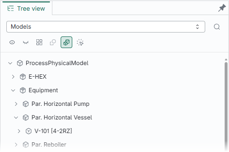
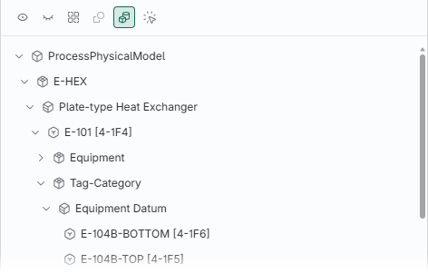
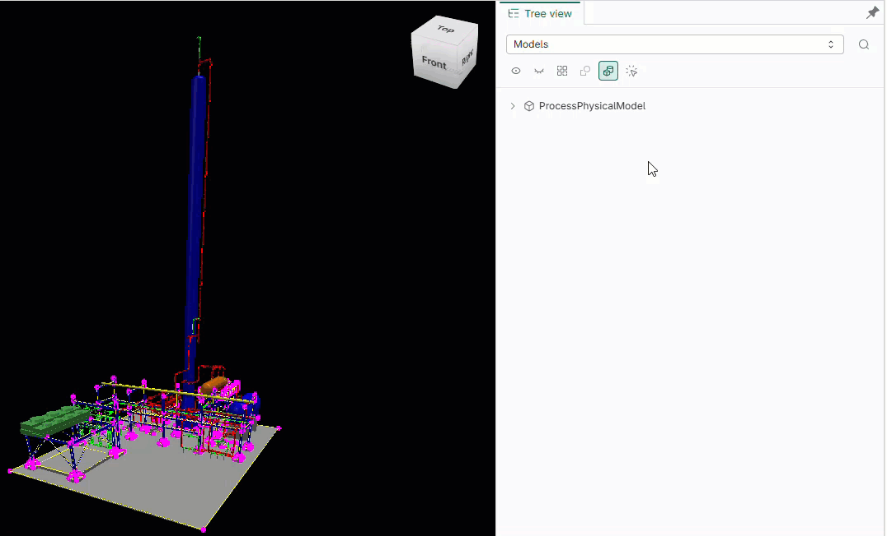
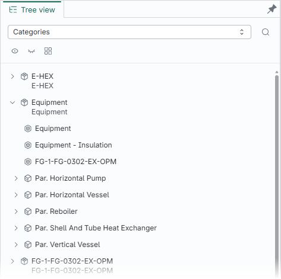
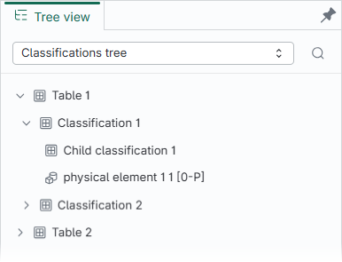
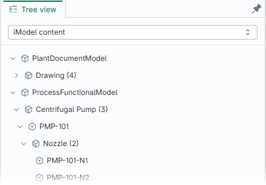
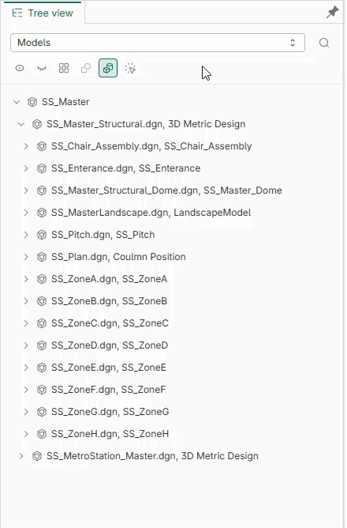
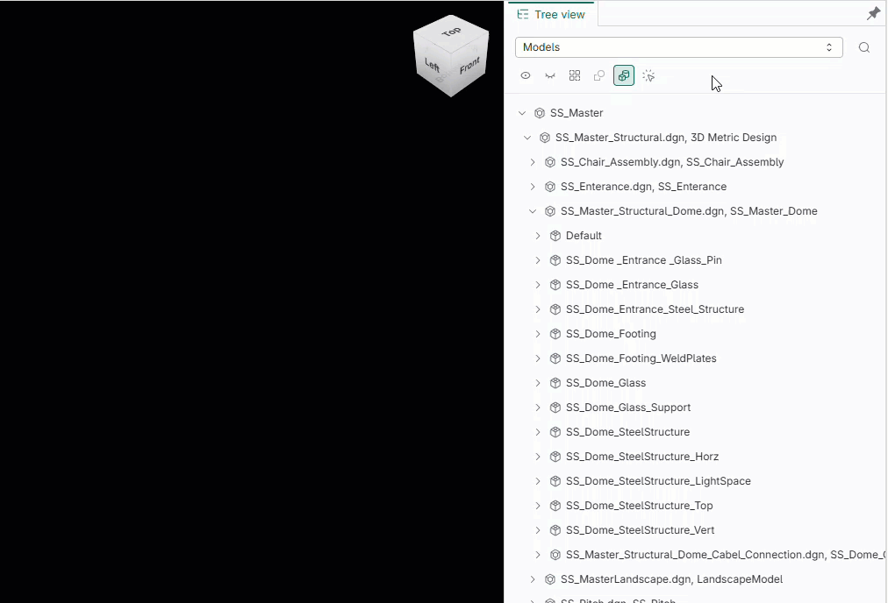

# @itwin/tree-widget-react

Copyright © Bentley Systems, Incorporated. All rights reserved.

The `@itwin/tree-widget-react` package provides React components to build a widget with tree components' selector, along with all the building blocks that can be used individually.



## Table of Contents

- [Usage](#usage)
- [Localization](#localization)
- [Tree integration](#tree-integration)
  - [Using an explicit viewport](#using-an-explicit-viewport)
  - [Tree widget context](#tree-widget-context)
  - [Tree actions](#tree-actions)
- [Components](#components)
  - [Selectable tree](#selectable-tree)
  - [Models tree](#models-tree)
    - [Configuring the hierarchy](#configuring-the-hierarchy)
    - [Focus mode](#focus-mode)
    - [Custom models tree](#custom-models-tree)
    - [Displaying a subset of the tree](#displaying-a-subset-of-the-tree)
  - [Categories tree](#categories-tree)
    - [Configuring the hierarchy](#configuring-the-hierarchy-1)
    - [Custom categories tree](#custom-categories-tree)
  - [Classifications tree](#classifications-tree)
    - [Configuring the hierarchy and visibility](#configuring-the-hierarchy-and-visibility)
    - [Custom classifications tree and label search](#custom-classifications-tree-and-label-search)
    - [Searching by instance key](#searching-by-instance-key)
    - [Merging multiple iModel versions](#merging-multiple-imodel-versions)
  - [iModel content tree](#imodel-content-tree)
  - [Custom trees](#custom-trees)
    - [Custom basic tree](#custom-basic-tree)
    - [Custom visibility tree](#custom-visibility-tree)
  - [Hierarchy level size limiting](#hierarchy-level-size-limiting)
  - [Hierarchy level filtering](#hierarchy-level-filtering)
  - [Creating unified selection storage](#creating-unified-selection-storage)
- [Telemetry](#telemetry)
  - [Performance tracking](#performance-tracking)
  - [Usage tracking](#usage-tracking)
  - [Logging](#logging)
  - [Example](#example)

## Usage

Typically, the package is used with an [AppUI](https://github.com/iTwin/appui/tree/master/ui/appui-react) based application, but the building blocks may also be used with any other iTwin.js React app.

Place a single `TreeWidgetContextProvider` near the root of the application, above all tree widget components. The provider initializes localization, logging, and shared tree resources required by the components. Standard tree components initialize their own telemetry context:

<!-- [[include: [TreeWidget.TreeWidgetInitializeImports, TreeWidget.TreeWidgetInitialize], tsx]] -->
<!-- BEGIN EXTRACTION -->

```tsx
import { TreeWidgetContextProvider } from "@itwin/tree-widget-react";

function App() {
  return (
    <TreeWidgetContextProvider localization={IModelApp.localization}>{/* application content, including all tree components */}</TreeWidgetContextProvider>
  );
}
```

<!-- END EXTRACTION -->

In [AppUI](https://github.com/iTwin/appui/tree/master/ui/appui-react) based applications widgets are typically provided using `UiItemsProvider` implementations. The `@itwin/tree-widget-react` package delivers `createTreeWidget` function that can be used to add the tree widget to UI through a `UiItemsProvider`:

<!-- [[include: [TreeWidget.RegisterExampleImports, TreeWidget.RegisterExample], tsx]] -->
<!-- BEGIN EXTRACTION -->

```tsx
import { UiItemsManager } from "@itwin/appui-react";
import { createTreeWidget, ModelsTreeComponent } from "@itwin/tree-widget-react";

UiItemsManager.register({
  id: "tree-widget-provider",
  getWidgets: () =>
    [
      createTreeWidget({
        // localization object for localizing widget components
        localization: IModelApp.localization,
        trees: [
          // add a custom component
          { id: "my-tree-id", startIcon: <svg />, getLabel: () => "My Custom Tree", render: () => <>This is my custom tree.</> },
          // add the Models tree component delivered with the package
          {
            id: ModelsTreeComponent.id,
            // display the widget header search box for this tree
            isSearchable: true,
            // use `ModelsTreeComponent.getLabel` to get the localized default label for models tree
            getLabel: ({ standardLabels }) => ModelsTreeComponent.getLabel({ standardLabels }),
            render: ({ treeLabel, searchText }) => (
              <ModelsTreeComponent
                // label for the tree, used for accessibility purposes
                treeLabel={treeLabel}
                searchText={searchText}
                // see "Creating unified selection storage" section for example implementation
                selectionStorage={unifiedSelectionStorage}
              />
            ),
          },
        ],
      }),
    ] as readonly Widget[],
});
```

<!-- END EXTRACTION -->

When `isSearchable` is set on a tree definition, the widget header search box is displayed for that tree. The `searchText` received by the render callback can be forwarded to the tree component, as shown above.

As seen in the above code snippet, `createTreeWidget` takes a list of trees that are displayed in the widget. This package delivers a number of tree components for everyone's use (see below), but providing custom trees is also an option.

## Localization

This package delivers a locale JSON file with English strings that follows the [`i18next JSON format`](https://www.i18next.com/misc/json-format). To enable localization, register `LOCALIZATION_NAMESPACES` during initialization:

<!-- [[include: [TreeWidget.LocalizationRegisterNamespacesImports, TreeWidget.LocalizationRegisterNamespaces], tsx]] -->
<!-- BEGIN EXTRACTION -->

```tsx
import { LOCALIZATION_NAMESPACES } from "@itwin/tree-widget-react";

// Register localization namespaces with `i18next` based localization provider.
for (const namespace of LOCALIZATION_NAMESPACES) {
  await IModelApp.localization.registerNamespace(namespace);
}
```

<!-- END EXTRACTION -->

When using `createTreeWidget`, pass a `localization` object and `TreeWidgetContextProvider` will be added at the widget scope automatically:

<!-- [[include: [TreeWidget.LocalizationCreateTreeWidgetImports, TreeWidget.LocalizationCreateTreeWidget], tsx]] -->
<!-- BEGIN EXTRACTION -->

```tsx
import { createTreeWidget, ModelsTreeComponent } from "@itwin/tree-widget-react";

// When using `createTreeWidget`, the `localization` object is supplied to `TreeWidgetContextProvider` automatically.
UiItemsManager.register({
  id: "tree-widget-provider",
  getWidgets: () =>
    [
      createTreeWidget({
        localization: IModelApp.localization,
        trees: [
          {
            id: ModelsTreeComponent.id,
            getLabel: ({ standardLabels }) => ModelsTreeComponent.getLabel({ standardLabels }),
            render: ({ treeLabel }) => <ModelsTreeComponent treeLabel={treeLabel} selectionStorage={unifiedSelectionStorage} />,
          },
        ],
      }),
    ] as readonly Widget[],
});
```

<!-- END EXTRACTION -->

When using tree components directly, wrap them with `TreeWidgetContextProvider`:

<!-- [[include: [TreeWidget.TreeWidgetContextProviderImports, TreeWidget.TreeWidgetContextProvider], tsx]] -->
<!-- BEGIN EXTRACTION -->

```tsx
import { TreeWidgetContextProvider } from "@itwin/tree-widget-react";

// When using tree components directly, wrap them with the tree widget context provider.
function TreeComponent() {
  return (
    <TreeWidgetContextProvider localization={IModelApp.localization}>
      <ModelsTreeComponent
        treeLabel="Models tree"
        selectionStorage={unifiedSelectionStorage}
        headerButtons={[
          (props) => <ModelsTreeComponent.ShowAllButton {...props} key={"ShowAllButton"} />,
          (props) => <ModelsTreeComponent.HideAllButton {...props} key={"HideAllButton"} />,
        ]}
      />
    </TreeWidgetContextProvider>
  );
}
```

<!-- END EXTRACTION -->

`TreeWidgetContextProvider` accepts a `localization` prop — an object with a `getLocalizedString(key: string): string` method. It is designed to work with the `Localization` interface from `@itwin/core-common`, but a custom implementation can be used as well by providing an object with a custom `getLocalizedString` function.

## Tree integration

The building blocks in this section apply to all tree components delivered with the package.

### Using an explicit viewport

`TreeWidgetViewport` decouples tree visibility from AppUI's active viewport. It may adapt an iTwin.js viewport or be implemented by another viewport integration.

An existing iTwin.js viewport can be adapted with `createTreeWidgetViewport` and passed directly to a tree:

<!-- [[include: [TreeWidget.TreeWidgetViewportReactImports, TreeWidget.TreeIntegrationCommonImports, TreeWidget.TreeWidgetViewportExampleImports, TreeWidget.TreeWidgetViewportExample], tsx]] -->
<!-- BEGIN EXTRACTION -->

```tsx
import { useMemo } from "react";

import { ModelsTreeComponent, TreeWidgetContextProvider } from "@itwin/tree-widget-react";
import type { SelectionStorage } from "@itwin/unified-selection";

import { createTreeWidgetViewport } from "@itwin/tree-widget-react";
import type { Viewport } from "@itwin/core-frontend";

interface ModelsTreeWithViewportProps {
  viewport: Viewport;
  selectionStorage: SelectionStorage;
}

function ModelsTreeWithViewport({ viewport, selectionStorage }: ModelsTreeWithViewportProps) {
  const treeViewport = useMemo(() => createTreeWidgetViewport(viewport), [viewport]);
  return (
    <TreeWidgetContextProvider localization={IModelApp.localization}>
      <ModelsTreeComponent treeLabel="Models tree" viewport={treeViewport} selectionStorage={selectionStorage} />
    </TreeWidgetContextProvider>
  );
}
```

<!-- END EXTRACTION -->

Alternatively, a non-iTwin.js viewport can integrate with tree visibility by implementing `TreeWidgetViewport`:

<!-- [[include: [TreeWidget.TreeIntegrationCommonImports, TreeWidget.CustomTreeWidgetViewportExampleImports, TreeWidget.CustomTreeWidgetViewportExample], tsx]] -->
<!-- BEGIN EXTRACTION -->

```tsx
import { ModelsTreeComponent, TreeWidgetContextProvider } from "@itwin/tree-widget-react";
import type { SelectionStorage } from "@itwin/unified-selection";

import type { TreeWidgetViewport } from "@itwin/tree-widget-react";

interface CustomViewport extends TreeWidgetViewport {
  readonly viewType: "3d";
  // ...the custom viewport implements the remaining TreeWidgetViewport members.
}

function ModelsTreeWithCustomViewport({ viewport, selectionStorage }: { viewport: CustomViewport; selectionStorage: SelectionStorage }) {
  return (
    <TreeWidgetContextProvider localization={IModelApp.localization}>
      <ModelsTreeComponent treeLabel="Models tree" viewport={viewport} selectionStorage={selectionStorage} />
    </TreeWidgetContextProvider>
  );
}
```

<!-- END EXTRACTION -->

### Tree widget context

When tree components are used directly, place a single `TreeWidgetContextProvider` near the root of the application instead of wrapping each tree separately. The provider supplies localization, logging, and shared tree resources. Standard tree components supply their own telemetry context:

<!-- [[include: [TreeWidget.TreeIntegrationCommonImports, TreeWidget.TreeWidgetContextExampleImports, TreeWidget.TreeWidgetContextExample], tsx]] -->
<!-- BEGIN EXTRACTION -->

```tsx
import { ModelsTreeComponent, TreeWidgetContextProvider } from "@itwin/tree-widget-react";
import type { SelectionStorage } from "@itwin/unified-selection";

import { CategoriesTreeComponent } from "@itwin/tree-widget-react";

function TreesWithSharedContext({ selectionStorage }: { selectionStorage: SelectionStorage }) {
  return (
    <TreeWidgetContextProvider localization={IModelApp.localization}>
      <ModelsTreeComponent
        treeLabel="Models tree"
        selectionStorage={selectionStorage}
        headerButtons={[
          (props) => <ModelsTreeComponent.ShowAllButton {...props} key="show-all" />,
          (props) => <ModelsTreeComponent.HideAllButton {...props} key="hide-all" />,
        ]}
      />
      <CategoriesTreeComponent
        treeLabel="Categories tree"
        selectionStorage={selectionStorage}
        headerButtons={[
          (props) => <CategoriesTreeComponent.ShowAllButton {...props} key="show-all" />,
          (props) => <CategoriesTreeComponent.HideAllButton {...props} key="hide-all" />,
        ]}
      />
    </TreeWidgetContextProvider>
  );
}
```

<!-- END EXTRACTION -->

### Tree actions

Tree components support separate inline, overflow-menu, and context-menu action callbacks. Each callback receives the target node and selected nodes, while the second callback argument provides access to the current tree renderer state. Node types can be determined using `ModelsTreeNode.getType`, `CategoriesTreeNode.getType`, or `ClassificationsTreeNode.getType`, which allows rendering actions only for the applicable nodes:

<!-- [[include: [TreeWidget.ModelsTreeExampleImports, TreeWidget.TreeActionsExampleImports, TreeWidget.TreeActionsExample], tsx]] -->
<!-- BEGIN EXTRACTION -->

```tsx
import { ModelsTreeComponent, TreeWidgetContextProvider } from "@itwin/tree-widget-react";

import { ModelsTreeNode, TreeActionBase } from "@itwin/tree-widget-react";

// `TreeActionBase` renders icons from an svg sprite href, e.g. `import inspectSvg from "@stratakit/icons/cursor-click.svg"`.
const inspectSvg = "#inspect-icon";
const exportSvg = "#export-icon";
const propertiesSvg = "#properties-icon";

interface ModelsTreeWithActionsProps {
  onInspect: (label: string) => void;
  onExport: (label: string) => void;
  onShowProperties: (label: string) => void;
}

function ModelsTreeWithActions({ onInspect, onExport, onShowProperties }: ModelsTreeWithActionsProps) {
  return (
    <TreeWidgetContextProvider localization={IModelApp.localization}>
      <ModelsTreeComponent
        treeLabel="Models tree with actions"
        selectionStorage={unifiedSelectionStorage}
        selectionMode="extended"
        // rendered directly on the node
        getInlineActions={(actionProps) => [
          <TreeActionBase key="inspect" label="Inspect selection" icon={inspectSvg} onClick={() => onInspect(actionProps.targetNode.label)} />,
        ]}
        // rendered in the node's overflow menu
        getMenuActions={(actionProps) => [
          <TreeActionBase key="export" label="Export node" icon={exportSvg} onClick={() => onExport(actionProps.targetNode.label)} />,
        ]}
        // rendered in the node's right-click context menu
        getContextMenuActions={(actionProps) => {
          if (ModelsTreeNode.getType(actionProps.targetNode.nodeData) !== "model") {
            return [];
          }
          return [
            <TreeActionBase
              key="properties"
              label="Show model properties"
              icon={propertiesSvg}
              onClick={() => onShowProperties(actionProps.targetNode.label)}
            />,
          ];
        }}
      />
    </TreeWidgetContextProvider>
  );
}
```

<!-- END EXTRACTION -->

## Components

While it is expected that this package will be mostly used with [AppUI](https://github.com/iTwin/appui/tree/master/ui/appui-react) and widget created through `createTreeWidget`, the package delivers components used within the widget to meet other use cases.

### Selectable tree

`SelectableTree` renders a tree selector and selected tree, based on the `trees` prop. Each tree definition contains a label, an optional icon and a render function that renders the component.

### Models tree

The component renders a tree that tries to replicate how a typical "Models" tree of the iModel would look like in the source application. There's also a header that renders models search box and various visibility control buttons.



Typical usage:

<!-- [[include: [TreeWidget.ModelsTreeExampleImports, TreeWidget.ModelsTreeExample], tsx]] -->
<!-- BEGIN EXTRACTION -->

```tsx
import { ModelsTreeComponent, TreeWidgetContextProvider } from "@itwin/tree-widget-react";

function MyWidget() {
  return (
    <TreeWidgetContextProvider localization={IModelApp.localization}>
      <ModelsTreeComponent
        // label for the tree, used for accessibility purposes
        treeLabel="Models tree"
        // see "Creating unified selection storage" section for example implementation
        selectionStorage={unifiedSelectionStorage}
        headerButtons={[
          (props) => <ModelsTreeComponent.ShowAllButton {...props} key={"ShowAllButton"} />,
          (props) => <ModelsTreeComponent.HideAllButton {...props} key={"HideAllButton"} />,
        ]}
      />
    </TreeWidgetContextProvider>
  );
}
```

<!-- END EXTRACTION -->

#### Configuring the hierarchy

Models hierarchy options are grouped by node type. EC class names use dot notation.

<!-- [[include: [TreeWidget.ModelsTreeExampleImports, TreeWidget.ModelsTreeHierarchyConfigExample], tsx]] -->
<!-- BEGIN EXTRACTION -->

```tsx
import { ModelsTreeComponent, TreeWidgetContextProvider } from "@itwin/tree-widget-react";

function ConfiguredModelsTree() {
  return (
    <TreeWidgetContextProvider localization={IModelApp.localization}>
      <ModelsTreeComponent
        treeLabel="Configured models tree"
        selectionStorage={unifiedSelectionStorage}
        hierarchyConfig={{
          // Do not display the root subject node.
          subjects: { root: "exclude" },
          elements: {
            // Display this class and its sub-classes as element nodes.
            baseClass: "BisCore.PhysicalElement",
            // Exclude this class and its sub-classes from the tree.
            excludedClasses: ["BisCore.SpatialLocationElement"],
            // Show class grouping nodes with children counts
            classGrouping: "enable-with-counts",
          },
          // Display models that contain no elements.
          models: { withoutElements: "include" },
        }}
      />
    </TreeWidgetContextProvider>
  );
}
```

<!-- END EXTRACTION -->

Available header buttons:

- `ModelsTreeComponent.ShowAllButton` makes everything in the iModel displayed.
- `ModelsTreeComponent.HideAllButton` makes everything in the iModel hidden by turning off all models.
- `ModelsTreeComponent.InvertButton` inverts display of all models.
- `ModelsTreeComponent.View2DButton` toggles plan projection models' display.
- `ModelsTreeComponent.View3DButton` toggles non-plan projection models' display.
- `ModelsTreeComponent.ToggleInstancesFocusButton` enables/disables instances focusing mode.

#### Focus mode

The Models tree can be used in a "focus mode" where the tree is automatically filtered to show only elements that are selected in the application. The mode can be controlled through a toggle button in the component's header. The feature is mutually exclusive with "search" - the toggle button is disabled while a search is active, and activating a search turns focus mode off.



#### Custom models tree

This package provides building blocks for custom models tree:

- `useModelsTree` - hook for creating and managing models tree state.
- `useModelsTreeButtonProps` - hook for creating props for models tree buttons.

Example:

<!-- [[include: [TreeWidget.ModelsTreeExampleImports, TreeWidget.CustomModelsTreeExampleImports, TreeWidget.CustomModelsTreeExample], tsx]] -->
<!-- BEGIN EXTRACTION -->

```tsx
import { ModelsTreeComponent, TreeWidgetContextProvider } from "@itwin/tree-widget-react";

import { useCallback, useMemo } from "react";
import {
  createTreeWidgetViewport,
  SelectableTree,
  useModelsTree,
  useModelsTreeButtonProps,
  VisibilityTree,
  VisibilityTreeRenderer,
} from "@itwin/tree-widget-react";
import type { SelectionStorage } from "@itwin/unified-selection";
import type { IModelConnection, Viewport } from "@itwin/core-frontend";
import type { ComponentPropsWithoutRef } from "react";

type VisibilityTreeRendererProps = ComponentPropsWithoutRef<typeof VisibilityTreeRenderer>;
type CustomModelsTreeRendererProps = Parameters<ComponentPropsWithoutRef<typeof VisibilityTree>["treeRenderer"]>[0];
function CustomModelsTreeRenderer(props: CustomModelsTreeRendererProps) {
  const getTreeItemProps = props.getTreeItemProps;
  const getTreeItemPropsCallback = useCallback<Required<VisibilityTreeRendererProps>["getTreeItemProps"]>(
    (node) => {
      const nodeProps = getTreeItemProps(node);
      return {
        ...nodeProps,
        label: <>Custom node - {nodeProps.label}</>,
        description: <>Sublabel - {node.label}</>,
      };
    },
    [getTreeItemProps],
  );
  return <VisibilityTreeRenderer {...props} treeLabel="Custom models tree" getTreeItemProps={getTreeItemPropsCallback} />;
}

interface CustomModelsTreeProps {
  imodel: IModelConnection;
  viewport: Viewport;
  selectionStorage: SelectionStorage;
}

function CustomModelsTree({ imodel, viewport, selectionStorage }: CustomModelsTreeProps) {
  const activeView = useMemo(() => createTreeWidgetViewport(viewport), [viewport]);
  const { buttonProps } = useModelsTreeButtonProps({ imodel, viewport: activeView });
  const { treeProps, getTreeItemProps } = useModelsTree({ activeView });

  return (
    <SelectableTree
      buttons={[
        <ModelsTreeComponent.ShowAllButton {...buttonProps} key={"ShowAllButton"} />,
        <ModelsTreeComponent.HideAllButton {...buttonProps} key={"HideAllButton"} />,
      ]}
    >
      <VisibilityTree
        {...treeProps}
        selectionStorage={selectionStorage}
        imodel={imodel}
        treeRenderer={(rendererProps) => <CustomModelsTreeRenderer {...rendererProps} getTreeItemProps={(node) => getTreeItemProps(node, rendererProps)} />}
      />
    </SelectableTree>
  );
}

function CustomModelsTreeComponent(props: CustomModelsTreeProps) {
  return (
    <TreeWidgetContextProvider localization={IModelApp.localization}>
      <CustomModelsTree {...props} />
    </TreeWidgetContextProvider>
  );
}
```

<!-- END EXTRACTION -->

#### Displaying a subset of the tree

Models tree allows displaying a subset of all nodes by providing a `getSearchPaths` or `getSubTreePaths` functions. These functions receive a helper function called `createInstanceKeyPaths`.
For `getSearchPaths` this helper function can generate paths from either:

- a list of instance keys (`targetItems`)
- a label string

For `getSubTreePaths` this helper function can generate paths from:

- a list of instance keys (`targetItems`)

Based on the returned paths, the displayed hierarchy consists only of the targeted nodes, their ancestors, and their children.

Use `getSearchPaths` when you need more control over filtering behaviour. Here are some example use cases:

- **Filter by known instance keys**: You already have a list of `InstanceKey` items that should remain in the tree. Pass them as `targetItems` to `createInstanceKeyPaths`.

  <!-- [[include: [TreeWidget.GetFilteredPathsComponentWithTargetItemsExample], tsx]] -->
  <!-- BEGIN EXTRACTION -->

  ```tsx
  type UseModelsTreeProps = Parameters<typeof useModelsTree>[0];
  type GetSearchPathsType = Exclude<UseModelsTreeProps["getSearchPaths"], undefined>;

  function CustomModelsTreeComponentWithTargetItems({
    viewport,
    selectionStorage,
    imodel,
    targetItems,
  }: {
    viewport: Viewport;
    selectionStorage: SelectionStorage;
    imodel: IModelConnection;
    targetItems: InstanceKey[];
  }) {
    const getSearchPaths = useCallback<GetSearchPathsType>(
      async ({ createInstanceKeyPaths }) => {
        return createInstanceKeyPaths({
          // list of instance keys representing nodes that should be displayed in the hierarchy
          targetItems,
        });
      },
      [targetItems],
    );

    const activeView = useMemo(() => createTreeWidgetViewport(viewport), [viewport]);
    const { treeProps, getTreeItemProps } = useModelsTree({ activeView, getSearchPaths });

    return (
      <VisibilityTree
        {...treeProps}
        selectionStorage={selectionStorage}
        imodel={imodel}
        treeRenderer={(rendererProps) => (
          <VisibilityTreeRenderer {...rendererProps} treeLabel="Custom models tree" getTreeItemProps={(node) => getTreeItemProps(node, rendererProps)} />
        )}
      />
    );
  }
  ```

  <!-- END EXTRACTION -->

- **Post-process the paths created `createInstanceKeyPaths`**: Use `searchText` string to generate the paths, then apply additional filtering - e.g., remove paths that are too long.

  <!-- [[include: [TreeWidget.GetFilteredPathsComponentWithPostProcessingExample], tsx]] -->
  <!-- BEGIN EXTRACTION -->

  ```tsx
  function CustomModelsTreeComponentWithPostProcessing({
    viewport,
    selectionStorage,
    imodel,
  }: {
    viewport: Viewport;
    selectionStorage: SelectionStorage;
    imodel: IModelConnection;
  }) {
    const getSearchPaths = useCallback<GetSearchPathsType>(async ({ createInstanceKeyPaths, searchText }) => {
      const searchTree = await createInstanceKeyPaths({ label: searchText ?? "test" });
      // post-process the search tree - e.g. limit displayed depth and auto-expand the remaining nodes
      const limitDepthAndAutoExpand = (entries: HierarchySearchTree[], depth: number): HierarchySearchTree[] => {
        if (depth >= 5) {
          return [];
        }
        const result = new Array<HierarchySearchTree>();
        for (const entry of entries) {
          const children = entry.children ? limitDepthAndAutoExpand(entry.children, depth + 1) : undefined;
          result.push({ ...entry, options: { autoExpand: true }, children });
        }
        return result;
      };
      return limitDepthAndAutoExpand(searchTree, 1);
    }, []);

    const activeView = useMemo(() => createTreeWidgetViewport(viewport), [viewport]);
    const { treeProps, getTreeItemProps } = useModelsTree({ activeView, getSearchPaths });

    return (
      <VisibilityTree
        {...treeProps}
        selectionStorage={selectionStorage}
        imodel={imodel}
        treeRenderer={(rendererProps) => (
          <VisibilityTreeRenderer {...rendererProps} treeLabel="Custom models tree" getTreeItemProps={(node) => getTreeItemProps(node, rendererProps)} />
        )}
      />
    );
  }
  ```

  <!-- END EXTRACTION -->

- **Apply custom logic to generate instance keys**: Generate instance keys using custom implementation. For example: only apply the given filter string to `bis.Subject` and `bis.Model` instances, but not others (`bis.Category`, `bis.GeometricElement`).

  <!-- [[include: [TreeWidget.GetFilteredPathsComponentWithFilterAndTargetItemsExample], tsx]] -->
  <!-- BEGIN EXTRACTION -->

  ```tsx
  function CustomModelsTreeComponentWithFilterAndTargetItems({
    viewport,
    selectionStorage,
    imodel,
    filter,
  }: {
    viewport: Viewport;
    selectionStorage: SelectionStorage;
    imodel: IModelConnection;
    filter: string | undefined;
  }) {
    const getSearchPaths = useCallback<GetSearchPathsType>(
      async ({ createInstanceKeyPaths, searchText }) => {
        if (!searchText) {
          // if search text is not defined, return `undefined` to avoid applying empty filter
          return undefined;
        }
        const targetItems = new Array<InstanceKey>();
        for await (const row of imodel.createQueryReader(
          `
            SELECT ClassName, Id
            FROM (
              SELECT
                ec_classname(e.ECClassId, 's.c') ClassName,
                e.ECInstanceId Id,
                COALESCE(e.UserLabel, e.CodeValue) Label
              FROM BisCore.Subject e
  
              UNION ALL
  
              SELECT
                ec_classname(m.ECClassId, 's.c') ClassName,
                m.ECInstanceId Id,
                COALESCE(e.UserLabel, e.CodeValue) Label
              FROM BisCore.GeometricModel3d m
              JOIN BisCore.Element e ON e.ECInstanceId = m.ModeledElement.Id
              WHERE NOT m.IsPrivate
                AND EXISTS (SELECT 1 FROM BisCore.Element WHERE Model.Id = m.ECInstanceId)
                AND json_extract(e.JsonProperties, '$.PhysicalPartition.Model.Content') IS NULL
                AND json_extract(e.JsonProperties, '$.GraphicalPartition3d.Model.Content') IS NULL
            )
            WHERE Label LIKE '%' || ? || '%' ESCAPE '\\'
          `,
          QueryBinder.from([searchText]),
          { rowFormat: QueryRowFormat.UseECSqlPropertyIndexes },
        )) {
          targetItems.push({ id: row[1], className: row[0] });
        }
        // `createInstanceKeyPaths` doesn't automatically set the `autoExpand` flag - set it here
        const searchTree = await createInstanceKeyPaths({ targetItems });
        return searchTree.map((entry) => ({ ...entry, options: { autoExpand: true } }));
      },
      [imodel],
    );

    const activeView = useMemo(() => createTreeWidgetViewport(viewport), [viewport]);
    const { treeProps, getTreeItemProps } = useModelsTree({ activeView, getSearchPaths, searchText: filter });
    return (
      <VisibilityTree
        {...treeProps}
        selectionStorage={selectionStorage}
        imodel={imodel}
        treeRenderer={(rendererProps) => (
          <VisibilityTreeRenderer {...rendererProps} treeLabel="Custom models tree" getTreeItemProps={(node) => getTreeItemProps(node, rendererProps)} />
        )}
      />
    );
  }
  ```

  <!-- END EXTRACTION -->

Use `getSubTreePaths` when you need to restrict the visible hierarchy to a specific sub-tree of nodes, without changing how filtering works. Here is an example use case:

**Restrict the hierarchy to a sub-tree and keep the default filtering logic**: You already have a list of `InstanceKey` items that should remain in the tree. Pass them as `targetItems` to `createInstanceKeyPaths`. This will restrict the hierarchy to a sub-tree, but filtering will work as before.

<!-- [[include: [TreeWidget.GetSubTreePathsComponentWithTargetItemsExample], tsx]] -->
<!-- BEGIN EXTRACTION -->

```tsx
type UseModelsTreeProps = Props<typeof useModelsTree>;
type GetSubTreePathsType = NonNullable<UseModelsTreeProps["getSubTreePaths"]>;

function CustomModelsTreeComponentWithTargetItems({
  viewport,
  selectionStorage,
  imodel,
  targetItems,
}: {
  viewport: Viewport;
  selectionStorage: SelectionStorage;
  imodel: IModelConnection;
  targetItems: InstanceKey[];
}) {
  const getSubTreePaths = useCallback<GetSubTreePathsType>(
    async ({ createInstanceKeyPaths }) => {
      return createInstanceKeyPaths({
        // List of instance keys representing nodes that should be part of the hierarchy.
        // Only these nodes, their ancestors and children will be part of that hierarchy.
        targetItems,
      });
    },
    [targetItems],
  );

  const activeView = useMemo(() => createTreeWidgetViewport(viewport), [viewport]);
  const { treeProps, getTreeItemProps } = useModelsTree({ activeView, getSubTreePaths });

  return (
    <VisibilityTree
      {...treeProps}
      selectionStorage={selectionStorage}
      imodel={imodel}
      treeRenderer={(rendererProps) => (
        <VisibilityTreeRenderer {...rendererProps} treeLabel="Custom models tree" getTreeItemProps={(node) => getTreeItemProps(node, rendererProps)} />
      )}
    />
  );
}
```

<!-- END EXTRACTION -->

### Categories tree

The component, based on the active view, renders a hierarchy of either spatial (3d) or drawing (2d) categories. The hierarchy consists of multiple levels: definition containers, their categories (spatial or drawing), categories' sub-categories, and (when enabled via hierarchy configuration options) category elements. There's also a header that renders a categories search box and various visibility control buttons.



Typical usage:

<!-- [[include: [TreeWidget.CategoriesTreeExampleImports, TreeWidget.CategoriesTreeExample], tsx]] -->
<!-- BEGIN EXTRACTION -->

```tsx
import { CategoriesTreeComponent, TreeWidgetContextProvider } from "@itwin/tree-widget-react";

function MyWidget() {
  return (
    <TreeWidgetContextProvider localization={IModelApp.localization}>
      <CategoriesTreeComponent
        // label for the tree, used for accessibility purposes
        treeLabel="Categories tree"
        // see "Creating unified selection storage" section for example implementation
        selectionStorage={unifiedSelectionStorage}
        headerButtons={[(props) => <CategoriesTreeComponent.ShowAllButton {...props} />, (props) => <CategoriesTreeComponent.HideAllButton {...props} />]}
      />
    </TreeWidgetContextProvider>
  );
}
```

<!-- END EXTRACTION -->

#### Configuring the hierarchy

Categories trees can display element nodes, exclude element classes, hide subcategories, and display categories without elements:

<!-- [[include: [TreeWidget.CategoriesTreeExampleImports, TreeWidget.CategoriesTreeHierarchyConfigExample], tsx]] -->
<!-- BEGIN EXTRACTION -->

```tsx
import { CategoriesTreeComponent, TreeWidgetContextProvider } from "@itwin/tree-widget-react";

function ConfiguredCategoriesTree() {
  return (
    <TreeWidgetContextProvider localization={IModelApp.localization}>
      <CategoriesTreeComponent
        treeLabel="Configured categories tree"
        selectionStorage={unifiedSelectionStorage}
        hierarchyConfig={{
          // Display element nodes, except instances of this class and its subclasses.
          elements: {
            nodes: "include",
            excludedClasses: ["BisCore.SpatialLocationElement"],
          },
          // Display categories that contain no elements.
          categories: { withoutElements: "include" },
          // Do not display subcategory nodes.
          subCategories: { nodes: "exclude" },
        }}
      />
    </TreeWidgetContextProvider>
  );
}
```

<!-- END EXTRACTION -->

Available header buttons:

- `ModelsTreeComponent.ShowAllButton` makes all categories and their subcategories displayed.
- `ModelsTreeComponent.HideAllButton` makes all categories hidden.
- `ModelsTreeComponent.InvertButton` inverts display of all categories.

#### Custom categories tree

This package provides building blocks for custom categories tree:

- `useCategoriesTree` - hook for creating and managing categories tree state.
- `useCategoriesTreeButtonProps` - hook for creating props for categories tree buttons.

Example:

<!-- [[include: [TreeWidget.CategoriesTreeExampleImports, TreeWidget.CustomCategoriesTreeExampleImports, TreeWidget.CustomCategoriesTreeExample], tsx]] -->
<!-- BEGIN EXTRACTION -->

```tsx
import { CategoriesTreeComponent, TreeWidgetContextProvider } from "@itwin/tree-widget-react";

import {
  createTreeWidgetViewport,
  SelectableTree,
  useCategoriesTree,
  useCategoriesTreeButtonProps,
  VisibilityTree,
  VisibilityTreeRenderer,
} from "@itwin/tree-widget-react";
import type { IModelConnection, Viewport } from "@itwin/core-frontend";
import type { SelectionStorage } from "@itwin/unified-selection";
import type { ComponentPropsWithoutRef } from "react";

type VisibilityTreeRendererProps = ComponentPropsWithoutRef<typeof VisibilityTreeRenderer>;
type CustomCategoriesTreeRendererProps = Parameters<ComponentPropsWithoutRef<typeof VisibilityTree>["treeRenderer"]>[0];

function CustomCategoriesTreeRenderer(props: CustomCategoriesTreeRendererProps) {
  const getTreeItemProps = props.getTreeItemProps;
  const getTreeItemPropsCallback = useCallback<Required<VisibilityTreeRendererProps>["getTreeItemProps"]>(
    (node) => {
      const nodeProps = getTreeItemProps(node);
      return {
        ...nodeProps,
        label: <>Custom node - {nodeProps.label}</>,
        description: <>Custom sub label</>,
      };
    },
    [getTreeItemProps],
  );
  return <VisibilityTreeRenderer {...props} treeLabel="Custom categories tree" getTreeItemProps={getTreeItemPropsCallback} />;
}

interface CustomCategoriesTreeProps {
  imodel: IModelConnection;
  viewport: Viewport;
  selectionStorage: SelectionStorage;
}

function CustomCategoriesTree({ imodel, viewport, selectionStorage }: CustomCategoriesTreeProps) {
  const activeView = useMemo(() => createTreeWidgetViewport(viewport), [viewport]);
  const { buttonProps } = useCategoriesTreeButtonProps({ viewport: activeView });
  const { treeProps, getTreeItemProps } = useCategoriesTree({ activeView });
  return (
    <SelectableTree
      buttons={[
        <CategoriesTreeComponent.ShowAllButton {...buttonProps} key={"ShowAllButton"} />,
        <CategoriesTreeComponent.HideAllButton {...buttonProps} key={"HideAllButton"} />,
      ]}
    >
      <VisibilityTree
        {...treeProps}
        selectionStorage={selectionStorage}
        imodel={imodel}
        treeRenderer={(rendererProps) => <CustomCategoriesTreeRenderer {...rendererProps} getTreeItemProps={(node) => getTreeItemProps(node, rendererProps)} />}
      />
    </SelectableTree>
  );
}

function CustomCategoriesTreeComponent(props: CustomCategoriesTreeProps) {
  return (
    <TreeWidgetContextProvider localization={IModelApp.localization}>
      <CustomCategoriesTree {...props} />
    </TreeWidgetContextProvider>
  );
}
```

<!-- END EXTRACTION -->

### Classifications tree

The Classifications tree displays classifications and the 3D geometric elements assigned to them. It supports visibility controls, label search, classification and element instance-key search, and classification renaming.



Typical usage:

<!-- [[include: [TreeWidget.ClassificationsTreeComponentImports, TreeWidget.TreeWidgetContextProviderImports, TreeWidget.ClassificationsTreeSelectionStorageImports, TreeWidget.ClassificationsTreeExample], tsx]] -->
<!-- BEGIN EXTRACTION -->

```tsx
import { ClassificationsTreeComponent } from "@itwin/tree-widget-react";

import { TreeWidgetContextProvider } from "@itwin/tree-widget-react";

import type { SelectionStorage } from "@itwin/unified-selection";

interface MyClassificationsTreeProps {
  selectionStorage: SelectionStorage;
}

function MyClassificationsTree({ selectionStorage }: MyClassificationsTreeProps) {
  return (
    <TreeWidgetContextProvider localization={IModelApp.localization}>
      <ClassificationsTreeComponent
        treeLabel="Classifications tree"
        selectionStorage={selectionStorage}
        hierarchyConfig={{
          // Set the code of the ClassificationSystem element that contains the classification tables to display.
          rootClassificationSystemCode: "My Classification System",
        }}
        emptyTreeContent={<>No classifications are available.</>}
      />
    </TreeWidgetContextProvider>
  );
}
```

<!-- END EXTRACTION -->

#### Configuring the hierarchy and visibility

The `hierarchyConfig` can select a root classification system and exclude element classes. `rootClassificationSystemCode` is the code value of the classification system that contains the desired classification tables and classifications.

Classifications display is controlled using their associated categories. When the categories cannot be derived through the elements under that classification, the relationship can be configured explicitly using `classificationToCategoriesRelationshipSpecification`. This allows resolving related categories correctly, so changing a classification's display affects the intended categories. It also has these benefits:

- Without this specification, the `Classification -> ClassificationSystems.ElementHasClassifications -> Element -> Category` relationship path is used, which results in slightly slower queries.
- When a classification has no elements of its own, the fallback path cannot find its associated categories. Configuring the relationship allows those categories to be resolved and their visibility to be changed with the classification.

<!-- [[include: [TreeWidget.ClassificationsTreeComponentImports, TreeWidget.TreeWidgetContextProviderImports, TreeWidget.ClassificationsTreeSelectionStorageImports, TreeWidget.ClassificationsTreeConfigExample], tsx]] -->
<!-- BEGIN EXTRACTION -->

```tsx
import { ClassificationsTreeComponent } from "@itwin/tree-widget-react";

import { TreeWidgetContextProvider } from "@itwin/tree-widget-react";

import type { SelectionStorage } from "@itwin/unified-selection";

function ConfiguredClassificationsTree({ selectionStorage }: { selectionStorage: SelectionStorage }) {
  return (
    <TreeWidgetContextProvider localization={IModelApp.localization}>
      <ClassificationsTreeComponent
        treeLabel="Configured classifications tree"
        selectionStorage={selectionStorage}
        hierarchyConfig={{
          // Set the code of the ClassificationSystem element that contains the classification tables to display.
          rootClassificationSystemCode: "My Classification System",
          // Exclude instances of this class and its subclasses from the tree.
          elements: { excludedClasses: ["BisCore.SpatialLocationElement"] },
        }}
        visibilityHandlerConfig={{
          // Use a custom relationship to determine the categories related to a classification.
          classificationToCategoriesRelationshipSpecification: {
            fullClassName: "MySchema.ClassificationHasCategory",
            source: "classification",
          },
        }}
      />
    </TreeWidgetContextProvider>
  );
}
```

<!-- END EXTRACTION -->

#### Custom classifications tree and label search

A custom classifications tree can be built with `useClassificationsTree`. The search limit may be a number or `"unbounded"`:

<!-- [[include: [TreeWidget.TreeWidgetContextProviderImports, TreeWidget.ClassificationsTreeSelectionStorageImports, TreeWidget.ClassificationsTreeIModelImports, TreeWidget.ClassificationsTreeSearchExampleImports, TreeWidget.ClassificationsTreeSearchExample], tsx]] -->
<!-- BEGIN EXTRACTION -->

```tsx
import { TreeWidgetContextProvider } from "@itwin/tree-widget-react";

import type { SelectionStorage } from "@itwin/unified-selection";

import type { IModelConnection } from "@itwin/core-frontend";

import { useMemo } from "react";
import { createTreeWidgetViewport, useClassificationsTree, VisibilityTree, VisibilityTreeRenderer } from "@itwin/tree-widget-react";
import type { Viewport } from "@itwin/core-frontend";

interface SearchableClassificationsTreeProps {
  imodel: IModelConnection;
  viewport: Viewport;
  selectionStorage: SelectionStorage;
  searchText: string;
}

function SearchableClassificationsTree({ imodel, viewport, selectionStorage, searchText }: SearchableClassificationsTreeProps) {
  return (
    <TreeWidgetContextProvider localization={IModelApp.localization}>
      <SearchableClassificationsTreeContent imodel={imodel} viewport={viewport} selectionStorage={selectionStorage} searchText={searchText} />
    </TreeWidgetContextProvider>
  );
}

function SearchableClassificationsTreeContent({ imodel, viewport, selectionStorage, searchText }: SearchableClassificationsTreeProps) {
  const activeView = useMemo(() => createTreeWidgetViewport(viewport), [viewport]);
  const { treeProps, getTreeItemProps } = useClassificationsTree({
    activeView,
    hierarchyConfig: { rootClassificationSystemCode: "My Classification System" },
    searchText,
    // Use "unbounded" instead when every match must be returned.
    searchLimit: 250,
  });

  return (
    <VisibilityTree
      {...treeProps}
      imodel={imodel}
      selectionStorage={selectionStorage}
      treeRenderer={(rendererProps) => (
        <VisibilityTreeRenderer
          {...rendererProps}
          treeLabel="Searchable classifications tree"
          getTreeItemProps={(node) => getTreeItemProps(node, rendererProps)}
        />
      )}
    />
  );
}
```

<!-- END EXTRACTION -->

#### Searching by instance key

`useClassificationsTreeDefinition` supports searching for known classification or element instance keys. `targetItems` contains the classification table, classification or element keys whose hierarchy paths should be revealed. `onSearchPathsChanged` reports when matching paths change:

<!-- [[include: [TreeWidget.ClassificationsTreeIModelImports, TreeWidget.ClassificationsTreeInstanceSearchExampleImports, TreeWidget.ClassificationsTreeInstanceSearchExample], tsx]] -->
<!-- BEGIN EXTRACTION -->

```tsx
import type { IModelConnection } from "@itwin/core-frontend";

import { useClassificationsTreeDefinition } from "@itwin/tree-widget-react";
import type { InstanceKey } from "@itwin/presentation-shared";

interface ClassificationsTreeDefinitionProps {
  imodel: IModelConnection;
  targetItems: InstanceKey[];
  onSearchPathsChanged: (pathsFound: boolean) => void;
}

function useMyClassificationsTreeDefinition({ imodel, targetItems, onSearchPathsChanged }: ClassificationsTreeDefinitionProps) {
  return useClassificationsTreeDefinition({
    imodels: [imodel],
    hierarchyConfig: { rootClassificationSystemCode: "My Classification System" },
    search: {
      targetItems,
      limit: 250,
    },
    onSearchPathsChanged: (paths) => onSearchPathsChanged(paths !== undefined && paths.length > 0),
  });
}
```

<!-- END EXTRACTION -->

#### Merging multiple iModel versions

`useClassificationsTreeDefinition` can merge classifications from multiple versions of the same iModel. The versions are supplied in chronological order, from earliest to latest:

<!-- [[include: [TreeWidget.ClassificationsTreeIModelImports, TreeWidget.ClassificationsTreeInstanceSearchExampleImports, TreeWidget.ClassificationsTreeMultipleIModelsExample], tsx]] -->
<!-- BEGIN EXTRACTION -->

```tsx
import type { IModelConnection } from "@itwin/core-frontend";

import { useClassificationsTreeDefinition } from "@itwin/tree-widget-react";
import type { InstanceKey } from "@itwin/presentation-shared";

interface VersionedClassificationsTreeDefinitionProps {
  imodelVersions: IModelConnection[];
}

function useVersionedClassificationsTreeDefinition({ imodelVersions }: VersionedClassificationsTreeDefinitionProps) {
  return useClassificationsTreeDefinition({
    // Supply versions from earliest to latest.
    imodels: imodelVersions,
    hierarchyConfig: { rootClassificationSystemCode: "My Classification System" },
  });
}
```

<!-- END EXTRACTION -->

This hook requires a `TreeWidgetContextProvider` above it in the component tree.

### iModel content tree

The component renders a similar hierarchy to [Models tree](#models-tree), but with the following changes:

- Only the hierarchy, without a header is rendered.
- Visibility control is not allowed.
- There's less hiding of `Subject` and `Model` nodes.
- Show not only geometric, but all Models and Elements.

In general, the component is expected to be used by advanced users to inspect contents of the iModel.



Typical usage:

<!-- [[include: [TreeWidget.ImodelContentTreeExampleImports, TreeWidget.ImodelContentTreeExample], tsx]] -->
<!-- BEGIN EXTRACTION -->

```tsx
import { IModelContentTreeComponent } from "@itwin/tree-widget-react";

function MyWidget() {
  return (
    <IModelContentTreeComponent
      // label for the tree, used for accessibility purposes
      treeLabel="IModel content tree"
      // see "Creating unified selection storage" section for example implementation
      selectionStorage={unifiedSelectionStorage}
    />
  );
}
```

<!-- END EXTRACTION -->

### Custom trees

The package delivers a set of building blocks for creating trees that look and feel similar to the tree components provided by this package.

#### Custom basic tree

A "basic" tree is a tree that renders the hierarchy without visibility control - see [iModel content tree](#imodel-content-tree) for an example. Core components:

- `Tree` - component that manages tree state, selection and filtering.
- `TreeRenderer` - default renderer for tree data.

Example:

<!-- [[include: [TreeWidget.CustomTreeExampleImports, TreeWidget.CustomTreeExample], tsx]] -->
<!-- BEGIN EXTRACTION -->

```tsx
import type { ComponentPropsWithoutRef } from "react";
import type { IModelConnection } from "@itwin/core-frontend";
import { Tree, TreeRenderer } from "@itwin/tree-widget-react";
import { createPredicateBasedHierarchyDefinition } from "@itwin/presentation-hierarchies";

type TreeProps = ComponentPropsWithoutRef<typeof Tree>;
const getHierarchyDefinition: TreeProps["getHierarchyDefinition"] = ({ imodelAccess }) => {
  // create a hierarchy definition that defines what should be shown in the tree
  // see https://github.com/iTwin/presentation/blob/master/packages/hierarchies/learning/imodel/HierarchyDefinition.md
  return createPredicateBasedHierarchyDefinition({
    classHierarchyInspector: imodelAccess,
    hierarchy: {
      // For root nodes, select all BisCore.GeometricModel3d instances
      rootNodes: async ({ createSelectClause }) => [
        {
          fullClassName: "BisCore.GeometricModel3d",
          query: {
            ecsql: `
              SELECT
                ${await createSelectClause({
                  ecClassId: { selector: "this.ECClassId" },
                  ecInstanceId: { selector: "this.ECInstanceId" },
                  nodeLabel: {
                    of: { classAlias: "this", className: "BisCore.GeometricModel3d" },
                  },
                })}
              FROM BisCore.GeometricModel3d this
            `,
          },
        },
      ],
      childNodes: [],
    },
  });
};

interface MyTreeProps {
  imodel: IModelConnection;
}

function MyTree({ imodel }: MyTreeProps) {
  return (
    <Tree
      treeName="MyTree"
      imodel={imodel}
      selectionStorage={unifiedSelectionStorage}
      getHierarchyDefinition={getHierarchyDefinition}
      treeRenderer={(props) => <TreeRenderer {...props} treeLabel="My tree" />}
    />
  );
}
```

<!-- END EXTRACTION -->

#### Custom visibility tree

A visibility tree is a tree that renders the hierarchy and allows controlling visibility control through the use of "eye" checkboxes - see [Models](#models-tree) and [Categories](#categories-tree) trees. Core components:

- `VisibilityTree` - same as `Tree` component but additionally manages visibility of instances represented by tree nodes.
- `VisibilityTreeRenderer` - same as `TreeRenderer` but additionally renders checkboxes for visibility control.

Example:

<!-- [[include: [TreeWidget.CustomVisibilityTreeExampleImports, TreeWidget.CustomVisibilityTreeExample], tsx]] -->
<!-- BEGIN EXTRACTION -->

```tsx
import { BeEvent } from "@itwin/core-bentley";
import { VisibilityTree, VisibilityTreeRenderer } from "@itwin/tree-widget-react";
import { createPredicateBasedHierarchyDefinition } from "@itwin/presentation-hierarchies";
import type { ComponentPropsWithoutRef } from "react";
import type { IModelConnection } from "@itwin/core-frontend";

type VisibilityTreeProps = ComponentPropsWithoutRef<typeof VisibilityTree>;
const getHierarchyDefinition: VisibilityTreeProps["getHierarchyDefinition"] = ({ imodelAccess }) => {
  // create a hierarchy definition that defines what should be shown in the tree
  // see https://github.com/iTwin/presentation/blob/master/packages/hierarchies/learning/imodel/HierarchyDefinition.md
  return createPredicateBasedHierarchyDefinition({
    classHierarchyInspector: imodelAccess,
    hierarchy: {
      // For root nodes, select all BisCore.GeometricModel3d instances
      rootNodes: async ({ createSelectClause }) => [
        {
          fullClassName: "BisCore.GeometricModel3d",
          query: {
            ecsql: `
              SELECT
                ${await createSelectClause({
                  ecClassId: { selector: "this.ECClassId" },
                  ecInstanceId: { selector: "this.ECInstanceId" },
                  nodeLabel: {
                    of: { classAlias: "this", className: "BisCore.GeometricModel3d" },
                  },
                })}
              FROM BisCore.GeometricModel3d this
            `,
          },
        },
      ],
      childNodes: [],
    },
  });
};

const visibilityHandlerFactory: VisibilityTreeProps["visibilityHandlerFactory"] = () => {
  return {
    // event that can be used to notify tree when visibility of instances represented by tree nodes changes from outside.
    onVisibilityChange: new BeEvent(),
    async getVisibilityStatus(node: HierarchyNode): Promise<VisibilityStatus> {
      return { state: "visible" };
      // determine visibility status of the instance represented by tree node.
    },
    async changeVisibility(node: HierarchyNode, on: boolean): Promise<void> {
      // change visibility of the instance represented by tree node.
    },
    [Symbol.dispose]() {
      // if necessary, do some clean up before new visibility handler is created or component is unmounted.
    },
  };
};

interface MyVisibilityTreeProps {
  imodel: IModelConnection;
}

function MyVisibilityTree({ imodel }: MyVisibilityTreeProps) {
  return (
    <VisibilityTree
      treeName="MyVisibilityTree"
      imodel={imodel}
      selectionStorage={unifiedSelectionStorage}
      getHierarchyDefinition={getHierarchyDefinition}
      visibilityHandlerFactory={visibilityHandlerFactory}
      treeRenderer={(props) => <VisibilityTreeRenderer {...props} treeLabel="My visibility tree" />}
    />
  );
}
```

<!-- END EXTRACTION -->

### Hierarchy level size limiting

All tree components in this package enforce a hierarchy level size limit. This means that when a node is expanded, only a certain number of child nodes are loaded. The limit is enforced to prevent loading too many nodes at once and to keep the performance of the tree components at an acceptable level.

By default, the limit is set to `1000` nodes and components allow users to increase it to `10,000` for each hierarchy level individually:



### Hierarchy level filtering

All tree components in this package allow users to filter nodes at each hierarchy level. The filter is applied to a single hierarchy level, which allows users to reduce amount of nodes being loaded - this is especially useful when a [hierarchy level size limit](#hierarchy-level-size-limiting) is hit:



### Creating unified selection storage

Tree components that support selection synchronization, require a unified selection storage object created using `createStorage()` function from `@itwin/unified-selection` package.

Typically, we want one unified selection storage per application - this makes sure that selection in all application's components is synchronized. Below is an example implementation of `getUnifiedSelectionStorage` function that creates the storage and clears it when an iModel is closed:

<!-- [[include: [TreeWidget.SelectionStorageExampleImports, TreeWidget.SelectionStorageExample], tsx]] -->
<!-- BEGIN EXTRACTION -->

```tsx
import { IModelConnection } from "@itwin/core-frontend";
import { createStorage } from "@itwin/unified-selection";
import type { SelectionStorage } from "@itwin/unified-selection";

let unifiedSelectionStorage: SelectionStorage | undefined;
function getUnifiedSelectionStorage(): SelectionStorage {
  if (!unifiedSelectionStorage) {
    unifiedSelectionStorage = createStorage();
    IModelConnection.onClose.addListener((imodel) => {
      unifiedSelectionStorage!.clearStorage({ imodelKey: imodel.key });
    });
  }
  return unifiedSelectionStorage;
}
```

<!-- END EXTRACTION -->

In case the application is also using components driven by APIs from `@itwin/presentation-frontend` package, which has its own selection manager, the single unified selection storage object should be passed to [`initialize`](https://www.itwinjs.org/reference/presentation-frontend/core/presentation/initializestatic/) function, e.g.:

<!-- [[include: [TreeWidget.SelectionStorageInitializeExampleImports, TreeWidget.SelectionStorageInitializeExample], tsx]] -->
<!-- BEGIN EXTRACTION -->

```tsx
import { Presentation } from "@itwin/presentation-frontend";

await Presentation.initialize({ selection: { selectionStorage: getUnifiedSelectionStorage() } });
```

<!-- END EXTRACTION -->

## Telemetry

### Performance tracking

Components from this package allow consumers to track the performance of specific features.

Pass an `onPerformanceMeasured` callback directly to `CategoriesTreeComponent`, `ClassificationsTreeComponent`, `ExternalSourcesTreeComponent`, `IModelContentTreeComponent`, or `ModelsTreeComponent`. The callback receives the feature ID and elapsed time. Tracked features include:

- `"{tree}-initial-load"` - time it takes to load initial nodes after the tree is created.
- `"{tree}-hierarchy-level-load"` - time it takes to load child nodes when a node is expanded.
- `"{tree}-reload"` - time it takes to reload the tree after data in the iModel changes or it's being reloaded due to filtering.

Where `{tree}` specifies which tree component the feature is of.

### Usage tracking

Components from this package allow consumers to track the usage of specific features.

Pass an `onFeatureUsed` callback directly to `CategoriesTreeComponent`, `ClassificationsTreeComponent`, `ExternalSourcesTreeComponent`, `IModelContentTreeComponent`, or `ModelsTreeComponent`. The callback receives the feature ID. Tracked features include:

<!-- cspell:disable -->

- `"choose-{tree}"` - when a tree is selected in the tree selector.
- `"use-{tree}"` - when an interaction with a tree hierarchy happens. This includes any kind of interaction with nodes, including them being expanded/collapsed, selected, filtered, their visibility change, etc.
- `"{tree}-visibility-change"` - when visibility is toggled using an "eye" button.
- `"{tree}-error-timeout"` - when a request timeouts while loading hierarchy or filtering.
- `"{tree}-error-unknown"` - when an unknown error occurs while loading hierarchy or filtering.
- `"models-tree-showall"` - when "Show All" button is used in `ModelsTreeComponent`.
- `"models-tree-hideall"` - when "Hide All" button is used in `ModelsTreeComponent`.
- `"models-tree-invert"` - when "Invert" button is used in `ModelsTreeComponent`.
- `"models-tree-view2d"` - when "Toggle 2D Views" button is used in `ModelsTreeComponent`.
- `"models-tree-view3d"` - when "Toggle 3D Views" button is used in `ModelsTreeComponent`.
- `"models-tree-instancesfocus"` - when "Instances focus mode" toggle button is used in `ModelsTreeComponent`.
- `"models-tree-zoom-to-node"` - when node is zoomed to in `ModelsTree`.
- `"models-tree-filtering"` - when a filter is applied in `ModelsTree`.
- `"models-tree-hierarchy-level-filtering"` - when a hierarchy level filter is applied in the `ModelsTree`.
- `"models-tree-hierarchy-level-size-limit-hit"` - when hierarchy level size limit is exceeded while loading nodes in the `ModelsTree`.
- `"categories-tree-showall"` - when "Show All" button is used in `CategoriesTreeComponent`.
- `"categories-tree-hideall"` - when "Hide All" button is used in `CategoriesTreeComponent`.
- `"categories-tree-invert"` - when "Invert" button is used in `CategoriesTreeComponent`.

<!-- cspell:enable -->

Where `{tree}` specifies which tree component the feature is of.

### Logging

By default, tree widget components log through `Logger` from `@itwin/core-bentley`. To use a custom logger, pass an `ILogger` from `@itwin/presentation-shared` to `TreeWidgetContextProvider`:

<!-- [[include: [TreeWidget.TreeWidgetLoggerImports, TreeWidget.TreeWidgetLogger], tsx]] -->
<!-- BEGIN EXTRACTION -->

```tsx
import { TreeWidgetContextProvider } from "@itwin/tree-widget-react";
import type { ILogger } from "@itwin/presentation-shared";

function MyTreeWidget({ logger }: { logger: ILogger }) {
  return (
    <TreeWidgetContextProvider localization={IModelApp.localization} logger={logger}>
      {/* tree components */}
    </TreeWidgetContextProvider>
  );
}
```

<!-- END EXTRACTION -->

The `createTreeWidget` function accepts the same `logger` option and supplies it to its `TreeWidgetContextProvider` automatically.

Nested `TreeWidgetContextProvider` instances inherit the logger from the outer provider. The hierarchy packages use a process-wide logger, so the first top-level provider that mounts owns that logger registration until it unmounts. Applications supplying a custom logger should therefore use a single top-level provider where possible.

### Example

Standard tree components own their telemetry context. Supply telemetry callbacks directly to the component:

<!-- [[include: [TreeWidget.TelemetryTreeComponentExampleImports, TreeWidget.TelemetryTreeWidgetContextProviderImports, TreeWidget.TelemetryTreeComponentExample], tsx]] -->
<!-- BEGIN EXTRACTION -->

```tsx
import { IModelContentTreeComponent } from "@itwin/tree-widget-react";

import { TreeWidgetContextProvider } from "@itwin/tree-widget-react";

function MyWidget() {
  return (
    <TreeWidgetContextProvider localization={IModelApp.localization}>
      <IModelContentTreeComponent
        treeLabel="IModel content tree"
        selectionStorage={unifiedSelectionStorage}
        onPerformanceMeasured={(feature, elapsedTime) => {
          console.log(`TreeWidget [${feature}] took ${elapsedTime} ms`);
        }}
        onFeatureUsed={(feature) => {
          console.log(`TreeWidget [${feature}] used`);
        }}
      />
    </TreeWidgetContextProvider>
  );
}
```

<!-- END EXTRACTION -->

Custom trees built from lower-level hooks and components do not create a telemetry context. Wrap them with `TelemetryContextProvider` inside `TreeWidgetContextProvider`. The `componentIdentifier` prefixes all feature IDs reported by the custom tree.

When composing a custom tree from a `use*Tree` hook and header buttons, place both under the same `TelemetryContextProvider`. Tree interactions, performance measurements, and header-button usage will then report through the same callbacks and component identifier:

<!-- [[include: [TreeWidget.TelemetryTreeWidgetContextProviderImports, TreeWidget.TelemetryContextProviderImports, TreeWidget.TelemetryCustomTreeExampleImports, TreeWidget.TelemetryCustomTreeExample], tsx]] -->
<!-- BEGIN EXTRACTION -->

```tsx
import { TreeWidgetContextProvider } from "@itwin/tree-widget-react";

import { TelemetryContextProvider } from "@itwin/tree-widget-react";

import {
  CategoriesTreeComponent,
  createTreeWidgetViewport,
  SelectableTree,
  useCategoriesTree,
  useCategoriesTreeButtonProps,
  VisibilityTree,
  VisibilityTreeRenderer,
} from "@itwin/tree-widget-react";

function MyWidget({ viewport }: { viewport: Viewport }) {
  return (
    <TreeWidgetContextProvider localization={IModelApp.localization}>
      <TelemetryContextProvider
        componentIdentifier="MyTree"
        onPerformanceMeasured={(feature, elapsedTime) => {
          console.log(`TreeWidget [${feature}] took ${elapsedTime} ms`);
        }}
        onFeatureUsed={(feature) => {
          console.log(`TreeWidget [${feature}] used`);
        }}
      >
        <MyTree viewport={viewport} />
      </TelemetryContextProvider>
    </TreeWidgetContextProvider>
  );
}

function MyTree({ viewport }: { viewport: Viewport }) {
  const activeView = useMemo(() => createTreeWidgetViewport(viewport), [viewport]);
  const { buttonProps, onCategoriesFiltered } = useCategoriesTreeButtonProps({ viewport: activeView });
  const { treeProps, getTreeItemProps } = useCategoriesTree({ activeView, onCategoriesFiltered });
  return (
    <SelectableTree
      buttons={[
        <CategoriesTreeComponent.ShowAllButton {...buttonProps} key="show-all" />,
        <CategoriesTreeComponent.HideAllButton {...buttonProps} key="hide-all" />,
      ]}
    >
      {/* The tree and header buttons report through the same telemetry context. */}
      <VisibilityTree
        {...treeProps}
        selectionStorage={unifiedSelectionStorage}
        imodel={imodelConnection}
        treeRenderer={(rendererProps) => (
          <VisibilityTreeRenderer {...rendererProps} treeLabel="My tree" getTreeItemProps={(node) => getTreeItemProps(node, rendererProps)} />
        )}
      />
    </SelectableTree>
  );
  // see "Custom trees" section for more example implementations
}
```

<!-- END EXTRACTION -->
